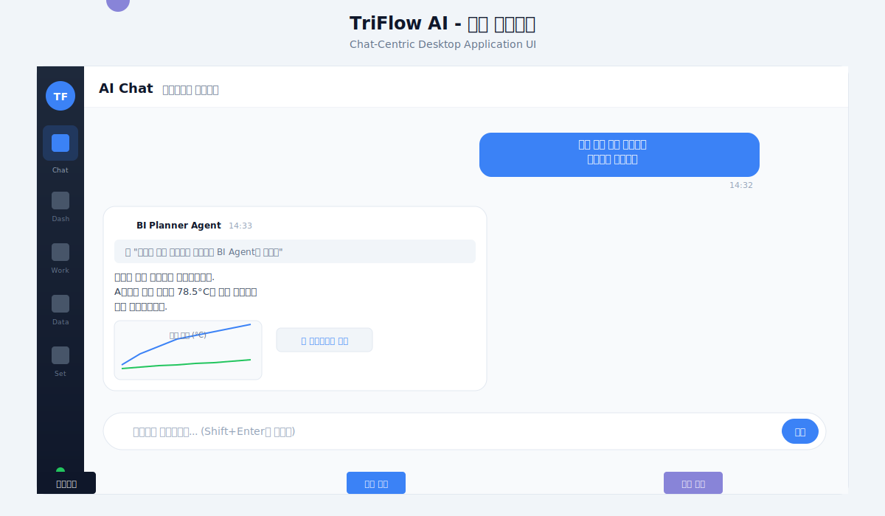
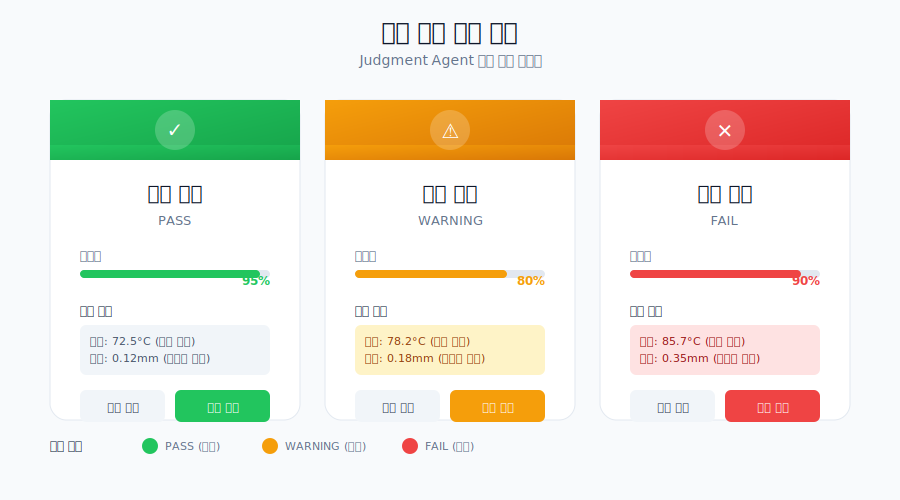
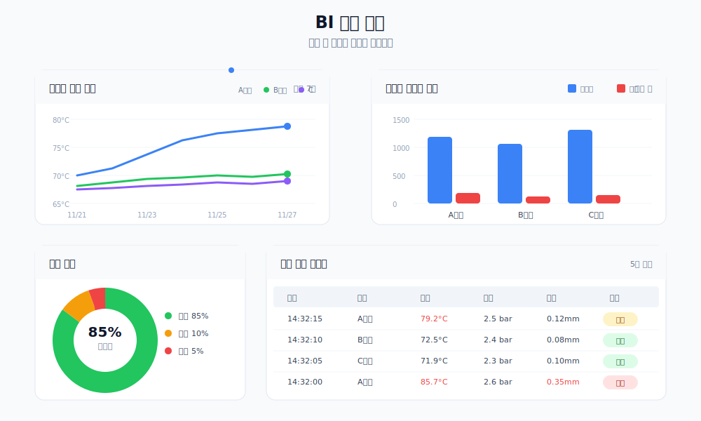
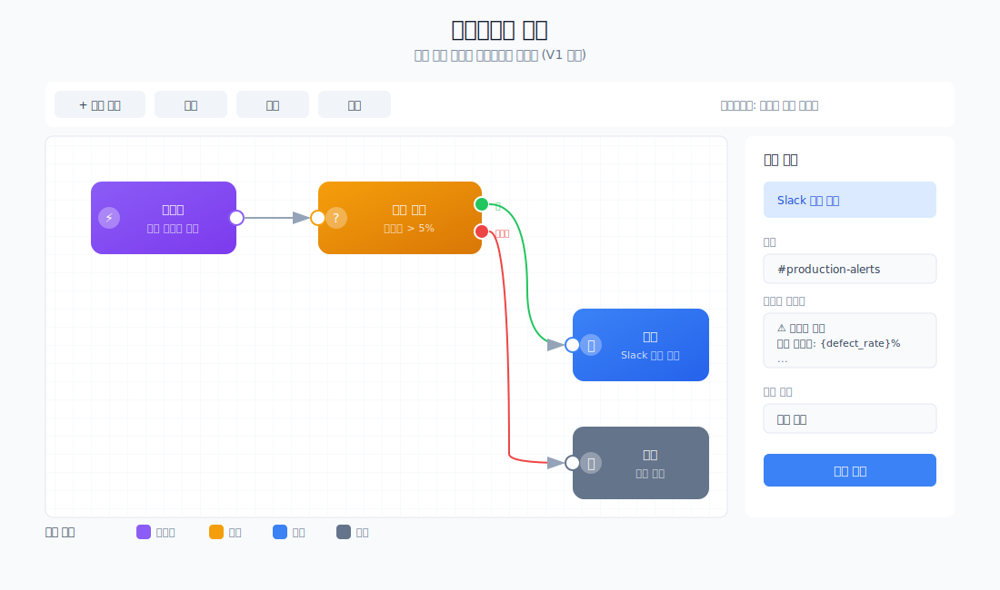

# TriFlow AI - UI/UX 명세서

> **버전**: 1.0.0
> **최종 수정**: 2025-11-27
> **대상**: MVP (PC 설치형 데스크톱 애플리케이션)

---

## 1. 디자인 시스템 개요

### 1.1 디자인 원칙

| 원칙 | 설명 |
|------|------|
| **Chat-Centric** | 모든 AI 인터랙션은 자연어 채팅을 통해 이루어짐 |
| **Card-Based Response** | 에이전트 응답은 구조화된 카드 형태로 표시 |
| **Progressive Disclosure** | 상세 정보는 토글/확장으로 제공하여 복잡도 관리 |
| **Dark Mode Support** | Slate 기반 라이트/다크 테마 지원 |

### 1.2 기술 스택

- **UI Framework**: React 18+ with TypeScript
- **Styling**: Tailwind CSS v4 + Shadcn/ui
- **Charts**: Recharts v2
- **Icons**: Lucide React
- **Desktop**: Tauri v2

---

## 2. 색상 팔레트

### 2.1 Primary Colors (Slate 기반)

| 용도 | Light Mode | Dark Mode | Tailwind Class |
|------|------------|-----------|----------------|
| 배경 (Primary) | `#f8fafc` | `#0f172a` | `bg-slate-50` / `bg-slate-900` |
| 배경 (Secondary) | `#ffffff` | `#020617` | `bg-white` / `bg-slate-950` |
| 텍스트 (Primary) | `#0f172a` | `#f8fafc` | `text-slate-900` / `text-slate-50` |
| 텍스트 (Secondary) | `#475569` | `#94a3b8` | `text-slate-600` / `text-slate-400` |
| 테두리 | `#e2e8f0` | `#1e293b` | `border-slate-200` / `border-slate-800` |

### 2.2 Accent Colors

| 용도 | Color | Hex | 사용처 |
|------|-------|-----|--------|
| Primary Action | Blue | `#3b82f6` | 버튼, 링크, 활성 상태 |
| Success | Green | `#22c55e` | 성공 메시지, 정상 상태 |
| Warning | Amber | `#f59e0b` | 경고, 주의 필요 |
| Error | Red | `#ef4444` | 에러, 위험 상태 |
| Info | Cyan | `#06b6d4` | 정보성 알림 |

### 2.3 차트 색상 팔레트

```typescript
const CHART_COLORS = [
  '#8884d8', // Blue (Primary)
  '#82ca9d', // Green
  '#ffc658', // Yellow
  '#ff7c7c', // Red
  '#8dd1e1', // Cyan
  '#d084d0', // Purple
  '#ffb347', // Orange
  '#a4de6c', // Light Green
];
```

---

## 3. 타이포그래피

### 3.1 폰트 패밀리

```css
font-family: 'Inter', system-ui, -apple-system, sans-serif;
```

### 3.2 폰트 사이즈 시스템

| 용도 | Size | Weight | Class |
|------|------|--------|-------|
| 페이지 제목 | 24px | Bold (700) | `text-2xl font-bold` |
| 섹션 제목 | 18px | Semibold (600) | `text-lg font-semibold` |
| 카드 제목 | 16px | Medium (500) | `text-base font-medium` |
| 본문 텍스트 | 14px | Normal (400) | `text-sm` |
| 보조 텍스트 | 12px | Normal (400) | `text-xs` |

---

## 4. 레이아웃 구조

### 4.1 전체 레이아웃



```
┌──────────────────────────────────────────────────────────────────┐
│                        TriFlow AI                                │
├────────┬─────────────────────────────────────────────────────────┤
│        │  상단바 (페이지 제목 + 보조설명)                           │
│        ├─────────────────────────────────────────────────────────┤
│ 사이드 │                                                         │
│  바    │                    메인 컨텐츠 영역                       │
│ (64px) │                                                         │
│        │                                                         │
│  Chat  │                                                         │
│  Dash  │                                                         │
│  Work  │                                                         │
│  Data  │                                                         │
│  Set   │                                                         │
└────────┴─────────────────────────────────────────────────────────┘
```

### 4.2 사이드바 네비게이션

| 메뉴 | 아이콘 | 설명 |
|------|--------|------|
| AI Chat | `MessageSquare` | 에이전트와 자연어 대화 |
| Dashboard | `BarChart3` | 실시간 모니터링 대시보드 |
| Workflows | `GitBranch` | 자동화 워크플로우 관리 |
| Data | `Database` | 센서/생산 데이터 조회 |
| Settings | `Settings` | 앱 설정 관리 |

### 4.3 상단바 구조

```
┌─────────────────────────────────────────────────────────────────┐
│  AI Chat   에이전트와 대화하기                                    │
└─────────────────────────────────────────────────────────────────┘
   ↑ 제목    ↑ 보조설명 (작은 회색 텍스트)
```

---

## 5. 주요 컴포넌트 명세

### 5.1 채팅 인터페이스

#### 메시지 버블

**사용자 메시지**
- 배경: `bg-blue-600`
- 텍스트: `text-white`
- 정렬: 우측 (`justify-end`)
- 최대 너비: 80%

**에이전트 메시지**
- 배경: `bg-slate-100` (dark: `bg-slate-800`)
- 텍스트: `text-slate-900` (dark: `text-slate-100`)
- 정렬: 좌측 (`justify-start`)
- 최대 너비: 80% (차트 포함 시 95%)

#### Tool 호출 정보

```
┌─────────────────────────────────────────┐
│ 💡 "데이터 분석 요청으로 분류"           │
│    ─────────────────────────────────    │
│    ▼ 상세 정보                          │
│    ┌───────────────────────────────┐   │
│    │ {                              │   │
│    │   "tool": "classify_intent",   │   │
│    │   "input": {...}               │   │
│    │ }                              │   │
│    └───────────────────────────────┘   │
└─────────────────────────────────────────┘
```

### 5.2 대시보드 카드



#### StatCard 구조

```
┌─────────────────────────────────┐
│  생산량              [📈 아이콘] │
│  1,234 units                    │
│  +12.5%                         │
└─────────────────────────────────┘
```

### 5.3 차트 위젯



#### 지원 차트 타입

| 타입 | 용도 | 컴포넌트 |
|------|------|----------|
| Line | 시계열 추이 분석 | `LineChartComponent` |
| Bar | 카테고리 비교 | `BarChartComponent` |
| Pie | 비율/구성 표시 | `PieChartComponent` |
| Area | 누적 추이 분석 | `AreaChartComponent` |
| Scatter | 상관관계 분석 | `ScatterChartComponent` |
| Table | 상세 데이터 표시 | `TableComponent` |

### 5.4 워크플로우 빌더 (V1 예정)



---

## 6. 인터랙션 패턴

### 6.1 채팅 흐름

1. 사용자가 메시지 입력 (Enter 전송, Shift+Enter 줄바꿈)
2. 로딩 애니메이션 표시 (3개 점 바운스)
3. Meta Router가 의도 분류
4. 적절한 Sub-Agent로 라우팅
5. Tool 호출 결과 표시 (토글 가능)
6. 최종 응답 렌더링 (차트 포함 시 자동 감지)

### 6.2 대시보드 차트 고정

1. AI Chat에서 차트 생성 요청
2. BI Agent가 `generate_chart_config` 실행
3. 채팅 메시지 내 차트 렌더링
4. "대시보드에 고정" 버튼 클릭
5. Dashboard 페이지에 차트 추가
6. X 버튼으로 삭제 가능

### 6.3 설정 저장

1. Settings 페이지 진입
2. 연결 상태 자동 확인 (`/health` 호출)
3. API 키, Backend URL, Tenant ID 입력
4. "설정 저장" 버튼 클릭
5. localStorage에 저장
6. 성공/실패 피드백 표시

---

## 7. 반응형 디자인

### 7.1 브레이크포인트

| 이름 | 너비 | 설명 |
|------|------|------|
| sm | 640px | 태블릿 세로 |
| md | 768px | 태블릿 가로 |
| lg | 1024px | 소형 데스크톱 |
| xl | 1280px | 표준 데스크톱 |

### 7.2 그리드 시스템

- **Dashboard Stats**: 1열 (sm) → 2열 (md) → 4열 (lg)
- **Chart Cards**: 1열 (sm/md) → 2열 (lg)
- **Settings Form**: 최대 너비 `max-w-2xl` (중앙 정렬)

---

## 8. 접근성

### 8.1 키보드 네비게이션

- Tab: 포커스 이동
- Enter: 버튼 실행, 폼 제출
- Escape: 모달/드롭다운 닫기

### 8.2 색상 대비

- 텍스트 대비 비율: 최소 4.5:1 (WCAG AA)
- 큰 텍스트: 최소 3:1

### 8.3 스크린 리더

- 모든 버튼에 `aria-label` 또는 명시적 텍스트
- 이미지에 `alt` 속성 필수

---

## 9. 다이어그램 목록

| 파일명 | 설명 |
|--------|------|
| `ui_01_main_layout.svg` | 전체 레이아웃 구조 |
| `ui_02_judgment_card.svg` | 불량 판단 결과 카드 |
| `ui_03_workflow_builder.svg` | 워크플로우 빌더 화면 |
| `ui_04_bi_chart_widget.svg` | BI 차트 위젯 |

---

## 10. 변경 이력

| 버전 | 날짜 | 변경 내용 |
|------|------|----------|
| 1.0.0 | 2025-11-27 | 최초 작성 |
