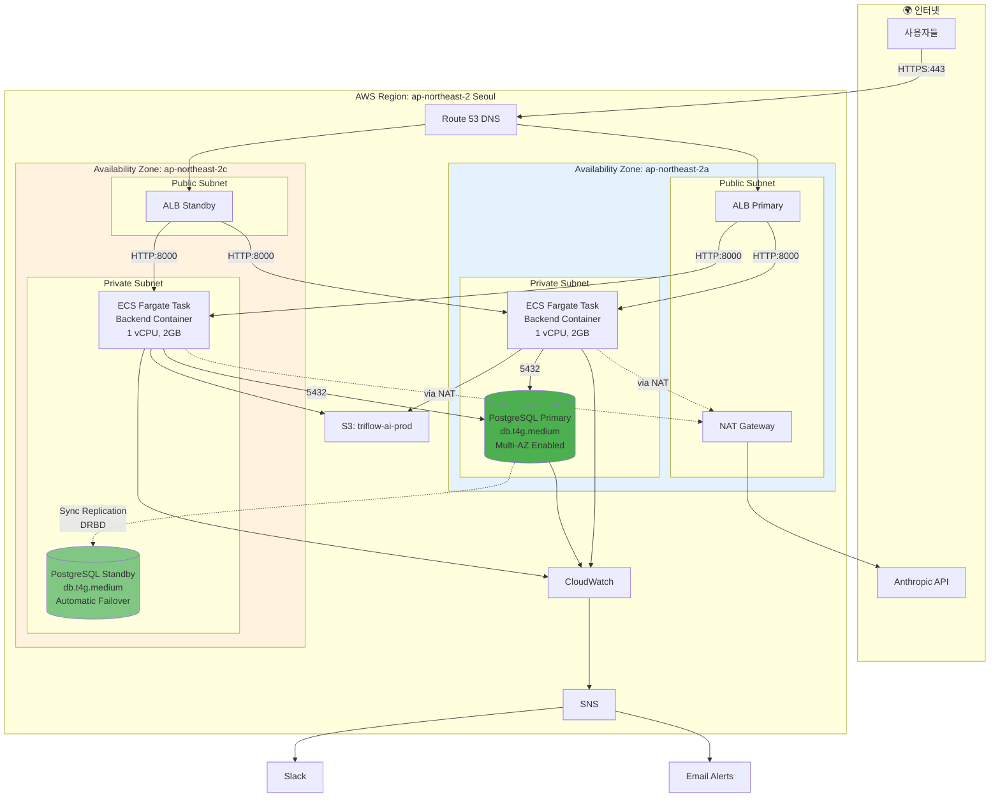
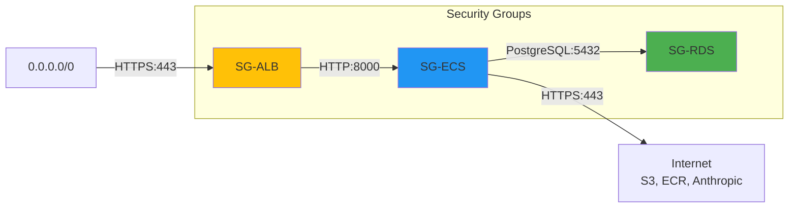
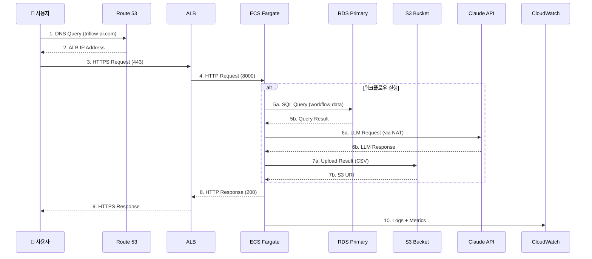
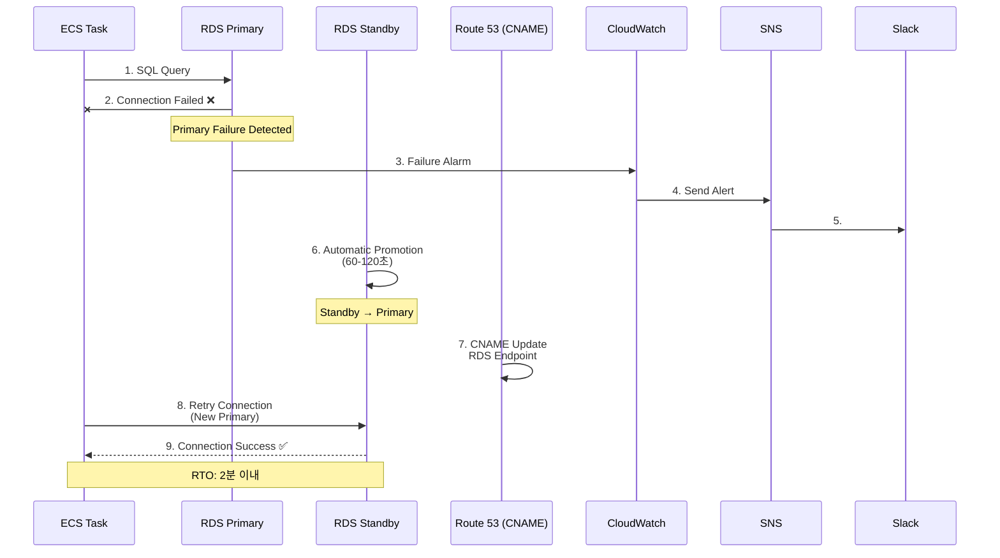
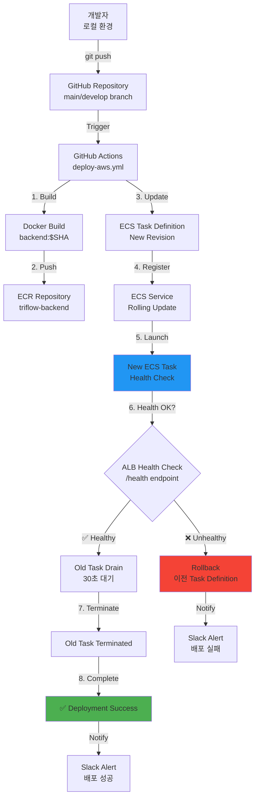
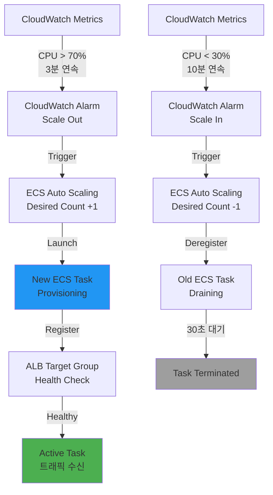
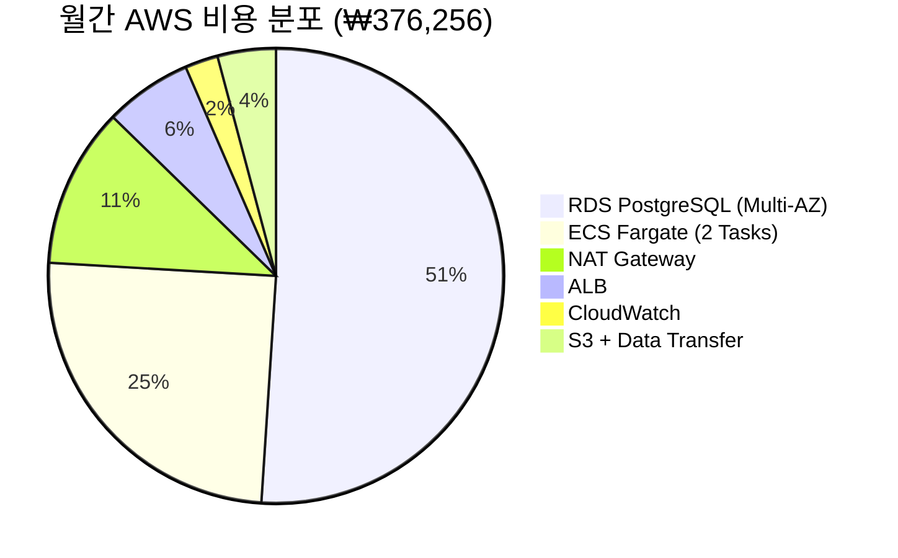
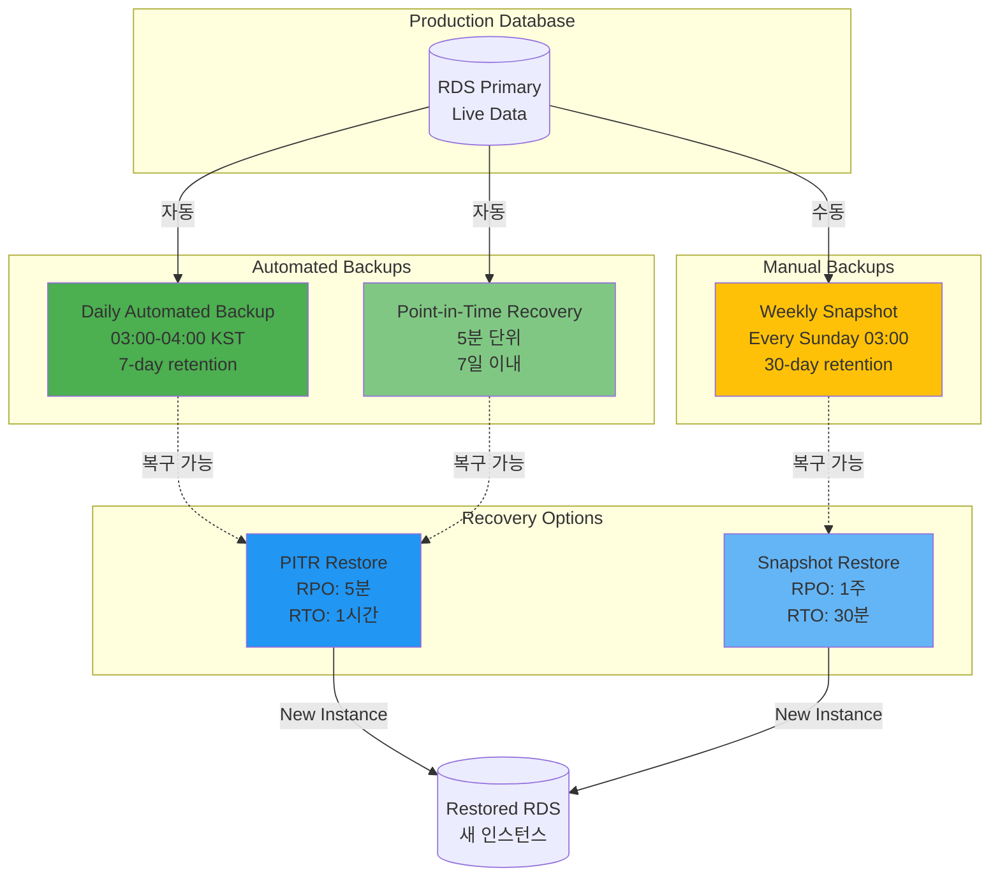
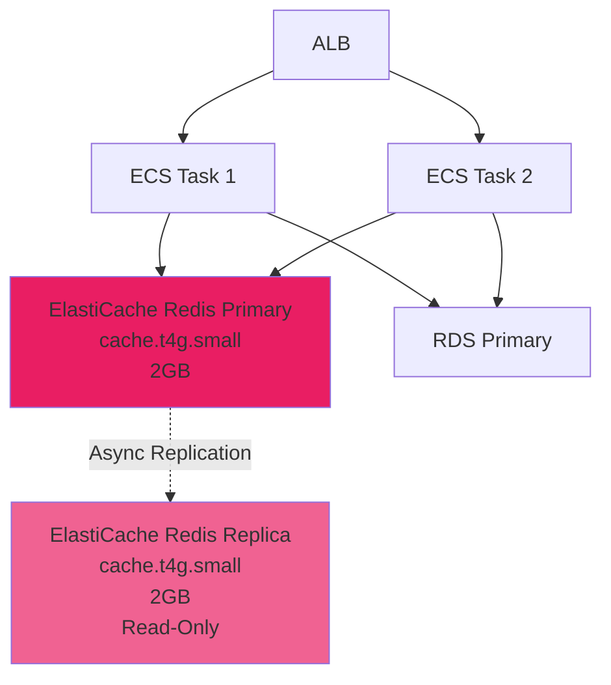

# AWS 아키텍처 다이어그램
**프로젝트**: TriFlow AI
**버전**: 1.0
**작성일**: 2026년 1월 20일

---

## High-Level Architecture

```mermaid
graph TB
    User[👤 사용자<br/>웹 브라우저] -->|HTTPS| Route53[🌐 Route 53<br/>DNS: triflow-ai.com]
    Route53 -->|DNS Query| ALB[⚖️ Application Load Balancer<br/>Public Subnet<br/>HTTPS:443]

    subgraph VPC[☁️ VPC: 10.0.0.0/16 ap-northeast-2]
        subgraph PublicSubnet[📡 Public Subnets]
            direction LR
            ALB
            NAT[🚪 NAT Gateway<br/>10.0.1.x<br/>ap-northeast-2a]
        end

        subgraph PrivateSubnet[🔒 Private Subnets]
            direction TB
            ECS1[🐳 ECS Fargate Task 1<br/>1 vCPU, 2GB RAM<br/>10.0.11.x<br/>ap-northeast-2a]
            ECS2[🐳 ECS Fargate Task 2<br/>1 vCPU, 2GB RAM<br/>10.0.12.x<br/>ap-northeast-2c]

            RDS_Primary[(🗄️ RDS PostgreSQL Primary<br/>db.t4g.medium<br/>4GB RAM, 100GB gp3<br/>10.0.11.x<br/>ap-northeast-2a)]
            RDS_Standby[(🗄️ RDS PostgreSQL Standby<br/>db.t4g.medium<br/>4GB RAM, 100GB gp3<br/>10.0.12.x<br/>ap-northeast-2c)]
        end
    end

    ALB -->|HTTP:8000<br/>Health Check /health| ECS1
    ALB -->|HTTP:8000<br/>Health Check /health| ECS2

    ECS1 -->|SQL:5432<br/>pgvector queries| RDS_Primary
    ECS2 -->|SQL:5432<br/>pgvector queries| RDS_Primary

    RDS_Primary -.Synchronous Replication.-> RDS_Standby

    ECS1 -->|HTTPS:443<br/>boto3| S3[🪣 S3 Bucket<br/>triflow-ai-prod<br/>Versioning, Encryption]
    ECS2 -->|HTTPS:443<br/>boto3| S3

    ECS1 -.Anthropic API<br/>Claude 3.5.-> NAT
    ECS2 -.Anthropic API<br/>Claude 3.5.-> NAT
    NAT -->|HTTPS| Internet[🌍 Internet<br/>api.anthropic.com]

    ECS1 -->|Logs + Metrics| CloudWatch[📊 CloudWatch<br/>Logs, Metrics, Alarms]
    ECS2 -->|Logs + Metrics| CloudWatch
    RDS_Primary -->|PostgreSQL Logs| CloudWatch
    ALB -->|Access Logs| CloudWatch

    CloudWatch -->|Alarms| SNS[📢 SNS Topic<br/>triflow-alarms-prod]
    SNS -->|Webhook| Slack[💬 Slack<br/>#triflow-alerts]
    SNS -->|Email| Email[📧 tech-lead@company.com]

    style VPC fill:#e1f5ff
    style PublicSubnet fill:#fff4e6
    style PrivateSubnet fill:#f0f0f0
    style RDS_Primary fill:#4CAF50
    style RDS_Standby fill:#81C784
    style ECS1 fill:#2196F3
    style ECS2 fill:#64B5F6
    style CloudWatch fill:#FF9800
    style S3 fill:#FF5722
```

---

## Network Topology (Detailed)



---

## Security Groups Flow



**Security Group Rules**:

| Security Group | Direction | Protocol | Port | Source/Destination | Purpose |
|----------------|-----------|----------|------|--------------------|---------|
| **SG-ALB** | Inbound | TCP | 443 | 0.0.0.0/0 | HTTPS from Internet |
| | Outbound | TCP | 8000 | SG-ECS | Forward to Backend |
| **SG-ECS** | Inbound | TCP | 8000 | SG-ALB | Receive from ALB |
| | Outbound | TCP | 5432 | SG-RDS | Database queries |
| | Outbound | TCP | 443 | 0.0.0.0/0 | S3, ECR, Anthropic |
| **SG-RDS** | Inbound | TCP | 5432 | SG-ECS | PostgreSQL connections |
| | Outbound | - | - | None | No outbound needed |

---

## Data Flow Diagrams

### Request Flow (Normal Operation)



### Failover Flow (RDS Primary Failure)



---

## Deployment Flow



---

## Auto Scaling Flow



**Auto Scaling Policy**:
- **Scale Out**: CPU > 70% for 3분 → Add 1 task (Max: 5)
- **Scale In**: CPU < 30% for 10분 → Remove 1 task (Min: 2)
- **Cooldown**: 5분 (연속 스케일링 방지)

---

## Cost Breakdown (월간)



| 서비스 | 비용/월 | 비율 |
|--------|--------:|-----:|
| RDS PostgreSQL | ₩192,000 | 51% |
| ECS Fargate | ₩93,678 | 25% |
| NAT Gateway | ₩42,764 | 11% |
| ALB | ₩23,374 | 6% |
| CloudWatch | ₩8,840 | 2% |
| S3 + Transfer | ₩15,600 | 4% |
| **총계** | **₩376,256** | 100% |

---

## Monitoring Dashboard Layout

```
┌─────────────────────────────────────────────────────────────┐
│ TriFlow AI - Production Monitoring (Grafana)               │
├─────────────────────────────────────────────────────────────┤
│                                                             │
│ ┌─────────────┐ ┌─────────────┐ ┌─────────────┐           │
│ │ ECS Tasks   │ │ RDS CPU     │ │ ALB Latency │           │
│ │ 2/5 Running │ │ 45%         │ │ P95: 350ms  │           │
│ │ ✅ Healthy  │ │ ✅ Normal   │ │ ✅ Good     │           │
│ └─────────────┘ └─────────────┘ └─────────────┘           │
│                                                             │
│ ┌───────────────────────────────────────────────────────┐   │
│ │ 📈 API Request Rate (req/sec)                        │   │
│ │ [Graph: Last 6 hours]                                │   │
│ │                    ╱╲                                │   │
│ │           ╱╲      ╱  ╲     ╱╲                        │   │
│ │      ╱╲  ╱  ╲    ╱    ╲   ╱  ╲                       │   │
│ │ ────╱  ╲╱    ╲──╱      ╲─╱    ╲──                    │   │
│ └───────────────────────────────────────────────────────┘   │
│                                                             │
│ ┌──────────────────────┐ ┌──────────────────────────────┐  │
│ │ 🗄️ Database          │ │ 📊 System Resources         │  │
│ │ Connections: 23/100  │ │ CPU: 45% (Target: <70%)     │  │
│ │ QPS: 450             │ │ Memory: 1.2GB/2GB (60%)     │  │
│ │ Latency: 12ms        │ │ Disk: 15GB/100GB (15%)      │  │
│ └──────────────────────┘ └──────────────────────────────┘  │
│                                                             │
│ ┌───────────────────────────────────────────────────────┐   │
│ │ 🚨 Recent Alarms (Last 24h)                          │   │
│ │ [No active alarms] ✅                                │   │
│ └───────────────────────────────────────────────────────┘   │
└─────────────────────────────────────────────────────────────┘
```

---

## Backup & Recovery Strategy



**Backup Schedule**:
- 자동 백업: 매일 03:00-04:00 KST (7일 보관)
- 수동 스냅샷: 매주 일요일 03:00 (30일 보관)
- PITR: 7일 이내 5분 단위 복구 가능

**Recovery Scenarios**:
1. 데이터 손상 (실수로 삭제): PITR로 5분 전 복구
2. 주간 백업 필요: Snapshot으로 복구
3. 재해 복구: Multi-AZ Failover (자동, 2분)

---

## S3 Bucket Structure

```
s3://triflow-ai-prod/
│
├─ tenants/
│  ├─ {tenant-uuid-A}/
│  │  ├─ workflows/
│  │  │  ├─ {workflow-id-1}/
│  │  │  │  ├─ execution_20260120_143022.json
│  │  │  │  ├─ output_20260120_143022.csv
│  │  │  │  └─ logs_20260120_143022.txt
│  │  │  └─ {workflow-id-2}/...
│  │  ├─ uploads/
│  │  │  ├─ {file-uuid}.xlsx
│  │  │  └─ {file-uuid}.pdf
│  │  └─ exports/
│  │     ├─ export_20260120.xlsx
│  │     └─ export_20260119.csv
│  │
│  └─ {tenant-uuid-B}/
│     └─ (동일 구조)
│
├─ shared/
│  ├─ templates/
│  │  ├─ workflow_template_defect_detection.json
│  │  └─ workflow_template_quality_check.json
│  ├─ industry-profiles/
│  │  ├─ pharma.json
│  │  ├─ food.json
│  │  └─ electronics.json
│  └─ system/
│     └─ config.json
│
└─ backups/ (선택사항)
   └─ db/
      ├─ manual_snapshot_20260120.sql.gz
      └─ manual_snapshot_20260113.sql.gz
```

**Lifecycle Rules**:
```
Rule 1: workflows/* → 90일 후 Glacier (80% 비용 절감)
Rule 2: uploads/* → 180일 후 Glacier
Rule 3: exports/* → 90일 후 Glacier
Rule 4: backups/* → 30일 후 삭제
```

---

## IAM Roles & Policies

```mermaid
graph TD
    subgraph ECS_Task_Role[ECS Task Execution Role]
        ECS_Pull[ECR Pull Images]
        ECS_Logs[CloudWatch Logs Write]
    end

    subgraph ECS_App_Role[ECS Task Role]
        S3_Access[S3 Read/Write<br/>tenants/{tenant_id}/*]
        RDS_Connect[RDS Connect<br/>IAM Auth]
        Secrets_Read[Secrets Manager Read<br/>triflow/prod/*]
        CW_Metrics[CloudWatch PutMetrics]
    end

    subgraph RDS_Monitoring[RDS Enhanced Monitoring]
        RDS_CW[CloudWatch Logs Write<br/>PostgreSQL Logs]
    end

    ECS_Task[ECS Fargate Task] --> ECS_Task_Role
    ECS_Task --> ECS_App_Role
    RDS[RDS Instance] --> RDS_Monitoring

    style ECS_Task_Role fill:#2196F3
    style ECS_App_Role fill:#4CAF50
    style RDS_Monitoring fill:#FF9800
```

**IAM Policy Example (S3 Access)**:
```json
{
  "Version": "2012-10-17",
  "Statement": [
    {
      "Effect": "Allow",
      "Action": [
        "s3:PutObject",
        "s3:GetObject",
        "s3:DeleteObject",
        "s3:ListBucket"
      ],
      "Resource": [
        "arn:aws:s3:::triflow-ai-prod/tenants/${aws:userid}/*",
        "arn:aws:s3:::triflow-ai-prod/shared/*"
      ]
    }
  ]
}
```

**최소 권한 원칙**:
- ECS Task는 자신의 테넌트 폴더만 접근
- Secrets Manager는 Read-Only
- CloudWatch는 Write-Only (Logs, Metrics)

---

## 확장 계획 (4-5월)

### ElastiCache Redis 추가 (선택사항)



**추가 비용**: ₩50,000/월 (cache.t4g.small × 2)

**효과**:
- 세션 저장 고가용성 (현재: 메모리, 재시작 시 손실)
- API 응답 캐싱 (RDS 부하 감소)
- 워크플로우 실행 결과 캐싱

---

## 참고: AWS 리전 선택 근거

**선택**: **ap-northeast-2 (Seoul)**

| 리전 | Latency (한국) | 비용 | 서비스 가용성 | 선택 |
|------|---------------:|------|--------------|:----:|
| ap-northeast-2 (Seoul) | 5-10ms | 100% | Full | ✅ |
| ap-northeast-1 (Tokyo) | 30-40ms | 95% | Full | ❌ |
| us-west-2 (Oregon) | 150-200ms | 80% | Full | ❌ |

**이유**:
- 사용자 대부분 한국 (Latency 최소화)
- 데이터 주권 (한국 법규 준수)
- AWS Direct Connect 서울 가능

---

**문서 버전**: 1.0 (2026-01-20)
**다음 업데이트**: Terraform 코드 완성 후
