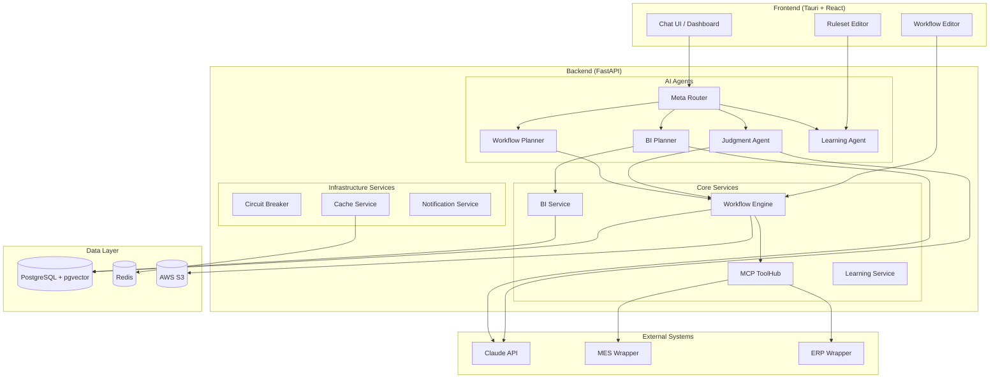
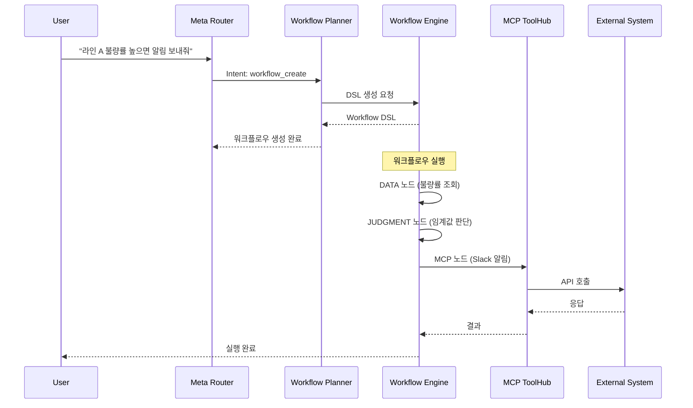
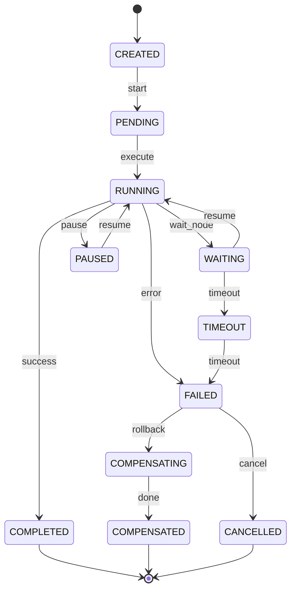

# TriFlow AI 시스템 아키텍처

> **문서 버전**: 1.0
> **작성일**: 2025-12-26
> **대상 독자**: 아키텍트, 시니어 개발자
> **관련 문서**: [메인 현황](PROJECT_STATUS.md) | [스펙 비교](SPEC_COMPARISON.md) | [구현 가이드](IMPLEMENTATION_GUIDE.md) | [지표/로드맵](METRICS_ROADMAP.md)

---

## 목차

1. [전체 시스템 구성도](#1-전체-시스템-구성도)
2. [워크플로우 실행 흐름](#2-워크플로우-실행-흐름)
3. [기술 스택](#3-기술-스택)
4. [계층별 상세 구조](#4-계층별-상세-구조)
5. [데이터 흐름](#5-데이터-흐름)

---

## 1. 전체 시스템 구성도



### 주요 구성요소

| 계층 | 구성요소 | 역할 |
|------|---------|------|
| **Frontend** | Tauri + React | 데스크톱 앱 UI, 워크플로우 에디터 |
| **AI Agents** | 5개 에이전트 | 의도 분류, 판단, 워크플로우, BI, 학습 |
| **Core Services** | 워크플로우 엔진, MCP ToolHub, BI | 핵심 비즈니스 로직 |
| **Infra Services** | Circuit Breaker, Cache, Notification | 안정성, 성능, 알림 |
| **External** | Claude API, MCP 래퍼 서버 | LLM, 외부 시스템 연동 |
| **Data Layer** | PostgreSQL, Redis, S3 | 데이터 영속화, 캐싱, 파일 |

---

## 2. 워크플로우 실행 흐름



### 상태 전이 다이어그램



---

## 3. 기술 스택

### 3.1 프론트엔드

| 기술 | 버전 | 용도 |
|------|------|------|
| **Tauri** | v2 | 데스크톱 앱 프레임워크 |
| **React** | 18 | UI 라이브러리 |
| **TypeScript** | 5.x | 타입 안정성 |
| **React Flow** | 11.x | 워크플로우 에디터 |
| **Recharts** | 2.x | 차트 시각화 |
| **TailwindCSS** | 3.x | 스타일링 |
| **Zustand** | 4.x | 상태 관리 |

### 3.2 백엔드

| 기술 | 버전 | 용도 |
|------|------|------|
| **FastAPI** | 0.104+ | API 프레임워크 |
| **Python** | 3.9+ | 런타임 |
| **SQLAlchemy** | 2.x | ORM |
| **Pydantic** | 2.x | 데이터 검증 |
| **httpx** | 0.25+ | 비동기 HTTP 클라이언트 |
| **uvicorn** | 0.24+ | ASGI 서버 |

### 3.3 AI/ML

| 기술 | 버전 | 용도 |
|------|------|------|
| **Anthropic SDK** | latest | Claude API 연동 |
| **claude-sonnet-4-5-20250929** | - | 기본 LLM 모델 |
| **Rhai** | 1.16 | 규칙 엔진 |
| **pgvector** | 0.5+ | 벡터 검색 (RAG) |

### 3.4 데이터베이스

| 기술 | 버전 | 용도 |
|------|------|------|
| **PostgreSQL** | 14+ | 메인 DB (트랜잭션) |
| **Redis** | 7.2 | 캐시/세션 |
| **AWS S3** | - | 파일 저장소 |

### 3.5 인프라

| 기술 | 버전 | 용도 |
|------|------|------|
| **Docker** | 24+ | 컨테이너 |
| **Docker Compose** | 2.x | 로컬 개발 환경 |
| **GitHub Actions** | - | CI/CD |
| **AWS EC2/ECS** | - | 프로덕션 배포 |

---

## 4. 계층별 상세 구조

### 4.1 AI 에이전트 계층

```
┌────────────────────────────────────────────────────────┐
│                    Meta Router                         │
│  - Intent 분류 (규칙 + LLM 하이브리드)                  │
│  - 에이전트 라우팅                                      │
└──────────┬──────────┬──────────┬──────────┬───────────┘
           │          │          │          │
    ┌──────▼─────┐ ┌──▼────┐ ┌──▼─────┐ ┌──▼────────┐
    │ Judgment   │ │  BI   │ │Workflow│ │ Learning  │
    │  Agent     │ │Planner│ │Planner │ │   Agent   │
    │            │ │       │ │        │ │           │
    │ - 센서분석 │ │- NL2SQL│ │- DSL생성│ │ - 피드백 │
    │ - 규칙실행 │ │- 차트  │ │- 노드  │ │ - 규칙   │
    │ - LLM판단  │ │- 인사이트│ │ 구성   │ │   제안   │
    └────────────┘ └────────┘ └────────┘ └───────────┘
```

### 4.2 코어 서비스 계층

```
┌─────────────────────────────────────────────────────────┐
│                  Workflow Engine                         │
│  - 18개 노드 타입 실행                                    │
│  - 상태 관리 (15개 상태)                                  │
│  - 체크포인트 복구                                        │
└──────────────────────────┬──────────────────────────────┘
                           │
    ┌──────────────────────┼──────────────────────┐
    │                      │                      │
┌───▼───────────┐    ┌─────▼────────┐    ┌───────▼──────┐
│  MCP ToolHub  │    │  BI Service  │    │   Learning   │
│               │    │              │    │   Service    │
│ - 서버 레지스트리│    │ - Text-to-SQL│    │ - 피드백 수집│
│ - 도구 호출    │    │ - 차트 빌더  │    │ - A/B 테스트 │
│ - 헬스체크     │    │ - StatCard   │    │ - 규칙 배포  │
└───────────────┘    └──────────────┘    └──────────────┘
```

### 4.3 인프라 서비스 계층

```
┌─────────────────┐ ┌─────────────────┐ ┌─────────────────┐
│ Circuit Breaker │ │  Cache Service  │ │  Notification   │
│                 │ │                 │ │    Service      │
│ - 상태: CLOSED  │ │ - Redis 연동    │ │ - Slack 웹훅    │
│   OPEN, HALF    │ │ - TTL 관리      │ │ - 이메일        │
│ - 5회 실패→OPEN │ │ - 해시 기반 키  │ │ - 인앱 알림     │
└─────────────────┘ └─────────────────┘ └─────────────────┘
```

---

## 5. 데이터 흐름

### 5.1 요청 처리 흐름

```
[User Request]
      │
      ▼
┌─────────────────┐
│   API Gateway   │ ← JWT 인증, Rate Limiting
│  (FastAPI)      │
└────────┬────────┘
         │
         ▼
┌─────────────────┐
│   Meta Router   │ ← Intent 분류
└────────┬────────┘
         │
    ┌────┴────┬────────┬────────┐
    │         │        │        │
    ▼         ▼        ▼        ▼
[Judgment] [BI]   [Workflow] [Learning]
    │         │        │        │
    └────┬────┴────────┴────────┘
         │
         ▼
┌─────────────────┐
│   Response      │ ← 구조화된 응답
│   Formatter     │
└─────────────────┘
```

### 5.2 데이터 저장 구조

```
PostgreSQL (메인 DB)
├── public 스키마
│   ├── tenants          # 멀티테넌트
│   ├── users            # 사용자
│   ├── workflows        # 워크플로우 정의
│   ├── workflow_instances # 실행 인스턴스
│   ├── rulesets         # 규칙셋
│   └── audit_logs       # 감사 로그
│
└── bi 스키마
    ├── dim_date, dim_line, dim_product  # 차원 테이블
    ├── fact_daily_production            # 생산 팩트
    ├── fact_daily_defect                # 불량 팩트
    └── bi_dashboards, bi_statcards      # BI 카탈로그

Redis (캐시)
├── session:*      # 사용자 세션
├── bi:query:*     # BI 쿼리 결과
├── judgment:*     # 판단 캐시
└── mcp:health:*   # MCP 헬스체크

AWS S3 (파일)
├── exports/       # CSV 내보내기
├── attachments/   # 첨부파일
└── checkpoints/   # 워크플로우 체크포인트
```

### 5.3 MCP 통신 흐름

```
[Workflow MCP Node]
        │
        ▼
┌─────────────────┐
│  MCP ToolHub    │ ← 서버 조회, 도구 목록 캐시
└────────┬────────┘
         │
         ▼
┌─────────────────┐
│  HTTP MCP Proxy │ ← 재시도, 타임아웃
└────────┬────────┘
         │
         ▼
┌─────────────────┐
│ Circuit Breaker │ ← 5회 실패 → OPEN → 60초 후 HALF_OPEN
└────────┬────────┘
         │
         ▼
┌─────────────────────────────┐
│  MCP 래퍼 서버 (MES/ERP)     │
│  POST /tools/call           │
│  { tool: "...", args: {...} } │
└─────────────────────────────┘
         │
         ▼
┌─────────────────────────────┐
│  외부 시스템 API (기존)       │
└─────────────────────────────┘
```

---

## 문서 이력

| 버전 | 날짜 | 작성자 | 변경 내용 |
|------|------|--------|----------|
| 1.0 | 2025-12-26 | AI 개발팀 | PROJECT_STATUS.md에서 분리 |

---

**문서 끝**
