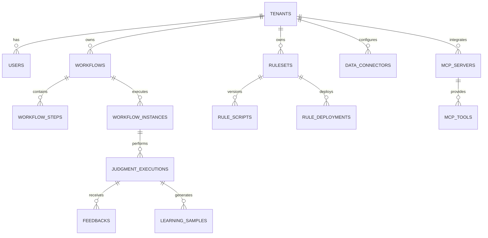

# B-3-1. Core Schema Design

**문서 ID**: B-3-1
**버전**: 2.0
**최종 수정일**: 2025-01-26
**작성자**: AI Factory Development Team
**관련 문서**: A-2 (요구사항), B-1 (아키텍처), B-4 (API), B-5 (워크플로우), B-6 (AI/프롬프트)

---

## 목차
1. [개요](#1-개요)
2. [멀티테넌시 기본 스키마](#2-멀티테넌시-기본-스키마)
3. [워크플로우 스키마](#3-워크플로우-스키마)
4. [판단 실행 스키마](#4-판단-실행-스키마)
5. [룰 관리 스키마](#5-룰-관리-스키마)
6. [학습 & 자동화 스키마](#6-학습--자동화-스키마)
7. [프롬프트 관리 스키마](#7-프롬프트-관리-스키마)
8. [채팅 & 인텐트 스키마](#8-채팅--인텐트-스키마)
9. [외부 연동 스키마](#9-외부-연동-스키마)
10. [감사 로그 스키마](#10-감사-로그-스키마)
11. [DDL 전체 스크립트](#11-ddl-전체-스크립트)
12. [추적성 매트릭스](#12-추적성-매트릭스)

---

## 1. 개요

### 1.1 목적
제조업 AI 판단 플랫폼의 핵심 운영 데이터를 저장하기 위한 PostgreSQL 스키마 설계.

### 1.2 설계 원칙
- **멀티테넌시**: 모든 테이블에 tenant_id로 격리
- **이벤트 소싱**: 판단/워크플로우 실행 이력 완전 보존
- **확장성**: JSONB로 유연한 메타데이터 저장
- **추적성**: 모든 변경사항 감사 로그 기록
- **성능**: 인덱스/파티셔닝으로 대용량 처리

### 1.3 데이터 도메인


---

## 2. 멀티테넌시 기본 스키마

### 2.1 tenants (테넌트)

**목적**: 멀티테넌트 격리 기준 테이블

**테이블 구조**:
```sql
CREATE TABLE tenants (
  id uuid PRIMARY KEY DEFAULT gen_random_uuid(),
  name text NOT NULL UNIQUE,
  display_name text NOT NULL,
  settings jsonb NOT NULL DEFAULT '{}',
  subscription_plan text NOT NULL DEFAULT 'standard' CHECK (subscription_plan IN ('trial','standard','enterprise','custom')),
  max_users int NOT NULL DEFAULT 10,
  max_workflows int NOT NULL DEFAULT 50,
  max_judgments_per_day int NOT NULL DEFAULT 10000,
  status text NOT NULL DEFAULT 'active' CHECK (status IN ('active','suspended','deleted')),
  created_at timestamptz NOT NULL DEFAULT now(),
  updated_at timestamptz NOT NULL DEFAULT now(),
  deleted_at timestamptz
);

CREATE INDEX idx_tenants_status ON tenants (status) WHERE status = 'active';
CREATE INDEX idx_tenants_name ON tenants (name);

COMMENT ON TABLE tenants IS '멀티테넌트 격리 기준 테이블';
COMMENT ON COLUMN tenants.settings IS 'JSON: {timezone, locale, features_enabled[], llm_config{model,temperature}, notification_config{}}';
COMMENT ON COLUMN tenants.subscription_plan IS '구독 플랜: trial(14일), standard(기본), enterprise(무제한), custom(협의)';
```

**settings JSONB 구조**:
```json
{
  "timezone": "Asia/Seoul",
  "locale": "ko-KR",
  "features_enabled": ["hybrid_judgment", "auto_rule_learning", "mcp_integration"],
  "llm_config": {
    "model": "gpt-4o",
    "temperature": 0.3,
    "max_tokens": 2000,
    "fallback_model": "gpt-4o-mini"
  },
  "notification_config": {
    "email_enabled": true,
    "webhook_enabled": true,
    "slack_webhook_url": "https://hooks.slack.com/..."
  },
  "data_retention": {
    "raw_logs_days": 90,
    "judgment_logs_days": 730,
    "llm_calls_days": 180
  }
}
```

### 2.2 users (사용자)

**목적**: 사용자 인증 및 권한 관리

**테이블 구조**:
```sql
CREATE TABLE users (
  id uuid PRIMARY KEY DEFAULT gen_random_uuid(),
  tenant_id uuid NOT NULL REFERENCES tenants(id) ON DELETE CASCADE,
  email text NOT NULL,
  username text NOT NULL,
  password_hash text NOT NULL,
  role text NOT NULL CHECK (role IN ('admin','approver','operator','viewer')),
  permissions text[] NOT NULL DEFAULT '{}',
  metadata jsonb NOT NULL DEFAULT '{}',
  status text NOT NULL DEFAULT 'active' CHECK (status IN ('active','inactive','locked')),
  last_login_at timestamptz,
  created_at timestamptz NOT NULL DEFAULT now(),
  updated_at timestamptz NOT NULL DEFAULT now(),
  UNIQUE (tenant_id, email),
  UNIQUE (tenant_id, username)
);

CREATE INDEX idx_users_tenant_role ON users (tenant_id, role) WHERE status = 'active';
CREATE INDEX idx_users_email ON users (email);
CREATE INDEX idx_users_status ON users (status);

COMMENT ON TABLE users IS '사용자 인증 및 권한 관리';
COMMENT ON COLUMN users.role IS 'RBAC 역할: admin(전체), approver(승인), operator(실행), viewer(조회)';
COMMENT ON COLUMN users.permissions IS 'RBAC 권한 배열: [judgment:read, judgment:execute, workflow:create, ...]';
```

**RBAC 권한 매트릭스**:
| Role | Permissions |
|------|------------|
| admin | `*:*` (전체) |
| approver | `judgment:*, workflow:read, approval:*, rule:approve, deployment:approve` |
| operator | `judgment:read, judgment:execute, workflow:read, workflow:execute, bi:read` |
| viewer | `judgment:read, workflow:read, bi:read, mcp:read` |

**metadata JSONB 구조**:
```json
{
  "department": "생산관리팀",
  "line_access": ["L01", "L02", "L03"],
  "notification_preferences": {
    "email": true,
    "slack": false,
    "critical_only": true
  },
  "ui_preferences": {
    "theme": "dark",
    "language": "ko",
    "timezone": "Asia/Seoul"
  }
}
```

---

## 3. 워크플로우 스키마

### 3.1 workflows (워크플로우 정의)

**목적**: 판단 워크플로우 DSL 정의 및 버전 관리

**테이블 구조**:
```sql
CREATE TABLE workflows (
  id uuid PRIMARY KEY DEFAULT gen_random_uuid(),
  tenant_id uuid NOT NULL REFERENCES tenants(id) ON DELETE CASCADE,
  name text NOT NULL,
  description text,
  version int NOT NULL DEFAULT 1,
  dsl_json jsonb NOT NULL,
  dsl_digest text NOT NULL,
  is_active boolean NOT NULL DEFAULT false,
  trigger_config jsonb,
  timeout_seconds int NOT NULL DEFAULT 300,
  max_retry int NOT NULL DEFAULT 3,
  tags text[] DEFAULT '{}',
  metadata jsonb NOT NULL DEFAULT '{}',
  created_by uuid REFERENCES users(id),
  created_at timestamptz NOT NULL DEFAULT now(),
  updated_at timestamptz NOT NULL DEFAULT now(),
  activated_at timestamptz,
  UNIQUE (tenant_id, name, version)
);

CREATE INDEX idx_workflows_tenant_active ON workflows (tenant_id, is_active) WHERE is_active = true;
CREATE INDEX idx_workflows_name ON workflows (tenant_id, name);
CREATE INDEX idx_workflows_tags ON workflows USING GIN (tags);
CREATE INDEX idx_workflows_dsl_digest ON workflows (dsl_digest);

COMMENT ON TABLE workflows IS '워크플로우 DSL 정의 및 버전 관리 (B-5 참조)';
COMMENT ON COLUMN workflows.dsl_json IS 'B-5 워크플로우 DSL 전체 JSON';
COMMENT ON COLUMN workflows.dsl_digest IS 'SHA256(dsl_json) - 변경 추적용';
COMMENT ON COLUMN workflows.trigger_config IS 'JSON: {type: schedule|event|webhook, cron, event_filter}';
```

**dsl_json JSONB 구조** (B-5 참조):
```json
{
  "name": "defect_analysis_workflow",
  "version": "1.0.0",
  "description": "불량 분석 및 대응 워크플로우",
  "variables": {
    "global": {
      "threshold_defect_rate": {"type": "number", "default": 0.05}
    },
    "input": {
      "line_code": {"type": "string", "required": true},
      "shift": {"type": "string", "required": true}
    }
  },
  "nodes": [
    {
      "id": "data_collect",
      "type": "DATA",
      "config": {
        "connector_id": "mes_connector",
        "query": "SELECT * FROM production WHERE line=:line_code AND shift=:shift"
      }
    },
    {
      "id": "defect_judgment",
      "type": "JUDGMENT",
      "config": {
        "input_mapping": {"line": "$.input.line_code", "data": "$.nodes.data_collect.result"}
      }
    }
  ]
}
```

**trigger_config JSONB 구조**:
```json
{
  "type": "schedule",
  "cron": "0 */2 * * *",
  "timezone": "Asia/Seoul",
  "enabled": true,
  "metadata": {
    "description": "2시간마다 불량률 체크"
  }
}
```

### 3.2 workflow_steps (워크플로우 단계)

**목적**: 워크플로우 DSL의 노드를 정규화된 단계로 저장

**테이블 구조**:
```sql
CREATE TABLE workflow_steps (
  id uuid PRIMARY KEY DEFAULT gen_random_uuid(),
  workflow_id uuid NOT NULL REFERENCES workflows(id) ON DELETE CASCADE,
  step_order int NOT NULL,
  node_id text NOT NULL,
  node_type text NOT NULL CHECK (node_type IN (
    'DATA','BI','JUDGMENT','MCP','ACTION','APPROVAL','WAIT',
    'SWITCH','PARALLEL','COMPENSATION','DEPLOY','ROLLBACK','SIMULATE'
  )),
  config jsonb NOT NULL,
  timeout_seconds int NOT NULL DEFAULT 60,
  retry_policy jsonb,
  created_at timestamptz NOT NULL DEFAULT now(),
  UNIQUE (workflow_id, node_id),
  UNIQUE (workflow_id, step_order)
);

CREATE INDEX idx_workflow_steps_workflow ON workflow_steps (workflow_id, step_order);
CREATE INDEX idx_workflow_steps_type ON workflow_steps (node_type);

COMMENT ON TABLE workflow_steps IS '워크플로우 단계 정규화 (B-5 13가지 노드 타입)';
COMMENT ON COLUMN workflow_steps.node_type IS 'B-5 정의 13가지: DATA, BI, JUDGMENT, MCP, ACTION, APPROVAL, WAIT, SWITCH, PARALLEL, COMPENSATION, DEPLOY, ROLLBACK, SIMULATE';
```

**retry_policy JSONB 구조**:
```json
{
  "max_attempts": 3,
  "backoff_strategy": "exponential",
  "initial_delay_ms": 1000,
  "max_delay_ms": 30000,
  "retry_on_errors": ["TIMEOUT", "NETWORK_ERROR", "RATE_LIMIT"]
}
```

### 3.3 workflow_instances (워크플로우 실행 인스턴스)

**목적**: 워크플로우 실행 이력 및 상태 추적

**테이블 구조**:
```sql
CREATE TABLE workflow_instances (
  id uuid PRIMARY KEY DEFAULT gen_random_uuid(),
  workflow_id uuid NOT NULL REFERENCES workflows(id),
  tenant_id uuid NOT NULL REFERENCES tenants(id),
  status text NOT NULL CHECK (status IN (
    'PENDING','RUNNING','WAITING','PAUSED',
    'COMPLETED','FAILED','CANCELLED','TIMEOUT'
  )),
  trigger_type text NOT NULL CHECK (trigger_type IN ('manual','schedule','event','webhook','api')),
  triggered_by uuid REFERENCES users(id),
  input_context jsonb NOT NULL DEFAULT '{}',
  runtime_context jsonb NOT NULL DEFAULT '{}',
  checkpoint_data jsonb,
  current_step_id uuid REFERENCES workflow_steps(id),
  last_error text,
  error_code text,
  retry_count int NOT NULL DEFAULT 0,
  started_at timestamptz NOT NULL DEFAULT now(),
  ended_at timestamptz,
  duration_ms int,
  trace_id text NOT NULL,
  parent_instance_id uuid REFERENCES workflow_instances(id),
  metadata jsonb NOT NULL DEFAULT '{}'
);

CREATE INDEX idx_workflow_instances_tenant_status ON workflow_instances (tenant_id, status);
CREATE INDEX idx_workflow_instances_workflow_started ON workflow_instances (workflow_id, started_at DESC);
CREATE INDEX idx_workflow_instances_status ON workflow_instances (status) WHERE status IN ('RUNNING','WAITING','PAUSED');
CREATE INDEX idx_workflow_instances_trace ON workflow_instances (trace_id);

COMMENT ON TABLE workflow_instances IS '워크플로우 실행 인스턴스 및 상태 추적';
COMMENT ON COLUMN workflow_instances.status IS 'PENDING: 대기, RUNNING: 실행중, WAITING: 승인대기, PAUSED: 일시정지, COMPLETED: 완료, FAILED: 실패, CANCELLED: 취소, TIMEOUT: 타임아웃';
COMMENT ON COLUMN workflow_instances.checkpoint_data IS '장기 실행 워크플로우 체크포인트 (B-5 참조)';
```

**runtime_context JSONB 구조**:
```json
{
  "variables": {
    "global": {"threshold_defect_rate": 0.05},
    "input": {"line_code": "L01", "shift": "day"},
    "nodes": {
      "data_collect": {"result": {...}, "status": "completed"},
      "defect_judgment": {"result": "warning", "confidence": 0.87}
    }
  },
  "execution_path": ["data_collect", "defect_judgment", "notify_supervisor"],
  "circuit_breaker_state": {
    "mcp_server_1": {"state": "open", "fail_count": 5}
  }
}
```

### 3.4 workflow_execution_logs (워크플로우 실행 로그)

**목적**: 워크플로우 단계별 실행 로그

**테이블 구조**:
```sql
CREATE TABLE workflow_execution_logs (
  id uuid PRIMARY KEY DEFAULT gen_random_uuid(),
  instance_id uuid NOT NULL REFERENCES workflow_instances(id) ON DELETE CASCADE,
  step_id uuid NOT NULL REFERENCES workflow_steps(id),
  node_id text NOT NULL,
  status text NOT NULL CHECK (status IN ('PENDING','RUNNING','COMPLETED','FAILED','SKIPPED','RETRYING')),
  input_data jsonb,
  output_data jsonb,
  error_message text,
  error_code text,
  retry_attempt int NOT NULL DEFAULT 0,
  started_at timestamptz NOT NULL DEFAULT now(),
  ended_at timestamptz,
  duration_ms int,
  metadata jsonb NOT NULL DEFAULT '{}'
);

CREATE INDEX idx_wf_exec_logs_instance ON workflow_execution_logs (instance_id, started_at DESC);
CREATE INDEX idx_wf_exec_logs_step ON workflow_execution_logs (step_id);
CREATE INDEX idx_wf_exec_logs_status ON workflow_execution_logs (status) WHERE status IN ('RUNNING','RETRYING');

COMMENT ON TABLE workflow_execution_logs IS '워크플로우 단계별 실행 로그';
```

---

## 4. 판단 실행 스키마

### 4.1 judgment_executions (판단 실행 이력)

**목적**: AI 판단 실행 이력 및 결과 저장 (이벤트 소싱)

**테이블 구조**:
```sql
CREATE TABLE judgment_executions (
  id uuid PRIMARY KEY DEFAULT gen_random_uuid(),
  tenant_id uuid NOT NULL REFERENCES tenants(id),
  workflow_instance_id uuid REFERENCES workflow_instances(id),
  workflow_id uuid REFERENCES workflows(id),
  source text NOT NULL CHECK (source IN ('workflow','api','manual','schedule')),
  input_data jsonb NOT NULL,
  result text NOT NULL CHECK (result IN ('normal','warning','critical','unknown')),
  confidence float CHECK (confidence >= 0 AND confidence <= 1),
  method_used text NOT NULL CHECK (method_used IN ('rule_only','llm_only','hybrid','cache')),
  explanation text,
  recommended_actions jsonb,
  rule_trace jsonb,
  llm_metadata jsonb,
  evidence jsonb,
  feature_importance jsonb,
  cache_hit boolean NOT NULL DEFAULT false,
  cache_key text,
  latency_ms int,
  created_at timestamptz NOT NULL DEFAULT now(),
  created_by uuid REFERENCES users(id),
  trace_id text NOT NULL,
  metadata jsonb NOT NULL DEFAULT '{}'
);

-- 파티셔닝: 월별로 파티션 생성 (대용량 데이터 대비)
-- CREATE TABLE judgment_executions_y2025m01 PARTITION OF judgment_executions
-- FOR VALUES FROM ('2025-01-01') TO ('2025-02-01');

CREATE INDEX idx_judgment_exec_tenant_created ON judgment_executions (tenant_id, created_at DESC);
CREATE INDEX idx_judgment_exec_workflow ON judgment_executions (workflow_id, created_at DESC);
CREATE INDEX idx_judgment_exec_result ON judgment_executions (tenant_id, result, created_at DESC);
CREATE INDEX idx_judgment_exec_trace ON judgment_executions (trace_id);
CREATE INDEX idx_judgment_exec_cache_key ON judgment_executions (cache_key) WHERE cache_hit = true;
CREATE INDEX idx_judgment_exec_input_data ON judgment_executions USING GIN (input_data);
CREATE INDEX idx_judgment_exec_evidence ON judgment_executions USING GIN (evidence);

COMMENT ON TABLE judgment_executions IS 'AI 판단 실행 이력 및 결과 (이벤트 소싱)';
COMMENT ON COLUMN judgment_executions.method_used IS 'rule_only: 룰만, llm_only: LLM만, hybrid: 룰+LLM, cache: 캐시 히트';
COMMENT ON COLUMN judgment_executions.evidence IS 'JSON: {data_refs[], urls[], charts[]}';
```

**input_data JSONB 구조**:
```json
{
  "line_code": "L01",
  "shift": "day",
  "date": "2025-01-26",
  "metrics": {
    "defect_rate": 0.073,
    "production_qty": 1500,
    "cycle_time_avg": 45.2,
    "oee": 0.78
  },
  "context": {
    "previous_defect_rate": 0.045,
    "target_defect_rate": 0.05,
    "shift_supervisor": "김철수"
  }
}
```

**rule_trace JSONB 구조**:
```json
{
  "ruleset_id": "ruleset_001",
  "ruleset_version": 5,
  "matched_rules": [
    {
      "rule_id": "R001",
      "rule_name": "high_defect_rate_alert",
      "condition": "defect_rate > 0.07",
      "result": "critical",
      "confidence": 1.0,
      "execution_time_ms": 12
    }
  ],
  "total_rules_evaluated": 15,
  "execution_time_ms": 45
}
```

**llm_metadata JSONB 구조**:
```json
{
  "model": "gpt-4o",
  "prompt_template_id": "prompt_defect_analysis_v3",
  "prompt_tokens": 850,
  "completion_tokens": 320,
  "total_tokens": 1170,
  "cost_estimate_usd": 0.0234,
  "latency_ms": 1250,
  "temperature": 0.3,
  "reasoning_trace": "불량률이 목표치 대비 46% 상승. 최근 3일 트렌드 분석 결과 설비 노후화 패턴 감지...",
  "validation_passed": true,
  "retry_count": 0
}
```

**evidence JSONB 구조**:
```json
{
  "data_refs": [
    {"table": "fact_daily_defect", "filter": "line='L01' AND date='2025-01-26'"},
    {"table": "fact_equipment_event", "filter": "equipment='E01-M01' AND event_type='alarm'"}
  ],
  "urls": [
    "https://bi-dashboard/defect-trend/L01",
    "https://mes/production-log/L01/2025-01-26"
  ],
  "charts": [
    {"type": "line", "title": "최근 7일 불량률 추이", "data_url": "..."}
  ],
  "related_judgments": ["judgment_exec_id_001", "judgment_exec_id_002"]
}
```

**recommended_actions JSONB 구조**:
```json
[
  {
    "action_type": "alert",
    "priority": "high",
    "target": "shift_supervisor",
    "message": "L01 라인 불량률 7.3% 초과 - 즉시 확인 필요",
    "auto_execute": true
  },
  {
    "action_type": "workflow",
    "workflow_id": "equipment_inspection_workflow",
    "input": {"line_code": "L01", "equipment_codes": ["E01-M01", "E01-M02"]},
    "auto_execute": false
  },
  {
    "action_type": "ticket",
    "system": "jira",
    "title": "L01 라인 불량률 급증 조사",
    "priority": "critical",
    "assignee": "maintenance_team"
  }
]
```

### 4.2 judgment_cache (판단 캐시)

**목적**: 동일 입력에 대한 판단 결과 캐시

**테이블 구조**:
```sql
CREATE TABLE judgment_cache (
  id uuid PRIMARY KEY DEFAULT gen_random_uuid(),
  tenant_id uuid NOT NULL REFERENCES tenants(id),
  cache_key text NOT NULL,
  judgment_execution_id uuid NOT NULL REFERENCES judgment_executions(id),
  input_hash text NOT NULL,
  result text NOT NULL,
  confidence float,
  ttl_seconds int NOT NULL DEFAULT 3600,
  hit_count int NOT NULL DEFAULT 0,
  created_at timestamptz NOT NULL DEFAULT now(),
  expires_at timestamptz NOT NULL,
  last_hit_at timestamptz,
  UNIQUE (tenant_id, cache_key)
);

CREATE INDEX idx_judgment_cache_expires ON judgment_cache (expires_at) WHERE expires_at > now();
CREATE INDEX idx_judgment_cache_tenant_key ON judgment_cache (tenant_id, cache_key);

COMMENT ON TABLE judgment_cache IS '판단 캐시 - TTL 기반 무효화';
COMMENT ON COLUMN judgment_cache.cache_key IS 'judgment:{workflow_id}:{sha256(input_data)}';
```

---

## 5. 룰 관리 스키마

### 5.1 rulesets (룰셋)

**목적**: 룰 그룹 정의 (KPI별 룰 모음)

**테이블 구조**:
```sql
CREATE TABLE rulesets (
  id uuid PRIMARY KEY DEFAULT gen_random_uuid(),
  tenant_id uuid NOT NULL REFERENCES tenants(id),
  name text NOT NULL,
  description text,
  target_kpi text NOT NULL,
  category text CHECK (category IN ('quality','production','equipment','inventory','safety')),
  is_active boolean NOT NULL DEFAULT false,
  priority int NOT NULL DEFAULT 100,
  metadata jsonb NOT NULL DEFAULT '{}',
  created_by uuid REFERENCES users(id),
  created_at timestamptz NOT NULL DEFAULT now(),
  updated_at timestamptz NOT NULL DEFAULT now(),
  UNIQUE (tenant_id, name)
);

CREATE INDEX idx_rulesets_tenant_active ON rulesets (tenant_id, is_active) WHERE is_active = true;
CREATE INDEX idx_rulesets_kpi ON rulesets (target_kpi);

COMMENT ON TABLE rulesets IS '룰셋 그룹 정의 (KPI별 룰 모음)';
COMMENT ON COLUMN rulesets.target_kpi IS '대상 KPI: defect_rate, oee, cycle_time, inventory_cov 등';
```

### 5.2 rule_scripts (룰 스크립트 버전)

**목적**: Rhai 룰 스크립트 버전 관리

**테이블 구조**:
```sql
CREATE TABLE rule_scripts (
  id uuid PRIMARY KEY DEFAULT gen_random_uuid(),
  ruleset_id uuid NOT NULL REFERENCES rulesets(id) ON DELETE CASCADE,
  version int NOT NULL,
  language text NOT NULL DEFAULT 'rhai' CHECK (language = 'rhai'),
  script text NOT NULL,
  script_hash text NOT NULL,
  compile_status text NOT NULL DEFAULT 'pending' CHECK (compile_status IN ('pending','compiled','failed')),
  compile_error text,
  test_coverage float,
  created_by uuid REFERENCES users(id),
  created_at timestamptz NOT NULL DEFAULT now(),
  UNIQUE (ruleset_id, version)
);

CREATE INDEX idx_rule_scripts_ruleset ON rule_scripts (ruleset_id, version DESC);
CREATE INDEX idx_rule_scripts_hash ON rule_scripts (script_hash);

COMMENT ON TABLE rule_scripts IS 'Rhai 룰 스크립트 버전 관리';
COMMENT ON COLUMN rule_scripts.script IS 'Rhai 스크립트 전체 텍스트';
```

**script 예시**:
```rhai
// defect_rate 판단 룰
fn judge_defect_rate(metrics, context) {
  let defect_rate = metrics.defect_rate;
  let target = context.target_defect_rate ?? 0.05;

  if defect_rate > target * 1.5 {
    #{
      result: "critical",
      confidence: 1.0,
      explanation: `불량률 ${defect_rate}이 목표치 ${target}의 150% 초과`,
      actions: ["alert_supervisor", "stop_line"]
    }
  } else if defect_rate > target * 1.2 {
    #{
      result: "warning",
      confidence: 0.9,
      explanation: `불량률 ${defect_rate}이 목표치 ${target}의 120% 초과`,
      actions: ["notify_operator"]
    }
  } else {
    #{
      result: "normal",
      confidence: 1.0,
      explanation: "불량률 정상 범위"
    }
  }
}
```

### 5.3 rule_deployments (룰 배포 이력)

**목적**: 룰 배포 및 카나리 릴리즈 추적

**테이블 구조**:
```sql
CREATE TABLE rule_deployments (
  id uuid PRIMARY KEY DEFAULT gen_random_uuid(),
  tenant_id uuid NOT NULL REFERENCES tenants(id),
  ruleset_id uuid NOT NULL REFERENCES rulesets(id),
  version int NOT NULL,
  status text NOT NULL DEFAULT 'draft' CHECK (status IN ('draft','canary','active','rolled_back','deprecated')),
  canary_pct float CHECK (canary_pct >= 0 AND canary_pct <= 1),
  canary_target_filter jsonb,
  rollback_to int,
  changelog text NOT NULL,
  approver_id uuid REFERENCES users(id),
  approved_at timestamptz,
  deployed_at timestamptz,
  rolled_back_at timestamptz,
  created_at timestamptz NOT NULL DEFAULT now(),
  metadata jsonb NOT NULL DEFAULT '{}'
);

CREATE INDEX idx_rule_deployments_ruleset ON rule_deployments (ruleset_id, deployed_at DESC);
CREATE INDEX idx_rule_deployments_status ON rule_deployments (status);

COMMENT ON TABLE rule_deployments IS '룰 배포 및 카나리 릴리즈 추적';
COMMENT ON COLUMN rule_deployments.canary_pct IS '카나리 비율: 0.1 = 10% 트래픽에만 적용';
COMMENT ON COLUMN rule_deployments.canary_target_filter IS 'JSON: {line_codes: [L01, L02]} - 특정 라인만 적용';
```

**canary_target_filter JSONB 구조**:
```json
{
  "line_codes": ["L01", "L02"],
  "shift": "night",
  "product_categories": ["A", "B"],
  "user_groups": ["beta_testers"]
}
```

### 5.4 rule_conflicts (룰 충돌 감지)

**목적**: 룰 간 충돌 자동 감지 및 해결 이력

**테이블 구조**:
```sql
CREATE TABLE rule_conflicts (
  id uuid PRIMARY KEY DEFAULT gen_random_uuid(),
  tenant_id uuid NOT NULL REFERENCES tenants(id),
  ruleset_id uuid NOT NULL REFERENCES rulesets(id),
  rule_version_1 int NOT NULL,
  rule_version_2 int NOT NULL,
  conflict_type text NOT NULL CHECK (conflict_type IN ('output_conflict','condition_overlap','circular_dependency')),
  description text NOT NULL,
  severity text NOT NULL CHECK (severity IN ('low','medium','high','critical')),
  resolution_status text NOT NULL DEFAULT 'unresolved' CHECK (resolution_status IN ('unresolved','investigating','resolved','accepted')),
  resolution_note text,
  detected_at timestamptz NOT NULL DEFAULT now(),
  resolved_at timestamptz,
  resolved_by uuid REFERENCES users(id)
);

CREATE INDEX idx_rule_conflicts_ruleset ON rule_conflicts (ruleset_id, detected_at DESC);
CREATE INDEX idx_rule_conflicts_status ON rule_conflicts (resolution_status) WHERE resolution_status = 'unresolved';

COMMENT ON TABLE rule_conflicts IS '룰 충돌 감지 및 해결 이력';
```

---

## 6. 학습 & 자동화 스키마

### 6.1 feedbacks (피드백)

**목적**: 판단 결과에 대한 사용자 피드백 수집

**테이블 구조**:
```sql
CREATE TABLE feedbacks (
  id uuid PRIMARY KEY DEFAULT gen_random_uuid(),
  tenant_id uuid NOT NULL REFERENCES tenants(id),
  judgment_execution_id uuid NOT NULL REFERENCES judgment_executions(id),
  user_id uuid NOT NULL REFERENCES users(id),
  feedback_type text NOT NULL CHECK (feedback_type IN ('correct','incorrect','partial','helpful','not_helpful')),
  rating int CHECK (rating >= 1 AND rating <= 5),
  comment text,
  corrected_result text CHECK (corrected_result IN ('normal','warning','critical')),
  created_at timestamptz NOT NULL DEFAULT now()
);

CREATE INDEX idx_feedbacks_judgment ON feedbacks (judgment_execution_id);
CREATE INDEX idx_feedbacks_tenant_created ON feedbacks (tenant_id, created_at DESC);
CREATE INDEX idx_feedbacks_user ON feedbacks (user_id);

COMMENT ON TABLE feedbacks IS '판단 결과에 대한 사용자 피드백';
COMMENT ON COLUMN feedbacks.feedback_type IS 'correct: 정확함, incorrect: 부정확, partial: 부분적으로 맞음';
```

### 6.2 learning_samples (학습 샘플)

**목적**: LLM/ML 학습용 샘플 자동 수집

**테이블 구조**:
```sql
CREATE TABLE learning_samples (
  id uuid PRIMARY KEY DEFAULT gen_random_uuid(),
  tenant_id uuid NOT NULL REFERENCES tenants(id),
  judgment_execution_id uuid REFERENCES judgment_executions(id),
  input_features jsonb NOT NULL,
  label jsonb NOT NULL,
  source text NOT NULL CHECK (source IN ('feedback','auto','manual','import')),
  quality_score float CHECK (quality_score >= 0 AND quality_score <= 1),
  is_validated boolean NOT NULL DEFAULT false,
  validated_by uuid REFERENCES users(id),
  validated_at timestamptz,
  created_at timestamptz NOT NULL DEFAULT now(),
  metadata jsonb NOT NULL DEFAULT '{}'
);

CREATE INDEX idx_learning_samples_tenant ON learning_samples (tenant_id, created_at DESC);
CREATE INDEX idx_learning_samples_judgment ON learning_samples (judgment_execution_id);
CREATE INDEX idx_learning_samples_validated ON learning_samples (is_validated) WHERE is_validated = true;

COMMENT ON TABLE learning_samples IS 'LLM/ML 학습용 샘플 자동 수집';
COMMENT ON COLUMN learning_samples.source IS 'feedback: 피드백 기반, auto: 자동 수집, manual: 수동 생성';
```

**label JSONB 구조**:
```json
{
  "result": "critical",
  "confidence": 0.95,
  "explanation": "불량률이 목표치 대비 50% 초과",
  "recommended_actions": ["alert", "inspection"],
  "validated_by_expert": true
}
```

### 6.3 auto_rule_candidates (자동 룰 후보)

**목적**: LLM이 생성한 룰 후보 저장 및 승인 관리

**테이블 구조**:
```sql
CREATE TABLE auto_rule_candidates (
  id uuid PRIMARY KEY DEFAULT gen_random_uuid(),
  tenant_id uuid NOT NULL REFERENCES tenants(id),
  ruleset_id uuid REFERENCES rulesets(id),
  generated_rule text NOT NULL,
  rule_language text NOT NULL DEFAULT 'rhai',
  generation_method text NOT NULL CHECK (generation_method IN ('llm','pattern_mining','ensemble')),
  coverage float CHECK (coverage >= 0 AND coverage <= 1),
  precision float CHECK (precision >= 0 AND precision <= 1),
  recall float CHECK (recall >= 0 AND recall <= 1),
  f1_score float,
  conflict_with text[],
  is_approved boolean NOT NULL DEFAULT false,
  approval_status text NOT NULL DEFAULT 'pending' CHECK (approval_status IN ('pending','approved','rejected','testing')),
  approver_id uuid REFERENCES users(id),
  approved_at timestamptz,
  rejection_reason text,
  test_results jsonb,
  created_at timestamptz NOT NULL DEFAULT now(),
  metadata jsonb NOT NULL DEFAULT '{}'
);

CREATE INDEX idx_auto_rule_candidates_ruleset ON auto_rule_candidates (ruleset_id, created_at DESC);
CREATE INDEX idx_auto_rule_candidates_status ON auto_rule_candidates (approval_status);

COMMENT ON TABLE auto_rule_candidates IS 'LLM 생성 룰 후보 및 승인 관리';
COMMENT ON COLUMN auto_rule_candidates.coverage IS '전체 케이스 중 이 룰이 커버하는 비율';
```

**test_results JSONB 구조**:
```json
{
  "total_cases": 1000,
  "passed": 920,
  "failed": 80,
  "false_positives": 15,
  "false_negatives": 12,
  "edge_cases": [
    {"input": {...}, "expected": "warning", "actual": "normal"}
  ],
  "performance": {
    "avg_execution_time_ms": 45,
    "max_execution_time_ms": 120
  }
}
```

### 6.4 model_training_jobs (모델 학습 작업)

**목적**: 주기적 모델 재학습 작업 추적

**테이블 구조**:
```sql
CREATE TABLE model_training_jobs (
  id uuid PRIMARY KEY DEFAULT gen_random_uuid(),
  tenant_id uuid NOT NULL REFERENCES tenants(id),
  job_type text NOT NULL CHECK (job_type IN ('rule_learning','llm_finetuning','embedding_update')),
  status text NOT NULL DEFAULT 'pending' CHECK (status IN ('pending','running','completed','failed','cancelled')),
  dataset_size int,
  training_config jsonb NOT NULL,
  metrics jsonb,
  model_artifact_url text,
  error_message text,
  started_at timestamptz,
  ended_at timestamptz,
  duration_seconds int,
  triggered_by uuid REFERENCES users(id),
  created_at timestamptz NOT NULL DEFAULT now()
);

CREATE INDEX idx_model_training_jobs_tenant ON model_training_jobs (tenant_id, created_at DESC);
CREATE INDEX idx_model_training_jobs_status ON model_training_jobs (status);

COMMENT ON TABLE model_training_jobs IS '모델 재학습 작업 추적';
```

---

## 7. 프롬프트 관리 스키마

### 7.1 prompt_templates (프롬프트 템플릿)

**목적**: LLM 프롬프트 버전 관리 (B-6 참조)

**테이블 구조**:
```sql
CREATE TABLE prompt_templates (
  id uuid PRIMARY KEY DEFAULT gen_random_uuid(),
  tenant_id uuid NOT NULL REFERENCES tenants(id),
  name text NOT NULL,
  purpose text NOT NULL,
  version int NOT NULL,
  template_type text NOT NULL CHECK (template_type IN ('judgment','chat','reasoning','extraction')),
  model_config jsonb NOT NULL,
  variables jsonb NOT NULL,
  is_active boolean NOT NULL DEFAULT false,
  a_b_test_group text,
  created_by uuid REFERENCES users(id),
  created_at timestamptz NOT NULL DEFAULT now(),
  updated_at timestamptz NOT NULL DEFAULT now(),
  UNIQUE (tenant_id, name, version)
);

CREATE INDEX idx_prompt_templates_tenant_active ON prompt_templates (tenant_id, is_active) WHERE is_active = true;
CREATE INDEX idx_prompt_templates_name ON prompt_templates (tenant_id, name, version DESC);

COMMENT ON TABLE prompt_templates IS 'LLM 프롬프트 템플릿 버전 관리 (B-6 참조)';
COMMENT ON COLUMN prompt_templates.a_b_test_group IS 'A/B 테스트 그룹: control, variant_a, variant_b';
```

**model_config JSONB 구조**:
```json
{
  "model": "gpt-4o",
  "temperature": 0.3,
  "max_tokens": 2000,
  "top_p": 0.9,
  "frequency_penalty": 0.0,
  "presence_penalty": 0.0,
  "stop_sequences": ["###END###"]
}
```

**variables JSONB 구조**:
```json
{
  "required": ["input_data", "context"],
  "optional": ["historical_data", "expert_knowledge"],
  "defaults": {
    "tone": "professional",
    "language": "ko"
  }
}
```

### 7.2 prompt_template_bodies (프롬프트 본문)

**목적**: 다국어 프롬프트 본문 저장

**테이블 구조**:
```sql
CREATE TABLE prompt_template_bodies (
  id uuid PRIMARY KEY DEFAULT gen_random_uuid(),
  template_id uuid NOT NULL REFERENCES prompt_templates(id) ON DELETE CASCADE,
  locale text NOT NULL DEFAULT 'ko-KR',
  system_prompt text NOT NULL,
  user_prompt_template text NOT NULL,
  few_shot_examples jsonb,
  created_at timestamptz NOT NULL DEFAULT now(),
  UNIQUE (template_id, locale)
);

CREATE INDEX idx_prompt_bodies_template ON prompt_template_bodies (template_id);

COMMENT ON TABLE prompt_template_bodies IS '다국어 프롬프트 본문';
```

**user_prompt_template 예시**:
```text
# 생산 라인 불량률 분석

## 입력 데이터
라인: {{input_data.line_code}}
교대: {{input_data.shift}}
일자: {{input_data.date}}
불량률: {{input_data.metrics.defect_rate}}%
생산량: {{input_data.metrics.production_qty}}개

## 과거 데이터
{{#if historical_data}}
최근 7일 평균 불량률: {{historical_data.avg_defect_rate_7d}}%
목표 불량률: {{historical_data.target_defect_rate}}%
{{/if}}

## 분석 요청
1. 현재 불량률 상태 판단 (normal/warning/critical)
2. 근본 원인 분석
3. 권장 조치사항 제시
4. 신뢰도 점수 (0-1)

응답 형식: JSON
```

### 7.3 llm_calls (LLM 호출 로그)

**목적**: LLM API 호출 추적 및 비용 관리

**테이블 구조**:
```sql
CREATE TABLE llm_calls (
  id uuid PRIMARY KEY DEFAULT gen_random_uuid(),
  tenant_id uuid NOT NULL REFERENCES tenants(id),
  judgment_execution_id uuid REFERENCES judgment_executions(id),
  prompt_template_id uuid REFERENCES prompt_templates(id),
  call_type text NOT NULL CHECK (call_type IN ('judgment','chat','reasoning','embedding')),
  model text NOT NULL,
  prompt_summary text,
  prompt_tokens int NOT NULL,
  completion_tokens int NOT NULL,
  total_tokens int NOT NULL,
  cost_estimate_usd numeric(10,6),
  latency_ms int,
  success boolean NOT NULL DEFAULT true,
  validation_error boolean NOT NULL DEFAULT false,
  error_message text,
  response_summary text,
  created_at timestamptz NOT NULL DEFAULT now(),
  trace_id text,
  metadata jsonb NOT NULL DEFAULT '{}'
);

CREATE INDEX idx_llm_calls_tenant_created ON llm_calls (tenant_id, created_at DESC);
CREATE INDEX idx_llm_calls_judgment ON llm_calls (judgment_execution_id);
CREATE INDEX idx_llm_calls_model ON llm_calls (model, created_at DESC);
CREATE INDEX idx_llm_calls_validation_error ON llm_calls (validation_error) WHERE validation_error = true;

COMMENT ON TABLE llm_calls IS 'LLM API 호출 로그 및 비용 추적';
```

---

## 8. 채팅 & 인텐트 스키마

### 8.1 chat_sessions (채팅 세션)

**목적**: 사용자 채팅 세션 관리

**테이블 구조**:
```sql
CREATE TABLE chat_sessions (
  id uuid PRIMARY KEY DEFAULT gen_random_uuid(),
  tenant_id uuid NOT NULL REFERENCES tenants(id),
  user_id uuid NOT NULL REFERENCES users(id),
  title text NOT NULL DEFAULT 'New Chat',
  status text NOT NULL DEFAULT 'active' CHECK (status IN ('active','archived','deleted')),
  context jsonb NOT NULL DEFAULT '{}',
  message_count int NOT NULL DEFAULT 0,
  created_at timestamptz NOT NULL DEFAULT now(),
  updated_at timestamptz NOT NULL DEFAULT now(),
  last_message_at timestamptz
);

CREATE INDEX idx_chat_sessions_user ON chat_sessions (user_id, updated_at DESC);
CREATE INDEX idx_chat_sessions_tenant ON chat_sessions (tenant_id, updated_at DESC);

COMMENT ON TABLE chat_sessions IS '채팅 세션 관리';
```

### 8.2 chat_messages (채팅 메시지)

**목적**: 채팅 메시지 이력

**테이블 구조**:
```sql
CREATE TABLE chat_messages (
  id uuid PRIMARY KEY DEFAULT gen_random_uuid(),
  session_id uuid NOT NULL REFERENCES chat_sessions(id) ON DELETE CASCADE,
  role text NOT NULL CHECK (role IN ('user','assistant','system')),
  content text NOT NULL,
  intent_log_id uuid REFERENCES intent_logs(id),
  metadata jsonb NOT NULL DEFAULT '{}',
  created_at timestamptz NOT NULL DEFAULT now()
);

CREATE INDEX idx_chat_messages_session ON chat_messages (session_id, created_at ASC);
CREATE INDEX idx_chat_messages_intent ON chat_messages (intent_log_id);

COMMENT ON TABLE chat_messages IS '채팅 메시지 이력';
```

### 8.3 intent_logs (인텐트 로그)

**목적**: 사용자 의도 분석 로그

**테이블 구조**:
```sql
CREATE TABLE intent_logs (
  id uuid PRIMARY KEY DEFAULT gen_random_uuid(),
  tenant_id uuid NOT NULL REFERENCES tenants(id),
  user_id uuid REFERENCES users(id),
  user_query text NOT NULL,
  predicted_intent text NOT NULL,
  confidence float CHECK (confidence >= 0 AND confidence <= 1),
  extracted_slots jsonb,
  feedback_score int CHECK (feedback_score >= 1 AND feedback_score <= 5),
  feedback_comment text,
  created_at timestamptz NOT NULL DEFAULT now()
);

CREATE INDEX idx_intent_logs_tenant ON intent_logs (tenant_id, created_at DESC);
CREATE INDEX idx_intent_logs_intent ON intent_logs (predicted_intent);

COMMENT ON TABLE intent_logs IS '사용자 의도 분석 로그';
COMMENT ON COLUMN intent_logs.predicted_intent IS '예측된 의도: query_defect_rate, run_workflow, check_oee 등';
```

**extracted_slots JSONB 구조**:
```json
{
  "line_code": "L01",
  "date_range": {
    "start": "2025-01-20",
    "end": "2025-01-26"
  },
  "kpi": "defect_rate",
  "threshold": 0.05
}
```

---

## 9. 외부 연동 스키마

### 9.1 data_connectors (데이터 커넥터)

**목적**: ERP/MES 등 외부 시스템 연동 설정

**테이블 구조**:
```sql
CREATE TABLE data_connectors (
  id uuid PRIMARY KEY DEFAULT gen_random_uuid(),
  tenant_id uuid NOT NULL REFERENCES tenants(id),
  name text NOT NULL,
  type text NOT NULL CHECK (type IN ('postgres','mysql','mssql','oracle','rest_api','graphql','kafka')),
  engine text,
  config jsonb NOT NULL,
  credentials_encrypted bytea,
  status text NOT NULL DEFAULT 'inactive' CHECK (status IN ('active','inactive','error')),
  last_health_check_at timestamptz,
  last_health_status text,
  created_by uuid REFERENCES users(id),
  created_at timestamptz NOT NULL DEFAULT now(),
  updated_at timestamptz NOT NULL DEFAULT now(),
  UNIQUE (tenant_id, name)
);

CREATE INDEX idx_data_connectors_tenant ON data_connectors (tenant_id);
CREATE INDEX idx_data_connectors_status ON data_connectors (status);

COMMENT ON TABLE data_connectors IS '외부 데이터 소스 연동 설정';
COMMENT ON COLUMN data_connectors.config IS 'JSON: {host, port, database, ssl_enabled, connection_pool{}}';
```

**config JSONB 구조** (PostgreSQL 예시):
```json
{
  "host": "mes-db.example.com",
  "port": 5432,
  "database": "mes_production",
  "ssl_enabled": true,
  "connection_pool": {
    "min_connections": 2,
    "max_connections": 10,
    "idle_timeout_seconds": 300
  },
  "read_only": true,
  "query_timeout_seconds": 30
}
```

### 9.2 mcp_servers (MCP 서버)

**목적**: MCP (Model Context Protocol) 서버 연동 설정

**테이블 구조**:
```sql
CREATE TABLE mcp_servers (
  id uuid PRIMARY KEY DEFAULT gen_random_uuid(),
  tenant_id uuid NOT NULL REFERENCES tenants(id),
  name text NOT NULL,
  endpoint text NOT NULL,
  protocol text NOT NULL DEFAULT 'stdio' CHECK (protocol IN ('stdio','sse','websocket')),
  config jsonb NOT NULL,
  auth_config jsonb,
  status text NOT NULL DEFAULT 'inactive' CHECK (status IN ('active','inactive','error')),
  last_health_check_at timestamptz,
  circuit_breaker_state text NOT NULL DEFAULT 'closed' CHECK (circuit_breaker_state IN ('closed','open','half_open')),
  fail_count int NOT NULL DEFAULT 0,
  created_at timestamptz NOT NULL DEFAULT now(),
  updated_at timestamptz NOT NULL DEFAULT now(),
  UNIQUE (tenant_id, name)
);

CREATE INDEX idx_mcp_servers_tenant ON mcp_servers (tenant_id);
CREATE INDEX idx_mcp_servers_status ON mcp_servers (status);

COMMENT ON TABLE mcp_servers IS 'MCP (Model Context Protocol) 서버 연동';
COMMENT ON COLUMN mcp_servers.circuit_breaker_state IS '회로 차단기 상태: closed(정상), open(차단), half_open(복구 시도)';
```

### 9.3 mcp_tools (MCP 도구)

**목적**: MCP 서버가 제공하는 도구 목록

**테이블 구조**:
```sql
CREATE TABLE mcp_tools (
  id uuid PRIMARY KEY DEFAULT gen_random_uuid(),
  mcp_server_id uuid NOT NULL REFERENCES mcp_servers(id) ON DELETE CASCADE,
  tool_name text NOT NULL,
  description text,
  input_schema jsonb NOT NULL,
  output_schema jsonb,
  is_enabled boolean NOT NULL DEFAULT true,
  usage_count int NOT NULL DEFAULT 0,
  avg_latency_ms int,
  last_used_at timestamptz,
  created_at timestamptz NOT NULL DEFAULT now(),
  UNIQUE (mcp_server_id, tool_name)
);

CREATE INDEX idx_mcp_tools_server ON mcp_tools (mcp_server_id);
CREATE INDEX idx_mcp_tools_enabled ON mcp_tools (is_enabled) WHERE is_enabled = true;

COMMENT ON TABLE mcp_tools IS 'MCP 서버가 제공하는 도구 목록';
```

### 9.4 mcp_call_logs (MCP 호출 로그)

**목적**: MCP 도구 호출 로그

**테이블 구조**:
```sql
CREATE TABLE mcp_call_logs (
  id uuid PRIMARY KEY DEFAULT gen_random_uuid(),
  tenant_id uuid NOT NULL REFERENCES tenants(id),
  mcp_tool_id uuid NOT NULL REFERENCES mcp_tools(id),
  workflow_instance_id uuid REFERENCES workflow_instances(id),
  input_data jsonb NOT NULL,
  output_data jsonb,
  success boolean NOT NULL DEFAULT true,
  error_message text,
  latency_ms int,
  retry_count int NOT NULL DEFAULT 0,
  created_at timestamptz NOT NULL DEFAULT now(),
  trace_id text
);

CREATE INDEX idx_mcp_call_logs_tenant ON mcp_call_logs (tenant_id, created_at DESC);
CREATE INDEX idx_mcp_call_logs_tool ON mcp_call_logs (mcp_tool_id, created_at DESC);
CREATE INDEX idx_mcp_call_logs_workflow ON mcp_call_logs (workflow_instance_id);

COMMENT ON TABLE mcp_call_logs IS 'MCP 도구 호출 로그';
```

---

## 10. 감사 로그 스키마

### 10.1 audit_logs (감사 로그)

**목적**: 모든 중요 작업 감사 추적

**테이블 구조**:
```sql
CREATE TABLE audit_logs (
  id uuid PRIMARY KEY DEFAULT gen_random_uuid(),
  tenant_id uuid NOT NULL REFERENCES tenants(id),
  actor_id uuid REFERENCES users(id),
  actor_type text NOT NULL CHECK (actor_type IN ('user','system','api','webhook')),
  action text NOT NULL,
  resource_type text NOT NULL,
  resource_id text,
  before_state jsonb,
  after_state jsonb,
  diff jsonb,
  ip_address inet,
  user_agent text,
  trace_id text,
  created_at timestamptz NOT NULL DEFAULT now()
);

CREATE INDEX idx_audit_logs_tenant_created ON audit_logs (tenant_id, created_at DESC);
CREATE INDEX idx_audit_logs_actor ON audit_logs (actor_id, created_at DESC);
CREATE INDEX idx_audit_logs_resource ON audit_logs (resource_type, resource_id);
CREATE INDEX idx_audit_logs_action ON audit_logs (action, created_at DESC);

COMMENT ON TABLE audit_logs IS '감사 로그 - 모든 중요 작업 추적';
COMMENT ON COLUMN audit_logs.action IS '작업: create, update, delete, execute, approve, deploy, rollback';
```

**감사 대상 작업**:
- 사용자 생성/삭제/권한 변경
- 워크플로우 생성/수정/활성화/비활성화
- 룰셋 배포/롤백/승인
- 프롬프트 배포
- 데이터 커넥터 등록/수정/삭제
- MCP 서버 등록/수정/삭제
- 중요 설정 변경

---

## 11. DDL 전체 스크립트

### 11.1 Extensions

```sql
-- 필수 확장
CREATE EXTENSION IF NOT EXISTS "uuid-ossp";
CREATE EXTENSION IF NOT EXISTS "pgcrypto";
CREATE EXTENSION IF NOT EXISTS "pg_trgm";
CREATE EXTENSION IF NOT EXISTS "btree_gin";

-- 향후 사용 (B-3-3 참조)
-- CREATE EXTENSION IF NOT EXISTS "vector"; -- pgvector for RAG
```

### 11.2 Full Schema DDL

전체 DDL 스크립트는 아래 순서로 실행:

1. Extensions
2. tenants, users
3. workflows, workflow_steps, workflow_instances, workflow_execution_logs
4. judgment_executions, judgment_cache
5. rulesets, rule_scripts, rule_deployments, rule_conflicts
6. feedbacks, learning_samples, auto_rule_candidates, model_training_jobs
7. prompt_templates, prompt_template_bodies, llm_calls
8. chat_sessions, chat_messages, intent_logs
9. data_connectors, mcp_servers, mcp_tools, mcp_call_logs
10. audit_logs

**마이그레이션 도구**: Alembic (Python) 또는 Flyway (Java)

### 11.3 Seed Data

```sql
-- 기본 테넌트
INSERT INTO tenants (id, name, display_name, settings, subscription_plan) VALUES
('00000000-0000-0000-0000-000000000001', 'demo', 'Demo Tenant',
 '{"timezone": "Asia/Seoul", "locale": "ko-KR", "features_enabled": ["hybrid_judgment"]}',
 'trial');

-- 기본 사용자
INSERT INTO users (tenant_id, email, username, password_hash, role, permissions) VALUES
('00000000-0000-0000-0000-000000000001', 'admin@demo.com', 'admin',
 crypt('admin123', gen_salt('bf')), 'admin', ARRAY['*:*']);

-- 샘플 워크플로우는 B-5 참조
-- 샘플 룰셋은 별도 시드 스크립트 제공
```

---

## 12. 추적성 매트릭스

### 12.1 요구사항 → 테이블 매핑

| 요구사항 ID (A-2) | 테이블 | 비고 |
|-------------------|--------|------|
| JUD-FR-001 (판단 실행) | judgment_executions | 하이브리드 판단 결과 저장 |
| JUD-FR-002 (신뢰도) | judgment_executions.confidence | 0-1 점수 |
| JUD-FR-003 (설명) | judgment_executions.explanation, evidence | 근거 추적 |
| JUD-FR-004 (캐시) | judgment_cache | TTL 기반 캐시 |
| WF-FR-001 (워크플로우 DSL) | workflows, workflow_steps | B-5 DSL 저장 |
| WF-FR-002 (상태 관리) | workflow_instances | 8가지 상태 |
| WF-FR-003 (재개/롤백) | workflow_instances.checkpoint_data | 체크포인트 |
| RULE-FR-001 (Rhai 룰) | rule_scripts | 버전 관리 |
| RULE-FR-002 (배포) | rule_deployments | 카나리/롤백 |
| RULE-FR-003 (충돌 감지) | rule_conflicts | 자동 감지 |
| LRN-FR-001 (피드백) | feedbacks | 사용자 피드백 |
| LRN-FR-002 (자동 학습) | learning_samples | 샘플 수집 |
| LRN-FR-003 (룰 생성) | auto_rule_candidates | LLM 생성 룰 |
| PROMPT-FR-001 (템플릿) | prompt_templates, prompt_template_bodies | 버전/다국어 |
| PROMPT-FR-002 (A/B 테스트) | prompt_templates.a_b_test_group | A/B 그룹 |
| INT-FR-001 (커넥터) | data_connectors | ERP/MES 연동 |
| INT-FR-002 (MCP) | mcp_servers, mcp_tools | MCP 프로토콜 |
| SEC-FR-001 (멀티테넌시) | 모든 테이블.tenant_id | RLS 적용 가능 |
| SEC-FR-002 (RBAC) | users.role, permissions | 권한 기반 접근 |
| SEC-FR-003 (감사) | audit_logs | 모든 변경 추적 |
| OBS-FR-001 (로그) | llm_calls, mcp_call_logs, workflow_execution_logs | 실행 로그 |

### 12.2 API → 테이블 매핑

| API (B-4) | 테이블 | 비고 |
|-----------|--------|------|
| POST /api/v1/judgments/execute | judgment_executions, llm_calls | 판단 실행 |
| GET /api/v1/judgments/{id} | judgment_executions | 이력 조회 |
| POST /api/v1/judgments/{id}/feedback | feedbacks | 피드백 제출 |
| POST /api/v1/workflows | workflows, workflow_steps | 워크플로우 생성 |
| POST /api/v1/workflows/{id}/execute | workflow_instances | 실행 |
| GET /api/v1/workflows/{id}/instances | workflow_instances | 실행 이력 |
| POST /api/v1/rules/rulesets | rulesets | 룰셋 생성 |
| POST /api/v1/rules/rulesets/{id}/deploy | rule_deployments | 배포 |
| GET /api/v1/rules/conflicts | rule_conflicts | 충돌 조회 |
| POST /api/v1/learning/auto-rules | auto_rule_candidates | 자동 룰 생성 |
| POST /api/v1/chat/sessions | chat_sessions | 채팅 세션 |
| POST /api/v1/chat/messages | chat_messages, intent_logs | 메시지 |
| POST /api/v1/connectors | data_connectors | 커넥터 등록 |
| POST /api/v1/mcp/servers | mcp_servers | MCP 서버 등록 |

### 12.3 테스트 케이스 → 테이블 매핑 (C-3 참조)

| 테스트 케이스 | 테이블 | 검증 항목 |
|---------------|--------|-----------|
| TC-JUD-001 (하이브리드 판단) | judgment_executions | method_used='hybrid', rule_trace, llm_metadata 존재 |
| TC-JUD-002 (캐시 히트) | judgment_cache, judgment_executions | cache_hit=true, latency < 500ms |
| TC-WF-001 (장기 실행) | workflow_instances | checkpoint_data 저장, 재개 성공 |
| TC-RULE-001 (카나리 배포) | rule_deployments | status='canary', canary_pct=0.1 |
| TC-RULE-002 (충돌 감지) | rule_conflicts | conflict_type='output_conflict', severity='high' |
| TC-LRN-001 (피드백 학습) | feedbacks, learning_samples | source='feedback', is_validated=true |
| TC-MCP-001 (타임아웃) | mcp_call_logs | latency_ms > timeout, retry_count > 0 |
| TC-SEC-001 (테넌트 격리) | 모든 테이블 | tenant_id 조건, cross-tenant 접근 불가 |

### 12.4 모니터링 → 테이블 매핑 (D-2 참조)

| 모니터링 지표 | 쿼리 대상 | 알람 조건 |
|---------------|-----------|-----------|
| 판단 지연 | judgment_executions.latency_ms | p95 > 3000ms |
| LLM 비용 | llm_calls.cost_estimate_usd | 일일 합계 > $100 |
| 워크플로우 실패율 | workflow_instances.status | failed > 5% (1시간) |
| 룰 충돌 | rule_conflicts.resolution_status | unresolved > 0 (critical) |
| MCP 회로 차단 | mcp_servers.circuit_breaker_state | state='open' |
| 캐시 히트율 | judgment_cache.hit_count | hit_rate < 30% |

---

## 부록 A. 컬럼 규칙

### A.1 공통 컬럼
- `id uuid PRIMARY KEY DEFAULT gen_random_uuid()`: 모든 테이블
- `tenant_id uuid REFERENCES tenants(id)`: 멀티테넌시 테이블
- `created_at timestamptz NOT NULL DEFAULT now()`: 생성 시각
- `updated_at timestamptz NOT NULL DEFAULT now()`: 수정 시각 (트리거로 자동 업데이트)
- `deleted_at timestamptz`: 소프트 삭제

### A.2 JSONB 활용
- `settings`, `config`: 설정 데이터 (유연한 확장)
- `metadata`: 메타데이터 (추가 정보)
- `*_trace`: 실행 추적 (rule_trace, llm_metadata)
- `evidence`: 근거 데이터
- `*_data`: 동적 데이터 (input_data, output_data)

### A.3 상태 관리
- `status`: 주요 상태 필드 (CHECK 제약)
- `is_active`: 활성화 여부 (boolean)
- `is_*`: 플래그 필드 (boolean)

---

## 부록 B. 인덱스 전략 요약

### B.1 필수 인덱스
- 모든 FK에 인덱스 생성
- `(tenant_id, created_at DESC)`: 시계열 조회
- `(tenant_id, status)`: 상태별 조회
- `trace_id`: 분산 추적

### B.2 JSONB 인덱스
- GIN 인덱스: 검색이 필요한 JSONB 컬럼
- 예: `input_data`, `evidence`, `tags`

### B.3 Partial 인덱스
- `WHERE status = 'active'`: 활성 레코드만
- `WHERE is_active = true`: 활성화된 항목만
- `WHERE validation_error = true`: 에러만

---

## 부록 C. 다음 문서 연계

- **B-3-2**: BI & Analytics Schema (RAW, DIM, FACT, Pre-agg)
- **B-3-3**: RAG & AAS Schema (임베딩, AAS 매핑)
- **B-3-4**: Performance & Operations (파티셔닝, 마이그레이션, 백업)

---

**문서 버전**: 2.0
**최종 검토**: 2025-01-26
**승인자**: AI Factory Architecture Team
