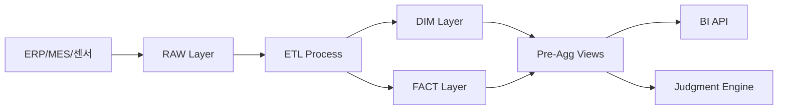

# B-3-2. BI & Analytics Schema Design

**문서 ID**: B-3-2
**버전**: 2.0
**최종 수정일**: 2025-01-26
**작성자**: AI Factory Development Team
**관련 문서**: A-2 (요구사항), B-1 (아키텍처), B-3-1 (Core Schema), B-4 (API)

---

## 목차
1. [개요](#1-개요)
2. [RAW 데이터 스키마](#2-raw-데이터-스키마)
3. [Dimension 테이블](#3-dimension-테이블)
4. [Fact 테이블](#4-fact-테이블)
5. [Pre-Aggregation 뷰](#5-pre-aggregation-뷰)
6. [BI 카탈로그 스키마](#6-bi-카탈로그-스키마)
7. [ETL 메타데이터](#7-etl-메타데이터)
8. [데이터 품질 체크](#8-데이터-품질-체크)
9. [DDL 전체 스크립트](#9-ddl-전체-스크립트)
10. [추적성 매트릭스](#10-추적성-매트릭스)

---

## 1. 개요

### 1.1 목적
제조 현장의 운영 데이터를 BI/분석에 최적화된 형태로 저장하고, 실시간 의사결정을 지원하기 위한 데이터 마트 설계.

### 1.2 데이터 계층 구조



### 1.3 설계 원칙
- **원본 보존**: RAW 계층에서 원본 데이터 완전 보존
- **Star Schema**: DIM + FACT 테이블로 쿼리 성능 최적화
- **Pre-Aggregation**: Materialized View로 대시보드 응답 속도 개선
- **증분 처리**: 변경분만 처리하는 ETL 전략
- **데이터 품질**: 자동 검증 및 이상치 탐지

### 1.4 성능 목표
- RAW 적재 지연: < 5분
- ETL 처리 시간: 일일 < 30분, 시간별 < 5분
- Pre-Agg 리프레시: < 2분
- BI 쿼리 응답: p95 < 2초
- 판단 엔진 데이터 조회: p95 < 500ms

---

## 2. RAW 데이터 스키마

### 2.1 raw_mes_production (MES 생산 데이터)

**목적**: MES 시스템의 생산 실적 원본 데이터

**테이블 구조**:
```sql
CREATE TABLE raw_mes_production (
  id uuid PRIMARY KEY DEFAULT gen_random_uuid(),
  tenant_id uuid NOT NULL REFERENCES tenants(id),
  src_system text NOT NULL DEFAULT 'MES',
  src_table text NOT NULL,
  src_pk text NOT NULL,
  payload jsonb NOT NULL,
  event_time timestamptz NOT NULL,
  ingested_at timestamptz NOT NULL DEFAULT now(),
  processing_status text NOT NULL DEFAULT 'pending' CHECK (processing_status IN ('pending','processed','error','duplicate')),
  error_message text,
  metadata jsonb NOT NULL DEFAULT '{}'
) PARTITION BY RANGE (event_time);

-- 파티션 예시 (월별)
CREATE TABLE raw_mes_production_y2025m01 PARTITION OF raw_mes_production
FOR VALUES FROM ('2025-01-01') TO ('2025-02-01');

CREATE INDEX idx_raw_mes_prod_tenant_event ON raw_mes_production (tenant_id, event_time DESC);
CREATE INDEX idx_raw_mes_prod_status ON raw_mes_production (processing_status) WHERE processing_status = 'pending';
CREATE INDEX idx_raw_mes_prod_src_pk ON raw_mes_production (src_system, src_table, src_pk);
CREATE INDEX idx_raw_mes_prod_payload ON raw_mes_production USING GIN (payload);

COMMENT ON TABLE raw_mes_production IS 'MES 생산 실적 RAW 데이터 (월별 파티션)';
COMMENT ON COLUMN raw_mes_production.payload IS 'JSON: 전체 원본 레코드';
```

**payload JSONB 구조**:
```json
{
  "work_order_id": "WO-2025-001",
  "line_code": "L01",
  "equipment_code": "E01-M01",
  "product_code": "P001",
  "shift": "day",
  "operator_id": "OP-001",
  "start_time": "2025-01-26T08:00:00+09:00",
  "end_time": "2025-01-26T16:00:00+09:00",
  "total_qty": 1500,
  "good_qty": 1390,
  "defect_qty": 110,
  "defect_details": [
    {"type": "scratch", "qty": 60},
    {"type": "dimension", "qty": 50}
  ],
  "cycle_time_avg_sec": 45.2,
  "runtime_minutes": 420,
  "downtime_minutes": 60,
  "downtime_reasons": [
    {"reason": "setup", "minutes": 30},
    {"reason": "breakdown", "minutes": 30}
  ],
  "quality_checks": [
    {"checkpoint": "visual", "pass": true},
    {"checkpoint": "dimension", "pass": false, "comment": "out of tolerance"}
  ]
}
```

### 2.2 raw_erp_order (ERP 주문 데이터)

**목적**: ERP 시스템의 주문/재고 원본 데이터

**테이블 구조**:
```sql
CREATE TABLE raw_erp_order (
  id uuid PRIMARY KEY DEFAULT gen_random_uuid(),
  tenant_id uuid NOT NULL REFERENCES tenants(id),
  src_system text NOT NULL DEFAULT 'ERP',
  src_table text NOT NULL,
  src_pk text NOT NULL,
  payload jsonb NOT NULL,
  event_time timestamptz NOT NULL,
  ingested_at timestamptz NOT NULL DEFAULT now(),
  processing_status text NOT NULL DEFAULT 'pending' CHECK (processing_status IN ('pending','processed','error','duplicate')),
  error_message text,
  metadata jsonb NOT NULL DEFAULT '{}'
) PARTITION BY RANGE (event_time);

CREATE INDEX idx_raw_erp_order_tenant_event ON raw_erp_order (tenant_id, event_time DESC);
CREATE INDEX idx_raw_erp_order_status ON raw_erp_order (processing_status) WHERE processing_status = 'pending';
CREATE INDEX idx_raw_erp_order_payload ON raw_erp_order USING GIN (payload);

COMMENT ON TABLE raw_erp_order IS 'ERP 주문/재고 RAW 데이터';
```

**payload JSONB 구조**:
```json
{
  "order_id": "SO-2025-001",
  "customer_code": "C001",
  "product_code": "P001",
  "order_qty": 5000,
  "delivery_date": "2025-02-15",
  "priority": "high",
  "status": "confirmed",
  "created_at": "2025-01-15T10:00:00+09:00"
}
```

### 2.3 raw_inventory (재고 데이터)

**목적**: 실시간 재고 현황 원본 데이터

**테이블 구조**:
```sql
CREATE TABLE raw_inventory (
  id uuid PRIMARY KEY DEFAULT gen_random_uuid(),
  tenant_id uuid NOT NULL REFERENCES tenants(id),
  src_system text NOT NULL,
  src_table text NOT NULL,
  src_pk text NOT NULL,
  payload jsonb NOT NULL,
  event_time timestamptz NOT NULL,
  ingested_at timestamptz NOT NULL DEFAULT now(),
  processing_status text NOT NULL DEFAULT 'pending' CHECK (processing_status IN ('pending','processed','error','duplicate')),
  error_message text,
  metadata jsonb NOT NULL DEFAULT '{}'
) PARTITION BY RANGE (event_time);

CREATE INDEX idx_raw_inventory_tenant_event ON raw_inventory (tenant_id, event_time DESC);
CREATE INDEX idx_raw_inventory_status ON raw_inventory (processing_status) WHERE processing_status = 'pending';

COMMENT ON TABLE raw_inventory IS '재고 현황 RAW 데이터';
```

### 2.4 raw_equipment_event (설비 이벤트)

**목적**: 설비 알람, 고장, 상태 변경 이벤트

**테이블 구조**:
```sql
CREATE TABLE raw_equipment_event (
  id uuid PRIMARY KEY DEFAULT gen_random_uuid(),
  tenant_id uuid NOT NULL REFERENCES tenants(id),
  src_system text NOT NULL,
  src_table text NOT NULL,
  src_pk text NOT NULL,
  payload jsonb NOT NULL,
  event_time timestamptz NOT NULL,
  ingested_at timestamptz NOT NULL DEFAULT now(),
  processing_status text NOT NULL DEFAULT 'pending' CHECK (processing_status IN ('pending','processed','error','duplicate')),
  error_message text,
  metadata jsonb NOT NULL DEFAULT '{}'
) PARTITION BY RANGE (event_time);

CREATE INDEX idx_raw_equip_event_tenant_event ON raw_equipment_event (tenant_id, event_time DESC);
CREATE INDEX idx_raw_equip_event_status ON raw_equipment_event (processing_status) WHERE processing_status = 'pending';

COMMENT ON TABLE raw_equipment_event IS '설비 이벤트 RAW 데이터';
```

**payload JSONB 구조**:
```json
{
  "equipment_code": "E01-M01",
  "event_type": "alarm",
  "alarm_code": "A-001",
  "severity": "warning",
  "message": "Temperature high",
  "value": 85.3,
  "threshold": 80.0,
  "timestamp": "2025-01-26T14:32:15+09:00"
}
```

### 2.5 RAW 공통 처리 로직

**중복 제거 전략**:
```sql
-- src_system + src_table + src_pk 조합으로 중복 체크
CREATE UNIQUE INDEX idx_raw_mes_prod_dedup
ON raw_mes_production (tenant_id, src_system, src_table, src_pk, event_time);
```

**보관 정책**:
- RAW 데이터: 90일 핫 스토리지, 이후 콜드 스토리지 이전
- 파티션 관리: 월별 자동 생성 및 아카이빙

---

## 3. Dimension 테이블

### 3.1 dim_date (날짜 차원)

**목적**: 날짜 기반 분석을 위한 차원 테이블

**테이블 구조**:
```sql
CREATE TABLE dim_date (
  date date PRIMARY KEY,
  year int NOT NULL,
  quarter int NOT NULL CHECK (quarter BETWEEN 1 AND 4),
  month int NOT NULL CHECK (month BETWEEN 1 AND 12),
  week int NOT NULL CHECK (week BETWEEN 1 AND 53),
  day_of_year int NOT NULL CHECK (day_of_year BETWEEN 1 AND 366),
  day_of_month int NOT NULL CHECK (day_of_month BETWEEN 1 AND 31),
  day_of_week int NOT NULL CHECK (day_of_week BETWEEN 0 AND 6),
  day_name text NOT NULL,
  is_weekend boolean NOT NULL,
  is_holiday boolean NOT NULL DEFAULT false,
  holiday_name text,
  fiscal_year int,
  fiscal_quarter int,
  fiscal_month int,
  created_at timestamptz NOT NULL DEFAULT now()
);

CREATE INDEX idx_dim_date_year_month ON dim_date (year, month);
CREATE INDEX idx_dim_date_is_holiday ON dim_date (is_holiday) WHERE is_holiday = true;

COMMENT ON TABLE dim_date IS '날짜 차원 테이블 (2020-2030)';
```

**시드 데이터 생성**:
```sql
INSERT INTO dim_date (date, year, quarter, month, week, day_of_year, day_of_month, day_of_week, day_name, is_weekend)
SELECT
  d::date,
  EXTRACT(year FROM d)::int,
  EXTRACT(quarter FROM d)::int,
  EXTRACT(month FROM d)::int,
  EXTRACT(week FROM d)::int,
  EXTRACT(doy FROM d)::int,
  EXTRACT(day FROM d)::int,
  EXTRACT(dow FROM d)::int,
  to_char(d, 'Day'),
  EXTRACT(dow FROM d) IN (0, 6)
FROM generate_series('2020-01-01'::date, '2030-12-31'::date, '1 day'::interval) d;
```

### 3.2 dim_line (라인 차원)

**목적**: 생산 라인 마스터

**테이블 구조**:
```sql
CREATE TABLE dim_line (
  tenant_id uuid NOT NULL REFERENCES tenants(id),
  line_code text NOT NULL,
  name text NOT NULL,
  category text CHECK (category IN ('assembly','processing','packaging','inspection','warehouse')),
  capacity_per_hour numeric,
  capacity_unit text,
  timezone text NOT NULL DEFAULT 'Asia/Seoul',
  plant_code text,
  department text,
  manager text,
  cost_center text,
  attributes jsonb NOT NULL DEFAULT '{}',
  is_active boolean NOT NULL DEFAULT true,
  activated_at date,
  deactivated_at date,
  created_at timestamptz NOT NULL DEFAULT now(),
  updated_at timestamptz NOT NULL DEFAULT now(),
  PRIMARY KEY (tenant_id, line_code)
);

CREATE INDEX idx_dim_line_active ON dim_line (tenant_id, is_active) WHERE is_active = true;
CREATE INDEX idx_dim_line_category ON dim_line (category);

COMMENT ON TABLE dim_line IS '생산 라인 차원 테이블';
```

**attributes JSONB 구조**:
```json
{
  "shift_pattern": "3_shift",
  "automation_level": "semi_auto",
  "critical_equipment": ["E01-M01", "E01-M02"],
  "quality_gate": true,
  "target_oee": 0.85,
  "target_defect_rate": 0.03
}
```

### 3.3 dim_product (제품 차원)

**목적**: 제품 마스터

**테이블 구조**:
```sql
CREATE TABLE dim_product (
  tenant_id uuid NOT NULL REFERENCES tenants(id),
  product_code text NOT NULL,
  name text NOT NULL,
  name_en text,
  spec text,
  category text,
  subcategory text,
  unit text NOT NULL DEFAULT 'EA',
  standard_cost numeric,
  target_cycle_time_sec numeric,
  quality_standard text,
  attributes jsonb NOT NULL DEFAULT '{}',
  is_active boolean NOT NULL DEFAULT true,
  activated_at date,
  discontinued_at date,
  created_at timestamptz NOT NULL DEFAULT now(),
  updated_at timestamptz NOT NULL DEFAULT now(),
  PRIMARY KEY (tenant_id, product_code)
);

CREATE INDEX idx_dim_product_active ON dim_product (tenant_id, is_active) WHERE is_active = true;
CREATE INDEX idx_dim_product_category ON dim_product (category, subcategory);

COMMENT ON TABLE dim_product IS '제품 차원 테이블';
```

### 3.4 dim_equipment (설비 차원)

**목적**: 설비 마스터

**테이블 구조**:
```sql
CREATE TABLE dim_equipment (
  tenant_id uuid NOT NULL REFERENCES tenants(id),
  equipment_code text NOT NULL,
  line_code text NOT NULL,
  name text NOT NULL,
  equipment_type text CHECK (equipment_type IN ('machine','robot','conveyor','inspection','utility')),
  vendor text,
  model text,
  serial_number text,
  install_date date,
  warranty_expiry_date date,
  maintenance_cycle_days int,
  last_maintenance_date date,
  next_maintenance_date date,
  mtbf_hours numeric,
  mttr_hours numeric,
  attributes jsonb NOT NULL DEFAULT '{}',
  is_active boolean NOT NULL DEFAULT true,
  created_at timestamptz NOT NULL DEFAULT now(),
  updated_at timestamptz NOT NULL DEFAULT now(),
  PRIMARY KEY (tenant_id, equipment_code),
  FOREIGN KEY (tenant_id, line_code) REFERENCES dim_line(tenant_id, line_code)
);

CREATE INDEX idx_dim_equipment_line ON dim_equipment (tenant_id, line_code);
CREATE INDEX idx_dim_equipment_type ON dim_equipment (equipment_type);
CREATE INDEX idx_dim_equipment_maintenance ON dim_equipment (next_maintenance_date) WHERE is_active = true;

COMMENT ON TABLE dim_equipment IS '설비 차원 테이블';
COMMENT ON COLUMN dim_equipment.mtbf_hours IS 'Mean Time Between Failures (평균 고장 간격)';
COMMENT ON COLUMN dim_equipment.mttr_hours IS 'Mean Time To Repair (평균 수리 시간)';
```

### 3.5 dim_kpi (KPI 차원)

**목적**: KPI 정의 마스터

**테이블 구조**:
```sql
CREATE TABLE dim_kpi (
  tenant_id uuid NOT NULL REFERENCES tenants(id),
  kpi_code text NOT NULL,
  name text NOT NULL,
  name_en text,
  category text NOT NULL CHECK (category IN ('quality','production','efficiency','cost','safety','inventory')),
  unit text,
  description text,
  calculation_method text,
  default_target numeric,
  green_threshold numeric,
  yellow_threshold numeric,
  red_threshold numeric,
  higher_is_better boolean NOT NULL DEFAULT true,
  aggregation_method text CHECK (aggregation_method IN ('sum','avg','min','max','last')),
  attributes jsonb NOT NULL DEFAULT '{}',
  is_active boolean NOT NULL DEFAULT true,
  created_at timestamptz NOT NULL DEFAULT now(),
  updated_at timestamptz NOT NULL DEFAULT now(),
  PRIMARY KEY (tenant_id, kpi_code)
);

CREATE INDEX idx_dim_kpi_category ON dim_kpi (category);

COMMENT ON TABLE dim_kpi IS 'KPI 정의 차원 테이블';
COMMENT ON COLUMN dim_kpi.higher_is_better IS 'true: 높을수록 좋음 (OEE), false: 낮을수록 좋음 (불량률)';
```

**KPI 예시**:
| kpi_code | name | category | unit | default_target | higher_is_better |
|----------|------|----------|------|----------------|------------------|
| defect_rate | 불량률 | quality | % | 0.03 | false |
| oee | 종합설비효율 | efficiency | % | 0.85 | true |
| cycle_time | 사이클타임 | production | sec | 45 | false |
| inventory_cov | 재고회전일수 | inventory | days | 7 | false |

### 3.6 dim_shift (교대 차원)

**목적**: 교대 패턴 정의

**테이블 구조**:
```sql
CREATE TABLE dim_shift (
  tenant_id uuid NOT NULL REFERENCES tenants(id),
  shift_code text NOT NULL,
  name text NOT NULL,
  start_time time NOT NULL,
  end_time time NOT NULL,
  duration_hours numeric NOT NULL,
  is_night_shift boolean NOT NULL DEFAULT false,
  shift_order int NOT NULL,
  created_at timestamptz NOT NULL DEFAULT now(),
  PRIMARY KEY (tenant_id, shift_code)
);

COMMENT ON TABLE dim_shift IS '교대 차원 테이블';
```

**시드 데이터**:
```sql
INSERT INTO dim_shift (tenant_id, shift_code, name, start_time, end_time, duration_hours, shift_order) VALUES
('00000000-0000-0000-0000-000000000001', 'day', '주간', '08:00', '16:00', 8, 1),
('00000000-0000-0000-0000-000000000001', 'evening', '오후', '16:00', '24:00', 8, 2),
('00000000-0000-0000-0000-000000000001', 'night', '야간', '00:00', '08:00', 8, 3);
```

---

## 4. Fact 테이블

### 4.1 fact_daily_production (일일 생산 실적)

**목적**: 일/교대/라인/제품별 생산 실적 집계

**테이블 구조**:
```sql
CREATE TABLE fact_daily_production (
  tenant_id uuid NOT NULL REFERENCES tenants(id),
  date date NOT NULL,
  line_code text NOT NULL,
  product_code text NOT NULL,
  shift text NOT NULL,
  total_qty numeric NOT NULL DEFAULT 0,
  good_qty numeric NOT NULL DEFAULT 0,
  defect_qty numeric NOT NULL DEFAULT 0,
  rework_qty numeric NOT NULL DEFAULT 0,
  scrap_qty numeric NOT NULL DEFAULT 0,
  cycle_time_avg numeric,
  cycle_time_std numeric,
  runtime_minutes numeric NOT NULL DEFAULT 0,
  downtime_minutes numeric NOT NULL DEFAULT 0,
  setup_time_minutes numeric NOT NULL DEFAULT 0,
  planned_qty numeric,
  target_cycle_time numeric,
  work_order_count int NOT NULL DEFAULT 0,
  operator_count int,
  created_at timestamptz NOT NULL DEFAULT now(),
  updated_at timestamptz NOT NULL DEFAULT now(),
  PRIMARY KEY (tenant_id, date, line_code, product_code, shift),
  FOREIGN KEY (date) REFERENCES dim_date(date),
  FOREIGN KEY (tenant_id, line_code) REFERENCES dim_line(tenant_id, line_code),
  FOREIGN KEY (tenant_id, product_code) REFERENCES dim_product(tenant_id, product_code)
) PARTITION BY RANGE (date);

-- 파티션 예시 (분기별)
CREATE TABLE fact_daily_production_y2025q1 PARTITION OF fact_daily_production
FOR VALUES FROM ('2025-01-01') TO ('2025-04-01');

CREATE INDEX idx_fact_daily_prod_date ON fact_daily_production (tenant_id, date DESC);
CREATE INDEX idx_fact_daily_prod_line ON fact_daily_production (tenant_id, line_code, date DESC);
CREATE INDEX idx_fact_daily_prod_product ON fact_daily_production (tenant_id, product_code, date DESC);

COMMENT ON TABLE fact_daily_production IS '일일 생산 실적 FACT (분기별 파티션)';
```

**계산 필드**:
```sql
-- View로 제공
CREATE VIEW v_fact_daily_production_calc AS
SELECT
  *,
  CASE WHEN total_qty > 0 THEN good_qty::numeric / total_qty ELSE 0 END AS yield_rate,
  CASE WHEN total_qty > 0 THEN defect_qty::numeric / total_qty ELSE 0 END AS defect_rate,
  CASE WHEN planned_qty > 0 THEN total_qty::numeric / planned_qty ELSE 0 END AS achievement_rate,
  (runtime_minutes + downtime_minutes + setup_time_minutes) AS total_time_minutes,
  CASE
    WHEN (runtime_minutes + downtime_minutes + setup_time_minutes) > 0
    THEN runtime_minutes::numeric / (runtime_minutes + downtime_minutes + setup_time_minutes)
    ELSE 0
  END AS availability
FROM fact_daily_production;
```

### 4.2 fact_daily_defect (일일 불량 실적)

**목적**: 불량 유형별 상세 집계

**테이블 구조**:
```sql
CREATE TABLE fact_daily_defect (
  tenant_id uuid NOT NULL REFERENCES tenants(id),
  date date NOT NULL,
  line_code text NOT NULL,
  product_code text NOT NULL,
  shift text NOT NULL,
  defect_type text NOT NULL,
  defect_qty numeric NOT NULL DEFAULT 0,
  defect_cost numeric,
  root_cause text,
  countermeasure text,
  responsible_dept text,
  created_at timestamptz NOT NULL DEFAULT now(),
  updated_at timestamptz NOT NULL DEFAULT now(),
  PRIMARY KEY (tenant_id, date, line_code, product_code, shift, defect_type),
  FOREIGN KEY (date) REFERENCES dim_date(date),
  FOREIGN KEY (tenant_id, line_code) REFERENCES dim_line(tenant_id, line_code),
  FOREIGN KEY (tenant_id, product_code) REFERENCES dim_product(tenant_id, product_code)
) PARTITION BY RANGE (date);

CREATE INDEX idx_fact_daily_defect_date ON fact_daily_defect (tenant_id, date DESC);
CREATE INDEX idx_fact_daily_defect_type ON fact_daily_defect (defect_type, date DESC);

COMMENT ON TABLE fact_daily_defect IS '일일 불량 상세 FACT';
```

### 4.3 fact_inventory_snapshot (재고 스냅샷)

**목적**: 일별 재고 현황 스냅샷

**테이블 구조**:
```sql
CREATE TABLE fact_inventory_snapshot (
  tenant_id uuid NOT NULL REFERENCES tenants(id),
  date date NOT NULL,
  product_code text NOT NULL,
  location text NOT NULL,
  stock_qty numeric NOT NULL DEFAULT 0,
  safety_stock_qty numeric NOT NULL DEFAULT 0,
  reserved_qty numeric NOT NULL DEFAULT 0,
  available_qty numeric NOT NULL DEFAULT 0,
  in_transit_qty numeric NOT NULL DEFAULT 0,
  stock_value numeric,
  avg_daily_usage numeric,
  coverage_days numeric,
  last_receipt_date date,
  last_issue_date date,
  created_at timestamptz NOT NULL DEFAULT now(),
  PRIMARY KEY (tenant_id, date, product_code, location),
  FOREIGN KEY (date) REFERENCES dim_date(date),
  FOREIGN KEY (tenant_id, product_code) REFERENCES dim_product(tenant_id, product_code)
) PARTITION BY RANGE (date);

CREATE INDEX idx_fact_inv_snapshot_date ON fact_inventory_snapshot (tenant_id, date DESC);
CREATE INDEX idx_fact_inv_snapshot_product ON fact_inventory_snapshot (tenant_id, product_code, date DESC);

COMMENT ON TABLE fact_inventory_snapshot IS '일별 재고 스냅샷 FACT';
COMMENT ON COLUMN fact_inventory_snapshot.coverage_days IS '재고 커버리지 일수 (재고량 / 일평균 사용량)';
```

### 4.4 fact_equipment_event (설비 이벤트 집계)

**목적**: 설비별 이벤트 집계

**테이블 구조**:
```sql
CREATE TABLE fact_equipment_event (
  tenant_id uuid NOT NULL REFERENCES tenants(id),
  date date NOT NULL,
  equipment_code text NOT NULL,
  event_type text NOT NULL CHECK (event_type IN ('alarm','breakdown','maintenance','setup','idle')),
  event_count int NOT NULL DEFAULT 0,
  total_duration_minutes numeric NOT NULL DEFAULT 0,
  avg_duration_minutes numeric,
  max_duration_minutes numeric,
  severity_distribution jsonb,
  created_at timestamptz NOT NULL DEFAULT now(),
  updated_at timestamptz NOT NULL DEFAULT now(),
  PRIMARY KEY (tenant_id, date, equipment_code, event_type),
  FOREIGN KEY (date) REFERENCES dim_date(date),
  FOREIGN KEY (tenant_id, equipment_code) REFERENCES dim_equipment(tenant_id, equipment_code)
) PARTITION BY RANGE (date);

CREATE INDEX idx_fact_equip_event_date ON fact_equipment_event (tenant_id, date DESC);
CREATE INDEX idx_fact_equip_event_equip ON fact_equipment_event (tenant_id, equipment_code, date DESC);

COMMENT ON TABLE fact_equipment_event IS '설비 이벤트 집계 FACT';
```

### 4.5 fact_hourly_production (시간별 생산 실적)

**목적**: 실시간 모니터링을 위한 시간별 집계

**테이블 구조**:
```sql
CREATE TABLE fact_hourly_production (
  tenant_id uuid NOT NULL REFERENCES tenants(id),
  hour_timestamp timestamptz NOT NULL,
  line_code text NOT NULL,
  product_code text NOT NULL,
  total_qty numeric NOT NULL DEFAULT 0,
  good_qty numeric NOT NULL DEFAULT 0,
  defect_qty numeric NOT NULL DEFAULT 0,
  cycle_time_avg numeric,
  runtime_minutes numeric NOT NULL DEFAULT 0,
  downtime_minutes numeric NOT NULL DEFAULT 0,
  created_at timestamptz NOT NULL DEFAULT now(),
  PRIMARY KEY (tenant_id, hour_timestamp, line_code, product_code),
  FOREIGN KEY (tenant_id, line_code) REFERENCES dim_line(tenant_id, line_code),
  FOREIGN KEY (tenant_id, product_code) REFERENCES dim_product(tenant_id, product_code)
) PARTITION BY RANGE (hour_timestamp);

CREATE INDEX idx_fact_hourly_prod_time ON fact_hourly_production (tenant_id, hour_timestamp DESC);
CREATE INDEX idx_fact_hourly_prod_line ON fact_hourly_production (tenant_id, line_code, hour_timestamp DESC);

COMMENT ON TABLE fact_hourly_production IS '시간별 생산 실적 FACT (실시간 모니터링용)';
```

---

## 5. Pre-Aggregation 뷰

### 5.1 mv_defect_trend (불량 추이)

**목적**: 불량률 추이 분석 (대시보드용)

**뷰 정의**:
```sql
CREATE MATERIALIZED VIEW mv_defect_trend AS
SELECT
  f.tenant_id,
  f.date,
  f.line_code,
  l.name AS line_name,
  f.product_code,
  p.name AS product_name,
  f.shift,
  SUM(f.total_qty) AS total_qty,
  SUM(f.defect_qty) AS defect_qty,
  CASE
    WHEN SUM(f.total_qty) > 0
    THEN SUM(f.defect_qty)::numeric / SUM(f.total_qty)
    ELSE 0
  END AS defect_rate,
  jsonb_agg(
    jsonb_build_object(
      'type', d.defect_type,
      'qty', d.defect_qty
    ) ORDER BY d.defect_qty DESC
  ) FILTER (WHERE d.defect_type IS NOT NULL) AS top_defect_types,
  AVG(SUM(f.defect_qty)::numeric / NULLIF(SUM(f.total_qty), 0))
    OVER (
      PARTITION BY f.tenant_id, f.line_code, f.product_code
      ORDER BY f.date
      ROWS BETWEEN 6 PRECEDING AND CURRENT ROW
    ) AS defect_rate_7d_avg
FROM fact_daily_production f
JOIN dim_line l ON f.tenant_id = l.tenant_id AND f.line_code = l.line_code
JOIN dim_product p ON f.tenant_id = p.tenant_id AND f.product_code = p.product_code
LEFT JOIN fact_daily_defect d ON
  f.tenant_id = d.tenant_id AND
  f.date = d.date AND
  f.line_code = d.line_code AND
  f.product_code = d.product_code AND
  f.shift = d.shift
WHERE f.date >= CURRENT_DATE - INTERVAL '90 days'
GROUP BY f.tenant_id, f.date, f.line_code, l.name, f.product_code, p.name, f.shift;

CREATE UNIQUE INDEX idx_mv_defect_trend_pk ON mv_defect_trend (tenant_id, date, line_code, product_code, shift);
CREATE INDEX idx_mv_defect_trend_date ON mv_defect_trend (tenant_id, date DESC);
CREATE INDEX idx_mv_defect_trend_line ON mv_defect_trend (tenant_id, line_code, date DESC);

COMMENT ON MATERIALIZED VIEW mv_defect_trend IS '불량률 추이 (최근 90일, 1시간 리프레시)';
```

**리프레시 전략**:
```sql
-- 증분 리프레시 (PostgreSQL 13+)
REFRESH MATERIALIZED VIEW CONCURRENTLY mv_defect_trend;

-- 스케줄: 1시간마다, 피크 시간대 전 수동
-- cron: 0 * * * * psql -c "REFRESH MATERIALIZED VIEW CONCURRENTLY mv_defect_trend;"
```

### 5.2 mv_oee_daily (일일 OEE)

**목적**: OEE (Overall Equipment Effectiveness) 계산

**OEE 공식**:
```
OEE = Availability × Performance × Quality
- Availability = Runtime / (Runtime + Downtime)
- Performance = (Total Qty × Ideal Cycle Time) / Runtime
- Quality = Good Qty / Total Qty
```

**뷰 정의**:
```sql
CREATE MATERIALIZED VIEW mv_oee_daily AS
SELECT
  f.tenant_id,
  f.date,
  f.line_code,
  l.name AS line_name,
  f.shift,
  SUM(f.total_qty) AS total_qty,
  SUM(f.good_qty) AS good_qty,
  SUM(f.runtime_minutes) AS runtime_minutes,
  SUM(f.downtime_minutes) AS downtime_minutes,
  SUM(f.setup_time_minutes) AS setup_time_minutes,
  -- Availability
  CASE
    WHEN SUM(f.runtime_minutes + f.downtime_minutes) > 0
    THEN SUM(f.runtime_minutes)::numeric / SUM(f.runtime_minutes + f.downtime_minutes)
    ELSE 0
  END AS availability,
  -- Performance
  CASE
    WHEN SUM(f.runtime_minutes) > 0 AND AVG(f.target_cycle_time) > 0
    THEN (SUM(f.total_qty) * AVG(f.target_cycle_time) / 60.0) / SUM(f.runtime_minutes)
    ELSE 0
  END AS performance,
  -- Quality
  CASE
    WHEN SUM(f.total_qty) > 0
    THEN SUM(f.good_qty)::numeric / SUM(f.total_qty)
    ELSE 0
  END AS quality,
  -- OEE
  (
    CASE
      WHEN SUM(f.runtime_minutes + f.downtime_minutes) > 0
      THEN SUM(f.runtime_minutes)::numeric / SUM(f.runtime_minutes + f.downtime_minutes)
      ELSE 0
    END
  ) * (
    CASE
      WHEN SUM(f.runtime_minutes) > 0 AND AVG(f.target_cycle_time) > 0
      THEN (SUM(f.total_qty) * AVG(f.target_cycle_time) / 60.0) / SUM(f.runtime_minutes)
      ELSE 0
    END
  ) * (
    CASE
      WHEN SUM(f.total_qty) > 0
      THEN SUM(f.good_qty)::numeric / SUM(f.total_qty)
      ELSE 0
    END
  ) AS oee
FROM fact_daily_production f
JOIN dim_line l ON f.tenant_id = l.tenant_id AND f.line_code = l.line_code
WHERE f.date >= CURRENT_DATE - INTERVAL '90 days'
GROUP BY f.tenant_id, f.date, f.line_code, l.name, f.shift;

CREATE UNIQUE INDEX idx_mv_oee_daily_pk ON mv_oee_daily (tenant_id, date, line_code, shift);
CREATE INDEX idx_mv_oee_daily_date ON mv_oee_daily (tenant_id, date DESC);

COMMENT ON MATERIALIZED VIEW mv_oee_daily IS '일일 OEE (최근 90일, 새벽 1회 리프레시)';
```

### 5.3 mv_inventory_coverage (재고 커버리지)

**목적**: 재고 커버리지 분석

**뷰 정의**:
```sql
CREATE MATERIALIZED VIEW mv_inventory_coverage AS
SELECT
  i.tenant_id,
  i.date,
  i.product_code,
  p.name AS product_name,
  p.category,
  i.location,
  i.stock_qty,
  i.safety_stock_qty,
  i.available_qty,
  i.avg_daily_usage,
  CASE
    WHEN i.avg_daily_usage > 0
    THEN i.available_qty / i.avg_daily_usage
    ELSE NULL
  END AS coverage_days,
  CASE
    WHEN i.stock_qty < i.safety_stock_qty THEN 'below_safety'
    WHEN i.stock_qty < i.safety_stock_qty * 1.5 THEN 'low'
    WHEN i.stock_qty > i.safety_stock_qty * 3 THEN 'excess'
    ELSE 'normal'
  END AS stock_status
FROM fact_inventory_snapshot i
JOIN dim_product p ON i.tenant_id = p.tenant_id AND i.product_code = p.product_code
WHERE i.date >= CURRENT_DATE - INTERVAL '30 days';

CREATE UNIQUE INDEX idx_mv_inv_cov_pk ON mv_inventory_coverage (tenant_id, date, product_code, location);
CREATE INDEX idx_mv_inv_cov_date ON mv_inventory_coverage (tenant_id, date DESC);
CREATE INDEX idx_mv_inv_cov_status ON mv_inventory_coverage (stock_status);

COMMENT ON MATERIALIZED VIEW mv_inventory_coverage IS '재고 커버리지 (최근 30일, 일 1회 리프레시)';
```

### 5.4 mv_line_performance (라인별 성과)

**목적**: 라인별 종합 성과 지표

**뷰 정의**:
```sql
CREATE MATERIALIZED VIEW mv_line_performance AS
SELECT
  f.tenant_id,
  f.date,
  f.line_code,
  l.name AS line_name,
  l.category AS line_category,
  -- 생산 지표
  SUM(f.total_qty) AS total_qty,
  SUM(f.good_qty) AS good_qty,
  SUM(f.defect_qty) AS defect_qty,
  CASE WHEN SUM(f.total_qty) > 0 THEN SUM(f.defect_qty)::numeric / SUM(f.total_qty) ELSE 0 END AS defect_rate,
  -- 시간 지표
  SUM(f.runtime_minutes) AS runtime_minutes,
  SUM(f.downtime_minutes) AS downtime_minutes,
  SUM(f.setup_time_minutes) AS setup_time_minutes,
  -- OEE (간소화)
  oee.oee,
  oee.availability,
  oee.performance,
  oee.quality,
  -- 제품 다양성
  COUNT(DISTINCT f.product_code) AS product_variety,
  -- 설비 이벤트
  COALESCE(e.total_alarm_count, 0) AS alarm_count,
  COALESCE(e.total_breakdown_count, 0) AS breakdown_count
FROM fact_daily_production f
JOIN dim_line l ON f.tenant_id = l.tenant_id AND f.line_code = l.line_code
LEFT JOIN mv_oee_daily oee ON
  f.tenant_id = oee.tenant_id AND
  f.date = oee.date AND
  f.line_code = oee.line_code AND
  f.shift = oee.shift
LEFT JOIN (
  SELECT
    tenant_id, date, equipment_code,
    SUM(CASE WHEN event_type = 'alarm' THEN event_count ELSE 0 END) AS total_alarm_count,
    SUM(CASE WHEN event_type = 'breakdown' THEN event_count ELSE 0 END) AS total_breakdown_count
  FROM fact_equipment_event
  GROUP BY tenant_id, date, equipment_code
) e ON f.tenant_id = e.tenant_id AND f.date = e.date
WHERE f.date >= CURRENT_DATE - INTERVAL '90 days'
GROUP BY f.tenant_id, f.date, f.line_code, l.name, l.category, oee.oee, oee.availability, oee.performance, oee.quality;

CREATE UNIQUE INDEX idx_mv_line_perf_pk ON mv_line_performance (tenant_id, date, line_code);
CREATE INDEX idx_mv_line_perf_date ON mv_line_performance (tenant_id, date DESC);

COMMENT ON MATERIALIZED VIEW mv_line_performance IS '라인별 종합 성과 (최근 90일, 새벽 1회 리프레시)';
```

### 5.5 리프레시 스케줄 요약

| 뷰 이름 | 리프레시 주기 | 실행 시간 | 데이터 범위 |
|---------|--------------|-----------|-------------|
| mv_defect_trend | 1시간 | 매시 정각 | 최근 90일 |
| mv_oee_daily | 1일 | 새벽 3시 | 최근 90일 |
| mv_inventory_coverage | 1일 | 새벽 4시 | 최근 30일 |
| mv_line_performance | 1일 | 새벽 5시 | 최근 90일 |

**리프레시 배치 스크립트**:
```bash
#!/bin/bash
# refresh_mv.sh
psql -c "REFRESH MATERIALIZED VIEW CONCURRENTLY mv_defect_trend;"
psql -c "REFRESH MATERIALIZED VIEW CONCURRENTLY mv_oee_daily;"
psql -c "REFRESH MATERIALIZED VIEW CONCURRENTLY mv_inventory_coverage;"
psql -c "REFRESH MATERIALIZED VIEW CONCURRENTLY mv_line_performance;"
```

---

## 6. BI 카탈로그 스키마

### 6.1 bi_datasets (데이터셋 정의)

**목적**: BI 대시보드에서 사용할 데이터셋 메타데이터

**테이블 구조**:
```sql
CREATE TABLE bi_datasets (
  id uuid PRIMARY KEY DEFAULT gen_random_uuid(),
  tenant_id uuid NOT NULL REFERENCES tenants(id),
  name text NOT NULL,
  description text,
  source_type text NOT NULL CHECK (source_type IN ('postgres_table','postgres_view','materialized_view','api_endpoint')),
  source_ref text NOT NULL,
  default_filters jsonb,
  refresh_schedule text,
  last_refresh_at timestamptz,
  row_count bigint,
  created_by uuid REFERENCES users(id),
  created_at timestamptz NOT NULL DEFAULT now(),
  updated_at timestamptz NOT NULL DEFAULT now(),
  UNIQUE (tenant_id, name)
);

CREATE INDEX idx_bi_datasets_tenant ON bi_datasets (tenant_id);

COMMENT ON TABLE bi_datasets IS 'BI 데이터셋 정의';
COMMENT ON COLUMN bi_datasets.source_ref IS 'postgres: 테이블/뷰명, api: 엔드포인트 URL';
```

**default_filters JSONB 구조**:
```json
{
  "date_range": {
    "type": "relative",
    "value": "last_30_days"
  },
  "line_codes": ["L01", "L02"],
  "is_active": true
}
```

### 6.2 bi_metrics (지표 정의)

**목적**: 계산 지표 정의

**테이블 구조**:
```sql
CREATE TABLE bi_metrics (
  id uuid PRIMARY KEY DEFAULT gen_random_uuid(),
  tenant_id uuid NOT NULL REFERENCES tenants(id),
  name text NOT NULL,
  description text,
  dataset_id uuid NOT NULL REFERENCES bi_datasets(id) ON DELETE CASCADE,
  expression_sql text NOT NULL,
  agg_type text CHECK (agg_type IN ('sum','avg','min','max','count','distinct_count','median','percentile')),
  format_type text CHECK (format_type IN ('number','percent','currency','duration')),
  format_options jsonb,
  default_chart_type text,
  created_by uuid REFERENCES users(id),
  created_at timestamptz NOT NULL DEFAULT now(),
  updated_at timestamptz NOT NULL DEFAULT now(),
  UNIQUE (tenant_id, name)
);

CREATE INDEX idx_bi_metrics_dataset ON bi_metrics (dataset_id);

COMMENT ON TABLE bi_metrics IS 'BI 지표 정의';
```

**예시 지표**:
```sql
INSERT INTO bi_metrics (tenant_id, name, dataset_id, expression_sql, agg_type, format_type, default_chart_type) VALUES
('tenant_001', '불량률', 'dataset_defect_trend',
 'SUM(defect_qty)::numeric / NULLIF(SUM(total_qty), 0) * 100',
 'avg', 'percent', 'line'),
('tenant_001', '평균 OEE', 'dataset_oee',
 'AVG(oee) * 100',
 'avg', 'percent', 'gauge'),
('tenant_001', '총 생산량', 'dataset_production',
 'SUM(total_qty)',
 'sum', 'number', 'bar');
```

### 6.3 bi_dashboards (대시보드 정의)

**목적**: 대시보드 레이아웃 저장

**테이블 구조**:
```sql
CREATE TABLE bi_dashboards (
  id uuid PRIMARY KEY DEFAULT gen_random_uuid(),
  tenant_id uuid NOT NULL REFERENCES tenants(id),
  name text NOT NULL,
  description text,
  layout jsonb NOT NULL,
  is_public boolean NOT NULL DEFAULT false,
  owner_id uuid NOT NULL REFERENCES users(id),
  created_at timestamptz NOT NULL DEFAULT now(),
  updated_at timestamptz NOT NULL DEFAULT now(),
  UNIQUE (tenant_id, name)
);

CREATE INDEX idx_bi_dashboards_tenant ON bi_dashboards (tenant_id);
CREATE INDEX idx_bi_dashboards_owner ON bi_dashboards (owner_id);

COMMENT ON TABLE bi_dashboards IS 'BI 대시보드 정의';
```

**layout JSONB 구조**:
```json
{
  "components": [
    {
      "id": "widget_1",
      "type": "chart",
      "position": {"x": 0, "y": 0, "w": 6, "h": 4},
      "config": {
        "dataset_id": "dataset_defect_trend",
        "metric_id": "metric_defect_rate",
        "chart_type": "line",
        "time_dimension": "date",
        "filters": {"line_code": "L01"}
      }
    },
    {
      "id": "widget_2",
      "type": "kpi_card",
      "position": {"x": 6, "y": 0, "w": 3, "h": 2},
      "config": {
        "metric_id": "metric_oee",
        "comparison": "previous_period"
      }
    }
  ]
}
```

### 6.4 bi_components (컴포넌트 템플릿)

**목적**: 재사용 가능한 BI 컴포넌트 템플릿

**테이블 구조**:
```sql
CREATE TABLE bi_components (
  id uuid PRIMARY KEY DEFAULT gen_random_uuid(),
  tenant_id uuid NOT NULL REFERENCES tenants(id),
  type text NOT NULL CHECK (type IN ('chart','table','kpi_card','gauge','heatmap','pivot')),
  name text NOT NULL,
  required_fields jsonb NOT NULL,
  options_schema jsonb NOT NULL,
  default_options jsonb,
  created_at timestamptz NOT NULL DEFAULT now(),
  UNIQUE (tenant_id, type, name)
);

COMMENT ON TABLE bi_components IS 'BI 컴포넌트 템플릿';
```

**예시 템플릿**:
```json
{
  "type": "chart",
  "name": "defect_trend_line",
  "required_fields": ["date", "defect_rate"],
  "options_schema": {
    "type": "object",
    "properties": {
      "show_target_line": {"type": "boolean"},
      "target_value": {"type": "number"},
      "color_scheme": {"enum": ["red_yellow_green", "blue", "custom"]}
    }
  },
  "default_options": {
    "show_target_line": true,
    "target_value": 0.03,
    "color_scheme": "red_yellow_green"
  }
}
```

---

## 7. ETL 메타데이터

### 7.1 etl_jobs (ETL 작업 정의)

**목적**: ETL 작업 정의 및 스케줄

**테이블 구조**:
```sql
CREATE TABLE etl_jobs (
  id uuid PRIMARY KEY DEFAULT gen_random_uuid(),
  tenant_id uuid NOT NULL REFERENCES tenants(id),
  name text NOT NULL,
  description text,
  job_type text NOT NULL CHECK (job_type IN ('raw_to_fact','fact_to_agg','refresh_mv','data_quality')),
  source_tables text[] NOT NULL,
  target_tables text[] NOT NULL,
  transform_logic text,
  schedule_cron text,
  is_enabled boolean NOT NULL DEFAULT true,
  max_runtime_minutes int NOT NULL DEFAULT 60,
  retry_count int NOT NULL DEFAULT 3,
  created_at timestamptz NOT NULL DEFAULT now(),
  updated_at timestamptz NOT NULL DEFAULT now(),
  UNIQUE (tenant_id, name)
);

CREATE INDEX idx_etl_jobs_tenant ON etl_jobs (tenant_id);

COMMENT ON TABLE etl_jobs IS 'ETL 작업 정의';
```

### 7.2 etl_job_executions (ETL 실행 이력)

**목적**: ETL 작업 실행 이력 및 모니터링

**테이블 구조**:
```sql
CREATE TABLE etl_job_executions (
  id uuid PRIMARY KEY DEFAULT gen_random_uuid(),
  job_id uuid NOT NULL REFERENCES etl_jobs(id),
  status text NOT NULL DEFAULT 'running' CHECK (status IN ('running','completed','failed','cancelled')),
  rows_processed bigint,
  rows_inserted bigint,
  rows_updated bigint,
  rows_deleted bigint,
  error_message text,
  started_at timestamptz NOT NULL DEFAULT now(),
  ended_at timestamptz,
  duration_seconds int,
  metadata jsonb NOT NULL DEFAULT '{}'
);

CREATE INDEX idx_etl_executions_job ON etl_job_executions (job_id, started_at DESC);
CREATE INDEX idx_etl_executions_status ON etl_job_executions (status) WHERE status = 'running';

COMMENT ON TABLE etl_job_executions IS 'ETL 실행 이력';
```

### 7.3 ETL 작업 예시

**RAW → FACT 변환**:
```sql
-- etl_raw_to_fact_daily_production.sql
INSERT INTO fact_daily_production (
  tenant_id, date, line_code, product_code, shift,
  total_qty, good_qty, defect_qty, cycle_time_avg,
  runtime_minutes, downtime_minutes, setup_time_minutes
)
SELECT
  tenant_id,
  (payload->>'start_time')::date AS date,
  payload->>'line_code' AS line_code,
  payload->>'product_code' AS product_code,
  payload->>'shift' AS shift,
  SUM((payload->>'total_qty')::numeric) AS total_qty,
  SUM((payload->>'good_qty')::numeric) AS good_qty,
  SUM((payload->>'defect_qty')::numeric) AS defect_qty,
  AVG((payload->>'cycle_time_avg_sec')::numeric) AS cycle_time_avg,
  SUM((payload->>'runtime_minutes')::numeric) AS runtime_minutes,
  SUM((payload->>'downtime_minutes')::numeric) AS downtime_minutes,
  SUM(COALESCE((payload->>'setup_time_minutes')::numeric, 0)) AS setup_time_minutes
FROM raw_mes_production
WHERE processing_status = 'pending'
  AND event_time >= CURRENT_DATE - INTERVAL '1 day'
  AND event_time < CURRENT_DATE
GROUP BY tenant_id, date, line_code, product_code, shift
ON CONFLICT (tenant_id, date, line_code, product_code, shift)
DO UPDATE SET
  total_qty = EXCLUDED.total_qty,
  good_qty = EXCLUDED.good_qty,
  defect_qty = EXCLUDED.defect_qty,
  cycle_time_avg = EXCLUDED.cycle_time_avg,
  runtime_minutes = EXCLUDED.runtime_minutes,
  downtime_minutes = EXCLUDED.downtime_minutes,
  setup_time_minutes = EXCLUDED.setup_time_minutes,
  updated_at = now();

-- RAW 처리 상태 업데이트
UPDATE raw_mes_production
SET processing_status = 'processed'
WHERE processing_status = 'pending'
  AND event_time >= CURRENT_DATE - INTERVAL '1 day'
  AND event_time < CURRENT_DATE;
```

---

## 8. 데이터 품질 체크

### 8.1 data_quality_rules (품질 규칙)

**목적**: 데이터 품질 검증 규칙 정의

**테이블 구조**:
```sql
CREATE TABLE data_quality_rules (
  id uuid PRIMARY KEY DEFAULT gen_random_uuid(),
  tenant_id uuid NOT NULL REFERENCES tenants(id),
  name text NOT NULL,
  description text,
  table_name text NOT NULL,
  rule_type text NOT NULL CHECK (rule_type IN ('not_null','range','uniqueness','referential_integrity','pattern','custom_sql')),
  rule_config jsonb NOT NULL,
  severity text NOT NULL CHECK (severity IN ('info','warning','error','critical')),
  is_enabled boolean NOT NULL DEFAULT true,
  created_at timestamptz NOT NULL DEFAULT now(),
  UNIQUE (tenant_id, name)
);

COMMENT ON TABLE data_quality_rules IS '데이터 품질 검증 규칙';
```

**rule_config 예시**:
```json
{
  "type": "range",
  "column": "defect_rate",
  "min": 0,
  "max": 1,
  "message": "불량률은 0~1 사이여야 함"
}
```

### 8.2 data_quality_checks (품질 체크 결과)

**목적**: 데이터 품질 체크 실행 결과

**테이블 구조**:
```sql
CREATE TABLE data_quality_checks (
  id uuid PRIMARY KEY DEFAULT gen_random_uuid(),
  rule_id uuid NOT NULL REFERENCES data_quality_rules(id),
  status text NOT NULL CHECK (status IN ('pass','fail','warning')),
  failed_row_count int,
  total_row_count int,
  sample_failed_rows jsonb,
  executed_at timestamptz NOT NULL DEFAULT now(),
  metadata jsonb NOT NULL DEFAULT '{}'
);

CREATE INDEX idx_dq_checks_rule ON data_quality_checks (rule_id, executed_at DESC);
CREATE INDEX idx_dq_checks_status ON data_quality_checks (status) WHERE status = 'fail';

COMMENT ON TABLE data_quality_checks IS '데이터 품질 체크 결과';
```

### 8.3 품질 체크 쿼리 예시

**필수 값 체크**:
```sql
-- fact_daily_production의 필수 컬럼 NULL 체크
SELECT
  date, line_code, product_code, shift,
  CASE
    WHEN total_qty IS NULL THEN 'total_qty is NULL'
    WHEN good_qty IS NULL THEN 'good_qty is NULL'
    ELSE 'OK'
  END AS issue
FROM fact_daily_production
WHERE total_qty IS NULL OR good_qty IS NULL;
```

**범위 체크**:
```sql
-- 불량률이 0~1 범위를 벗어나는 케이스
SELECT
  date, line_code, product_code,
  defect_qty::numeric / NULLIF(total_qty, 0) AS defect_rate
FROM fact_daily_production
WHERE defect_qty::numeric / NULLIF(total_qty, 0) NOT BETWEEN 0 AND 1;
```

**외래키 무결성 체크**:
```sql
-- fact_daily_production에서 dim_line에 없는 line_code
SELECT DISTINCT f.line_code
FROM fact_daily_production f
LEFT JOIN dim_line l ON f.tenant_id = l.tenant_id AND f.line_code = l.line_code
WHERE l.line_code IS NULL;
```

**이상치 탐지**:
```sql
-- 생산량이 평균 대비 3σ 이상 벗어나는 케이스
WITH stats AS (
  SELECT
    line_code, product_code,
    AVG(total_qty) AS avg_qty,
    STDDEV(total_qty) AS stddev_qty
  FROM fact_daily_production
  WHERE date >= CURRENT_DATE - INTERVAL '30 days'
  GROUP BY line_code, product_code
)
SELECT
  f.date, f.line_code, f.product_code, f.total_qty,
  s.avg_qty, s.stddev_qty,
  (f.total_qty - s.avg_qty) / NULLIF(s.stddev_qty, 0) AS z_score
FROM fact_daily_production f
JOIN stats s ON f.line_code = s.line_code AND f.product_code = s.product_code
WHERE ABS((f.total_qty - s.avg_qty) / NULLIF(s.stddev_qty, 0)) > 3;
```

---

## 9. DDL 전체 스크립트

### 9.1 실행 순서

1. RAW 테이블 (파티션 포함)
2. DIM 테이블
3. FACT 테이블 (파티션 포함)
4. Pre-Aggregation 뷰
5. BI 카탈로그
6. ETL 메타데이터
7. 데이터 품질

### 9.2 파티션 자동 생성 함수

```sql
-- 월별 파티션 자동 생성 함수
CREATE OR REPLACE FUNCTION create_monthly_partitions(
  p_table_name text,
  p_start_date date,
  p_end_date date
) RETURNS void AS $$
DECLARE
  v_partition_name text;
  v_start_date date;
  v_end_date date;
BEGIN
  v_start_date := date_trunc('month', p_start_date);

  WHILE v_start_date < p_end_date LOOP
    v_end_date := v_start_date + INTERVAL '1 month';
    v_partition_name := p_table_name || '_' || to_char(v_start_date, 'YYYYMM');

    EXECUTE format(
      'CREATE TABLE IF NOT EXISTS %I PARTITION OF %I FOR VALUES FROM (%L) TO (%L)',
      v_partition_name, p_table_name, v_start_date, v_end_date
    );

    v_start_date := v_end_date;
  END LOOP;
END;
$$ LANGUAGE plpgsql;

-- 사용 예시
SELECT create_monthly_partitions('raw_mes_production', '2025-01-01', '2026-01-01');
SELECT create_monthly_partitions('fact_daily_production', '2025-01-01', '2026-01-01');
```

### 9.3 시드 데이터

```sql
-- dim_date 시드 (2020-2030)
-- (이미 위에 정의됨)

-- dim_line 샘플
INSERT INTO dim_line (tenant_id, line_code, name, category, capacity_per_hour, timezone) VALUES
('00000000-0000-0000-0000-000000000001', 'L01', '1호기 조립라인', 'assembly', 200, 'Asia/Seoul'),
('00000000-0000-0000-0000-000000000001', 'L02', '2호기 가공라인', 'processing', 150, 'Asia/Seoul'),
('00000000-0000-0000-0000-000000000001', 'L03', '3호기 포장라인', 'packaging', 300, 'Asia/Seoul');

-- dim_product 샘플
INSERT INTO dim_product (tenant_id, product_code, name, category, unit, target_cycle_time_sec) VALUES
('00000000-0000-0000-0000-000000000001', 'P001', '제품A', 'TypeA', 'EA', 45),
('00000000-0000-0000-0000-000000000001', 'P002', '제품B', 'TypeB', 'EA', 60),
('00000000-0000-0000-0000-000000000001', 'P003', '제품C', 'TypeA', 'EA', 50);

-- dim_kpi 샘플
INSERT INTO dim_kpi (tenant_id, kpi_code, name, category, unit, default_target, higher_is_better) VALUES
('00000000-0000-0000-0000-000000000001', 'defect_rate', '불량률', 'quality', '%', 0.03, false),
('00000000-0000-0000-0000-000000000001', 'oee', 'OEE', 'efficiency', '%', 0.85, true),
('00000000-0000-0000-0000-000000000001', 'cycle_time', '사이클타임', 'production', 'sec', 45, false);
```

---

## 10. 추적성 매트릭스

### 10.1 요구사항 → 테이블 매핑

| 요구사항 ID (A-2) | 테이블 | 비고 |
|-------------------|--------|------|
| BI-FR-001 (실시간 모니터링) | fact_hourly_production | 시간별 집계 |
| BI-FR-002 (일일 리포트) | fact_daily_production, mv_oee_daily | 일일 FACT + Pre-agg |
| BI-FR-003 (불량 분석) | fact_daily_defect, mv_defect_trend | 불량 유형별 |
| BI-FR-004 (재고 현황) | fact_inventory_snapshot, mv_inventory_coverage | 일일 스냅샷 |
| BI-FR-005 (설비 분석) | fact_equipment_event | 이벤트 집계 |
| DATA-FR-001 (RAW 보존) | raw_mes_production, raw_erp_order, raw_inventory, raw_equipment_event | 90일 보관 |
| DATA-FR-002 (Star Schema) | DIM + FACT | 쿼리 최적화 |
| DATA-FR-003 (Pre-agg) | mv_* | 대시보드 응답 속도 |
| DATA-FR-004 (품질 체크) | data_quality_rules, data_quality_checks | 자동 검증 |

### 10.2 API → 테이블 매핑

| API (B-4) | 테이블 | 비고 |
|-----------|--------|------|
| GET /api/v1/bi/dashboards/{id} | bi_dashboards, bi_datasets, bi_metrics | 대시보드 조회 |
| GET /api/v1/bi/datasets/{id}/query | fact_*, dim_*, mv_* | 데이터 쿼리 |
| GET /api/v1/bi/metrics/{id}/value | bi_metrics + fact_* | 지표 값 계산 |
| GET /api/v1/analytics/defect-trend | mv_defect_trend | 불량 추이 |
| GET /api/v1/analytics/oee | mv_oee_daily | OEE 조회 |
| GET /api/v1/analytics/inventory | mv_inventory_coverage | 재고 분석 |

### 10.3 모니터링 → 테이블 매핑

| 모니터링 지표 | 쿼리 대상 | 알람 조건 |
|---------------|-----------|-----------|
| ETL 지연 | etl_job_executions | duration > 30분 |
| 데이터 품질 | data_quality_checks | status = 'fail' (critical) |
| MV 리프레시 지연 | pg_stat_user_tables | last_vacuum > 2시간 |
| RAW 적재 지연 | raw_*.ingested_at | now() - ingested_at > 10분 |
| FACT 결측 | fact_daily_production | 예상 라인/제품 조합 누락 |

---

## 부록 A. 성능 튜닝 가이드

### A.1 파티션 프루닝
- 날짜 조건 쿼리 시 파티션 키 활용
- `WHERE date >= '2025-01-01' AND date < '2025-02-01'`

### A.2 인덱스 활용
- 복합 인덱스 순서: `(tenant_id, date DESC, line_code)`
- Partial 인덱스: `WHERE processing_status = 'pending'`

### A.3 Materialized View 리프레시
- `REFRESH MATERIALIZED VIEW CONCURRENTLY`: 잠금 없이 리프레시
- 유니크 인덱스 필수

### A.4 쿼리 최적화
- Pre-agg 뷰 우선 사용
- FACT 직접 조회는 최근 7일 이내만
- JOIN 최소화 (Star Schema 활용)

---

## 부록 B. 다음 문서 연계

- **B-3-3**: RAG & AAS Schema (임베딩, AAS 매핑)
- **B-3-4**: Performance & Operations (파티셔닝, 마이그레이션, 백업)

---

**문서 버전**: 2.0
**최종 검토**: 2025-01-26
**승인자**: AI Factory Architecture Team
