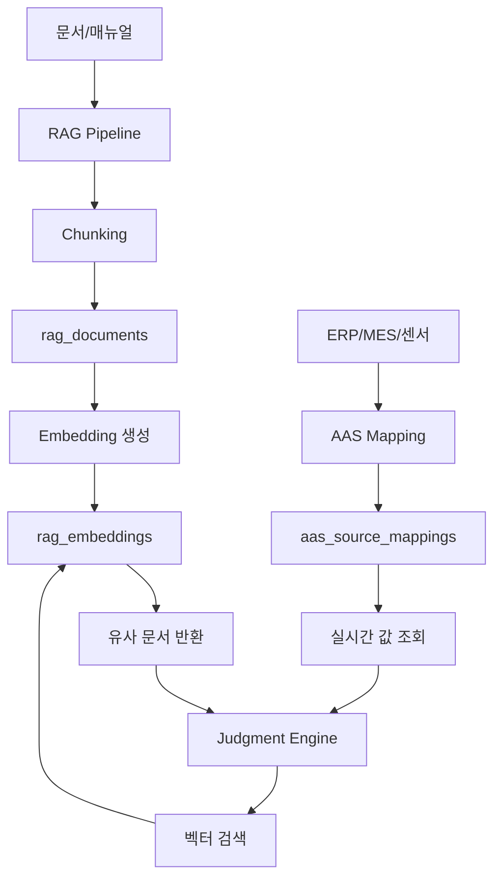
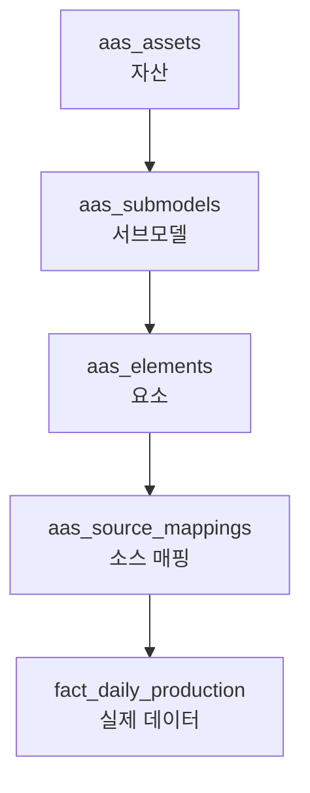
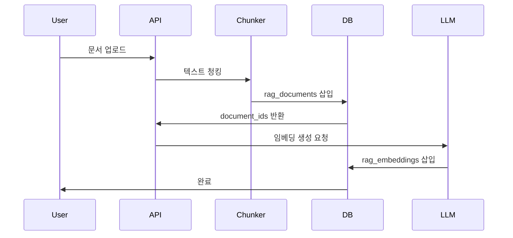
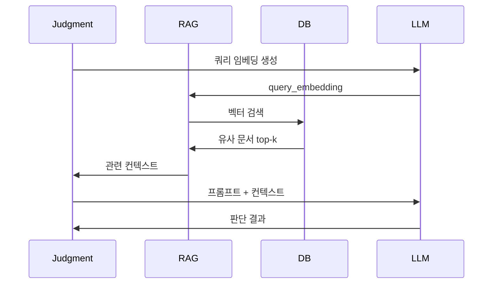

# B-3-3. RAG & AAS Schema Design

**문서 ID**: B-3-3
**버전**: 2.0
**최종 수정일**: 2025-01-26
**작성자**: AI Factory Development Team
**관련 문서**: A-2 (요구사항), B-1 (아키텍처), B-3-1 (Core Schema), B-6 (AI/프롬프트)

---

## 목차
1. [개요](#1-개요)
2. [RAG 문서 스키마](#2-rag-문서-스키마)
3. [RAG 임베딩 스키마](#3-rag-임베딩-스키마)
4. [메모리 시스템 스키마](#4-메모리-시스템-스키마)
5. [AAS 스키마](#5-aas-스키마)
6. [RAG 파이프라인](#6-rag-파이프라인)
7. [AAS 데이터 조회](#7-aas-데이터-조회)
8. [DDL 전체 스크립트](#8-ddl-전체-스크립트)
9. [추적성 매트릭스](#9-추적성-매트릭스)

---

## 1. 개요

### 1.1 목적
AI 판단 시 컨텍스트를 제공하기 위한 RAG (Retrieval-Augmented Generation) 시스템과 제조 현장의 디지털 트윈을 위한 AAS (Asset Administration Shell) 매핑 스키마 설계.

### 1.2 아키텍처



### 1.3 설계 원칙
- **벡터 검색**: pgvector를 활용한 고성능 유사도 검색
- **청크 전략**: 문맥 보존을 위한 오버랩 청킹
- **AAS 표준**: IEC 63278-1 기반 Asset Administration Shell
- **실시간 연동**: AAS 매핑을 통한 라이브 데이터 조회
- **버전 관리**: 문서 및 임베딩 버전 추적

### 1.4 성능 목표
- 벡터 검색 응답: p95 < 100ms
- 임베딩 생성: < 500ms/청크
- AAS 데이터 조회: < 200ms
- 메모리 조회: < 50ms

---

## 2. RAG 문서 스키마

### 2.1 rag_documents (RAG 문서 청크)

**목적**: 문서를 청크 단위로 저장 (벡터 검색용)

**테이블 구조**:
```sql
CREATE TABLE rag_documents (
  id uuid PRIMARY KEY DEFAULT gen_random_uuid(),
  tenant_id uuid NOT NULL REFERENCES tenants(id),
  source_type text NOT NULL CHECK (source_type IN ('manual','sop','wiki','faq','judgment_log','feedback','external_doc')),
  source_id text NOT NULL,
  parent_id uuid REFERENCES rag_documents(id),
  title text NOT NULL,
  section text,
  subsection text,
  chunk_index int NOT NULL,
  chunk_total int NOT NULL,
  text text NOT NULL,
  text_hash text NOT NULL,
  word_count int NOT NULL,
  char_count int NOT NULL,
  language text NOT NULL DEFAULT 'ko',
  metadata jsonb NOT NULL DEFAULT '{}',
  tags text[] DEFAULT '{}',
  is_active boolean NOT NULL DEFAULT true,
  version int NOT NULL DEFAULT 1,
  created_at timestamptz NOT NULL DEFAULT now(),
  updated_at timestamptz NOT NULL DEFAULT now(),
  UNIQUE (tenant_id, source_type, source_id, chunk_index, version)
);

CREATE INDEX idx_rag_docs_tenant_active ON rag_documents (tenant_id, is_active) WHERE is_active = true;
CREATE INDEX idx_rag_docs_source ON rag_documents (source_type, source_id);
CREATE INDEX idx_rag_docs_tags ON rag_documents USING GIN (tags);
CREATE INDEX idx_rag_docs_metadata ON rag_documents USING GIN (metadata);
CREATE INDEX idx_rag_docs_text_search ON rag_documents USING GIN (to_tsvector('korean', text));

COMMENT ON TABLE rag_documents IS 'RAG 문서 청크 (벡터 검색용)';
COMMENT ON COLUMN rag_documents.chunk_index IS '청크 순서 (0부터 시작)';
COMMENT ON COLUMN rag_documents.text_hash IS 'SHA256(text) - 중복 제거용';
```

**metadata JSONB 구조**:
```json
{
  "author": "홍길동",
  "created_date": "2025-01-15",
  "department": "생산기술팀",
  "document_type": "작업 지침서",
  "equipment_codes": ["E01-M01", "E01-M02"],
  "product_codes": ["P001", "P002"],
  "keywords": ["불량", "대응", "설비"],
  "importance": 0.8,
  "last_reviewed": "2025-01-20",
  "review_cycle_days": 90
}
```

### 2.2 rag_document_versions (문서 버전 이력)

**목적**: 문서 변경 이력 추적

**테이블 구조**:
```sql
CREATE TABLE rag_document_versions (
  id uuid PRIMARY KEY DEFAULT gen_random_uuid(),
  document_id uuid NOT NULL REFERENCES rag_documents(id) ON DELETE CASCADE,
  version int NOT NULL,
  change_type text NOT NULL CHECK (change_type IN ('create','update','delete','restore')),
  changed_by uuid REFERENCES users(id),
  change_summary text,
  diff jsonb,
  created_at timestamptz NOT NULL DEFAULT now(),
  UNIQUE (document_id, version)
);

CREATE INDEX idx_rag_doc_versions_document ON rag_document_versions (document_id, version DESC);

COMMENT ON TABLE rag_document_versions IS 'RAG 문서 버전 이력';
```

### 2.3 청킹 전략

**오버랩 청킹**:
- 청크 크기: 500 토큰 (약 300-400 단어)
- 오버랩: 50 토큰 (10%)
- 최대 청크 수: 문서당 100개

**청킹 로직** (Python 예시):
```python
def chunk_document(text: str, chunk_size: int = 500, overlap: int = 50) -> list[str]:
    """
    텍스트를 오버랩 청킹
    """
    tokens = tokenize(text)
    chunks = []

    for i in range(0, len(tokens), chunk_size - overlap):
        chunk_tokens = tokens[i:i + chunk_size]
        chunk_text = detokenize(chunk_tokens)
        chunks.append(chunk_text)

    return chunks
```

**시맨틱 청킹**:
- 섹션 경계 존중 (Markdown 헤더, HTML 태그)
- 문장 단위 분리 (마침표, 개행)
- 코드 블록 보존

---

## 3. RAG 임베딩 스키마

### 3.1 pgvector 확장 설치

```sql
CREATE EXTENSION IF NOT EXISTS vector;
```

### 3.2 rag_embeddings (임베딩 벡터)

**목적**: 문서 청크의 임베딩 벡터 저장

**테이블 구조**:
```sql
CREATE TABLE rag_embeddings (
  doc_id uuid PRIMARY KEY REFERENCES rag_documents(id) ON DELETE CASCADE,
  embedding vector(1536) NOT NULL,
  model text NOT NULL DEFAULT 'text-embedding-3-small',
  created_at timestamptz NOT NULL DEFAULT now()
);

-- 벡터 인덱스 (IVFFlat)
CREATE INDEX idx_rag_embeddings_vector ON rag_embeddings
USING ivfflat (embedding vector_cosine_ops)
WITH (lists = 100);

-- HNSW 인덱스 (고성능, PostgreSQL 15+)
-- CREATE INDEX idx_rag_embeddings_hnsw ON rag_embeddings
-- USING hnsw (embedding vector_cosine_ops);

COMMENT ON TABLE rag_embeddings IS '문서 임베딩 벡터 (pgvector)';
COMMENT ON COLUMN rag_embeddings.embedding IS 'OpenAI text-embedding-3-small (1536 차원)';
```

### 3.3 벡터 검색 쿼리

**유사 문서 검색** (코사인 유사도):
```sql
-- 쿼리 임베딩과 유사한 상위 5개 문서
SELECT
  d.id,
  d.title,
  d.section,
  d.text,
  d.metadata,
  1 - (e.embedding <=> :query_embedding) AS similarity
FROM rag_embeddings e
JOIN rag_documents d ON e.doc_id = d.id
WHERE d.tenant_id = :tenant_id
  AND d.is_active = true
ORDER BY e.embedding <=> :query_embedding
LIMIT 5;
```

**하이브리드 검색** (벡터 + 키워드):
```sql
WITH vector_results AS (
  SELECT
    d.id,
    d.text,
    1 - (e.embedding <=> :query_embedding) AS vector_score
  FROM rag_embeddings e
  JOIN rag_documents d ON e.doc_id = d.id
  WHERE d.tenant_id = :tenant_id AND d.is_active = true
  ORDER BY e.embedding <=> :query_embedding
  LIMIT 20
),
keyword_results AS (
  SELECT
    id,
    text,
    ts_rank(to_tsvector('korean', text), plainto_tsquery('korean', :query_text)) AS keyword_score
  FROM rag_documents
  WHERE tenant_id = :tenant_id
    AND is_active = true
    AND to_tsvector('korean', text) @@ plainto_tsquery('korean', :query_text)
  ORDER BY keyword_score DESC
  LIMIT 20
)
SELECT
  COALESCE(v.id, k.id) AS id,
  COALESCE(v.text, k.text) AS text,
  COALESCE(v.vector_score, 0) * 0.7 + COALESCE(k.keyword_score, 0) * 0.3 AS combined_score
FROM vector_results v
FULL OUTER JOIN keyword_results k ON v.id = k.id
ORDER BY combined_score DESC
LIMIT 5;
```

### 3.4 임베딩 생성 메타데이터

**embedding_jobs (임베딩 생성 작업)**:
```sql
CREATE TABLE embedding_jobs (
  id uuid PRIMARY KEY DEFAULT gen_random_uuid(),
  tenant_id uuid NOT NULL REFERENCES tenants(id),
  status text NOT NULL DEFAULT 'pending' CHECK (status IN ('pending','running','completed','failed')),
  document_count int NOT NULL,
  embeddings_generated int NOT NULL DEFAULT 0,
  model text NOT NULL,
  total_tokens int,
  cost_estimate_usd numeric(10,6),
  error_message text,
  started_at timestamptz,
  ended_at timestamptz,
  duration_seconds int,
  created_at timestamptz NOT NULL DEFAULT now()
);

CREATE INDEX idx_embedding_jobs_tenant ON embedding_jobs (tenant_id, created_at DESC);
CREATE INDEX idx_embedding_jobs_status ON embedding_jobs (status) WHERE status IN ('pending','running');

COMMENT ON TABLE embedding_jobs IS '임베딩 생성 배치 작업';
```

---

## 4. 메모리 시스템 스키마

### 4.1 memories (장단기 메모리)

**목적**: AI 에이전트의 장단기 메모리 저장

**테이블 구조**:
```sql
CREATE TABLE memories (
  id uuid PRIMARY KEY DEFAULT gen_random_uuid(),
  tenant_id uuid NOT NULL REFERENCES tenants(id),
  type text NOT NULL CHECK (type IN ('short_term','long_term','episodic','semantic','procedural')),
  key text NOT NULL,
  value jsonb NOT NULL,
  importance float NOT NULL DEFAULT 0.5 CHECK (importance >= 0 AND importance <= 1),
  access_count int NOT NULL DEFAULT 0,
  last_accessed_at timestamptz,
  expires_at timestamptz,
  context jsonb,
  created_at timestamptz NOT NULL DEFAULT now(),
  updated_at timestamptz NOT NULL DEFAULT now(),
  UNIQUE (tenant_id, type, key)
);

CREATE INDEX idx_memories_tenant_type ON memories (tenant_id, type);
CREATE INDEX idx_memories_expires ON memories (expires_at) WHERE expires_at IS NOT NULL;
CREATE INDEX idx_memories_importance ON memories (importance DESC);

COMMENT ON TABLE memories IS 'AI 에이전트 장단기 메모리';
COMMENT ON COLUMN memories.type IS 'short_term: 단기(1일), long_term: 장기(영구), episodic: 에피소드, semantic: 지식, procedural: 절차';
```

**메모리 타입별 특성**:
| Type | TTL | 목적 | 예시 |
|------|-----|------|------|
| short_term | 1일 | 세션 내 임시 정보 | 현재 라인 상태, 임시 계산 |
| long_term | 영구 | 학습된 패턴 | 불량 패턴, 최적 설정값 |
| episodic | 30일 | 과거 사건 기억 | "1월 15일 L01 라인 고장" |
| semantic | 영구 | 일반 지식 | "불량률 정상 범위: < 3%" |
| procedural | 영구 | 절차적 지식 | "설비 고장 시 대응 순서" |

**value JSONB 구조 (예시)**:
```json
{
  "memory_type": "episodic",
  "event": "L01 라인 불량률 급증",
  "timestamp": "2025-01-15T14:30:00+09:00",
  "context": {
    "line_code": "L01",
    "defect_rate": 0.12,
    "product_code": "P001",
    "root_cause": "금형 마모"
  },
  "actions_taken": ["설비 정지", "금형 교체", "재가동"],
  "outcome": "불량률 정상화 (0.03)",
  "lessons_learned": "금형 교체 주기 단축 필요"
}
```

### 4.2 메모리 관리 전략

**중요도 기반 우선순위**:
```sql
-- 중요도 자동 조정 (접근 빈도 기반)
UPDATE memories
SET importance = LEAST(1.0, importance + 0.1)
WHERE id = :memory_id;

UPDATE memories
SET access_count = access_count + 1,
    last_accessed_at = now()
WHERE id = :memory_id;
```

**만료된 메모리 정리**:
```sql
DELETE FROM memories
WHERE expires_at IS NOT NULL AND expires_at < now();
```

**중요도 낮은 메모리 아카이빙**:
```sql
-- 장기 메모리 중 중요도 < 0.3이고 6개월간 미접근
DELETE FROM memories
WHERE type = 'long_term'
  AND importance < 0.3
  AND last_accessed_at < now() - INTERVAL '6 months';
```

---

## 5. AAS 스키마

### 5.1 AAS 개요

**Asset Administration Shell (IEC 63278-1)**:
- 물리적/논리적 자산의 디지털 표현
- 계층 구조: Asset → Submodel → Element
- 실시간 데이터 소스 매핑



### 5.2 aas_assets (자산)

**목적**: 생산 라인, 설비 등 자산 정의

**테이블 구조**:
```sql
CREATE TABLE aas_assets (
  id uuid PRIMARY KEY DEFAULT gen_random_uuid(),
  tenant_id uuid NOT NULL REFERENCES tenants(id),
  asset_id text NOT NULL,
  asset_type text NOT NULL CHECK (asset_type IN ('line','equipment','product','process','system')),
  ref_code text NOT NULL,
  name text NOT NULL,
  description text,
  manufacturer text,
  model text,
  serial_number text,
  metadata jsonb NOT NULL DEFAULT '{}',
  is_active boolean NOT NULL DEFAULT true,
  created_at timestamptz NOT NULL DEFAULT now(),
  updated_at timestamptz NOT NULL DEFAULT now(),
  UNIQUE (tenant_id, asset_id)
);

CREATE INDEX idx_aas_assets_tenant ON aas_assets (tenant_id);
CREATE INDEX idx_aas_assets_ref ON aas_assets (ref_code);
CREATE INDEX idx_aas_assets_type ON aas_assets (asset_type);

COMMENT ON TABLE aas_assets IS 'AAS 자산 정의 (IEC 63278-1)';
COMMENT ON COLUMN aas_assets.ref_code IS '실제 시스템 코드 (line_code, equipment_code 등)';
```

**예시 데이터**:
```sql
INSERT INTO aas_assets (tenant_id, asset_id, asset_type, ref_code, name) VALUES
('tenant_001', 'line:L01', 'line', 'L01', '1호기 조립라인'),
('tenant_001', 'equipment:E01-M01', 'equipment', 'E01-M01', '1호기 메인 프레스');
```

### 5.3 aas_submodels (서브모델)

**목적**: 자산의 다양한 측면 표현 (생산, 품질, 유지보수 등)

**테이블 구조**:
```sql
CREATE TABLE aas_submodels (
  id uuid PRIMARY KEY DEFAULT gen_random_uuid(),
  asset_id uuid NOT NULL REFERENCES aas_assets(id) ON DELETE CASCADE,
  submodel_id text NOT NULL,
  name text NOT NULL,
  category text NOT NULL CHECK (category IN ('production','quality','maintenance','energy','cost','technical_data')),
  description text,
  semantic_id text,
  metadata jsonb NOT NULL DEFAULT '{}',
  created_at timestamptz NOT NULL DEFAULT now(),
  UNIQUE (asset_id, submodel_id)
);

CREATE INDEX idx_aas_submodels_asset ON aas_submodels (asset_id);
CREATE INDEX idx_aas_submodels_category ON aas_submodels (category);

COMMENT ON TABLE aas_submodels IS 'AAS 서브모델 (자산의 다양한 측면)';
COMMENT ON COLUMN aas_submodels.semantic_id IS 'IEC CDD 또는 ECLASS 참조';
```

**예시 데이터**:
```sql
INSERT INTO aas_submodels (asset_id, submodel_id, name, category) VALUES
((SELECT id FROM aas_assets WHERE asset_id = 'line:L01'), 'ProductionQuality', '생산/품질 지표', 'production'),
((SELECT id FROM aas_assets WHERE asset_id = 'line:L01'), 'OEE', 'OEE 지표', 'production');
```

### 5.4 aas_elements (요소)

**목적**: 서브모델 내 개별 데이터 요소

**테이블 구조**:
```sql
CREATE TABLE aas_elements (
  id uuid PRIMARY KEY DEFAULT gen_random_uuid(),
  submodel_id uuid NOT NULL REFERENCES aas_submodels(id) ON DELETE CASCADE,
  element_id text NOT NULL,
  name text NOT NULL,
  datatype text NOT NULL CHECK (datatype IN ('int','float','string','boolean','datetime','json')),
  unit text,
  description text,
  min_value numeric,
  max_value numeric,
  enum_values text[],
  metadata jsonb NOT NULL DEFAULT '{}',
  created_at timestamptz NOT NULL DEFAULT now(),
  UNIQUE (submodel_id, element_id)
);

CREATE INDEX idx_aas_elements_submodel ON aas_elements (submodel_id);

COMMENT ON TABLE aas_elements IS 'AAS 요소 (데이터 포인트)';
```

**예시 데이터**:
```sql
INSERT INTO aas_elements (submodel_id, element_id, name, datatype, unit, min_value, max_value) VALUES
((SELECT id FROM aas_submodels WHERE submodel_id = 'ProductionQuality'), 'daily_defect_rate', '일일 불량률', 'float', '%', 0, 100),
((SELECT id FROM aas_submodels WHERE submodel_id = 'OEE'), 'oee', '종합설비효율', 'float', '%', 0, 100);
```

### 5.5 aas_source_mappings (소스 매핑)

**목적**: AAS 요소를 실제 데이터 소스에 매핑

**테이블 구조**:
```sql
CREATE TABLE aas_source_mappings (
  id uuid PRIMARY KEY DEFAULT gen_random_uuid(),
  tenant_id uuid NOT NULL REFERENCES tenants(id),
  element_id uuid NOT NULL REFERENCES aas_elements(id) ON DELETE CASCADE,
  source_type text NOT NULL CHECK (source_type IN ('postgres_table','postgres_view','api_endpoint','mcp_tool','calculation')),
  source_table text,
  source_column text,
  filter_expr text,
  aggregation text CHECK (aggregation IN ('sum','avg','min','max','count','last','first')),
  transform_expr text,
  cache_ttl_seconds int DEFAULT 60,
  description text,
  created_at timestamptz NOT NULL DEFAULT now(),
  updated_at timestamptz NOT NULL DEFAULT now()
);

CREATE INDEX idx_aas_mappings_element ON aas_source_mappings (element_id);
CREATE INDEX idx_aas_mappings_tenant ON aas_source_mappings (tenant_id);

COMMENT ON TABLE aas_source_mappings IS 'AAS 요소의 데이터 소스 매핑';
COMMENT ON COLUMN aas_source_mappings.filter_expr IS 'WHERE 절 (예: line_code = :line AND date = :date)';
COMMENT ON COLUMN aas_source_mappings.transform_expr IS 'SQL 표현식 (예: value * 100)';
```

**매핑 예시**:
```sql
-- daily_defect_rate 매핑
INSERT INTO aas_source_mappings (
  tenant_id, element_id, source_type, source_table, source_column,
  filter_expr, aggregation, transform_expr
) VALUES (
  'tenant_001',
  (SELECT id FROM aas_elements WHERE element_id = 'daily_defect_rate'),
  'postgres_table',
  'fact_daily_defect',
  'defect_qty / NULLIF(total_qty, 0) * 100',
  'line_code = :line AND date = :date',
  'avg',
  NULL
);

-- oee 매핑
INSERT INTO aas_source_mappings (
  tenant_id, element_id, source_type, source_table, source_column,
  filter_expr, aggregation
) VALUES (
  'tenant_001',
  (SELECT id FROM aas_elements WHERE element_id = 'oee'),
  'postgres_view',
  'mv_oee_daily',
  'oee * 100',
  'line_code = :line AND date = :date',
  'avg'
);
```

---

## 6. RAG 파이프라인

### 6.1 문서 수집 → 청킹 → 임베딩



### 6.2 검색 파이프라인



### 6.3 RAG 검색 함수

```sql
CREATE OR REPLACE FUNCTION search_rag_documents(
  p_tenant_id uuid,
  p_query_embedding vector(1536),
  p_limit int DEFAULT 5,
  p_filters jsonb DEFAULT '{}'
) RETURNS TABLE (
  doc_id uuid,
  title text,
  section text,
  text text,
  similarity float,
  metadata jsonb
) AS $$
BEGIN
  RETURN QUERY
  SELECT
    d.id,
    d.title,
    d.section,
    d.text,
    1 - (e.embedding <=> p_query_embedding) AS similarity,
    d.metadata
  FROM rag_embeddings e
  JOIN rag_documents d ON e.doc_id = d.id
  WHERE d.tenant_id = p_tenant_id
    AND d.is_active = true
    AND (p_filters = '{}' OR d.metadata @> p_filters)
  ORDER BY e.embedding <=> p_query_embedding
  LIMIT p_limit;
END;
$$ LANGUAGE plpgsql;
```

**사용 예시**:
```sql
-- 불량 관련 문서 검색 (equipment_codes 필터)
SELECT * FROM search_rag_documents(
  'tenant_001',
  :query_embedding,
  5,
  '{"equipment_codes": ["E01-M01"]}'::jsonb
);
```

### 6.4 하이브리드 검색 함수

```sql
CREATE OR REPLACE FUNCTION hybrid_search_rag(
  p_tenant_id uuid,
  p_query_text text,
  p_query_embedding vector(1536),
  p_limit int DEFAULT 5,
  p_vector_weight float DEFAULT 0.7
) RETURNS TABLE (
  doc_id uuid,
  title text,
  text text,
  combined_score float
) AS $$
BEGIN
  RETURN QUERY
  WITH vector_results AS (
    SELECT
      d.id,
      d.title,
      d.text,
      1 - (e.embedding <=> p_query_embedding) AS vector_score
    FROM rag_embeddings e
    JOIN rag_documents d ON e.doc_id = d.id
    WHERE d.tenant_id = p_tenant_id AND d.is_active = true
    ORDER BY e.embedding <=> p_query_embedding
    LIMIT 20
  ),
  keyword_results AS (
    SELECT
      id,
      title,
      text,
      ts_rank(to_tsvector('korean', text), plainto_tsquery('korean', p_query_text)) AS keyword_score
    FROM rag_documents
    WHERE tenant_id = p_tenant_id
      AND is_active = true
      AND to_tsvector('korean', text) @@ plainto_tsquery('korean', p_query_text)
    ORDER BY keyword_score DESC
    LIMIT 20
  )
  SELECT
    COALESCE(v.id, k.id),
    COALESCE(v.title, k.title),
    COALESCE(v.text, k.text),
    COALESCE(v.vector_score, 0) * p_vector_weight +
    COALESCE(k.keyword_score, 0) * (1 - p_vector_weight) AS combined_score
  FROM vector_results v
  FULL OUTER JOIN keyword_results k ON v.id = k.id
  ORDER BY combined_score DESC
  LIMIT p_limit;
END;
$$ LANGUAGE plpgsql;
```

---

## 7. AAS 데이터 조회

### 7.1 AAS 값 조회 함수

```sql
CREATE OR REPLACE FUNCTION get_aas_element_value(
  p_tenant_id uuid,
  p_asset_ref_code text,
  p_element_id text,
  p_params jsonb DEFAULT '{}'
) RETURNS jsonb AS $$
DECLARE
  v_mapping record;
  v_query text;
  v_result jsonb;
BEGIN
  -- 매핑 정보 조회
  SELECT
    asm.source_type,
    asm.source_table,
    asm.source_column,
    asm.filter_expr,
    asm.aggregation,
    asm.transform_expr
  INTO v_mapping
  FROM aas_source_mappings asm
  JOIN aas_elements ae ON asm.element_id = ae.id
  JOIN aas_submodels asub ON ae.submodel_id = asub.id
  JOIN aas_assets aa ON asub.asset_id = aa.id
  WHERE asm.tenant_id = p_tenant_id
    AND aa.ref_code = p_asset_ref_code
    AND ae.element_id = p_element_id;

  IF NOT FOUND THEN
    RETURN jsonb_build_object('error', 'mapping not found');
  END IF;

  -- 동적 쿼리 생성
  IF v_mapping.source_type = 'postgres_table' OR v_mapping.source_type = 'postgres_view' THEN
    v_query := format(
      'SELECT %s(%s) FROM %s WHERE %s',
      COALESCE(v_mapping.aggregation, 'AVG'),
      v_mapping.source_column,
      v_mapping.source_table,
      replace(v_mapping.filter_expr, ':line', quote_literal(p_asset_ref_code))
    );

    -- 파라미터 치환 (예: :date)
    IF p_params ? 'date' THEN
      v_query := replace(v_query, ':date', quote_literal(p_params->>'date'));
    END IF;

    EXECUTE v_query INTO v_result;
    RETURN jsonb_build_object('value', v_result);

  ELSIF v_mapping.source_type = 'calculation' THEN
    -- 계산식 실행 (추후 구현)
    RETURN jsonb_build_object('error', 'calculation not implemented');

  ELSE
    RETURN jsonb_build_object('error', 'unsupported source type');
  END IF;
END;
$$ LANGUAGE plpgsql;
```

**사용 예시**:
```sql
-- L01 라인의 일일 불량률 조회 (2025-01-26)
SELECT get_aas_element_value(
  'tenant_001',
  'L01',
  'daily_defect_rate',
  '{"date": "2025-01-26"}'::jsonb
);
```

### 7.2 AAS 서브모델 전체 조회

```sql
CREATE OR REPLACE FUNCTION get_aas_submodel_values(
  p_tenant_id uuid,
  p_asset_ref_code text,
  p_submodel_id text,
  p_params jsonb DEFAULT '{}'
) RETURNS jsonb AS $$
DECLARE
  v_element record;
  v_result jsonb := '{}';
  v_value jsonb;
BEGIN
  FOR v_element IN
    SELECT ae.element_id, ae.name
    FROM aas_elements ae
    JOIN aas_submodels asub ON ae.submodel_id = asub.id
    JOIN aas_assets aa ON asub.asset_id = aa.id
    WHERE aa.tenant_id = p_tenant_id
      AND aa.ref_code = p_asset_ref_code
      AND asub.submodel_id = p_submodel_id
  LOOP
    v_value := get_aas_element_value(
      p_tenant_id,
      p_asset_ref_code,
      v_element.element_id,
      p_params
    );

    v_result := v_result || jsonb_build_object(
      v_element.element_id,
      jsonb_build_object(
        'name', v_element.name,
        'value', v_value->'value'
      )
    );
  END LOOP;

  RETURN v_result;
END;
$$ LANGUAGE plpgsql;
```

**사용 예시**:
```sql
-- L01 라인의 생산/품질 서브모델 전체 조회
SELECT get_aas_submodel_values(
  'tenant_001',
  'L01',
  'ProductionQuality',
  '{"date": "2025-01-26"}'::jsonb
);

-- 결과:
{
  "daily_defect_rate": {
    "name": "일일 불량률",
    "value": 0.073
  },
  "total_production_qty": {
    "name": "총 생산량",
    "value": 1500
  }
}
```

### 7.3 AAS 뷰 (조회 편의성)

```sql
CREATE VIEW v_aas_structure AS
SELECT
  aa.tenant_id,
  aa.asset_id,
  aa.asset_type,
  aa.ref_code,
  aa.name AS asset_name,
  asub.submodel_id,
  asub.name AS submodel_name,
  asub.category AS submodel_category,
  ae.element_id,
  ae.name AS element_name,
  ae.datatype,
  ae.unit,
  asm.source_table,
  asm.source_column,
  asm.aggregation
FROM aas_assets aa
JOIN aas_submodels asub ON aa.id = asub.asset_id
JOIN aas_elements ae ON asub.id = ae.submodel_id
LEFT JOIN aas_source_mappings asm ON ae.id = asm.element_id;

COMMENT ON VIEW v_aas_structure IS 'AAS 전체 구조 (Asset → Submodel → Element → Mapping)';
```

---

## 8. DDL 전체 스크립트

### 8.1 실행 순서

1. pgvector 확장
2. RAG 테이블 (rag_documents, rag_embeddings, embedding_jobs)
3. 메모리 테이블 (memories)
4. AAS 테이블 (aas_assets, aas_submodels, aas_elements, aas_source_mappings)
5. 함수 및 뷰

### 8.2 시드 데이터

**RAG 문서 예시**:
```sql
-- 작업 지침서
INSERT INTO rag_documents (tenant_id, source_type, source_id, title, section, chunk_index, chunk_total, text, text_hash, word_count, char_count, metadata, tags) VALUES
('tenant_001', 'manual', 'SOP-001', '불량 대응 작업 지침서', '1. 불량 발생 시 조치', 0, 3,
 '불량이 발생하면 즉시 라인을 정지하고 불량품을 분리합니다. 불량 유형을 기록하고 품질 담당자에게 보고합니다.',
 'hash1', 25, 80,
 '{"equipment_codes": ["E01-M01"], "keywords": ["불량", "조치"]}'::jsonb,
 ARRAY['불량', '대응', 'SOP']);
```

**AAS 데이터 예시**:
```sql
-- L01 라인 AAS 구조
-- (이미 위에 예시 포함)
```

### 8.3 인덱스 최적화

**벡터 인덱스 튜닝**:
```sql
-- IVFFlat 리스트 수 조정 (행 수의 √)
-- 100만 행: lists = 1000
-- 10만 행: lists = 316
-- 1만 행: lists = 100

-- 인덱스 재구성
REINDEX INDEX idx_rag_embeddings_vector;
```

---

## 9. 추적성 매트릭스

### 9.1 요구사항 → 테이블 매핑

| 요구사항 ID (A-2) | 테이블 | 비고 |
|-------------------|--------|------|
| RAG-FR-001 (문서 검색) | rag_documents, rag_embeddings | 벡터 검색 |
| RAG-FR-002 (하이브리드 검색) | hybrid_search_rag() 함수 | 벡터 + 키워드 |
| RAG-FR-003 (컨텍스트 주입) | search_rag_documents() | Judgment 프롬프트에 삽입 |
| MEM-FR-001 (메모리) | memories | 장단기 메모리 |
| AAS-FR-001 (디지털 트윈) | aas_assets, aas_submodels, aas_elements | IEC 63278-1 |
| AAS-FR-002 (실시간 조회) | aas_source_mappings, get_aas_element_value() | FACT 테이블 매핑 |

### 9.2 API → 테이블 매핑

| API (B-4) | 테이블 | 비고 |
|-----------|--------|------|
| POST /api/v1/rag/documents | rag_documents | 문서 업로드 |
| POST /api/v1/rag/search | rag_embeddings | 벡터 검색 |
| GET /api/v1/aas/assets/{id} | aas_assets, aas_submodels, aas_elements | AAS 구조 조회 |
| GET /api/v1/aas/assets/{id}/values | get_aas_submodel_values() | 실시간 값 조회 |
| POST /api/v1/memories | memories | 메모리 저장 |
| GET /api/v1/memories/{key} | memories | 메모리 조회 |

### 9.3 Judgment Engine 연계

```sql
-- Judgment 실행 시 RAG 컨텍스트 조회
WITH rag_context AS (
  SELECT string_agg(text, E'\n\n---\n\n') AS context_text
  FROM search_rag_documents(
    :tenant_id,
    :query_embedding,
    3,
    '{"equipment_codes": [:equipment_code]}'::jsonb
  )
),
aas_data AS (
  SELECT get_aas_submodel_values(
    :tenant_id,
    :line_code,
    'ProductionQuality',
    jsonb_build_object('date', :date)
  ) AS aas_values
)
SELECT
  rag.context_text,
  aas.aas_values
FROM rag_context rag, aas_data aas;
```

---

## 부록 A. pgvector 성능 튜닝

### A.1 인덱스 선택

| 인덱스 타입 | 빌드 속도 | 검색 속도 | 정확도 | 권장 용도 |
|------------|----------|----------|--------|-----------|
| IVFFlat | 빠름 | 중간 | 중간 | 중소규모 (<1M) |
| HNSW | 느림 | 빠름 | 높음 | 대규모 (>1M) |

### A.2 쿼리 최적화

```sql
-- 좋은 예: 인덱스 활용
SELECT * FROM rag_embeddings
ORDER BY embedding <=> :query_embedding
LIMIT 5;

-- 나쁜 예: 스캔 유발
SELECT *, 1 - (embedding <=> :query_embedding) AS similarity
FROM rag_embeddings
WHERE similarity > 0.7;  -- WHERE 절에 계산 사용 금지
```

---

## 부록 B. 다음 문서 연계

- **B-3-4**: Performance & Operations (파티셔닝, 마이그레이션, 백업)

---

**문서 버전**: 2.0
**최종 검토**: 2025-01-26
**승인자**: AI Factory Architecture Team
