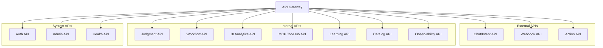
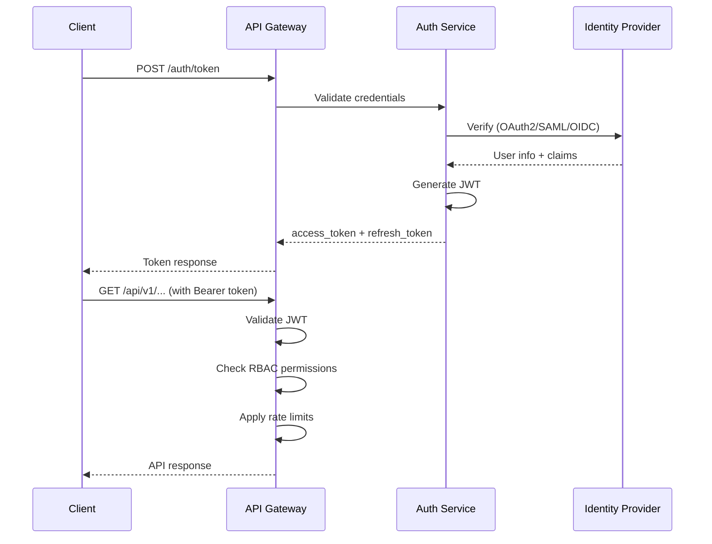

# B-4. API & Interface Specification

## 1. 개요

### 1.1 목적
본 문서는 AI Factory Decision Engine의 모든 API 인터페이스를 정의한다. RESTful API, gRPC, WebSocket, Webhook 등 다양한 프로토콜을 통한 시스템 간 통신 규약을 명세한다.

### 1.2 범위
- REST API 엔드포인트 및 스키마
- gRPC 서비스 정의
- WebSocket 실시간 통신
- Webhook 이벤트 알림
- 인증/인가 흐름
- 에러 처리 및 응답 규격
- Rate Limiting 정책

### 1.3 API 카테고리



---

## 2. API 공통 규격

### 2.1 Base URL 구조

```
Production:  https://api.factory.ai/v1
Staging:     https://api-staging.factory.ai/v1
Development: https://api-dev.factory.ai/v1
```

### 2.2 공통 헤더

| 헤더 | 필수 | 설명 |
|------|------|------|
| `Authorization` | Y | Bearer {access_token} |
| `X-Tenant-ID` | Y | 테넌트 식별자 |
| `X-Request-ID` | N | 클라이언트 요청 ID (UUID) |
| `X-Trace-ID` | N | 분산 추적 ID |
| `Accept-Language` | N | 응답 언어 (ko, en, ja) |
| `Content-Type` | Y | application/json |

### 2.3 공통 응답 포맷

**성공 응답:**
```json
{
  "success": true,
  "data": { ... },
  "meta": {
    "request_id": "req_abc123",
    "trace_id": "trace_xyz789",
    "timestamp": "2024-01-15T09:00:00Z",
    "duration_ms": 125
  }
}
```

**에러 응답:**
```json
{
  "success": false,
  "error": {
    "code": "ERR_VALIDATION",
    "message": "입력값이 유효하지 않습니다",
    "detail": {
      "field": "input_data.defect_rate",
      "reason": "must be between 0 and 1"
    },
    "doc_url": "https://docs.factory.ai/errors/ERR_VALIDATION"
  },
  "meta": {
    "request_id": "req_abc123",
    "trace_id": "trace_xyz789",
    "timestamp": "2024-01-15T09:00:00Z"
  }
}
```

### 2.4 페이지네이션

```json
{
  "data": [...],
  "pagination": {
    "page": 1,
    "page_size": 20,
    "total_items": 156,
    "total_pages": 8,
    "has_next": true,
    "has_prev": false
  }
}
```

**쿼리 파라미터:**
- `page`: 페이지 번호 (default: 1)
- `page_size`: 페이지 크기 (default: 20, max: 100)
- `sort`: 정렬 필드 (예: `-created_at,name`)
- `filter`: 필터 조건 (예: `status:active,type:warning`)

---

## 3. 인증/인가 API

### 3.1 인증 흐름



### 3.2 토큰 발급

**POST /api/v1/auth/token**

Request (Client Credentials):
```json
{
  "grant_type": "client_credentials",
  "client_id": "app_abc123",
  "client_secret": "secret_xyz789",
  "scope": "judgment:execute workflow:read"
}
```

Request (Password Grant):
```json
{
  "grant_type": "password",
  "username": "user@company.com",
  "password": "********",
  "tenant_id": "tenant_001",
  "scope": "full_access"
}
```

Response:
```json
{
  "access_token": "eyJhbGciOiJSUzI1NiIsInR5cCI6IkpXVCJ9...",
  "token_type": "Bearer",
  "expires_in": 3600,
  "refresh_token": "rt_abc123xyz789",
  "scope": "judgment:execute workflow:read",
  "tenant_id": "tenant_001"
}
```

### 3.3 토큰 갱신

**POST /api/v1/auth/refresh**

Request:
```json
{
  "grant_type": "refresh_token",
  "refresh_token": "rt_abc123xyz789"
}
```

### 3.4 JWT 구조

```json
{
  "header": {
    "alg": "RS256",
    "typ": "JWT",
    "kid": "key-2024-01"
  },
  "payload": {
    "iss": "https://auth.factory.ai",
    "sub": "user_123",
    "aud": "factory-api",
    "exp": 1705312800,
    "iat": 1705309200,
    "tenant_id": "tenant_001",
    "roles": ["operator", "approver"],
    "permissions": [
      "judgment:execute",
      "judgment:read",
      "workflow:read",
      "workflow:execute"
    ],
    "scope": "judgment:execute workflow:read"
  }
}
```

### 3.5 RBAC 권한 매트릭스

| 역할 | Judgment | Workflow | BI | Learning | Admin |
|-----|----------|----------|-----|----------|-------|
| viewer | read | read | read | read | - |
| operator | read, execute | read, execute | read, execute | read | - |
| approver | read, execute | read, execute, approve | read | read, approve | - |
| admin | full | full | full | full | full |
| system | full | full | full | full | limited |

**권한 코드:**
- `read`: 조회
- `execute`: 실행
- `create`: 생성
- `update`: 수정
- `delete`: 삭제
- `approve`: 승인
- `admin`: 관리

---

## 4. Judgment API

### 4.1 판정 실행

**POST /api/v2/judgment/execute**

Request:
```json
{
  "workflow_id": "defect_rule_pack",
  "input_data": {
    "line_id": "L01",
    "shift": "night",
    "date": "2024-01-15",
    "metrics": {
      "defect_rate": 0.032,
      "defect_count": 48,
      "total_production": 1500,
      "major_defect_types": ["scratch", "dent"]
    }
  },
  "options": {
    "policy_id": "HYBRID_WEIGHTED",
    "need_explanation": true,
    "need_evidence": true,
    "need_feature_importance": true,
    "context_refs": [
      "aas:line:L01",
      "rag:doc:quality_sop_v2"
    ],
    "timeout_ms": 30000,
    "cache_enabled": true,
    "cache_ttl_sec": 300
  }
}
```

Response:
```json
{
  "success": true,
  "data": {
    "execution_id": "exec_abc123",
    "result": "warning",
    "confidence": 0.87,
    "method_used": "hybrid",
    "processing_time_ms": 1250,
    "explanation": {
      "summary": "최근 3일 평균 대비 불량률 60% 상승 감지",
      "detailed": "L01 라인의 불량률이 0.032로 기준치(0.02) 대비 높음. scratch 유형 불량이 전체의 65%를 차지하며 야간 근무 시간대에 집중 발생.",
      "language": "ko"
    },
    "recommended_actions": [
      {
        "action_id": "act_001",
        "type": "inspection",
        "priority": "high",
        "description": "긴급 샘플 검사 실시",
        "params": {"sample_size": 50, "focus_type": "scratch"}
      },
      {
        "action_id": "act_002",
        "type": "investigation",
        "priority": "medium",
        "description": "원료 LOT 이력 점검",
        "params": {"lot_range": "last_24h"}
      }
    ],
    "evidence": [
      {
        "type": "data_point",
        "source": "fact_daily_defect",
        "query": "SELECT * FROM fact_daily_defect WHERE line_id='L01' AND date >= '2024-01-12'",
        "summary": "3일간 불량률 추이: 0.018 → 0.025 → 0.032"
      },
      {
        "type": "rule_match",
        "rule_id": "rule_defect_threshold_001",
        "condition": "defect_rate > 0.025",
        "matched": true
      }
    ],
    "feature_importance": [
      {"name": "defect_rate", "weight": 0.42, "direction": "positive"},
      {"name": "scratch_ratio", "weight": 0.28, "direction": "positive"},
      {"name": "shift_type", "weight": 0.15, "direction": "positive"}
    ],
    "raw_trace": {
      "rule_engine": {
        "rules_evaluated": 12,
        "rules_matched": 3,
        "execution_time_ms": 45
      },
      "llm_engine": {
        "model": "gpt-4o",
        "tokens_used": 850,
        "execution_time_ms": 1180
      },
      "rag_retrieval": {
        "documents_retrieved": 5,
        "similarity_scores": [0.92, 0.88, 0.85, 0.82, 0.78]
      }
    },
    "policy_used": {
      "id": "HYBRID_WEIGHTED",
      "rule_weight": 0.6,
      "llm_weight": 0.4,
      "conflict_resolution": "rule_priority"
    },
    "cache_hit": false,
    "cached_at": null
  },
  "meta": {
    "request_id": "req_abc123",
    "trace_id": "trace_xyz789",
    "timestamp": "2024-01-15T09:00:00Z",
    "duration_ms": 1250
  }
}
```

### 4.2 판정 조회

**GET /api/v2/judgment/{execution_id}**

Response:
```json
{
  "success": true,
  "data": {
    "execution_id": "exec_abc123",
    "workflow_id": "defect_rule_pack",
    "status": "completed",
    "result": "warning",
    "confidence": 0.87,
    "created_at": "2024-01-15T09:00:00Z",
    "completed_at": "2024-01-15T09:00:01Z",
    "input_data": { ... },
    "output_data": { ... },
    "audit": {
      "user_id": "user_123",
      "tenant_id": "tenant_001",
      "ip_address": "192.168.1.100",
      "user_agent": "FactoryClient/1.0"
    }
  }
}
```

### 4.3 판정 리플레이 (Zwave)

**POST /api/v2/judgment/replay**

Request:
```json
{
  "mode": "single | batch",
  "single": {
    "execution_id": "exec_abc123"
  },
  "batch": {
    "time_range": {
      "start": "2024-01-08T00:00:00Z",
      "end": "2024-01-15T00:00:00Z"
    },
    "filters": {
      "workflow_id": "defect_rule_pack",
      "line_id": "L01"
    },
    "sample_size": 1000,
    "sampling": "random"
  },
  "modifications": {
    "policy_id": "HYBRID_WEIGHTED_V2",
    "rule_pack_version": "v2.1.0",
    "model_version": "gpt-4o-2024-01"
  },
  "comparison": {
    "baseline": "original",
    "metrics": ["accuracy", "precision", "recall", "decision_distribution"]
  }
}
```

Response:
```json
{
  "success": true,
  "data": {
    "replay_id": "replay_xyz789",
    "status": "completed",
    "summary": {
      "total_samples": 1000,
      "baseline_accuracy": 0.85,
      "modified_accuracy": 0.89,
      "improvement": 0.04,
      "statistical_significance": true,
      "p_value": 0.002
    },
    "decision_distribution": {
      "baseline": {"normal": 750, "warning": 200, "critical": 50},
      "modified": {"normal": 720, "warning": 230, "critical": 50}
    },
    "detailed_comparison": [
      {
        "execution_id": "exec_001",
        "baseline_result": "normal",
        "modified_result": "warning",
        "baseline_confidence": 0.72,
        "modified_confidence": 0.85
      }
    ],
    "recommendation": "신규 정책 적용 권장 (정확도 4% 향상)"
  }
}
```

### 4.4 판정 취소

**PATCH /api/v2/judgment/{execution_id}/cancel**

Request:
```json
{
  "reason": "timeout_exceeded"
}
```

Response:
```json
{
  "success": true,
  "data": {
    "execution_id": "exec_abc123",
    "status": "cancelled",
    "cancelled_at": "2024-01-15T09:00:30Z"
  }
}
```

---

## 5. Workflow API

### 5.1 워크플로우 생성

**POST /api/v1/workflows**

Request:
```json
{
  "name": "불량 경보 워크플로우",
  "description": "일일 불량률 체크 및 경보 발송",
  "tags": ["quality", "alert", "daily"],
  "dsl": {
    "id": "wf_defect_alert_v1",
    "version": 1,
    "nodes": [...],
    "edges": [...],
    "context": {...},
    "policies": {...}
  },
  "validation_options": {
    "strict_mode": true,
    "dry_run": true
  }
}
```

Response:
```json
{
  "success": true,
  "data": {
    "workflow_id": "wf_defect_alert_v1",
    "version": 1,
    "status": "draft",
    "validation": {
      "passed": true,
      "warnings": [],
      "info": ["DSL syntax validated", "Dry-run completed"]
    },
    "created_at": "2024-01-15T09:00:00Z"
  }
}
```

### 5.2 워크플로우 조회

**GET /api/v1/workflows/{workflow_id}**

Query Parameters:
- `version`: 특정 버전 조회 (default: latest)
- `include_dsl`: DSL 포함 여부 (default: true)
- `include_stats`: 통계 포함 여부 (default: false)

Response:
```json
{
  "success": true,
  "data": {
    "workflow_id": "wf_defect_alert_v1",
    "name": "불량 경보 워크플로우",
    "description": "일일 불량률 체크 및 경보 발송",
    "version": 3,
    "status": "active",
    "tags": ["quality", "alert", "daily"],
    "dsl": {...},
    "stats": {
      "total_executions": 1250,
      "success_rate": 0.98,
      "avg_duration_ms": 2500,
      "last_execution": "2024-01-15T08:00:00Z"
    },
    "versions": [
      {"version": 3, "status": "active", "created_at": "2024-01-10"},
      {"version": 2, "status": "deprecated", "created_at": "2024-01-05"},
      {"version": 1, "status": "deprecated", "created_at": "2024-01-01"}
    ],
    "created_at": "2024-01-01T00:00:00Z",
    "updated_at": "2024-01-10T00:00:00Z"
  }
}
```

### 5.3 워크플로우 실행

**POST /api/v1/workflows/{workflow_id}/run**

Request:
```json
{
  "input": {
    "line_id": "L01",
    "date": "2024-01-15"
  },
  "options": {
    "version": "latest",
    "priority": "high",
    "timeout_ms": 60000,
    "idempotency_key": "run_L01_20240115_001"
  },
  "context_overrides": {
    "variables": {
      "notification_channel": "#quality-urgent"
    }
  }
}
```

Response:
```json
{
  "success": true,
  "data": {
    "instance_id": "inst_abc123",
    "workflow_id": "wf_defect_alert_v1",
    "version": 3,
    "status": "running",
    "started_at": "2024-01-15T09:00:00Z",
    "estimated_completion": "2024-01-15T09:00:30Z"
  }
}
```

### 5.4 워크플로우 인스턴스 조회

**GET /api/v1/workflow-instances/{instance_id}**

Response:
```json
{
  "success": true,
  "data": {
    "instance_id": "inst_abc123",
    "workflow_id": "wf_defect_alert_v1",
    "version": 3,
    "status": "completed",
    "trigger": {
      "type": "api",
      "user_id": "user_123"
    },
    "input": {...},
    "output": {...},
    "started_at": "2024-01-15T09:00:00Z",
    "completed_at": "2024-01-15T09:00:25Z",
    "duration_ms": 25000,
    "nodes_executed": [
      {
        "node_id": "data_defect",
        "type": "DATA",
        "status": "succeeded",
        "started_at": "2024-01-15T09:00:00Z",
        "completed_at": "2024-01-15T09:00:02Z",
        "duration_ms": 2000
      },
      {
        "node_id": "judge_quality",
        "type": "JUDGMENT",
        "status": "succeeded",
        "started_at": "2024-01-15T09:00:02Z",
        "completed_at": "2024-01-15T09:00:05Z",
        "duration_ms": 3000,
        "output_summary": {"result": "warning", "confidence": 0.87}
      }
    ],
    "checkpoints": 3,
    "errors": []
  }
}
```

### 5.5 워크플로우 인스턴스 제어

**PATCH /api/v1/workflow-instances/{instance_id}**

Request:
```json
{
  "action": "stop | restart | retry",
  "options": {
    "reason": "manual_intervention",
    "restart_from_node": "judge_quality"
  }
}
```

### 5.6 워크플로우 인스턴스 로그

**GET /api/v1/workflow-instances/{instance_id}/logs**

Query Parameters:
- `level`: log level filter (debug, info, warn, error)
- `node_id`: 특정 노드 로그만 조회
- `from`: 시작 시간
- `to`: 종료 시간

Response:
```json
{
  "success": true,
  "data": {
    "logs": [
      {
        "timestamp": "2024-01-15T09:00:00.123Z",
        "level": "info",
        "node_id": "data_defect",
        "message": "Starting data retrieval",
        "context": {"source": "fact_daily_defect", "params": {"line_id": "L01"}}
      },
      {
        "timestamp": "2024-01-15T09:00:02.456Z",
        "level": "info",
        "node_id": "data_defect",
        "message": "Data retrieval completed",
        "context": {"rows_returned": 150}
      }
    ],
    "pagination": {...}
  }
}
```

---

## 6. BI Analytics API

### 6.1 분석 계획 생성

**POST /api/v1/bi/plan**

Request:
```json
{
  "query": "지난 30일간 L01 라인의 불량률 추이와 주요 불량 유형별 분포를 보여줘",
  "context": {
    "user_preferences": {
      "preferred_chart_types": ["line", "pie"],
      "date_format": "YYYY-MM-DD"
    },
    "scope": {
      "lines": ["L01"],
      "time_range": "last_30_days"
    }
  },
  "options": {
    "max_widgets": 4,
    "include_recommendations": true
  }
}
```

Response:
```json
{
  "success": true,
  "data": {
    "plan_id": "plan_abc123",
    "status": "ready",
    "interpretation": {
      "intent": "trend_analysis",
      "entities": {
        "metric": "defect_rate",
        "dimension": "defect_type",
        "time_grain": "day",
        "time_range": {"start": "2023-12-16", "end": "2024-01-15"},
        "filters": [{"field": "line_id", "op": "eq", "value": "L01"}]
      }
    },
    "analysis_plan": {
      "widgets": [
        {
          "widget_id": "w1",
          "type": "line_chart",
          "title": "L01 라인 일별 불량률 추이",
          "dataset": "fact_daily_defect",
          "metrics": ["defect_rate"],
          "dimensions": ["date"],
          "filters": [{"field": "line_id", "op": "eq", "value": "L01"}],
          "time_range": {"start": "2023-12-16", "end": "2024-01-15"},
          "visualization": {
            "x_axis": "date",
            "y_axis": "defect_rate",
            "color": "#FF6B6B"
          }
        },
        {
          "widget_id": "w2",
          "type": "pie_chart",
          "title": "불량 유형별 분포",
          "dataset": "fact_daily_defect",
          "metrics": ["defect_count"],
          "dimensions": ["defect_type"],
          "aggregation": "sum"
        }
      ],
      "recommendations": [
        {
          "type": "insight",
          "message": "최근 7일 불량률이 평균 대비 25% 상승했습니다",
          "action": "상세 분석 필요"
        }
      ]
    },
    "estimated_execution_time_ms": 2000
  }
}
```

### 6.2 분석 실행

**POST /api/v1/bi/execute**

Request:
```json
{
  "plan_id": "plan_abc123",
  "options": {
    "cache_enabled": true,
    "format": "chart_data",
    "include_raw_data": false
  }
}
```

Response:
```json
{
  "success": true,
  "data": {
    "execution_id": "bi_exec_xyz789",
    "widgets": [
      {
        "widget_id": "w1",
        "type": "line_chart",
        "title": "L01 라인 일별 불량률 추이",
        "data": {
          "labels": ["2023-12-16", "2023-12-17", "..."],
          "datasets": [
            {
              "label": "defect_rate",
              "data": [0.018, 0.019, 0.022, "..."],
              "borderColor": "#FF6B6B"
            }
          ]
        },
        "insights": [
          {"type": "trend", "direction": "up", "magnitude": 0.25}
        ]
      },
      {
        "widget_id": "w2",
        "type": "pie_chart",
        "title": "불량 유형별 분포",
        "data": {
          "labels": ["scratch", "dent", "crack", "other"],
          "datasets": [
            {
              "data": [450, 280, 120, 150],
              "backgroundColor": ["#FF6384", "#36A2EB", "#FFCE56", "#4BC0C0"]
            }
          ]
        }
      }
    ],
    "cache_hit": true,
    "execution_time_ms": 150
  }
}
```

### 6.3 카탈로그 API

**GET /api/v1/bi/catalog/datasets**

Response:
```json
{
  "success": true,
  "data": {
    "datasets": [
      {
        "id": "fact_daily_defect",
        "name": "일별 불량 현황",
        "description": "라인별 일별 불량 집계 데이터",
        "schema": {
          "columns": [
            {"name": "date", "type": "date", "description": "집계 일자"},
            {"name": "line_id", "type": "varchar", "description": "라인 ID"},
            {"name": "defect_count", "type": "integer", "description": "불량 수량"},
            {"name": "defect_rate", "type": "decimal", "description": "불량률"}
          ]
        },
        "metrics": ["defect_count", "defect_rate", "yield_rate"],
        "dimensions": ["date", "line_id", "shift", "defect_type"],
        "refresh_schedule": "0 1 * * *",
        "last_refreshed": "2024-01-15T01:00:00Z"
      }
    ]
  }
}
```

**POST /api/v1/bi/catalog/metrics**

Request:
```json
{
  "name": "weekly_defect_trend",
  "display_name": "주간 불량 추이",
  "dataset_id": "fact_daily_defect",
  "expression_sql": "AVG(defect_rate) OVER (ORDER BY date ROWS BETWEEN 6 PRECEDING AND CURRENT ROW)",
  "agg_type": "moving_average",
  "unit": "percent",
  "format": "0.00%",
  "default_chart": "line_chart",
  "thresholds": {
    "warning": 0.025,
    "critical": 0.05
  }
}
```

---

## 7. MCP ToolHub API

### 7.1 도구 호출

**POST /api/v1/mcp/call**

Request:
```json
{
  "server": "erp",
  "tool": "get_inventory",
  "arguments": {
    "item_code": "RAW001",
    "warehouse": "WH01"
  },
  "options": {
    "timeout_ms": 10000,
    "retry": {
      "max_attempts": 3,
      "backoff_ms": 1000
    }
  }
}
```

Response:
```json
{
  "success": true,
  "data": {
    "call_id": "mcp_call_abc123",
    "server": "erp",
    "tool": "get_inventory",
    "result": {
      "item_code": "RAW001",
      "warehouse": "WH01",
      "quantity": 1500,
      "unit": "kg",
      "last_updated": "2024-01-15T08:00:00Z"
    },
    "execution_time_ms": 250
  }
}
```

### 7.2 서버 목록

**GET /api/v1/mcp/servers**

Response:
```json
{
  "success": true,
  "data": {
    "servers": [
      {
        "id": "erp",
        "name": "ERP System",
        "description": "기간계 ERP 연동",
        "status": "healthy",
        "version": "1.2.0",
        "tools": ["get_inventory", "get_order", "create_order"],
        "resources": ["inventory", "orders"],
        "capabilities": ["tools", "resources"],
        "last_health_check": "2024-01-15T09:00:00Z",
        "avg_response_time_ms": 200
      },
      {
        "id": "mes",
        "name": "MES System",
        "description": "제조실행시스템 연동",
        "status": "healthy",
        "version": "2.0.0",
        "tools": ["get_production", "get_quality", "set_parameter"],
        "resources": ["production", "quality"],
        "capabilities": ["tools", "resources", "subscriptions"]
      }
    ]
  }
}
```

### 7.3 도구 목록

**GET /api/v1/mcp/tools**

Query Parameters:
- `server`: 서버 필터
- `category`: 카테고리 필터

Response:
```json
{
  "success": true,
  "data": {
    "tools": [
      {
        "server": "erp",
        "name": "get_inventory",
        "description": "재고 조회",
        "input_schema": {
          "type": "object",
          "required": ["item_code"],
          "properties": {
            "item_code": {"type": "string", "description": "품목 코드"},
            "warehouse": {"type": "string", "description": "창고 코드"}
          }
        },
        "output_schema": {
          "type": "object",
          "properties": {
            "quantity": {"type": "number"},
            "unit": {"type": "string"}
          }
        },
        "category": "inventory",
        "rate_limit": {"requests": 100, "window_sec": 60}
      }
    ]
  }
}
```

### 7.4 서버 상태

**GET /api/v1/mcp/health**

Query Parameters:
- `server`: 특정 서버 상태 조회 (optional)

Response:
```json
{
  "success": true,
  "data": {
    "overall_status": "healthy",
    "servers": [
      {
        "id": "erp",
        "status": "healthy",
        "latency_ms": 45,
        "last_check": "2024-01-15T09:00:00Z",
        "error_rate_1h": 0.001,
        "schema_changed": false
      },
      {
        "id": "mes",
        "status": "degraded",
        "latency_ms": 2500,
        "last_check": "2024-01-15T09:00:00Z",
        "error_rate_1h": 0.05,
        "schema_changed": true,
        "schema_diff": {
          "added_fields": ["new_metric"],
          "removed_fields": [],
          "modified_fields": [{"field": "quality_score", "from": "int", "to": "decimal"}]
        }
      }
    ]
  }
}
```

---

## 8. Chat/Intent API

### 8.1 메시지 전송

**POST /api/v1/chat/send**

Request:
```json
{
  "session_id": "sess_abc123",
  "message": "L01 라인 오늘 불량률이 어떻게 되나요?",
  "context": {
    "user_role": "operator",
    "current_view": "dashboard",
    "selected_line": "L01"
  },
  "options": {
    "include_suggestions": true,
    "max_suggestions": 3
  }
}
```

Response:
```json
{
  "success": true,
  "data": {
    "message_id": "msg_xyz789",
    "session_id": "sess_abc123",
    "intent": {
      "name": "query_defect_rate",
      "confidence": 0.94,
      "category": "bi_query"
    },
    "slots": {
      "metric": "defect_rate",
      "line_id": "L01",
      "time_range": "today"
    },
    "response": {
      "type": "text_with_data",
      "text": "L01 라인의 오늘 불량률은 2.8%입니다. 어제 대비 0.5% 상승했습니다.",
      "data": {
        "defect_rate": 0.028,
        "comparison": {
          "yesterday": 0.023,
          "change": 0.005,
          "change_percent": 21.7
        }
      },
      "visualization": {
        "type": "stat_card",
        "value": "2.8%",
        "trend": "up",
        "trend_value": "+21.7%"
      }
    },
    "suggestions": [
      {"text": "주간 추이 보기", "intent": "query_weekly_trend"},
      {"text": "불량 유형별 분포 보기", "intent": "query_defect_distribution"},
      {"text": "원인 분석 요청", "intent": "request_analysis"}
    ],
    "actions": [
      {"type": "show_chart", "params": {"chart_id": "defect_trend_today"}}
    ]
  }
}
```

### 8.2 피드백

**POST /api/v1/chat/feedback**

Request:
```json
{
  "message_id": "msg_xyz789",
  "feedback": {
    "rating": 1,
    "category": "accuracy",
    "comment": "정확한 답변이었습니다"
  }
}
```

### 8.3 세션 이력

**GET /api/v1/chat/sessions**

Query Parameters:
- `user_id`: 사용자 필터
- `from`: 시작 일시
- `to`: 종료 일시

Response:
```json
{
  "success": true,
  "data": {
    "sessions": [
      {
        "session_id": "sess_abc123",
        "user_id": "user_123",
        "started_at": "2024-01-15T08:30:00Z",
        "last_activity": "2024-01-15T09:00:00Z",
        "message_count": 12,
        "intents_used": ["query_defect_rate", "request_analysis"],
        "satisfaction_score": 4.5
      }
    ],
    "pagination": {...}
  }
}
```

---

## 9. Learning API

### 9.1 학습 후보 조회

**GET /api/v1/learning/candidates**

Query Parameters:
- `type`: rule | prompt | model
- `status`: pending | approved | rejected | deployed
- `priority`: high | medium | low

Response:
```json
{
  "success": true,
  "data": {
    "candidates": [
      {
        "candidate_id": "cand_abc123",
        "type": "rule",
        "source": "auto_extraction",
        "status": "pending",
        "priority": "high",
        "content": {
          "rule_id": "auto_rule_001",
          "condition": "defect_rate > 0.03 AND shift = 'night'",
          "action": "warning",
          "confidence": 0.88
        },
        "evidence": {
          "source_judgments": 150,
          "accuracy": 0.92,
          "coverage": 0.15
        },
        "impact_analysis": {
          "affected_workflows": ["wf_defect_alert_v1"],
          "estimated_improvement": 0.05
        },
        "created_at": "2024-01-15T00:00:00Z",
        "expires_at": "2024-01-22T00:00:00Z"
      }
    ],
    "pagination": {...}
  }
}
```

### 9.2 후보 승인/거절

**POST /api/v1/learning/candidates/{candidate_id}/approve**

Request:
```json
{
  "action": "approve",
  "deployment_config": {
    "target_env": "staging",
    "rollout_strategy": "canary",
    "canary_percent": 10
  },
  "comment": "테스트 환경에서 검증 후 배포"
}
```

Response:
```json
{
  "success": true,
  "data": {
    "candidate_id": "cand_abc123",
    "status": "approved",
    "deployment": {
      "deployment_id": "deploy_xyz789",
      "status": "scheduled",
      "scheduled_at": "2024-01-16T00:00:00Z"
    },
    "approved_by": "user_admin",
    "approved_at": "2024-01-15T10:00:00Z"
  }
}
```

### 9.3 배포 상태 조회

**GET /api/v1/learning/deployments/{deployment_id}**

Response:
```json
{
  "success": true,
  "data": {
    "deployment_id": "deploy_xyz789",
    "candidate_id": "cand_abc123",
    "status": "in_progress",
    "progress": {
      "current_stage": "canary",
      "canary_percent": 30,
      "started_at": "2024-01-16T00:00:00Z",
      "stages_completed": ["validation", "staging"],
      "stages_remaining": ["production"]
    },
    "metrics": {
      "requests_processed": 1500,
      "success_rate": 0.98,
      "avg_latency_ms": 120,
      "error_rate": 0.02
    },
    "rollback_available": true
  }
}
```

---

## 10. Webhook API

### 10.1 Webhook 등록

**POST /api/v1/webhooks**

Request:
```json
{
  "name": "Quality Alert Webhook",
  "url": "https://internal.company.com/hooks/quality",
  "events": [
    "judgment.critical",
    "workflow.failed",
    "learning.candidate_ready"
  ],
  "secret": "webhook_secret_xyz",
  "options": {
    "retry_policy": {
      "max_attempts": 3,
      "backoff_ms": 1000
    },
    "filter": {
      "line_ids": ["L01", "L02"],
      "severity": ["critical", "warning"]
    }
  }
}
```

Response:
```json
{
  "success": true,
  "data": {
    "webhook_id": "wh_abc123",
    "name": "Quality Alert Webhook",
    "url": "https://internal.company.com/hooks/quality",
    "events": ["judgment.critical", "workflow.failed", "learning.candidate_ready"],
    "status": "active",
    "created_at": "2024-01-15T09:00:00Z"
  }
}
```

### 10.2 Webhook 페이로드 형식

```json
{
  "event": "judgment.critical",
  "timestamp": "2024-01-15T09:00:00Z",
  "webhook_id": "wh_abc123",
  "delivery_id": "del_xyz789",
  "data": {
    "execution_id": "exec_abc123",
    "workflow_id": "defect_rule_pack",
    "result": "critical",
    "confidence": 0.95,
    "line_id": "L01",
    "summary": "긴급: L01 라인 불량률 임계치 초과"
  },
  "signature": "sha256=abc123..."
}
```

### 10.3 Webhook 검증

수신 측 검증 코드 (예시):
```python
import hmac
import hashlib

def verify_webhook(payload: bytes, signature: str, secret: str) -> bool:
    expected = 'sha256=' + hmac.new(
        secret.encode(),
        payload,
        hashlib.sha256
    ).hexdigest()
    return hmac.compare_digest(expected, signature)
```

---

## 11. Observability API

### 11.1 로그 조회

**GET /api/v1/logs**

Query Parameters:
- `service`: 서비스 필터
- `level`: info | warn | error
- `trace_id`: 추적 ID
- `from`: 시작 시간
- `to`: 종료 시간
- `query`: 검색어

Response:
```json
{
  "success": true,
  "data": {
    "logs": [
      {
        "timestamp": "2024-01-15T09:00:00.123Z",
        "level": "error",
        "service": "judgment-service",
        "trace_id": "trace_abc123",
        "span_id": "span_xyz789",
        "message": "LLM response parsing failed",
        "context": {
          "model": "gpt-4o",
          "error_type": "json_parse_error",
          "raw_response_length": 1500
        }
      }
    ],
    "pagination": {...}
  }
}
```

### 11.2 분산 추적

**GET /api/v1/traces/{trace_id}**

Response:
```json
{
  "success": true,
  "data": {
    "trace_id": "trace_abc123",
    "service": "api-gateway",
    "operation": "POST /api/v2/judgment/execute",
    "duration_ms": 1250,
    "status": "ok",
    "spans": [
      {
        "span_id": "span_001",
        "parent_id": null,
        "service": "api-gateway",
        "operation": "http_request",
        "start_time": "2024-01-15T09:00:00.000Z",
        "duration_ms": 1250,
        "tags": {"http.method": "POST", "http.status_code": 200}
      },
      {
        "span_id": "span_002",
        "parent_id": "span_001",
        "service": "judgment-service",
        "operation": "execute_judgment",
        "start_time": "2024-01-15T09:00:00.010Z",
        "duration_ms": 1200,
        "tags": {"workflow_id": "defect_rule_pack"}
      },
      {
        "span_id": "span_003",
        "parent_id": "span_002",
        "service": "rule-engine",
        "operation": "evaluate_rules",
        "start_time": "2024-01-15T09:00:00.020Z",
        "duration_ms": 50,
        "tags": {"rules_evaluated": 12}
      },
      {
        "span_id": "span_004",
        "parent_id": "span_002",
        "service": "llm-service",
        "operation": "llm_inference",
        "start_time": "2024-01-15T09:00:00.080Z",
        "duration_ms": 1100,
        "tags": {"model": "gpt-4o", "tokens": 850}
      }
    ]
  }
}
```

### 11.3 메트릭 조회

**GET /api/v1/metrics**

Query Parameters:
- `name`: 메트릭 이름
- `labels`: 레이블 필터
- `from`: 시작 시간
- `to`: 종료 시간
- `step`: 집계 간격

Response:
```json
{
  "success": true,
  "data": {
    "metric": "judgment_execution_duration_seconds",
    "labels": {"workflow_id": "defect_rule_pack"},
    "values": [
      {"timestamp": "2024-01-15T08:00:00Z", "value": 1.2},
      {"timestamp": "2024-01-15T08:05:00Z", "value": 1.1},
      {"timestamp": "2024-01-15T08:10:00Z", "value": 1.3}
    ],
    "statistics": {
      "min": 0.8,
      "max": 2.5,
      "avg": 1.2,
      "p50": 1.1,
      "p95": 1.8,
      "p99": 2.2
    }
  }
}
```

---

## 12. 에러 코드 전체 목록

### 12.1 일반 에러 (ERR_*)

| 코드 | HTTP | 설명 | 대응 방법 |
|------|------|------|----------|
| ERR_VALIDATION | 400 | 입력 검증 실패 | 요청 데이터 확인 |
| ERR_INVALID_JSON | 400 | JSON 파싱 실패 | JSON 형식 확인 |
| ERR_MISSING_FIELD | 400 | 필수 필드 누락 | 필수 필드 추가 |
| ERR_INVALID_FORMAT | 400 | 잘못된 데이터 형식 | 형식 확인 |
| ERR_UNAUTHORIZED | 401 | 인증 실패 | 토큰 확인/갱신 |
| ERR_TOKEN_EXPIRED | 401 | 토큰 만료 | 토큰 갱신 |
| ERR_FORBIDDEN | 403 | 권한 없음 | 권한 확인 |
| ERR_NOT_FOUND | 404 | 리소스 없음 | ID 확인 |
| ERR_CONFLICT | 409 | 리소스 충돌 | 최신 버전 확인 |
| ERR_RATE_LIMIT | 429 | Rate limit 초과 | 재시도 지연 |
| ERR_INTERNAL | 500 | 내부 서버 오류 | 로그 확인 |
| ERR_SERVICE_UNAVAILABLE | 503 | 서비스 불가 | 잠시 후 재시도 |

### 12.2 Judgment 에러 (ERR_JUD_*)

| 코드 | HTTP | 설명 | 대응 방법 |
|------|------|------|----------|
| ERR_JUD_WORKFLOW_NOT_FOUND | 404 | 워크플로우 없음 | workflow_id 확인 |
| ERR_JUD_POLICY_NOT_FOUND | 404 | 정책 없음 | policy_id 확인 |
| ERR_JUD_EXECUTION_TIMEOUT | 504 | 실행 타임아웃 | timeout 증가 또는 재시도 |
| ERR_JUD_RULE_ENGINE_ERROR | 500 | Rule Engine 오류 | 규칙 설정 확인 |
| ERR_JUD_LLM_ERROR | 502 | LLM 호출 실패 | 재시도 또는 대체 모델 |
| ERR_JUD_LLM_PARSE_ERROR | 502 | LLM 응답 파싱 실패 | 재시도 |
| ERR_JUD_RAG_ERROR | 500 | RAG 검색 실패 | RAG 설정 확인 |
| ERR_JUD_CONTEXT_ERROR | 400 | 컨텍스트 참조 오류 | context_refs 확인 |

### 12.3 Workflow 에러 (ERR_WF_*)

| 코드 | HTTP | 설명 | 대응 방법 |
|------|------|------|----------|
| ERR_WF_DSL_INVALID | 400 | DSL 문법 오류 | DSL 수정 |
| ERR_WF_DSL_CYCLE | 400 | 순환 참조 감지 | 그래프 구조 확인 |
| ERR_WF_NODE_NOT_FOUND | 404 | 노드 없음 | node_id 확인 |
| ERR_WF_INSTANCE_NOT_FOUND | 404 | 인스턴스 없음 | instance_id 확인 |
| ERR_WF_ALREADY_RUNNING | 409 | 이미 실행 중 | idempotency_key 사용 |
| ERR_WF_APPROVAL_TIMEOUT | 408 | 승인 타임아웃 | 승인자 확인 |
| ERR_WF_EXECUTION_FAILED | 500 | 실행 실패 | 로그 확인 |

### 12.4 MCP 에러 (ERR_MCP_*)

| 코드 | HTTP | 설명 | 대응 방법 |
|------|------|------|----------|
| ERR_MCP_SERVER_NOT_FOUND | 404 | 서버 없음 | server 확인 |
| ERR_MCP_TOOL_NOT_FOUND | 404 | 도구 없음 | tool 확인 |
| ERR_MCP_CONNECTION_FAILED | 503 | 연결 실패 | 서버 상태 확인 |
| ERR_MCP_TIMEOUT | 504 | 호출 타임아웃 | timeout 증가 |
| ERR_MCP_SCHEMA_CHANGED | 409 | 스키마 변경됨 | 스키마 동기화 |
| ERR_MCP_CIRCUIT_OPEN | 503 | 회로 차단 활성화 | 잠시 후 재시도 |

### 12.5 BI 에러 (ERR_BI_*)

| 코드 | HTTP | 설명 | 대응 방법 |
|------|------|------|----------|
| ERR_BI_DATASET_NOT_FOUND | 404 | 데이터셋 없음 | dataset_id 확인 |
| ERR_BI_METRIC_NOT_FOUND | 404 | 메트릭 없음 | metric 확인 |
| ERR_BI_QUERY_TIMEOUT | 504 | 쿼리 타임아웃 | 쿼리 최적화 |
| ERR_BI_PLAN_FAILED | 500 | 분석 계획 실패 | 쿼리 수정 |

---

## 13. Rate Limiting 정책

### 13.1 기본 Rate Limit

| API 카테고리 | 요청/분 | 요청/시간 | Burst |
|------------|--------|----------|-------|
| Chat | 60 | 1000 | 10 |
| Judgment | 30 | 500 | 5 |
| Workflow | 30 | 500 | 5 |
| BI | 60 | 2000 | 10 |
| MCP | 100 | 5000 | 20 |
| Learning | 20 | 200 | 3 |
| Admin | 10 | 100 | 2 |

### 13.2 LLM 호출 보호

```json
{
  "llm_rate_limits": {
    "per_tenant": {
      "requests_per_minute": 20,
      "tokens_per_minute": 100000,
      "concurrent_requests": 5
    },
    "per_user": {
      "requests_per_minute": 10,
      "tokens_per_minute": 50000
    },
    "global": {
      "requests_per_minute": 1000,
      "tokens_per_minute": 5000000
    }
  }
}
```

### 13.3 Rate Limit 응답 헤더

```
X-RateLimit-Limit: 60
X-RateLimit-Remaining: 45
X-RateLimit-Reset: 1705312800
X-RateLimit-RetryAfter: 30
```

---

## 14. OpenAPI Specification (요약)

```yaml
openapi: 3.1.0
info:
  title: AI Factory Decision Engine API
  version: 2.0.0
  description: Manufacturing AI Platform API
  contact:
    name: API Support
    email: api-support@factory.ai

servers:
  - url: https://api.factory.ai/v1
    description: Production
  - url: https://api-staging.factory.ai/v1
    description: Staging

security:
  - bearerAuth: []
  - tenantHeader: []

components:
  securitySchemes:
    bearerAuth:
      type: http
      scheme: bearer
      bearerFormat: JWT
    tenantHeader:
      type: apiKey
      in: header
      name: X-Tenant-ID

  schemas:
    Error:
      type: object
      required: [success, error]
      properties:
        success:
          type: boolean
          const: false
        error:
          type: object
          required: [code, message]
          properties:
            code:
              type: string
            message:
              type: string
            detail:
              type: object
            doc_url:
              type: string
              format: uri

    JudgmentExecuteRequest:
      type: object
      required: [workflow_id, input_data]
      properties:
        workflow_id:
          type: string
        input_data:
          type: object
        options:
          $ref: '#/components/schemas/JudgmentOptions'

    JudgmentExecuteResponse:
      type: object
      properties:
        execution_id:
          type: string
        result:
          type: string
          enum: [normal, warning, critical, unknown]
        confidence:
          type: number
          minimum: 0
          maximum: 1
        method_used:
          type: string
          enum: [rule_only, llm_only, hybrid, escalate]
        explanation:
          $ref: '#/components/schemas/Explanation'
        recommended_actions:
          type: array
          items:
            $ref: '#/components/schemas/RecommendedAction'

paths:
  /judgment/execute:
    post:
      summary: Execute judgment
      operationId: executeJudgment
      tags: [Judgment]
      requestBody:
        required: true
        content:
          application/json:
            schema:
              $ref: '#/components/schemas/JudgmentExecuteRequest'
      responses:
        '200':
          description: Successful judgment
          content:
            application/json:
              schema:
                $ref: '#/components/schemas/JudgmentExecuteResponse'
        '400':
          $ref: '#/components/responses/BadRequest'
        '401':
          $ref: '#/components/responses/Unauthorized'
        '500':
          $ref: '#/components/responses/InternalError'
```

---

## 15. gRPC 서비스 정의 (요약)

```protobuf
syntax = "proto3";
package factory.judgment.v2;

service JudgmentService {
  rpc Execute(ExecuteRequest) returns (ExecuteResponse);
  rpc GetExecution(GetExecutionRequest) returns (ExecuteResponse);
  rpc Replay(ReplayRequest) returns (ReplayResponse);
  rpc Cancel(CancelRequest) returns (CancelResponse);
  rpc StreamExecutions(StreamExecutionsRequest) returns (stream ExecuteResponse);
}

message ExecuteRequest {
  string workflow_id = 1;
  bytes input_data = 2;  // JSON
  ExecuteOptions options = 3;
}

message ExecuteResponse {
  string execution_id = 1;
  string result = 2;
  double confidence = 3;
  string method_used = 4;
  Explanation explanation = 5;
  repeated RecommendedAction recommended_actions = 6;
  bytes raw_trace = 7;  // JSON
}

message ExecuteOptions {
  string policy_id = 1;
  bool need_explanation = 2;
  bool need_evidence = 3;
  repeated string context_refs = 4;
  int32 timeout_ms = 5;
}
```

---

## 16. 추적성 매트릭스

### 16.1 API ↔ 요구사항

| API | 요구사항 ID | 설명 |
|-----|-----------|------|
| Judgment API | JUD-FR-001~005 | 판정 실행, 캐시, 리플레이 |
| Workflow API | WF-FR-001~006 | 워크플로우 관리, 실행 |
| BI API | BI-FR-001~004 | 분석 계획, 실행, 카탈로그 |
| MCP API | INT-FR-001~003 | 외부 시스템 연동 |
| Chat API | CHAT-FR-001~003 | 대화형 인터페이스 |
| Learning API | LRN-FR-001~003 | 자동 학습, 배포 |

### 16.2 API ↔ 테스트 케이스

| API | 테스트 케이스 ID | 우선순위 |
|-----|-----------------|---------|
| POST /judgment/execute | TC-API-JUD-001 | Critical |
| POST /judgment/replay | TC-API-JUD-002 | High |
| POST /workflows | TC-API-WF-001 | Critical |
| POST /workflows/{id}/run | TC-API-WF-002 | Critical |
| POST /bi/plan | TC-API-BI-001 | High |
| POST /mcp/call | TC-API-MCP-001 | High |
| POST /chat/send | TC-API-CHAT-001 | High |
| POST /auth/token | TC-API-AUTH-001 | Critical |

---

## 17. 부록

### 17.1 변경 이력

| 버전 | 날짜 | 변경 내용 | 작성자 |
|-----|------|----------|-------|
| 1.0 | 2024-01-10 | 초안 작성 | - |
| 2.0 | 2024-01-15 | 상세 스키마, 에러 코드, Rate Limiting 추가 | AI Assistant |

### 17.2 용어집

| 용어 | 정의 |
|-----|------|
| JWT | JSON Web Token, 인증 토큰 |
| RBAC | Role-Based Access Control, 역할 기반 접근 제어 |
| Rate Limiting | 요청 빈도 제한 |
| Webhook | 이벤트 기반 HTTP 콜백 |
| gRPC | Google Remote Procedure Call |
