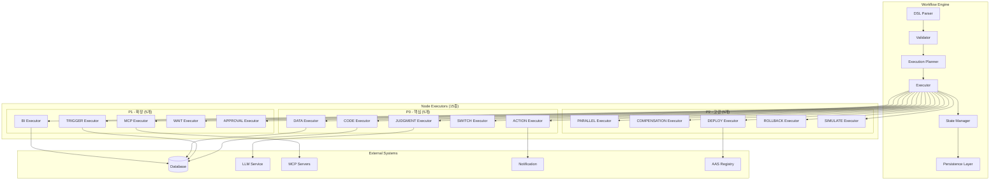

# B-5. Workflow / State Machine Spec

## 문서 정보
- **문서 ID**: B-5
- **버전**: 2.0 (V7 Intent + 15 Nodes)
- **최종 수정일**: 2025-12-16
- **상태**: Active Development
- **관련 문서**: A-1, B-2, B-3-1, B-6, E-3

## 1. 개요

### 1.1 목적
본 문서는 AI Factory Decision Engine의 Workflow DSL 및 State Machine 명세를 정의한다. 비즈니스 로직을 선언적으로 표현하고, 장기 실행 프로세스와 이벤트 기반 오케스트레이션을 지원한다. **V7 Intent 체계와 연동하여 Intent Router → Orchestrator → Workflow Engine 파이프라인을 구현한다.**

### 1.2 범위
- Workflow DSL 문법 및 노드 타입 정의
- State Machine 상태 전이 규칙
- 조건식 표현 문법 (Rhai Expression Grammar)
- 변수 스코프 및 참조 규칙
- 에러 복구 및 보상 트랜잭션
- 장기 실행 처리 및 체크포인트

### 1.3 추적성 매트릭스

| 요구사항 ID | Workflow 관련 항목 | 관련 문서 |
|------------|-------------------|----------|
| WF-FR-001 | DSL 기반 워크플로우 정의 | A-2, B-4 |
| WF-FR-002 | **15개 노드 타입 지원 (P0/P1/P2)** | B-2, B-3-1 |
| WF-FR-003 | 조건 분기 및 병렬 처리 | B-1 |
| WF-FR-004 | 에러 복구 및 보상 | C-3 |
| WF-FR-005 | 장기 실행 지원 | D-1 |
| WF-FR-006 | 버전 관리 및 배포 | D-3 |
| WF-FR-007 | **V7 Intent → Orchestrator 연동** | B-6, E-3 |
| WF-FR-008 | **CODE 노드 (Python 실행)** | B-3-1 |
| WF-FR-009 | **TRIGGER 노드 (이벤트 트리거)** | B-3-1 |

---

## 2. 워크플로우 아키텍처

### 2.1 전체 구조



### 2.2 Workflow Instance 생명주기


### 2.3 Node 실행 상태 전이


---

## 3. Workflow DSL 정의

### 3.1 기본 구조

```json
{
  "$schema": "https://factory.ai/schemas/workflow-dsl-v2.json",
  "id": "string (UUID or slug)",
  "name": "string (display name)",
  "description": "string (optional)",
  "version": "integer (auto-increment)",
  "tenant_id": "string",
  "tags": ["string"],
  "trigger": {
    "type": "manual | schedule | event | webhook",
    "config": {}
  },
  "input_schema": {},
  "output_schema": {},
  "nodes": [],
  "edges": [],
  "context": {
    "variables": {},
    "secrets": {},
    "rag_context": [],
    "aas_context": []
  },
  "policies": {
    "retry": {},
    "timeout_ms": "integer",
    "circuit_breaker": {},
    "compensation": {}
  },
  "metadata": {
    "created_at": "timestamp",
    "created_by": "user_id",
    "updated_at": "timestamp",
    "approved_by": "user_id",
    "approval_status": "draft | pending | approved | deprecated"
  }
}
```

### 3.2 Trigger 설정

```json
{
  "trigger": {
    "type": "schedule",
    "config": {
      "cron": "0 8 * * *",
      "timezone": "Asia/Seoul"
    }
  }
}
```

```json
{
  "trigger": {
    "type": "event",
    "config": {
      "source": "mes.defect.detected",
      "filter": {
        "severity": {"$gte": "high"},
        "line_id": {"$in": ["L01", "L02"]}
      }
    }
  }
}
```

```json
{
  "trigger": {
    "type": "webhook",
    "config": {
      "path": "/api/v1/workflows/{workflow_id}/trigger",
      "method": "POST",
      "auth": "bearer_token",
      "rate_limit": {"requests": 100, "window_sec": 60}
    }
  }
}
```

---

## 4. 노드 타입 상세 명세 (15종)

### 4.0 노드 타입 개요

| 우선순위 | 노드 타입 | 설명 | 주요 용도 |
|---------|----------|------|----------|
| **P0** | DATA | 외부 데이터 소스 조회 | 모든 데이터 파이프라인 시작점 |
| **P0** | JUDGMENT | LLM 기반 분석/판단 | 원인 분석, 예측, 비교 |
| **P0** | CODE | Python 코드 실행 | 데이터 변환, 계산 |
| **P0** | SWITCH | 조건 분기 | 규칙 기반 라우팅 |
| **P0** | ACTION | 외부 액션 실행 | 알림, Webhook |
| **P1** | BI | BI 시각화 생성 | 차트, 리포트 |
| **P1** | MCP | MCP 서버 도구 호출 | 외부 서비스 연동 |
| **P1** | TRIGGER | 워크플로우 트리거 | 스케줄, 이벤트 기반 시작 |
| **P1** | WAIT | 대기 | 시간, 이벤트 대기 |
| **P1** | APPROVAL | 사용자 승인 대기 | 결재, 승인 워크플로우 |
| **P2** | PARALLEL | 병렬 실행 | 동시 처리 |
| **P2** | COMPENSATION | 보상 트랜잭션 | 롤백 액션 |
| **P2** | DEPLOY | 배포 | 룰, 모델 배포 |
| **P2** | ROLLBACK | 롤백 | 버전 복구 |
| **P2** | SIMULATE | 시뮬레이션 | What-if 분석 |

---

### 4.1 DATA 노드

데이터 소스에서 데이터를 조회하여 컨텍스트에 로드한다.

```json
{
  "id": "data_defect",
  "type": "DATA",
  "name": "불량 데이터 조회",
  "source": {
    "type": "sql | api | file | stream",
    "connection": "postgres_main",
    "query": "SELECT * FROM fact_daily_defect WHERE line_id = :line_id AND date >= :start_date",
    "params": {
      "line_id": "${input.line_id}",
      "start_date": "${fn.date_add(fn.now(), -7, 'day')}"
    }
  },
  "output": {
    "variable": "defect_data",
    "schema": {
      "type": "array",
      "items": {
        "type": "object",
        "properties": {
          "date": {"type": "string", "format": "date"},
          "defect_count": {"type": "integer"},
          "defect_rate": {"type": "number"}
        }
      }
    }
  },
  "cache": {
    "enabled": true,
    "ttl_sec": 300,
    "key": "defect_${input.line_id}_${fn.date_format(fn.now(), 'YYYYMMDD')}"
  },
  "retry": {"max": 3, "backoff_ms": 1000},
  "timeout_ms": 30000
}
```

**속성 정의:**

| 속성 | 타입 | 필수 | 설명 |
|-----|------|------|------|
| id | string | Y | 노드 고유 ID |
| type | "DATA" | Y | 노드 타입 |
| name | string | N | 표시명 |
| source.type | enum | Y | sql, api, file, stream |
| source.connection | string | Y | 연결 ID (secrets 참조) |
| source.query | string | Y | SQL 또는 API 경로 |
| source.params | object | N | 쿼리 파라미터 |
| output.variable | string | Y | 결과 저장 변수명 |
| output.schema | JSON Schema | N | 결과 스키마 검증 |
| cache | object | N | 캐시 설정 |
| retry | object | N | 재시도 정책 |
| timeout_ms | integer | N | 타임아웃 (기본 30000) |

---

### 4.2 BI 노드

BI 분석 쿼리를 실행하고 결과를 시각화 가능한 형태로 반환한다.

```json
{
  "id": "bi_trend",
  "type": "BI",
  "name": "불량 추이 분석",
  "analysis": {
    "type": "trend | comparison | distribution | correlation | anomaly",
    "metrics": ["defect_rate", "yield_rate"],
    "dimensions": ["line_id", "shift"],
    "time_grain": "day",
    "time_range": {
      "start": "${fn.date_add(fn.now(), -30, 'day')}",
      "end": "${fn.now()}"
    },
    "filters": [
      {"field": "line_id", "op": "in", "value": "${input.target_lines}"}
    ],
    "aggregation": {
      "defect_rate": "avg",
      "yield_rate": "avg"
    }
  },
  "output": {
    "variable": "trend_result",
    "format": "chart_data | table | summary"
  },
  "visualization": {
    "chart_type": "line | bar | pie | heatmap | scatter",
    "title": "30일 불량률 추이",
    "x_axis": "date",
    "y_axis": ["defect_rate"],
    "series_by": "line_id"
  }
}
```

**분석 타입별 설정:**

| 분석 타입 | 설명 | 필수 설정 |
|----------|------|----------|
| trend | 시계열 추이 분석 | time_grain, time_range |
| comparison | 기간/그룹 비교 | compare_periods 또는 compare_groups |
| distribution | 분포 분석 | bucket_config |
| correlation | 상관관계 분석 | correlation_pairs |
| anomaly | 이상치 탐지 | anomaly_config (algorithm, threshold) |

---

### 4.3 JUDGMENT 노드

Rule Engine 또는 LLM을 사용하여 판정을 수행한다.

```json
{
  "id": "judge_quality",
  "type": "JUDGMENT",
  "name": "품질 판정",
  "policy": {
    "type": "RULE_ONLY | LLM_ONLY | HYBRID | ESCALATE",
    "rule_pack_id": "quality_rules_v2",
    "llm_config": {
      "model": "gpt-4o",
      "temperature": 0.1,
      "max_tokens": 1000
    },
    "routing": {
      "confidence_threshold": 0.85,
      "conflict_resolution": "rule_priority | llm_priority | human_escalate",
      "fallback": "ESCALATE"
    }
  },
  "input": {
    "data": "${defect_data}",
    "context": {
      "line_info": "${aas.line.L01}",
      "recent_judgments": "${rag.similar_judgments(defect_data, 5)}"
    }
  },
  "output": {
    "variable": "judgment_result",
    "schema": {
      "type": "object",
      "properties": {
        "decision": {"enum": ["normal", "warning", "critical", "unknown"]},
        "confidence": {"type": "number", "minimum": 0, "maximum": 1},
        "reasoning": {"type": "string"},
        "matched_rules": {"type": "array"},
        "recommendations": {"type": "array"}
      }
    }
  },
  "audit": {
    "log_input": true,
    "log_reasoning": true,
    "human_review_if": "confidence < 0.7 || decision == 'critical'"
  }
}
```

**Policy 타입 상세:**


---

### 4.4 CODE 노드 (신규 - P0)

Python 코드를 샌드박스 환경에서 실행하여 데이터 변환, 계산, 검증을 수행한다.

```json
{
  "id": "code_transform",
  "type": "CODE",
  "name": "불량률 계산 및 통계 분석",
  "config": {
    "code_type": "transform | calculate | validate | format | custom",
    "code_template_id": "defect_rate_calc_v1",
    "inline_code": null,
    "sandbox_enabled": true,
    "allowed_imports": ["pandas", "numpy", "datetime", "json", "statistics"]
  },
  "input": {
    "data": "${defect_data}",
    "parameters": {
      "threshold": 0.05,
      "window_days": 7
    }
  },
  "output": {
    "variable": "calculated_metrics",
    "schema": {
      "type": "object",
      "properties": {
        "defect_rate": {"type": "number"},
        "trend": {"enum": ["increasing", "decreasing", "stable"]},
        "stats": {"type": "object"}
      }
    }
  },
  "execution": {
    "timeout_ms": 30000,
    "memory_limit_mb": 512,
    "cpu_limit_percent": 50
  },
  "audit": {
    "log_input": true,
    "log_output": true,
    "log_execution_time": true
  }
}
```

**Code 템플릿 예시:**

```python
# defect_rate_calc_v1.py
import pandas as pd
import numpy as np
from datetime import datetime, timedelta

def execute(data, parameters):
    df = pd.DataFrame(data)
    threshold = parameters.get('threshold', 0.05)
    window = parameters.get('window_days', 7)

    # 불량률 계산
    df['defect_rate'] = df['defect_count'] / df['production_count']

    # 추세 분석
    recent = df.tail(window)
    slope = np.polyfit(range(len(recent)), recent['defect_rate'], 1)[0]

    trend = 'stable'
    if slope > 0.001:
        trend = 'increasing'
    elif slope < -0.001:
        trend = 'decreasing'

    return {
        'defect_rate': float(df['defect_rate'].mean()),
        'trend': trend,
        'stats': {
            'mean': float(df['defect_rate'].mean()),
            'std': float(df['defect_rate'].std()),
            'max': float(df['defect_rate'].max()),
            'min': float(df['defect_rate'].min())
        },
        'alert': df['defect_rate'].iloc[-1] > threshold
    }
```

**속성 정의:**

| 속성 | 타입 | 필수 | 설명 |
|-----|------|------|------|
| id | string | Y | 노드 고유 ID |
| type | "CODE" | Y | 노드 타입 |
| config.code_type | enum | Y | transform, calculate, validate, format, custom |
| config.code_template_id | string | N | 사전 정의된 코드 템플릿 ID |
| config.inline_code | string | N | 인라인 Python 코드 (custom일 때) |
| config.sandbox_enabled | boolean | Y | 샌드박스 실행 여부 (기본 true) |
| config.allowed_imports | array | N | 허용된 import 목록 |
| execution.timeout_ms | integer | N | 타임아웃 (기본 30000) |
| execution.memory_limit_mb | integer | N | 메모리 제한 (기본 512) |

---

### 4.5 MCP 노드

외부 MCP 서버를 호출하여 도구 실행, 리소스 접근 등을 수행한다.

```json
{
  "id": "mcp_erp",
  "type": "MCP",
  "name": "ERP 재고 조회",
  "server": {
    "id": "erp_mcp_server",
    "version": "1.0.0"
  },
  "operation": {
    "type": "tool | resource | prompt",
    "name": "get_inventory",
    "arguments": {
      "item_code": "${input.item_code}",
      "warehouse": "WH01"
    }
  },
  "output": {
    "variable": "inventory_data",
    "transform": {
      "type": "jq",
      "expression": ".items | map({code: .item_code, qty: .quantity})"
    }
  },
  "fallback": {
    "on_error": "skip | fail | default_value | alternative_server",
    "default": {"quantity": 0, "status": "unavailable"},
    "alternative_server": "erp_mcp_backup"
  }
}
```

**MCP 연산 타입:**

| 타입 | 설명 | 예시 |
|------|------|------|
| tool | 도구 실행 | 계산, 외부 API 호출 |
| resource | 리소스 조회 | 설정값, 참조 데이터 |
| prompt | 프롬프트 템플릿 실행 | 분석 리포트 생성 |

---

### 4.5 ACTION 노드

외부 시스템에 알림, 명령, 데이터 전송 등의 액션을 수행한다.

```json
{
  "id": "action_slack",
  "type": "ACTION",
  "name": "Slack 알림 발송",
  "channel": {
    "type": "slack | email | sms | webhook | robot | database",
    "config": {
      "slack": {
        "webhook_url": "${secrets.slack_webhook}",
        "channel": "#quality-alerts",
        "mention": ["@quality-team"]
      }
    }
  },
  "template": {
    "id": "defect_alert_v2",
    "params": {
      "severity": "${judgment_result.decision}",
      "line_id": "${input.line_id}",
      "defect_rate": "${defect_data[0].defect_rate}",
      "recommendation": "${judgment_result.recommendations[0]}"
    }
  },
  "conditions": {
    "execute_if": "judgment_result.decision != 'normal'",
    "skip_if": "fn.is_holiday() || fn.is_maintenance_window()"
  },
  "rate_limit": {
    "max_per_hour": 10,
    "dedupe_key": "line_${input.line_id}_${judgment_result.decision}",
    "dedupe_window_sec": 3600
  }
}
```

**채널별 설정:**

| 채널 | 필수 설정 | 옵션 설정 |
|------|----------|----------|
| slack | webhook_url | channel, mention, attachments |
| email | to, subject | cc, bcc, attachments, template |
| sms | to, message | provider |
| webhook | url, method | headers, body, auth |
| robot | robot_id, command | params, queue_name |
| database | table, operation | conflict_action |

---

### 4.6 APPROVAL 노드

사람의 승인을 요청하고 승인/거절 결과에 따라 분기한다.

```json
{
  "id": "approval_deploy",
  "type": "APPROVAL",
  "name": "배포 승인 요청",
  "request": {
    "title": "신규 불량 탐지 규칙 배포 승인",
    "description": "Rule Pack: ${rule_pack.name} v${rule_pack.version}",
    "priority": "high | normal | low",
    "approvers": {
      "type": "user | role | group | any_of | all_of",
      "targets": ["role:quality_manager", "user:admin@company.com"],
      "min_approvals": 1
    },
    "data": {
      "rule_summary": "${rule_pack.summary}",
      "impact_analysis": "${simulation_result}",
      "rollback_plan": "${rollback_config}"
    }
  },
  "timeout": {
    "duration_hours": 24,
    "reminder_intervals": [1, 6, 12],
    "on_timeout": "reject | escalate | auto_approve"
  },
  "notification": {
    "channels": ["email", "slack"],
    "template": "approval_request_v1"
  },
  "output": {
    "variable": "approval_result",
    "schema": {
      "type": "object",
      "properties": {
        "status": {"enum": ["approved", "rejected", "timeout", "escalated"]},
        "approver": {"type": "string"},
        "comment": {"type": "string"},
        "approved_at": {"type": "string", "format": "date-time"}
      }
    }
  }
}
```

**승인 상태 전이:**


---

### 4.7 TRIGGER 노드 (신규 - P1)

워크플로우를 시작하는 트리거를 정의한다. 스케줄, 이벤트, 조건, 웹훅 등 다양한 트리거 유형을 지원한다.

```json
{
  "id": "trigger_defect_alert",
  "type": "TRIGGER",
  "name": "불량률 임계값 트리거",
  "config": {
    "trigger_type": "schedule | event | condition | webhook | manual",
    "schedule_config": {
      "cron": "0 8 * * *",
      "timezone": "Asia/Seoul"
    },
    "event_config": {
      "event_type": "mes.defect.detected",
      "filter": {
        "severity": {"$gte": "high"},
        "line_id": {"$in": ["L01", "L02", "L03"]}
      }
    },
    "condition_config": {
      "expression": "defect_rate > 0.05",
      "check_interval_seconds": 60,
      "debounce_seconds": 300
    },
    "webhook_config": {
      "path": "/api/v1/triggers/defect-alert",
      "method": "POST",
      "auth": "bearer_token",
      "rate_limit": {"requests": 100, "window_sec": 60}
    }
  },
  "output": {
    "triggered": true,
    "trigger_time": "2025-12-16T08:00:00+09:00",
    "trigger_reason": "Schedule: 0 8 * * *",
    "initial_context": {
      "trigger_type": "schedule",
      "trigger_id": "trigger_defect_alert",
      "workflow_id": "wf_daily_defect_check"
    }
  },
  "enabled": true,
  "retry_on_failure": false
}
```

**트리거 타입 상세:**

| 타입 | 설명 | 사용 사례 |
|------|------|----------|
| schedule | 크론 표현식 기반 스케줄 | 일일 리포트, 정기 점검 |
| event | 이벤트 버스 구독 | MES 이상 감지, 센서 알림 |
| condition | 주기적 조건 평가 | 임계값 초과 감시 |
| webhook | HTTP 호출 트리거 | 외부 시스템 연동 |
| manual | 수동 실행 | 테스트, 일회성 실행 |

**속성 정의:**

| 속성 | 타입 | 필수 | 설명 |
|-----|------|------|------|
| id | string | Y | 트리거 고유 ID |
| type | "TRIGGER" | Y | 노드 타입 |
| config.trigger_type | enum | Y | schedule, event, condition, webhook, manual |
| config.schedule_config.cron | string | N | 크론 표현식 |
| config.event_config.event_type | string | N | 이벤트 타입 |
| config.condition_config.expression | string | N | 조건 표현식 |
| enabled | boolean | Y | 활성화 여부 |

---

### 4.8 WAIT 노드

지정된 조건이 충족되거나 타임아웃까지 대기한다.

```json
{
  "id": "wait_lab_result",
  "type": "WAIT",
  "name": "실험실 검사 결과 대기",
  "condition": {
    "type": "event | time | polling | manual",
    "event": {
      "source": "lab.result.completed",
      "filter": {
        "sample_id": "${sample_request.sample_id}"
      }
    },
    "polling": {
      "endpoint": "/api/lab/results/${sample_request.sample_id}",
      "interval_sec": 60,
      "success_condition": "response.status == 'completed'"
    }
  },
  "timeout": {
    "duration_minutes": 120,
    "on_timeout": "fail | skip | default_value | alternative_path"
  },
  "checkpoint": {
    "save_context": true,
    "resume_on_restart": true
  },
  "output": {
    "variable": "lab_result",
    "from": "event.payload | polling.response"
  }
}
```

**대기 조건 타입:**

| 타입 | 설명 | 사용 사례 |
|------|------|----------|
| event | 이벤트 수신 대기 | 외부 시스템 콜백 |
| time | 지정 시간까지 대기 | 스케줄된 작업 |
| polling | 주기적 상태 확인 | API 결과 대기 |
| manual | 수동 진행 신호 대기 | 사람 확인 필요 |

---

### 4.8 SWITCH 노드

조건에 따라 실행 경로를 분기한다.

```json
{
  "id": "switch_severity",
  "type": "SWITCH",
  "name": "심각도별 분기",
  "expression": "${judgment_result.decision}",
  "cases": [
    {
      "value": "critical",
      "label": "긴급 대응",
      "goto": "action_emergency"
    },
    {
      "value": "warning",
      "label": "주의 알림",
      "goto": "action_warning"
    },
    {
      "value": "normal",
      "label": "정상 처리",
      "goto": "action_log"
    }
  ],
  "default": {
    "label": "알 수 없음",
    "goto": "action_escalate"
  },
  "multi_match": {
    "enabled": false,
    "mode": "first | all | priority"
  }
}
```

**고급 조건 분기:**

```json
{
  "id": "switch_complex",
  "type": "SWITCH",
  "mode": "condition",
  "cases": [
    {
      "condition": "judgment_result.confidence >= 0.9 && judgment_result.decision == 'critical'",
      "goto": "auto_action"
    },
    {
      "condition": "judgment_result.confidence < 0.7",
      "goto": "human_review"
    },
    {
      "condition": "fn.is_night_shift() && judgment_result.decision != 'normal'",
      "goto": "escalate_to_manager"
    }
  ],
  "default": {
    "goto": "standard_flow"
  }
}
```

---

### 4.9 PARALLEL 노드

여러 분기를 동시에 실행하고 결과를 수집한다.

```json
{
  "id": "parallel_notify",
  "type": "PARALLEL",
  "name": "병렬 알림 발송",
  "branches": [
    {
      "id": "branch_slack",
      "nodes": ["action_slack"],
      "required": true
    },
    {
      "id": "branch_email",
      "nodes": ["action_email"],
      "required": false
    },
    {
      "id": "branch_sms",
      "nodes": ["action_sms"],
      "required": false,
      "condition": "judgment_result.decision == 'critical'"
    }
  ],
  "join": {
    "strategy": "all | any | n_of",
    "n": 2,
    "timeout_ms": 30000,
    "on_partial_failure": "continue | fail | compensate"
  },
  "output": {
    "variable": "parallel_results",
    "merge_strategy": "array | object | first_success"
  }
}
```

**Join 전략:**


---

### 4.10 COMPENSATION 노드

실패 시 보상 트랜잭션을 실행하여 상태를 복구한다.

```json
{
  "id": "compensation_inventory",
  "type": "COMPENSATION",
  "name": "재고 롤백",
  "for_node": "action_reserve_inventory",
  "trigger": {
    "on": ["node_failure", "workflow_cancel", "manual"],
    "conditions": "action_reserve_inventory.status == 'succeeded'"
  },
  "actions": [
    {
      "type": "api",
      "endpoint": "/api/inventory/release",
      "method": "POST",
      "body": {
        "reservation_id": "${action_reserve_inventory.output.reservation_id}",
        "reason": "workflow_compensation"
      }
    },
    {
      "type": "notification",
      "channel": "slack",
      "message": "재고 예약이 롤백되었습니다: ${action_reserve_inventory.output.reservation_id}"
    }
  ],
  "retry": {
    "max": 5,
    "backoff_ms": 2000,
    "on_failure": "alert_and_manual"
  },
  "audit": {
    "log_reason": true,
    "log_result": true
  }
}
```

**보상 트랜잭션 흐름:**


---

### 4.11 DEPLOY 노드

규칙, 모델, 구성을 대상 환경에 배포한다.

```json
{
  "id": "deploy_rule",
  "type": "DEPLOY",
  "name": "품질 규칙 배포",
  "artifact": {
    "type": "rule_pack | model | prompt | config",
    "id": "${rule_pack.id}",
    "version": "${rule_pack.version}"
  },
  "target": {
    "environment": "staging | production",
    "scope": {
      "tenant_ids": ["tenant_001"],
      "line_ids": ["L01", "L02"]
    }
  },
  "strategy": {
    "type": "immediate | canary | blue_green | rolling",
    "canary": {
      "initial_percent": 10,
      "increment_percent": 20,
      "interval_minutes": 30,
      "success_criteria": {
        "error_rate_max": 0.01,
        "latency_p99_max_ms": 500
      }
    }
  },
  "rollback": {
    "auto_rollback": true,
    "trigger": {
      "error_rate": 0.05,
      "latency_p99_ms": 1000,
      "anomaly_score": 0.8
    },
    "to_version": "previous | specific",
    "specific_version": null
  },
  "notification": {
    "on_start": true,
    "on_complete": true,
    "on_rollback": true,
    "channels": ["slack", "email"]
  },
  "output": {
    "variable": "deploy_result",
    "schema": {
      "type": "object",
      "properties": {
        "status": {"enum": ["succeeded", "failed", "rolled_back"]},
        "deployed_version": {"type": "string"},
        "deployed_at": {"type": "string"},
        "affected_scope": {"type": "object"}
      }
    }
  }
}
```

---

### 4.12 ROLLBACK 노드

배포된 아티팩트를 이전 버전으로 되돌린다.

```json
{
  "id": "rollback_rule",
  "type": "ROLLBACK",
  "name": "규칙 롤백",
  "artifact": {
    "type": "rule_pack | model | prompt | config",
    "id": "${deploy_result.artifact_id}"
  },
  "target_version": {
    "strategy": "previous | specific | last_stable",
    "specific_version": null,
    "last_stable_criteria": {
      "min_uptime_hours": 24,
      "max_error_rate": 0.01
    }
  },
  "scope": {
    "match_deploy": true,
    "override": null
  },
  "verification": {
    "health_check": true,
    "smoke_test": true,
    "timeout_ms": 60000
  },
  "notification": {
    "channels": ["slack", "email", "pagerduty"],
    "include_reason": true
  }
}
```

---

### 4.13 SIMULATE 노드

변경 사항의 영향을 시뮬레이션하고 분석한다.

```json
{
  "id": "simulate_rule",
  "type": "SIMULATE",
  "name": "규칙 변경 영향 시뮬레이션",
  "mode": {
    "type": "dry_run | replay | what_if | monte_carlo",
    "replay": {
      "data_source": "historical",
      "time_range": {
        "start": "${fn.date_add(fn.now(), -7, 'day')}",
        "end": "${fn.now()}"
      },
      "sample_size": 1000,
      "sampling": "random | stratified | sequential"
    },
    "what_if": {
      "base_scenario": "current_production",
      "modifications": [
        {
          "type": "rule_change",
          "rule_id": "${rule_pack.rules[0].id}",
          "new_threshold": 0.05
        }
      ]
    }
  },
  "comparison": {
    "baseline": "current_production",
    "metrics": [
      "accuracy", "precision", "recall", "f1_score",
      "false_positive_rate", "false_negative_rate",
      "decision_distribution", "processing_time"
    ]
  },
  "analysis": {
    "statistical_test": "chi_square | t_test | ks_test",
    "confidence_level": 0.95,
    "effect_size": true
  },
  "output": {
    "variable": "simulation_result",
    "schema": {
      "type": "object",
      "properties": {
        "summary": {
          "type": "object",
          "properties": {
            "total_samples": {"type": "integer"},
            "baseline_accuracy": {"type": "number"},
            "simulated_accuracy": {"type": "number"},
            "improvement": {"type": "number"},
            "statistical_significance": {"type": "boolean"}
          }
        },
        "detailed_comparison": {"type": "array"},
        "risk_assessment": {"type": "object"},
        "recommendation": {"type": "string"}
      }
    }
  },
  "report": {
    "generate": true,
    "format": "html | pdf | json",
    "include_visualizations": true
  }
}
```

---

## 5. 조건식 문법 (Expression Grammar)

### 5.1 기본 문법

Workflow DSL에서 사용하는 조건식은 Rhai 표현식 엔진을 기반으로 하며, 안전한 서브셋만 허용한다.

```ebnf
expression     ::= or_expr
or_expr        ::= and_expr ( '||' and_expr )*
and_expr       ::= equality_expr ( '&&' equality_expr )*
equality_expr  ::= comparison_expr ( ( '==' | '!=' ) comparison_expr )*
comparison_expr ::= additive_expr ( ( '<' | '<=' | '>' | '>=' ) additive_expr )*
additive_expr  ::= multiplicative_expr ( ( '+' | '-' ) multiplicative_expr )*
multiplicative_expr ::= unary_expr ( ( '*' | '/' | '%' ) unary_expr )*
unary_expr     ::= ( '!' | '-' )? primary_expr
primary_expr   ::= literal | variable_ref | function_call | '(' expression ')'

literal        ::= string | number | boolean | null | array | object
string         ::= '"' [^"]* '"' | "'" [^']* "'"
number         ::= integer | float
boolean        ::= 'true' | 'false'
null           ::= 'null'
array          ::= '[' ( expression ( ',' expression )* )? ']'
object         ::= '{' ( string ':' expression ( ',' string ':' expression )* )? '}'

variable_ref   ::= '${' path '}'
path           ::= identifier ( '.' identifier | '[' ( integer | string ) ']' )*
identifier     ::= [a-zA-Z_][a-zA-Z0-9_]*

function_call  ::= 'fn.' identifier '(' ( expression ( ',' expression )* )? ')'
```

### 5.2 변수 참조

```javascript
// 입력 변수
${input.line_id}
${input.params.threshold}

// 노드 출력
${data_node.output}
${judgment_result.decision}
${judgment_result.confidence}

// 배열 접근
${defect_data[0].defect_rate}
${defect_data[-1]}  // 마지막 요소

// 객체 접근
${context.variables.custom_value}
${secrets.api_key}

// AAS 컨텍스트
${aas.line.L01.capacity}
${aas.equipment.EQ001.status}

// RAG 컨텍스트
${rag.similar_cases[0].solution}
```

### 5.3 내장 함수

#### 날짜/시간 함수

```javascript
fn.now()                           // 현재 시간 (ISO 8601)
fn.date_add(date, amount, unit)    // 날짜 더하기 (unit: day, hour, minute, second)
fn.date_diff(date1, date2, unit)   // 날짜 차이
fn.date_format(date, pattern)      // 날짜 포맷팅 (YYYY-MM-DD HH:mm:ss)
fn.date_parse(string, pattern)     // 문자열 → 날짜
fn.is_weekend(date)                // 주말 여부
fn.is_holiday(date)                // 공휴일 여부 (설정 필요)
fn.is_business_hours()             // 업무 시간 여부
fn.is_maintenance_window()         // 유지보수 시간 여부
fn.is_night_shift()                // 야간 근무 여부
```

#### 문자열 함수

```javascript
fn.concat(str1, str2, ...)         // 문자열 연결
fn.substring(str, start, length)   // 부분 문자열
fn.replace(str, find, replace)     // 문자열 치환
fn.lower(str)                      // 소문자 변환
fn.upper(str)                      // 대문자 변환
fn.trim(str)                       // 공백 제거
fn.split(str, delimiter)           // 문자열 분리
fn.join(array, delimiter)          // 배열 합치기
fn.regex_match(str, pattern)       // 정규식 매칭
fn.regex_extract(str, pattern)     // 정규식 추출
```

#### 배열 함수

```javascript
fn.length(array)                   // 배열 길이
fn.first(array)                    // 첫 번째 요소
fn.last(array)                     // 마지막 요소
fn.nth(array, index)               // N번째 요소
fn.filter(array, condition)        // 필터링
fn.map(array, transform)           // 매핑
fn.reduce(array, initial, fn)      // 리듀스
fn.sort(array, key, order)         // 정렬
fn.unique(array)                   // 중복 제거
fn.flatten(array)                  // 평탄화
fn.contains(array, value)          // 포함 여부
fn.sum(array)                      // 합계
fn.avg(array)                      // 평균
fn.min(array)                      // 최소값
fn.max(array)                      // 최대값
```

#### 숫자 함수

```javascript
fn.abs(num)                        // 절대값
fn.round(num, decimals)            // 반올림
fn.floor(num)                      // 내림
fn.ceil(num)                       // 올림
fn.sqrt(num)                       // 제곱근
fn.pow(base, exp)                  // 거듭제곱
fn.random()                        // 0-1 랜덤
fn.random_int(min, max)            // 정수 랜덤
```

#### 논리 함수

```javascript
fn.if(condition, then, else)       // 조건부 값
fn.coalesce(val1, val2, ...)       // 첫 번째 non-null 값
fn.default(value, default)         // 기본값
fn.is_null(value)                  // null 여부
fn.is_empty(value)                 // 빈 값 여부
fn.type_of(value)                  // 타입 확인
```

#### 컨텍스트 함수

```javascript
fn.get_variable(name)              // 변수 조회
fn.get_secret(name)                // 시크릿 조회
fn.get_config(key)                 // 설정 조회
fn.get_tenant_config(key)          // 테넌트 설정 조회
```

### 5.4 조건식 예제

```javascript
// 단순 비교
judgment_result.decision == 'critical'
judgment_result.confidence >= 0.85

// 복합 조건
judgment_result.decision != 'normal' && judgment_result.confidence >= 0.7

// 배열 조건
fn.length(defect_data) > 0 && fn.avg(fn.map(defect_data, 'defect_rate')) > 0.05

// 시간 기반 조건
fn.is_business_hours() && !fn.is_holiday(fn.now())

// null 안전 접근
fn.coalesce(judgment_result.recommendations[0], 'no recommendation')

// 패턴 매칭
fn.regex_match(input.error_message, 'timeout|connection refused')
```

---

## 6. 변수 스코프 규칙

### 6.1 스코프 계층


### 6.2 변수 참조 우선순위

| 우선순위 | 스코프 | 접두어 | 예시 |
|---------|--------|-------|------|
| 1 | Local | (없음) | `${my_var}` |
| 2 | Node Output | node_id. | `${data_node.output}` |
| 3 | Input | input. | `${input.line_id}` |
| 4 | Context Variables | context. 또는 (없음) | `${context.threshold}` |
| 5 | Secrets | secrets. | `${secrets.api_key}` |
| 6 | AAS Context | aas. | `${aas.line.L01}` |
| 7 | RAG Context | rag. | `${rag.similar_cases}` |
| 8 | System | sys. | `${sys.workflow_id}` |

### 6.3 변수 정의 및 수정

```json
{
  "id": "set_vars",
  "type": "DATA",
  "source": {"type": "expression"},
  "output": {
    "variable": "calculated_threshold",
    "expression": "fn.avg(defect_data.map(d => d.defect_rate)) * 1.5"
  },
  "side_effects": {
    "set_variables": {
      "last_check_time": "${fn.now()}",
      "check_count": "${fn.coalesce(context.check_count, 0) + 1}"
    }
  }
}
```

### 6.4 시스템 변수

```javascript
${sys.workflow_id}          // 워크플로우 정의 ID
${sys.workflow_version}     // 워크플로우 버전
${sys.instance_id}          // 실행 인스턴스 ID
${sys.tenant_id}            // 테넌트 ID
${sys.execution_start}      // 실행 시작 시간
${sys.current_node}         // 현재 노드 ID
${sys.retry_count}          // 현재 재시도 횟수
${sys.parent_instance_id}   // 부모 워크플로우 인스턴스 (서브플로우인 경우)
```

---

## 7. 에러 처리 및 복구

### 7.1 에러 분류

```typescript
enum ErrorCategory {
  TRANSIENT = 'transient',      // 일시적 오류 (재시도 가능)
  PERMANENT = 'permanent',       // 영구적 오류 (재시도 불가)
  BUSINESS = 'business',         // 비즈니스 로직 오류
  VALIDATION = 'validation',     // 입력 검증 오류
  TIMEOUT = 'timeout',           // 타임아웃
  AUTHORIZATION = 'authorization', // 권한 오류
  RESOURCE = 'resource',         // 리소스 부족
  EXTERNAL = 'external'          // 외부 시스템 오류
}

interface WorkflowError {
  code: string;
  category: ErrorCategory;
  message: string;
  node_id: string;
  context: Record<string, any>;
  timestamp: string;
  retry_count: number;
  stack_trace?: string;
}
```

### 7.2 재시도 정책

```json
{
  "retry": {
    "max_attempts": 3,
    "backoff": {
      "type": "exponential | linear | fixed",
      "initial_ms": 1000,
      "multiplier": 2,
      "max_ms": 30000,
      "jitter": true
    },
    "retryable_errors": ["transient", "timeout", "external"],
    "non_retryable_errors": ["permanent", "validation", "authorization"]
  }
}
```

### 7.3 회로 차단기 (Circuit Breaker)

```json
{
  "circuit_breaker": {
    "enabled": true,
    "failure_threshold": 5,
    "failure_rate_threshold": 0.5,
    "window_size": 10,
    "half_open_requests": 3,
    "cooldown_ms": 60000,
    "on_open": {
      "action": "skip | fail | fallback",
      "fallback_node": "fallback_action"
    },
    "metrics": {
      "track_latency": true,
      "latency_threshold_ms": 5000
    }
  }
}
```

**회로 차단기 상태 전이:**


### 7.4 에러 복구 전략


### 7.5 Dead Letter Queue (DLQ)

```json
{
  "dlq": {
    "enabled": true,
    "queue_name": "workflow_dlq",
    "retention_days": 30,
    "include": {
      "error": true,
      "input": true,
      "context_snapshot": true,
      "execution_history": true
    },
    "alerts": {
      "threshold": 10,
      "window_minutes": 60,
      "channels": ["slack", "pagerduty"]
    },
    "replay": {
      "enabled": true,
      "auto_replay_on_fix": false,
      "max_replay_attempts": 3
    }
  }
}
```

---

## 8. 장기 실행 처리

### 8.1 체크포인트 관리

```json
{
  "checkpoint": {
    "strategy": "node_boundary | time_interval | explicit",
    "time_interval_ms": 60000,
    "include": {
      "context_variables": true,
      "node_outputs": true,
      "execution_position": true,
      "pending_events": true
    },
    "storage": {
      "type": "database | s3 | redis",
      "compression": true,
      "encryption": true
    },
    "retention": {
      "completed_hours": 24,
      "failed_days": 30,
      "running_days": 7
    }
  }
}
```

### 8.2 상태 저장 스키마

```sql
CREATE TABLE workflow_checkpoints (
    id UUID PRIMARY KEY DEFAULT gen_random_uuid(),
    instance_id UUID NOT NULL REFERENCES workflow_instances(id) ON DELETE CASCADE,
    checkpoint_number INTEGER NOT NULL,
    node_id VARCHAR(100) NOT NULL,
    status VARCHAR(50) NOT NULL,
    context_snapshot JSONB NOT NULL,
    node_outputs JSONB,
    pending_events JSONB,
    created_at TIMESTAMPTZ DEFAULT NOW(),

    UNIQUE(instance_id, checkpoint_number)
);

CREATE INDEX idx_checkpoint_instance ON workflow_checkpoints(instance_id);
CREATE INDEX idx_checkpoint_status ON workflow_checkpoints(status);
```

### 8.3 인스턴스 재개 로직


### 8.4 Idempotency 보장

```json
{
  "idempotency": {
    "enabled": true,
    "key_generation": "node_id + input_hash | custom_expression",
    "custom_expression": "fn.concat(input.order_id, '_', fn.date_format(fn.now(), 'YYYYMMDD'))",
    "ttl_hours": 24,
    "on_duplicate": "skip | return_cached | fail"
  }
}
```

---

## 9. 워크플로우 검증 및 배포

### 9.1 검증 단계


### 9.2 검증 규칙

```typescript
interface ValidationRule {
  id: string;
  category: 'syntax' | 'semantic' | 'security' | 'performance';
  severity: 'error' | 'warning' | 'info';
  check: (workflow: WorkflowDSL) => ValidationResult;
}

const validationRules: ValidationRule[] = [
  // 구문 검증
  {
    id: 'unique_node_ids',
    category: 'syntax',
    severity: 'error',
    check: (wf) => {
      const ids = wf.nodes.map(n => n.id);
      const duplicates = ids.filter((id, i) => ids.indexOf(id) !== i);
      return { valid: duplicates.length === 0, message: `Duplicate node IDs: ${duplicates}` };
    }
  },

  // 그래프 검증
  {
    id: 'no_orphan_nodes',
    category: 'semantic',
    severity: 'error',
    check: (wf) => {
      const connected = new Set(wf.edges.flatMap(e => [e.from, e.to]));
      const orphans = wf.nodes.filter(n => !connected.has(n.id));
      return { valid: orphans.length === 0, message: `Orphan nodes: ${orphans.map(n => n.id)}` };
    }
  },

  // 순환 검증
  {
    id: 'no_cycles',
    category: 'semantic',
    severity: 'error',
    check: (wf) => {
      // 위상 정렬로 순환 검사
      return detectCycle(wf) ? { valid: false, message: 'Workflow contains cycle' } : { valid: true };
    }
  },

  // 보안 검증
  {
    id: 'no_hardcoded_secrets',
    category: 'security',
    severity: 'error',
    check: (wf) => {
      const json = JSON.stringify(wf);
      const patterns = [/password\s*[:=]\s*["'][^"']+["']/i, /api[_-]?key\s*[:=]\s*["'][^"']+["']/i];
      return { valid: !patterns.some(p => p.test(json)), message: 'Hardcoded secrets detected' };
    }
  },

  // 성능 검증
  {
    id: 'max_parallel_branches',
    category: 'performance',
    severity: 'warning',
    check: (wf) => {
      const parallelNodes = wf.nodes.filter(n => n.type === 'PARALLEL');
      const maxBranches = Math.max(...parallelNodes.map(n => n.branches?.length || 0));
      return { valid: maxBranches <= 10, message: `Too many parallel branches: ${maxBranches}` };
    }
  }
];
```

### 9.3 버전 관리

```sql
CREATE TABLE workflow_versions (
    id UUID PRIMARY KEY DEFAULT gen_random_uuid(),
    workflow_id VARCHAR(100) NOT NULL,
    version INTEGER NOT NULL,
    tenant_id UUID NOT NULL REFERENCES tenants(id),
    dsl JSONB NOT NULL,
    dsl_hash VARCHAR(64) NOT NULL,
    status VARCHAR(50) NOT NULL DEFAULT 'draft',
    created_by UUID REFERENCES users(id),
    created_at TIMESTAMPTZ DEFAULT NOW(),
    approved_by UUID REFERENCES users(id),
    approved_at TIMESTAMPTZ,
    deprecated_at TIMESTAMPTZ,
    change_summary TEXT,

    UNIQUE(workflow_id, version, tenant_id),
    CHECK (status IN ('draft', 'pending_approval', 'approved', 'active', 'deprecated'))
);

CREATE INDEX idx_wf_version_active ON workflow_versions(workflow_id, tenant_id)
    WHERE status = 'active';
```

### 9.4 배포 프로세스


---

## 10. 모니터링 및 관측성

### 10.1 핵심 메트릭

| 메트릭 | 설명 | 알람 임계치 |
|--------|------|------------|
| workflow_execution_total | 총 실행 횟수 | - |
| workflow_success_rate | 성공률 | < 95% |
| workflow_duration_seconds | 실행 시간 | p99 > 60s |
| workflow_waiting_count | 대기 중 인스턴스 | > 100 |
| node_execution_total | 노드 실행 횟수 | - |
| node_error_rate | 노드 에러율 | > 5% |
| node_duration_seconds | 노드 실행 시간 | p99 > 10s |
| approval_pending_count | 대기 중 승인 | > 50 |
| approval_timeout_rate | 승인 타임아웃율 | > 10% |
| circuit_breaker_open_count | 열린 회로 차단기 | > 0 |
| dlq_message_count | DLQ 메시지 수 | > 10 |
| checkpoint_size_bytes | 체크포인트 크기 | > 10MB |

### 10.2 추적 정보

```json
{
  "trace_id": "abc123",
  "span_id": "def456",
  "workflow_execution": {
    "workflow_id": "wf_defect_alert_v1",
    "instance_id": "inst_789",
    "version": 3,
    "tenant_id": "tenant_001",
    "started_at": "2024-01-15T09:00:00Z",
    "completed_at": "2024-01-15T09:01:30Z",
    "duration_ms": 90000,
    "status": "completed",
    "trigger": {
      "type": "schedule",
      "source": "cron_job_123"
    },
    "input_summary": {
      "line_id": "L01",
      "date_range": "2024-01-14"
    },
    "output_summary": {
      "decision": "warning",
      "actions_taken": ["slack_notification"]
    },
    "nodes_executed": [
      {
        "node_id": "data1",
        "type": "DATA",
        "status": "succeeded",
        "duration_ms": 1200,
        "retry_count": 0
      },
      {
        "node_id": "judge1",
        "type": "JUDGMENT",
        "status": "succeeded",
        "duration_ms": 3500,
        "model": "gpt-4o",
        "tokens_used": 850
      }
    ],
    "errors": [],
    "checkpoints": 3
  }
}
```

### 10.3 대시보드 구성

```yaml
workflow_dashboard:
  rows:
    - title: "Overview"
      panels:
        - type: stat
          title: "Active Workflows"
          query: "count(workflow_versions{status='active'})"
        - type: stat
          title: "Running Instances"
          query: "count(workflow_instances{status='running'})"
        - type: gauge
          title: "Success Rate (24h)"
          query: "sum(rate(workflow_success_total[24h])) / sum(rate(workflow_execution_total[24h]))"

    - title: "Execution Metrics"
      panels:
        - type: timeseries
          title: "Executions by Status"
          query: "sum by (status) (rate(workflow_execution_total[5m]))"
        - type: histogram
          title: "Duration Distribution"
          query: "histogram_quantile(0.95, workflow_duration_bucket)"

    - title: "Node Performance"
      panels:
        - type: table
          title: "Slowest Nodes"
          query: "topk(10, avg by (node_type) (node_duration_seconds))"
        - type: timeseries
          title: "Node Error Rate"
          query: "sum by (node_type) (rate(node_error_total[5m]))"

    - title: "Approvals & Waiting"
      panels:
        - type: stat
          title: "Pending Approvals"
          query: "count(approval_requests{status='pending'})"
        - type: timeseries
          title: "Approval Response Time"
          query: "histogram_quantile(0.5, approval_response_time_bucket)"
```

---

## 11. 대표 워크플로우 시나리오

### 11.1 불량 경보 플로우

```json
{
  "id": "wf_defect_alert_v2",
  "name": "불량 경보 워크플로우",
  "version": 2,
  "trigger": {
    "type": "schedule",
    "config": {"cron": "0 8,14,20 * * *", "timezone": "Asia/Seoul"}
  },
  "nodes": [
    {
      "id": "data_defect",
      "type": "DATA",
      "source": {
        "type": "sql",
        "connection": "postgres_main",
        "query": "SELECT * FROM fact_daily_defect WHERE line_id = :line_id AND date >= :start_date"
      },
      "params": {"line_id": "${input.line_id}", "start_date": "${fn.date_add(fn.now(), -1, 'day')}"},
      "output": {"variable": "defect_data"}
    },
    {
      "id": "judge_quality",
      "type": "JUDGMENT",
      "policy": {"type": "HYBRID", "rule_pack_id": "defect_rules_v3"},
      "input": {"data": "${defect_data}", "context": {"line_info": "${aas.line.${input.line_id}}"}},
      "output": {"variable": "judgment_result"}
    },
    {
      "id": "switch_severity",
      "type": "SWITCH",
      "expression": "${judgment_result.decision}",
      "cases": [
        {"value": "critical", "goto": "parallel_emergency"},
        {"value": "warning", "goto": "action_warning"},
        {"value": "normal", "goto": "action_log"}
      ]
    },
    {
      "id": "parallel_emergency",
      "type": "PARALLEL",
      "branches": [
        {"id": "branch_slack", "nodes": ["action_slack_emergency"]},
        {"id": "branch_sms", "nodes": ["action_sms_manager"]},
        {"id": "branch_ticket", "nodes": ["action_create_ticket"]}
      ],
      "join": {"strategy": "all"}
    },
    {
      "id": "action_slack_emergency",
      "type": "ACTION",
      "channel": {"type": "slack"},
      "template": {"id": "emergency_alert", "params": {"severity": "critical"}}
    },
    {
      "id": "action_sms_manager",
      "type": "ACTION",
      "channel": {"type": "sms"},
      "template": {"id": "sms_emergency"}
    },
    {
      "id": "action_create_ticket",
      "type": "ACTION",
      "channel": {"type": "webhook", "config": {"url": "${secrets.jira_webhook}"}},
      "template": {"id": "jira_ticket_critical"}
    },
    {
      "id": "action_warning",
      "type": "ACTION",
      "channel": {"type": "slack"},
      "template": {"id": "warning_alert"}
    },
    {
      "id": "action_log",
      "type": "ACTION",
      "channel": {"type": "database"},
      "template": {"id": "log_normal_check"}
    },
    {
      "id": "approval_required",
      "type": "SWITCH",
      "condition": "${judgment_result.decision == 'critical' && judgment_result.confidence < 0.8}",
      "cases": [{"value": true, "goto": "request_approval"}],
      "default": {"goto": "end"}
    },
    {
      "id": "request_approval",
      "type": "APPROVAL",
      "request": {
        "title": "긴급 불량 알람 검토 요청",
        "approvers": {"type": "role", "targets": ["quality_manager"]}
      },
      "timeout": {"duration_hours": 2, "on_timeout": "escalate"}
    }
  ],
  "edges": [
    {"from": "data_defect", "to": "judge_quality"},
    {"from": "judge_quality", "to": "switch_severity"},
    {"from": "switch_severity", "to": "parallel_emergency", "when": "critical"},
    {"from": "switch_severity", "to": "action_warning", "when": "warning"},
    {"from": "switch_severity", "to": "action_log", "when": "normal"},
    {"from": "parallel_emergency", "to": "approval_required"},
    {"from": "action_warning", "to": "approval_required"},
    {"from": "approval_required", "to": "request_approval", "when": "true"}
  ],
  "policies": {
    "retry": {"max": 2, "backoff_ms": 5000},
    "timeout_ms": 120000,
    "circuit_breaker": {"fail_rate": 0.3, "window": 10, "cooldown_s": 60}
  }
}
```

### 11.2 CCP 이탈 처리 플로우

```json
{
  "id": "wf_ccp_deviation_v2",
  "name": "CCP 이탈 처리 워크플로우",
  "version": 2,
  "trigger": {
    "type": "event",
    "config": {
      "source": "sensor.ccp.threshold_exceeded",
      "filter": {"severity": {"$gte": "warning"}}
    }
  },
  "nodes": [
    {
      "id": "data_ccp",
      "type": "DATA",
      "source": {"type": "sql", "query": "SELECT * FROM fact_ccp WHERE line_id = :line_id AND timestamp >= :since"},
      "params": {"line_id": "${input.line_id}", "since": "${fn.date_add(fn.now(), -1, 'hour')}"}
    },
    {
      "id": "judge_ccp",
      "type": "JUDGMENT",
      "policy": {"type": "RULE_ONLY", "rule_pack_id": "ccp_rules_v2"},
      "input": {"data": "${ccp_data}"}
    },
    {
      "id": "switch_ccp",
      "type": "SWITCH",
      "condition": "${judgment_result.decision != 'normal'}",
      "cases": [{"value": true, "goto": "parallel_response"}]
    },
    {
      "id": "parallel_response",
      "type": "PARALLEL",
      "branches": [
        {"id": "alert_branch", "nodes": ["action_ccp_alert"]},
        {"id": "sample_branch", "nodes": ["action_sample_request", "wait_lab", "action_report"]}
      ],
      "join": {"strategy": "all", "timeout_ms": 7200000}
    },
    {
      "id": "action_ccp_alert",
      "type": "ACTION",
      "channel": {"type": "slack"},
      "template": {"id": "ccp_deviation_alert"}
    },
    {
      "id": "action_sample_request",
      "type": "ACTION",
      "channel": {"type": "webhook"},
      "template": {"id": "lab_sample_request"}
    },
    {
      "id": "wait_lab",
      "type": "WAIT",
      "condition": {
        "type": "event",
        "event": {"source": "lab.result.completed", "filter": {"sample_id": "${sample_request.id}"}}
      },
      "timeout": {"duration_minutes": 120, "on_timeout": "fail"}
    },
    {
      "id": "action_report",
      "type": "ACTION",
      "channel": {"type": "email"},
      "template": {"id": "ccp_report", "params": {"lab_result": "${lab_result}"}}
    }
  ],
  "edges": [
    {"from": "data_ccp", "to": "judge_ccp"},
    {"from": "judge_ccp", "to": "switch_ccp"},
    {"from": "switch_ccp", "to": "parallel_response", "when": "true"},
    {"from": "action_sample_request", "to": "wait_lab"},
    {"from": "wait_lab", "to": "action_report"}
  ]
}
```

### 11.3 규칙 배포 승인 플로우

```json
{
  "id": "wf_rule_deploy_v2",
  "name": "규칙 배포 승인 워크플로우",
  "version": 2,
  "trigger": {"type": "manual"},
  "input_schema": {
    "type": "object",
    "required": ["rule_pack_id", "target_env"],
    "properties": {
      "rule_pack_id": {"type": "string"},
      "target_env": {"enum": ["staging", "production"]}
    }
  },
  "nodes": [
    {
      "id": "load_rule",
      "type": "DATA",
      "source": {"type": "api", "endpoint": "/api/rule-packs/${input.rule_pack_id}"}
    },
    {
      "id": "simulate_impact",
      "type": "SIMULATE",
      "mode": {
        "type": "replay",
        "replay": {"time_range": {"start": "${fn.date_add(fn.now(), -7, 'day')}", "end": "${fn.now()}"}}
      },
      "comparison": {"baseline": "current_production"}
    },
    {
      "id": "approval_staging",
      "type": "APPROVAL",
      "request": {
        "title": "규칙 Staging 배포 승인",
        "approvers": {"type": "role", "targets": ["qa_lead"]}
      }
    },
    {
      "id": "deploy_staging",
      "type": "DEPLOY",
      "artifact": {"type": "rule_pack", "id": "${input.rule_pack_id}"},
      "target": {"environment": "staging"},
      "strategy": {"type": "immediate"}
    },
    {
      "id": "wait_staging_test",
      "type": "WAIT",
      "condition": {"type": "time", "duration_hours": 24}
    },
    {
      "id": "switch_prod",
      "type": "SWITCH",
      "condition": "${input.target_env == 'production'}",
      "cases": [{"value": true, "goto": "approval_production"}]
    },
    {
      "id": "approval_production",
      "type": "APPROVAL",
      "request": {
        "title": "규칙 Production 배포 승인",
        "approvers": {"type": "all_of", "targets": ["role:quality_manager", "role:it_manager"]}
      }
    },
    {
      "id": "deploy_production",
      "type": "DEPLOY",
      "artifact": {"type": "rule_pack", "id": "${input.rule_pack_id}"},
      "target": {"environment": "production"},
      "strategy": {"type": "canary", "canary": {"initial_percent": 10, "increment_percent": 30, "interval_minutes": 60}}
    },
    {
      "id": "monitor_deploy",
      "type": "WAIT",
      "condition": {
        "type": "polling",
        "polling": {
          "endpoint": "/api/deploy/${deploy_production.deployment_id}/status",
          "interval_sec": 300,
          "success_condition": "response.progress == 100"
        }
      }
    },
    {
      "id": "comp_rollback",
      "type": "COMPENSATION",
      "for_node": "deploy_production",
      "actions": [
        {"type": "api", "endpoint": "/api/deploy/${deploy_production.deployment_id}/rollback", "method": "POST"}
      ]
    }
  ],
  "edges": [
    {"from": "load_rule", "to": "simulate_impact"},
    {"from": "simulate_impact", "to": "approval_staging"},
    {"from": "approval_staging", "to": "deploy_staging"},
    {"from": "deploy_staging", "to": "wait_staging_test"},
    {"from": "wait_staging_test", "to": "switch_prod"},
    {"from": "switch_prod", "to": "approval_production", "when": "true"},
    {"from": "approval_production", "to": "deploy_production"},
    {"from": "deploy_production", "to": "monitor_deploy"}
  ]
}
```

---

## 12. DSL JSON Schema (완전판)

```json
{
  "$schema": "http://json-schema.org/draft-07/schema#",
  "$id": "https://factory.ai/schemas/workflow-dsl-v2.json",
  "title": "Workflow DSL Schema",
  "type": "object",
  "required": ["id", "version", "nodes", "edges"],
  "properties": {
    "id": {
      "type": "string",
      "pattern": "^[a-z][a-z0-9_]*$",
      "description": "워크플로우 고유 ID"
    },
    "name": {
      "type": "string",
      "maxLength": 200,
      "description": "워크플로우 표시명"
    },
    "description": {
      "type": "string",
      "maxLength": 2000,
      "description": "워크플로우 설명"
    },
    "version": {
      "type": "integer",
      "minimum": 1,
      "description": "버전 번호"
    },
    "tenant_id": {
      "type": "string",
      "format": "uuid",
      "description": "테넌트 ID"
    },
    "tags": {
      "type": "array",
      "items": {"type": "string"},
      "description": "태그 목록"
    },
    "trigger": {
      "type": "object",
      "required": ["type"],
      "properties": {
        "type": {"enum": ["manual", "schedule", "event", "webhook"]},
        "config": {"type": "object"}
      }
    },
    "input_schema": {
      "$ref": "http://json-schema.org/draft-07/schema#",
      "description": "입력 스키마"
    },
    "output_schema": {
      "$ref": "http://json-schema.org/draft-07/schema#",
      "description": "출력 스키마"
    },
    "nodes": {
      "type": "array",
      "items": {
        "type": "object",
        "required": ["id", "type"],
        "properties": {
          "id": {"type": "string", "pattern": "^[a-z][a-z0-9_]*$"},
          "type": {
            "enum": ["DATA", "JUDGMENT", "CODE", "SWITCH", "ACTION",
                     "BI", "MCP", "TRIGGER", "WAIT", "APPROVAL",
                     "PARALLEL", "COMPENSATION", "DEPLOY", "ROLLBACK", "SIMULATE"]
          },
          "name": {"type": "string"},
          "description": {"type": "string"},
          "condition": {"type": "string"},
          "retry": {
            "type": "object",
            "properties": {
              "max": {"type": "integer", "minimum": 0, "maximum": 10},
              "backoff_ms": {"type": "integer", "minimum": 100}
            }
          },
          "timeout_ms": {"type": "integer", "minimum": 1000}
        },
        "allOf": [
          {
            "if": {"properties": {"type": {"const": "DATA"}}},
            "then": {
              "required": ["source", "output"],
              "properties": {
                "source": {
                  "type": "object",
                  "required": ["type"],
                  "properties": {
                    "type": {"enum": ["sql", "api", "file", "stream", "expression"]},
                    "connection": {"type": "string"},
                    "query": {"type": "string"},
                    "params": {"type": "object"}
                  }
                },
                "output": {
                  "type": "object",
                  "required": ["variable"],
                  "properties": {
                    "variable": {"type": "string"},
                    "schema": {"$ref": "http://json-schema.org/draft-07/schema#"}
                  }
                },
                "cache": {
                  "type": "object",
                  "properties": {
                    "enabled": {"type": "boolean"},
                    "ttl_sec": {"type": "integer"},
                    "key": {"type": "string"}
                  }
                }
              }
            }
          },
          {
            "if": {"properties": {"type": {"const": "JUDGMENT"}}},
            "then": {
              "required": ["policy", "input", "output"],
              "properties": {
                "policy": {
                  "type": "object",
                  "required": ["type"],
                  "properties": {
                    "type": {"enum": ["RULE_ONLY", "LLM_ONLY", "HYBRID", "ESCALATE"]},
                    "rule_pack_id": {"type": "string"},
                    "llm_config": {"type": "object"},
                    "routing": {"type": "object"}
                  }
                }
              }
            }
          },
          {
            "if": {"properties": {"type": {"const": "SWITCH"}}},
            "then": {
              "required": ["cases"],
              "properties": {
                "expression": {"type": "string"},
                "mode": {"enum": ["value", "condition"]},
                "cases": {
                  "type": "array",
                  "items": {
                    "type": "object",
                    "required": ["goto"],
                    "properties": {
                      "value": {},
                      "condition": {"type": "string"},
                      "label": {"type": "string"},
                      "goto": {"type": "string"}
                    }
                  }
                },
                "default": {
                  "type": "object",
                  "required": ["goto"],
                  "properties": {
                    "label": {"type": "string"},
                    "goto": {"type": "string"}
                  }
                }
              }
            }
          },
          {
            "if": {"properties": {"type": {"const": "PARALLEL"}}},
            "then": {
              "required": ["branches", "join"],
              "properties": {
                "branches": {
                  "type": "array",
                  "items": {
                    "type": "object",
                    "required": ["id", "nodes"],
                    "properties": {
                      "id": {"type": "string"},
                      "nodes": {"type": "array", "items": {"type": "string"}},
                      "required": {"type": "boolean"},
                      "condition": {"type": "string"}
                    }
                  }
                },
                "join": {
                  "type": "object",
                  "required": ["strategy"],
                  "properties": {
                    "strategy": {"enum": ["all", "any", "n_of"]},
                    "n": {"type": "integer"},
                    "timeout_ms": {"type": "integer"}
                  }
                }
              }
            }
          }
        ]
      }
    },
    "edges": {
      "type": "array",
      "items": {
        "type": "object",
        "required": ["from", "to"],
        "properties": {
          "from": {"type": "string"},
          "to": {"type": "string"},
          "when": {"type": "string"},
          "priority": {"type": "integer"}
        }
      }
    },
    "context": {
      "type": "object",
      "properties": {
        "variables": {"type": "object"},
        "secrets": {"type": "object"},
        "rag_context": {"type": "array"},
        "aas_context": {"type": "array"}
      }
    },
    "policies": {
      "type": "object",
      "properties": {
        "retry": {
          "type": "object",
          "properties": {
            "max": {"type": "integer"},
            "backoff_ms": {"type": "integer"},
            "backoff_type": {"enum": ["fixed", "linear", "exponential"]}
          }
        },
        "timeout_ms": {"type": "integer"},
        "circuit_breaker": {
          "type": "object",
          "properties": {
            "enabled": {"type": "boolean"},
            "fail_rate": {"type": "number"},
            "window": {"type": "integer"},
            "cooldown_s": {"type": "integer"}
          }
        },
        "checkpoint": {
          "type": "object",
          "properties": {
            "strategy": {"enum": ["node_boundary", "time_interval", "explicit"]},
            "time_interval_ms": {"type": "integer"}
          }
        },
        "dlq": {
          "type": "object",
          "properties": {
            "enabled": {"type": "boolean"},
            "retention_days": {"type": "integer"}
          }
        }
      }
    },
    "metadata": {
      "type": "object",
      "properties": {
        "created_at": {"type": "string", "format": "date-time"},
        "created_by": {"type": "string"},
        "updated_at": {"type": "string", "format": "date-time"},
        "approved_by": {"type": "string"},
        "approval_status": {"enum": ["draft", "pending", "approved", "deprecated"]}
      }
    }
  }
}
```

---

## 13. 추적성 체크리스트

### 13.1 문서 간 연결

| 본 문서 항목 | 관련 문서 | 연결 내용 |
|-------------|----------|----------|
| 노드 타입 정의 (15종) | B-2 Module Design | Executor 모듈 설계 |
| JUDGMENT 노드 | B-6 AI/Agent Spec | 판정 정책, 프롬프트 템플릿 |
| CODE 노드 (신규) | B-3-1 Core Schema | Python 코드 실행, 데이터 변환 |
| TRIGGER 노드 (신규) | B-3-1 Core Schema | 워크플로우 시작 트리거 |
| V7 Intent 매핑 | E-3 Intent Router | Intent → 노드 타입 라우팅 |
| 데이터 조회 | B-3 DB Schema | fact_*, dim_* 테이블 |
| API 호출 | B-4 API Spec | Workflow API endpoints |
| 에러 처리 | D-3 Runbook | 장애 대응 절차 |
| 모니터링 | D-2 Monitoring | 메트릭, 대시보드 |
| 테스트 | C-3 Test Plan | 워크플로우 테스트 케이스 |
| 배포 | D-1 DevOps | CI/CD 파이프라인 |

### 13.2 테스트 케이스 매핑

| 워크플로우 기능 | 테스트 케이스 ID | 우선순위 |
|---------------|-----------------|---------|
| 기본 실행 흐름 | TC-WF-001 | Critical |
| SWITCH 분기 | TC-WF-002 | Critical |
| PARALLEL 병렬 처리 | TC-WF-003 | High |
| WAIT 대기/재개 | TC-WF-004 | High |
| APPROVAL 승인 흐름 | TC-WF-005 | High |
| 에러 재시도 | TC-WF-006 | High |
| 회로 차단기 | TC-WF-007 | Medium |
| COMPENSATION 보상 | TC-WF-008 | High |
| DEPLOY 배포 | TC-WF-009 | High |
| ROLLBACK 롤백 | TC-WF-010 | High |
| SIMULATE 시뮬레이션 | TC-WF-011 | Medium |
| CODE Python 실행 | TC-WF-014 | High |
| TRIGGER 이벤트 트리거 | TC-WF-015 | High |
| 장기 실행 체크포인트 | TC-WF-012 | High |
| DLQ 처리 | TC-WF-013 | Medium |

---

## 14. 부록

### 14.1 용어집

| 용어 | 정의 |
|-----|------|
| DSL | Domain Specific Language, 도메인 특화 언어 |
| Node | 워크플로우의 기본 실행 단위 |
| Edge | 노드 간 연결, 실행 순서 정의 |
| Instance | 워크플로우 정의의 실행 인스턴스 |
| Checkpoint | 장기 실행 시 상태 저장 지점 |
| DLQ | Dead Letter Queue, 실패 메시지 저장소 |
| Circuit Breaker | 회로 차단기, 연속 실패 시 요청 차단 |
| Idempotency | 멱등성, 동일 요청의 동일 결과 보장 |

### 14.2 V7 Intent → 노드 타입 매핑 (신규)

| V7 Intent | 주요 노드 타입 | 설명 |
|-----------|--------------|------|
| CHECK | DATA, CODE | 단순 데이터 조회 및 변환 |
| TREND | DATA, CODE, BI | 시계열 데이터 조회 및 시각화 |
| COMPARE | DATA, JUDGMENT, CODE | 비교 분석 |
| RANK | DATA, JUDGMENT, CODE | 순위/최대/최소 조회 |
| FIND_CAUSE | DATA, JUDGMENT, SWITCH | 원인 분석 |
| DETECT_ANOMALY | DATA, SWITCH, ACTION | 이상 감지 및 알림 |
| PREDICT | DATA, JUDGMENT, SIMULATE | 예측 분석 |
| WHAT_IF | DATA, JUDGMENT, SIMULATE | 가정/시뮬레이션 |
| REPORT | DATA, CODE, BI | 보고서/차트 생성 |
| NOTIFY | TRIGGER, ACTION, WAIT | 알림/워크플로우 설정 |
| CONTINUE | - | 컨텍스트 의존 (이전 노드 재사용) |
| CLARIFY | - | 추가 질문 (노드 실행 없음) |
| STOP | - | 중단 (노드 실행 없음) |
| SYSTEM | - | 직접 응답 (노드 실행 없음) |

### 14.3 변경 이력

| 버전 | 날짜 | 변경 내용 | 작성자 |
|-----|------|----------|-------|
| 1.0 | 2024-01-10 | 초안 작성 | - |
| 2.0 | 2024-01-15 | 상세 노드 스펙, 조건식 문법, 에러 처리 추가 | AI Assistant |
| 3.0 | 2025-12-16 | **V7 Intent 체계 연동, 노드 타입 13→15개 확장 (CODE, TRIGGER 추가), Orchestrator 연동 문서화** | AI Factory Team |
