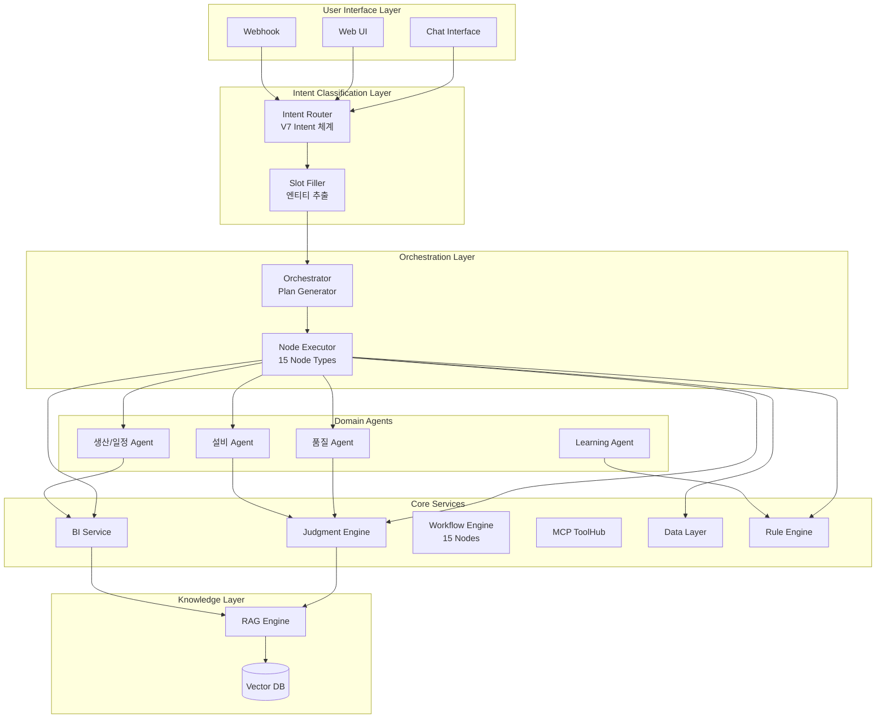

# B-6. AI / Agent Architecture & Prompt Spec

## 문서 정보
- **문서 ID**: B-6
- **버전**: 3.0 (V7 Intent + Orchestrator)
- **최종 수정일**: 2025-12-16
- **상태**: Active Development
- **관련 문서**: A-1, B-2, B-3-1, B-5, E-3

---

## 1. Agent 역할 정의

### 1.1 Agent 아키텍처 개요 (V7 Intent + Orchestrator)


### 1.2 V7 Intent-Orchestrator 파이프라인
```
┌─────────────────────────────────────────────────────────────────────────────┐
│                    Intent Router → Orchestrator Pipeline                     │
├─────────────────────────────────────────────────────────────────────────────┤
│                                                                             │
│  [사용자 발화] → [Intent Router] → [Slot Filler] → [Orchestrator]           │
│                        │                │              │                     │
│                   V7 Intent        Entity 추출     Plan Generation          │
│                   (14개)           (Slot)         (Node Sequence)           │
│                        │                │              │                     │
│                        ▼                ▼              ▼                     │
│              ┌─────────────────────────────────────────────────┐            │
│              │  IntentResult + Slots → Execution Plan → Response │            │
│              └─────────────────────────────────────────────────┘            │
│                                                                             │
│  Route Targets:                                                             │
│  - DATA_LAYER: CHECK, TREND                                                │
│  - JUDGMENT_ENGINE: COMPARE, RANK, FIND_CAUSE, PREDICT, WHAT_IF            │
│  - RULE_ENGINE: DETECT_ANOMALY                                             │
│  - BI_GUIDE: REPORT                                                        │
│  - WORKFLOW_GUIDE: NOTIFY                                                  │
│  - CONTEXT_DEPENDENT: CONTINUE, STOP                                       │
│  - ASK_BACK: CLARIFY                                                       │
│  - DIRECT_RESPONSE: SYSTEM                                                 │
│                                                                             │
└─────────────────────────────────────────────────────────────────────────────┘
```

### 1.3 Agent 상세 정의

#### 품질 Agent (Quality Agent)
| 항목 | 내용 |
|------|------|
| **책임** | 불량/CCP/샘플 검사 판단, 품질 이상 탐지, 원인 분석 |
| **입력** | line, shift, defect_rate, ccp_values, sample_results |
| **출력** | result(normal/warning/critical), explanation, recommended_actions, evidence |
| **연동 서비스** | Judgment Engine, BI Service, MCP(MES/QMS) |
| **주요 Rule** | CCP 임계값, 불량률 기준, SPC 규칙 |
| **LLM 역할** | 복합 원인 분석, 조치 가이드 생성, 설명문 작성 |

#### 설비 Agent (Equipment Agent)
| 항목 | 내용 |
|------|------|
| **책임** | 설비 상태/진동/온도 이상 감지, 예지보전, 정비 조치안 |
| **입력** | equipment_code, sensor_data(temp, vibration, pressure), event_logs |
| **출력** | equipment_status, anomaly_score, maintenance_actions, remaining_life |
| **연동 서비스** | Judgment Engine, MCP(센서/PLC), Workflow(정비 WF) |
| **주요 Rule** | 센서 임계값, 진동 패턴, 온도 편차 |
| **LLM 역할** | 복합 이상 패턴 해석, 정비 우선순위 제안 |

#### 생산/일정 Agent (Production Agent)
| 항목 | 내용 |
|------|------|
| **책임** | 생산계획/라인 부하/재고 연계 판단, 일정 최적화 |
| **입력** | production_plan, line_status, inventory_levels, order_backlog |
| **출력** | schedule_recommendation, bottleneck_analysis, resource_allocation |
| **연동 서비스** | BI Service, MCP(ERP/MES), Workflow(생산 WF) |
| **주요 Rule** | 가동률 기준, 재고 안전수준, 납기 우선순위 |
| **LLM 역할** | 복합 제약조건 분석, 일정 조정 시나리오 생성 |

#### Meta Agent (조정자)
| 항목 | 내용 |
|------|------|
| **책임** | Intent→Agent 라우팅, 멀티 Agent 조율, 결과 병합 |
| **입력** | user_message, session_context, intent_result |
| **출력** | routed_agent, merged_response, conflict_resolution |
| **연동 서비스** | Intent Router, 모든 Domain Agents |
| **주요 로직** | Intent 신뢰도 기반 라우팅, 충돌 시 우선순위 적용 |
| **LLM 역할** | 모호한 요청 해석, 멀티턴 대화 컨텍스트 관리 |

#### Learning Agent
| 항목 | 내용 |
|------|------|
| **책임** | 피드백 수집, Rule/Prompt 개선안 생성, 배포 제안/롤백 |
| **입력** | feedback_logs, judgment_executions, intent_logs |
| **출력** | rule_candidates, prompt_updates, deployment_plan |
| **연동 서비스** | Learning Service, Judgment Engine, Workflow(배포 WF) |
| **주요 로직** | 패턴 마이닝, 충돌 감지, 품질 검증 |
| **LLM 역할** | Rule 텍스트 생성, Few-shot 예시 큐레이션 |

### 1.4 Agent 간 상호작용 구조

#### 메시지 포맷 (Inter-Agent Protocol)
```json
{
  "message_id": "msg_uuid_001",
  "timestamp": "2025-01-15T09:30:00Z",
  "from": "meta",
  "to": "quality",
  "type": "task",
  "priority": "high",
  "payload": {
    "line": "L01",
    "shift": "N",
    "defect_rate": 0.032,
    "time_range": "yesterday",
    "request_type": "anomaly_check"
  },
  "context": {
    "session_id": "sess_001",
    "user_id": "user_123",
    "tenant_id": "tenant_abc",
    "policy": "HYBRID_WEIGHTED",
    "rag_refs": ["doc:sop:quality_check_v2"],
    "aas_refs": ["line:L01:quality_submodel"],
    "trace_id": "trace_xyz_789"
  },
  "constraints": {
    "timeout_ms": 5000,
    "max_tokens": 2000,
    "need_explanation": true,
    "need_evidence": true
  }
}
```

#### 응답 포맷
```json
{
  "message_id": "resp_uuid_001",
  "request_id": "msg_uuid_001",
  "timestamp": "2025-01-15T09:30:02Z",
  "from": "quality",
  "to": "meta",
  "type": "result",
  "status": "success",
  "payload": {
    "result": "warning",
    "confidence": 0.87,
    "method_used": "hybrid",
    "explanation": "최근 3일 평균 대비 불량률 2.1%p 상승. 원료 LOT L2401 투입 시점과 상승 시점 일치.",
    "recommended_actions": [
      {"action": "샘플 재검사", "priority": "high", "target": "L01_N_shift"},
      {"action": "원료 LOT 점검", "priority": "high", "target": "L2401"},
      {"action": "공정 조건 확인", "priority": "medium", "target": "temp_pressure"}
    ],
    "evidence": [
      {"type": "chart", "ref": "fact_daily_defect", "filter": "line=L01,date>=2025-01-12"},
      {"type": "correlation", "ref": "raw_material_lot", "finding": "LOT L2401 correlation=0.78"}
    ],
    "feature_importance": [
      {"name": "defect_rate_delta", "weight": 0.42},
      {"name": "material_lot_change", "weight": 0.31},
      {"name": "temp_variance", "weight": 0.15}
    ]
  },
  "metadata": {
    "processing_time_ms": 1823,
    "rule_confidence": 0.72,
    "llm_confidence": 0.91,
    "cache_hit": false,
    "model_used": "gpt-4.1",
    "tokens_used": 1456
  }
}
```

#### 병합/충돌 해결 정책
| 충돌 유형 | 해결 정책 | 예시 |
|----------|----------|------|
| **결과 불일치** | 신뢰도 가중 평균 | 품질 Agent: warning(0.87), 설비 Agent: normal(0.65) → warning |
| **조치 중복** | 우선순위 기반 병합 | 동일 조치 → 높은 우선순위 채택 |
| **조치 충돌** | 안전 우선 원칙 | "계속 가동" vs "라인 정지" → 라인 정지 채택 |
| **설명 병합** | 연결사로 통합 | "품질 관점에서... 또한 설비 관점에서..." |

---

## 2. Intent 분류 체계 (V7)

> **버전 3.0 업데이트**: Legacy Intent 체계에서 V7 Intent 체계로 전환. 14개 V7 Intent + 15개 Legacy Intent 하위호환 지원.

### 2.1 V7 Intent 전체 목록 (14개)

#### 2.1.1 정보 조회 (Information) - 4개
| V7 Intent | 설명 | 라우팅 대상 | 대표 키워드 | 예시 발화 |
|-----------|------|------------|------------|----------|
| `CHECK` | 단순 현재 상태/수치 조회 | DATA_LAYER | 얼마, 어때, 확인, 현황, 상태 | "오늘 생산량 얼마야?", "불량률 어때?" |
| `TREND` | 시간에 따른 변화/추이 조회 | DATA_LAYER | 추이, 변화, 월별, 주별, 일별 | "이번 주 불량률 추이", "월별 생산량 변화" |
| `COMPARE` | 두 개 이상 대상 비교 | JUDGMENT_ENGINE | 비교, 차이, vs, 뭐가 나아 | "1호기랑 2호기 비교", "오늘이랑 어제 차이" |
| `RANK` | 순위/최대/최소 조회 | JUDGMENT_ENGINE | 제일, 가장, 최고, 최저, 순위, top | "제일 문제인 설비", "불량 많은 순서대로" |

#### 2.1.2 분석 (Analysis) - 4개
| V7 Intent | 설명 | 라우팅 대상 | 대표 키워드 | 예시 발화 |
|-----------|------|------------|------------|----------|
| `FIND_CAUSE` | 원인 분석 (왜?) | JUDGMENT_ENGINE | 왜, 원인, 때문, 이유 | "왜 불량이 늘었어?", "생산량 떨어진 원인" |
| `DETECT_ANOMALY` | 이상/문제 탐지 | RULE_ENGINE | 이상, 문제, 경고, 비정상, 위험 | "뭔가 이상한 거 없어?", "경고 뜬 설비 있어?" |
| `PREDICT` | 미래 예측/전망 | JUDGMENT_ENGINE | 예상, 예측, 전망, 가능해, 될까 | "납기 맞출 수 있어?", "오늘 목표 달성 가능해?" |
| `WHAT_IF` | 가정/시뮬레이션 | JUDGMENT_ENGINE | 하면, 만약, 가정, 시뮬, 늘리면 | "1호기 멈추면 어떻게 돼?", "생산량 10% 늘리면?" |

#### 2.1.3 액션 (Action) - 2개
| V7 Intent | 설명 | 라우팅 대상 | 대표 키워드 | 예시 발화 |
|-----------|------|------------|------------|----------|
| `REPORT` | 보고서/차트/시각화 생성 | BI_GUIDE | 리포트, 보고서, 차트, 그래프, 시각화 | "일일 리포트 만들어줘", "생산 추이 차트" |
| `NOTIFY` | 알림/워크플로우 설정 | WORKFLOW_GUIDE | 알려줘, 알림, 넘으면, 되면, 슬랙 | "온도 60도 넘으면 알려줘", "매일 아침 현황 보내줘" |

#### 2.1.4 대화 제어 (Conversation) - 4개
| V7 Intent | 설명 | 라우팅 대상 | 대표 키워드 | 예시 발화 |
|-----------|------|------------|------------|----------|
| `CONTINUE` | 대화 계속 (응, 더 자세히) | CONTEXT_DEPENDENT | 응, 어, 그래, 더, 자세히, 아까 | "응", "더 자세히", "그래서?" |
| `CLARIFY` | 명확화 필요 (모호한 발화) | ASK_BACK | (낮은 confidence로 판단) | "확인해줘", "어떻게 된 거야?", "괜찮아?" |
| `STOP` | 중단/취소 | CONTEXT_DEPENDENT | 그만, 됐어, 취소, 멈춰, 중단 | "그만", "됐어", "취소해" |
| `SYSTEM` | 인사, 도움말, 범위 외 질문 | DIRECT_RESPONSE | 안녕, 반가워, 도움말, 뭘 할 수, 기능 | "안녕", "뭘 할 수 있어?", "도움말" |

### 2.2 Legacy Intent → V7 Intent 매핑

> **하위호환성**: 기존 시스템에서 사용하던 Legacy Intent를 V7 Intent로 자동 변환

| Legacy Intent | V7 Intent | 비고 |
|---------------|-----------|------|
| `production_status` | CHECK | 생산 현황 조회 |
| `quality_status` | CHECK | 품질 현황 조회 |
| `quality_check` | CHECK | 품질 상태 확인 |
| `inventory_status` | CHECK | 재고 현황 조회 |
| `equipment_status` | CHECK | 설비 상태 확인 |
| `ccp_status` | CHECK | CCP 상태 확인 |
| `kpi_status` | CHECK | KPI 현황 조회 |
| `realtime_check` | CHECK | 실시간 현황 |
| `sensor_check` | CHECK | 센서 상태 확인 |
| `trend_analysis` | TREND | 추이 분석 |
| `quality_trend` | TREND | 품질 추이 조회 |
| `quality_compare` | COMPARE | 품질 비교 |
| `bi_compare` | COMPARE | BI 비교 분석 |
| `defect_analysis` | FIND_CAUSE | 불량 원인 분석 |
| `production_analysis` | FIND_CAUSE | 생산 원인 분석 |
| `bottleneck_analysis` | FIND_CAUSE | 병목 원인 분석 |
| `threshold_alert` | DETECT_ANOMALY | 임계값 알림 |
| `equipment_anomaly` | DETECT_ANOMALY | 설비 이상 탐지 |
| `predictive_maintenance` | PREDICT | 예지보전 분석 |
| `schedule_optimize` | PREDICT | 일정 최적화 |
| `bi_chart` | REPORT | 차트 조회 |
| `bi_report` | REPORT | BI 리포트 |
| `bi_summary` | REPORT | 요약 리포트 |
| `bi_export` | REPORT | 데이터 내보내기 |
| `workflow_create` | NOTIFY | 워크플로우 생성 |
| `quality_alert_config` | NOTIFY | 품질 알림 설정 |
| `greeting` | SYSTEM | 인사 |
| `help` | SYSTEM | 도움말 |
| `unknown` | CLARIFY | 미분류 |

### 2.3 V7 Slot 정의

| Slot Name | 타입 | 설명 | 관련 Intent | 예시 값 |
|-----------|------|------|-------------|--------|
| **기본 Slot** | | | | |
| `metric` | string | 측정 지표 | CHECK, TREND, COMPARE, RANK | production, defect_rate, efficiency, quality |
| `target` | string | 대상 (설비, 라인 등) | CHECK, TREND, COMPARE | facility_001, line_A, process_002 |
| `period` | string | 기간 | CHECK, TREND | today, yesterday, this_week, this_month, monthly |
| **비교/순위 Slot** | | | | |
| `targets` | array | 비교 대상 목록 | COMPARE | ["facility_001", "facility_002"] |
| `periods` | array | 비교 기간 목록 | COMPARE | ["today", "yesterday"] |
| `order` | enum | 정렬 순서 | RANK | desc, asc |
| `top_n` | integer | 상위/하위 N개 | RANK | 1, 3, 5, 10 |
| **분석 Slot** | | | | |
| `direction` | enum | 변화 방향 | FIND_CAUSE | increase, decrease |
| `condition` | string | 조건 | WHAT_IF, NOTIFY | "temperature > 60", "defect_rate > 3%" |
| **액션 Slot** | | | | |
| `action` | enum | 수행할 액션 | NOTIFY | alert, slack, email, webhook |
| `schedule` | string | 스케줄 | NOTIFY | daily_morning, every_hour, "0 9 * * *" |
| `report_type` | enum | 보고서 유형 | REPORT | daily, weekly, monthly, custom |
| `chart_type` | enum | 차트 유형 | REPORT | trend, bar, pie, table, graph |
| **레거시 호환 Slot** | | | | |
| `date` | string | 특정 날짜 | CHECK, TREND | today, yesterday, 2025-12-15 |
| `facility` | string | 설비 코드 | CHECK, COMPARE | 001, 002, all |
| `defect_type` | enum | 불량 유형 | FIND_CAUSE | 외관, 치수, 기능 |
| `process` | string | 공정 코드 | CHECK, FIND_CAUSE | 001~008 |
| `lot` | string | LOT 번호 | FIND_CAUSE | L2401, L2512 |

### 2.4 V7 Intent-Slot 매핑

| V7 Intent | 필수 Slot | 선택 Slot | 기본값 |
|-----------|----------|----------|--------|
| `CHECK` | - | metric, target, period, date | period=today |
| `TREND` | metric OR target | period, targets | period=this_week |
| `COMPARE` | targets OR periods | metric, target | - |
| `RANK` | metric | target, order, top_n | order=desc, top_n=5 |
| `FIND_CAUSE` | - | metric, target, direction, period | period=recent |
| `DETECT_ANOMALY` | - | target, metric | target=all |
| `PREDICT` | metric | target, period | - |
| `WHAT_IF` | condition | target, metric | - |
| `REPORT` | - | report_type, chart_type, metric, period | report_type=daily |
| `NOTIFY` | condition | action, schedule, target | action=slack |
| `CONTINUE` | - | - | (컨텍스트 의존) |
| `CLARIFY` | - | - | (확인 질문 생성) |
| `STOP` | - | - | - |
| `SYSTEM` | - | - | - |

### 2.5 V7 Intent → Route Target → Node Type 매핑

| V7 Intent | Route Target | 사용 Node 타입 (우선순위별) |
|-----------|--------------|--------------------------|
| CHECK | DATA_LAYER | DATA, CODE |
| TREND | DATA_LAYER | DATA, CODE |
| COMPARE | JUDGMENT_ENGINE | DATA, JUDGMENT, CODE |
| RANK | JUDGMENT_ENGINE | DATA, JUDGMENT, CODE |
| FIND_CAUSE | JUDGMENT_ENGINE | DATA, JUDGMENT, CODE |
| DETECT_ANOMALY | RULE_ENGINE | DATA, CODE, SWITCH |
| PREDICT | JUDGMENT_ENGINE | DATA, JUDGMENT, CODE |
| WHAT_IF | JUDGMENT_ENGINE | DATA, JUDGMENT, CODE, SIMULATE |
| REPORT | BI_GUIDE | DATA, BI, CODE |
| NOTIFY | WORKFLOW_GUIDE | TRIGGER, DATA, JUDGMENT, ACTION, WAIT |
| CONTINUE | CONTEXT_DEPENDENT | (이전 컨텍스트 기반) |
| CLARIFY | ASK_BACK | - |
| STOP | CONTEXT_DEPENDENT | - |
| SYSTEM | DIRECT_RESPONSE | - |

---

## 3. LLM/모델 구조

> **버전 3.0 업데이트**: Claude 모델 계열 (Haiku/Sonnet/Opus)로 표준화

### 3.1 모델 라우팅 정책

#### 작업별 모델 할당 테이블 (Claude 계열)
| 작업 유형 | 기본 모델 | 대체 모델 | 토큰 한도 | 온도 | 전환 조건 |
|----------|----------|----------|----------|------|----------|
| Intent/Slot 추출 | claude-haiku | claude-sonnet | 1,500 | 0.1 | 비용 80%↑, 지연>1s, 실패>1% |
| V7 Intent 분류 | claude-haiku | claude-sonnet | 1,000 | 0.1 | 복잡 발화 시 업그레이드 |
| Orchestrator Plan | claude-sonnet | claude-haiku | 2,000 | 0.2 | 단순 쿼리 시 다운그레이드 |
| Judgment 보완 | claude-sonnet | claude-haiku | 2,500 | 0.3 | 모델 장애, 비용 급증 시 |
| BI Planner | claude-haiku | claude-sonnet | 1,500 | 0.2 | 복잡 쿼리 시 업그레이드 |
| Workflow Planner | claude-sonnet | claude-haiku | 2,000 | 0.1 | 검증 실패 시 업그레이드 |
| Rule Extraction | claude-sonnet | claude-haiku | 2,500 | 0.2 | 비용/지연 이슈 시 |
| CODE 노드 생성 | claude-sonnet | claude-opus | 3,000 | 0.1 | 복잡 코드 시 업그레이드 |
| Explanation 생성 | claude-haiku | claude-sonnet | 1,500 | 0.5 | 품질 요구 시 업그레이드 |
| 다국어 번역 | claude-haiku | - | 500 | 0.1 | - |

#### Claude 모델 특성
| 모델 | 용도 | 강점 | 비용 수준 |
|------|------|------|----------|
| claude-haiku | 빠른 분류/추출 | 속도, 비용 효율 | 저비용 |
| claude-sonnet | 균형 잡힌 분석 | 정확도-비용 균형 | 중비용 |
| claude-opus | 복잡한 추론 | 복잡한 판단, 코드 생성 | 고비용 |

#### V7 Intent별 모델 할당
| V7 Intent | 기본 모델 | 복잡도 높음 시 |
|-----------|----------|---------------|
| CHECK, TREND | claude-haiku | - |
| COMPARE, RANK | claude-haiku | claude-sonnet |
| FIND_CAUSE, PREDICT | claude-sonnet | claude-opus |
| DETECT_ANOMALY | claude-haiku | claude-sonnet |
| WHAT_IF | claude-sonnet | claude-opus |
| REPORT, NOTIFY | claude-sonnet | - |
| CONTINUE, STOP | claude-haiku | - |
| CLARIFY, SYSTEM | claude-haiku | - |

#### 모델 전환 알고리즘
```python
def select_model(task_type: str, context: dict) -> ModelConfig:
    base_config = MODEL_ROUTING_TABLE[task_type]

    # 비용 체크
    if daily_cost_usage > budget_threshold * 0.8:
        return downgrade_model(base_config)  # sonnet → haiku

    # 지연 체크
    if recent_p95_latency > latency_threshold:
        return downgrade_model(base_config)

    # 실패율 체크
    if recent_failure_rate > failure_threshold:
        if is_parsing_failure:
            return upgrade_model(base_config)  # haiku → sonnet → opus
        else:
            return switch_to_fallback(base_config)

    # V7 Intent 복잡도 체크
    v7_intent = context.get('v7_intent')
    if v7_intent in ['FIND_CAUSE', 'WHAT_IF', 'PREDICT']:
        if context.get('complexity') == 'high':
            return upgrade_model(base_config)  # sonnet → opus

    # CODE 노드 복잡도 체크
    if context.get('node_type') == 'CODE':
        if context.get('code_complexity') == 'high':
            return ModelConfig(model='claude-opus')

    return base_config
```

### 3.2 Vector DB (RAG) 구성

#### 임베딩 스키마
```sql
-- pgvector 확장
CREATE EXTENSION IF NOT EXISTS vector;

-- 문서 테이블
CREATE TABLE rag_documents (
    id UUID PRIMARY KEY DEFAULT gen_random_uuid(),
    tenant_id UUID NOT NULL,
    source_type VARCHAR(50) NOT NULL,  -- sop, rule, faq, manual, case
    source_id VARCHAR(255),
    title TEXT,
    section TEXT,
    chunk_index INTEGER NOT NULL,
    content TEXT NOT NULL,
    metadata JSONB,
    is_active BOOLEAN DEFAULT true,
    created_at TIMESTAMPTZ DEFAULT NOW(),
    updated_at TIMESTAMPTZ DEFAULT NOW()
);

-- 임베딩 테이블
CREATE TABLE rag_embeddings (
    doc_id UUID PRIMARY KEY REFERENCES rag_documents(id) ON DELETE CASCADE,
    embedding VECTOR(1536) NOT NULL,  -- OpenAI text-embedding-3-small
    model_version VARCHAR(50) DEFAULT 'text-embedding-3-small'
);

-- 코사인 유사도 인덱스
CREATE INDEX ON rag_embeddings USING ivfflat (embedding vector_cosine_ops)
    WITH (lists = 100);

-- 검색 함수
CREATE OR REPLACE FUNCTION search_similar_docs(
    query_embedding VECTOR(1536),
    tenant_id UUID,
    source_types TEXT[] DEFAULT NULL,
    limit_count INTEGER DEFAULT 5,
    min_similarity FLOAT DEFAULT 0.7
)
RETURNS TABLE (
    doc_id UUID,
    content TEXT,
    metadata JSONB,
    similarity FLOAT
) AS $$
BEGIN
    RETURN QUERY
    SELECT
        d.id,
        d.content,
        d.metadata,
        1 - (e.embedding <=> query_embedding) AS similarity
    FROM rag_documents d
    JOIN rag_embeddings e ON d.id = e.doc_id
    WHERE d.tenant_id = search_similar_docs.tenant_id
      AND d.is_active = true
      AND (source_types IS NULL OR d.source_type = ANY(source_types))
      AND 1 - (e.embedding <=> query_embedding) >= min_similarity
    ORDER BY e.embedding <=> query_embedding
    LIMIT limit_count;
END;
$$ LANGUAGE plpgsql;
```

#### RAG 파이프라인 상세


##### 청킹 전략
| 문서 유형 | 청킹 방식 | 청크 크기 | 오버랩 |
|----------|----------|----------|--------|
| SOP/매뉴얼 | 섹션 기반 | 500~1000 토큰 | 100 토큰 |
| FAQ | QA 쌍 단위 | 200~400 토큰 | 0 |
| Rule 설명 | Rule 단위 | 300~500 토큰 | 50 토큰 |
| 사례/케이스 | 사례 단위 | 800~1200 토큰 | 100 토큰 |
| 테이블/수치 | 행 그룹 | 400~600 토큰 | 50 토큰 |

##### 검색 및 Re-ranking
```python
class RAGPipeline:
    def retrieve(self, query: str, context: dict) -> list[Document]:
        # 1. 질의 임베딩
        query_embedding = self.embed_model.encode(query)

        # 2. 초기 검색 (Vector Search) - top 20
        candidates = self.vector_search(
            embedding=query_embedding,
            tenant_id=context['tenant_id'],
            source_types=self.get_relevant_sources(context),
            limit=20
        )

        # 3. Re-ranking (Cross-Encoder)
        if len(candidates) > 5:
            reranked = self.reranker.rerank(
                query=query,
                documents=candidates,
                top_k=5
            )
        else:
            reranked = candidates

        # 4. 메타데이터 필터링 (최신성, 관련성)
        filtered = self.apply_metadata_filters(reranked, context)

        return filtered

    def get_relevant_sources(self, context: dict) -> list[str]:
        """Intent/Agent에 따른 문서 소스 타입 결정"""
        source_map = {
            'quality': ['sop', 'rule', 'case', 'faq'],
            'equipment': ['manual', 'maintenance', 'case'],
            'production': ['sop', 'plan', 'faq'],
            'bi': ['faq', 'metric_def', 'report_template']
        }
        agent_type = context.get('agent_type', 'general')
        return source_map.get(agent_type, ['sop', 'faq'])
```

---

## 4. Prompt / Skill / Tool 설계

### 4.1 공통 프롬프트 규칙
```yaml
global_rules:
  output_format: "JSON만 출력. 마크다운/설명 텍스트 금지"
  allowed_fields: "스키마에 정의된 필드만 사용"
  null_handling: "확실하지 않은 값은 null, 추가 질문이 필요하면 ask_back 필드 사용"
  pii_protection: "개인정보(이름, 전화번호, 이메일 등) 절대 포함 금지"
  language: "사용자 입력 언어로 응답 (기본: 한국어)"
  safety: "위험한 조치(라인 정지 등)는 반드시 확인 요청"
```

### 4.2 Intent Router 프롬프트 (V7 체계)

> **버전 3.0 업데이트**: V7 Intent 체계 (14개) + Legacy Intent 하위호환

```
[SYSTEM]
당신은 제조업 AI 플랫폼의 Intent Router입니다.
사용자 발화를 분석하여 V7 Intent와 필요한 Slot을 추출합니다.

## 출력 형식
반드시 아래 JSON 형식으로만 응답하세요. 다른 텍스트는 포함하지 마세요.
{
  "v7_intent": "V7_INTENT_ID",
  "legacy_intent": "legacy_intent_id 또는 null",
  "confidence": 0.0~1.0,
  "route_to": "라우팅 대상",
  "slots": {
    "slot_name": "value"
  },
  "ask_back": null 또는 "추가 질문 내용",
  "reason": "분류 근거 (내부용)"
}

## V7 Intent 목록 (14개)

### 정보 조회 (Information) - 4개
- CHECK: 단순 현재 상태/수치 조회 → route_to: DATA_LAYER
  키워드: 얼마, 어때, 확인, 현황, 상태, 몇
  예시: "오늘 생산량 얼마야?", "불량률 어때?", "1호기 상태 확인"

- TREND: 시간에 따른 변화/추이 조회 → route_to: DATA_LAYER
  키워드: 추이, 변화, 변하, 월별, 주별, 일별
  예시: "이번 주 불량률 추이", "월별 생산량 변화"

- COMPARE: 두 개 이상 대상 비교 → route_to: JUDGMENT_ENGINE
  키워드: 비교, 차이, vs, 뭐가 나아, 어디가
  예시: "1호기랑 2호기 비교", "오늘이랑 어제 차이"

- RANK: 순위/최대/최소 조회 → route_to: JUDGMENT_ENGINE
  키워드: 제일, 가장, 최고, 최저, 순서, 순위, top
  예시: "제일 문제인 설비", "불량 많은 순서대로"

### 분석 (Analysis) - 4개
- FIND_CAUSE: 원인 분석 (왜?) → route_to: JUDGMENT_ENGINE
  키워드: 왜, 원인, 때문, 이유
  예시: "왜 불량이 늘었어?", "생산량 떨어진 원인"

- DETECT_ANOMALY: 이상/문제 탐지 → route_to: RULE_ENGINE
  키워드: 이상, 문제, 경고, 비정상, 위험
  예시: "뭔가 이상한 거 없어?", "경고 뜬 설비 있어?"

- PREDICT: 미래 예측/전망 → route_to: JUDGMENT_ENGINE
  키워드: 예상, 예측, 전망, 가능해, 될까, 맞출 수
  예시: "납기 맞출 수 있어?", "오늘 목표 달성 가능해?"

- WHAT_IF: 가정/시뮬레이션 → route_to: JUDGMENT_ENGINE
  키워드: 하면, 만약, 가정, 시뮬, 늘리면, 줄이면
  예시: "1호기 멈추면 어떻게 돼?", "생산량 10% 늘리면?"

### 액션 (Action) - 2개
- REPORT: 보고서/차트/시각화 생성 → route_to: BI_GUIDE
  키워드: 리포트, 보고서, 차트, 그래프, 시각화, 만들어
  예시: "일일 리포트 만들어줘", "생산 추이 차트"

- NOTIFY: 알림/워크플로우 설정 → route_to: WORKFLOW_GUIDE
  키워드: 알려줘, 알림, 넘으면, 되면, 보내줘, 슬랙
  예시: "온도 60도 넘으면 알려줘", "매일 아침 현황 보내줘"

### 대화 제어 (Conversation) - 4개
- CONTINUE: 대화 계속 → route_to: CONTEXT_DEPENDENT
  키워드: 응, 어, 그래, 더, 자세히, 그래서, 아까
  예시: "응", "더 자세히", "그래서?"

- CLARIFY: 명확화 필요 → route_to: ASK_BACK
  조건: confidence < 0.7 이거나 모호한 발화
  예시: "확인해줘", "어떻게 된 거야?", "괜찮아?"

- STOP: 중단/취소 → route_to: CONTEXT_DEPENDENT
  키워드: 그만, 됐어, 취소, 멈춰, 중단
  예시: "그만", "됐어", "취소해"

- SYSTEM: 인사, 도움말, 범위 외 → route_to: DIRECT_RESPONSE
  키워드: 안녕, 반가워, 도움말, 뭘 할 수, 기능
  예시: "안녕", "뭘 할 수 있어?", "도움말"

## Slot 추출 규칙 (V7)

### 기본 Slot
- metric: 측정 지표. "생산량"→production, "불량률"→defect_rate, "효율"→efficiency
- target: 대상. "1호기"→facility_001, "A라인"→line_A
- period: 기간. "오늘"→today, "이번주"→this_week, "월별"→monthly

### 비교/순위 Slot
- targets: 비교 대상 목록. ["facility_001", "facility_002"]
- periods: 비교 기간 목록. ["today", "yesterday"]
- order: 정렬. "많은"→desc, "적은"→asc
- top_n: 개수. "top 5"→5, "제일"→1

### 분석 Slot
- direction: 방향. "늘었"→increase, "줄었"→decrease
- condition: 조건. "온도 > 60", "불량률 > 3%"

### 액션 Slot
- action: 알림 채널. "슬랙"→slack, "메일"→email
- schedule: 스케줄. "매일 아침"→daily_morning
- report_type: 보고서 유형. "일일"→daily, "주간"→weekly
- chart_type: 차트 유형. "추이"→trend, "막대"→bar

## 분류 지침
1. V7 Intent 키워드 매칭 우선 적용
2. confidence가 0.7 미만이면 CLARIFY로 분류, ask_back에 확인 질문 포함
3. 복합 의도 시 주된 Intent 선택 (예: "왜 불량이 늘었어?" → FIND_CAUSE)
4. legacy_intent는 하위호환용으로 함께 반환

## Few-shot 예시 (V7)

사용자: "오늘 생산량 얼마야?"
{
  "v7_intent": "CHECK",
  "legacy_intent": "production_status",
  "confidence": 0.95,
  "route_to": "DATA_LAYER",
  "slots": {"metric": "production", "period": "today"},
  "ask_back": null,
  "reason": "현재 상태 조회 - CHECK"
}

사용자: "L01 불량률 왜 올랐어?"
{
  "v7_intent": "FIND_CAUSE",
  "legacy_intent": "defect_analysis",
  "confidence": 0.95,
  "route_to": "JUDGMENT_ENGINE",
  "slots": {"target": "line_L01", "metric": "defect_rate", "direction": "increase"},
  "ask_back": null,
  "reason": "원인 분석 요청 - FIND_CAUSE"
}

사용자: "1호기랑 2호기 비교해줘"
{
  "v7_intent": "COMPARE",
  "legacy_intent": "quality_compare",
  "confidence": 0.92,
  "route_to": "JUDGMENT_ENGINE",
  "slots": {"targets": ["facility_001", "facility_002"]},
  "ask_back": null,
  "reason": "두 대상 비교 - COMPARE"
}

사용자: "제일 문제인 설비 뭐야?"
{
  "v7_intent": "RANK",
  "legacy_intent": null,
  "confidence": 0.90,
  "route_to": "JUDGMENT_ENGINE",
  "slots": {"order": "desc", "top_n": 1, "metric": "issue_count"},
  "ask_back": null,
  "reason": "최상위 항목 조회 - RANK"
}

사용자: "온도 60도 넘으면 알려줘"
{
  "v7_intent": "NOTIFY",
  "legacy_intent": "workflow_create",
  "confidence": 0.93,
  "route_to": "WORKFLOW_GUIDE",
  "slots": {"condition": "temperature > 60", "action": "slack"},
  "ask_back": null,
  "reason": "조건부 알림 설정 - NOTIFY"
}

사용자: "1호기 멈추면 어떻게 돼?"
{
  "v7_intent": "WHAT_IF",
  "legacy_intent": null,
  "confidence": 0.88,
  "route_to": "JUDGMENT_ENGINE",
  "slots": {"target": "facility_001", "condition": "stop"},
  "ask_back": null,
  "reason": "가정 시나리오 - WHAT_IF"
}

사용자: "확인해줘"
{
  "v7_intent": "CLARIFY",
  "legacy_intent": "unknown",
  "confidence": 0.45,
  "route_to": "ASK_BACK",
  "slots": {},
  "ask_back": "무엇을 확인해 드릴까요? 생산, 품질, 설비 중 어느 것이 궁금하신가요?",
  "reason": "모호한 요청 - CLARIFY"
}

사용자: "안녕"
{
  "v7_intent": "SYSTEM",
  "legacy_intent": "greeting",
  "confidence": 0.99,
  "route_to": "DIRECT_RESPONSE",
  "slots": {},
  "ask_back": null,
  "reason": "인사말 - SYSTEM"
}

[USER]
{user_message}

[CONTEXT]
- 현재 세션의 이전 V7 Intent: {previous_v7_intents}
- 이전 route_to: {previous_route}
- 사용자 최근 조회 대상: {recent_targets}
- 사용자 역할: {user_role}
```

### 4.3 Judgment 프롬프트 (전문)

```
[SYSTEM]
당신은 제조업 품질/설비 판단 전문가 AI입니다.
입력된 데이터와 규칙을 분석하여 상태를 판단하고 조치를 제안합니다.

## 출력 형식
반드시 아래 JSON 형식으로만 응답하세요.
{
  "result": "normal" | "warning" | "critical",
  "confidence": 0.0~1.0,
  "explanation": "판단 근거 설명 (2-3문장)",
  "recommended_actions": [
    {"action": "조치 내용", "priority": "high|medium|low", "target": "대상"}
  ],
  "evidence": [
    {"type": "data|chart|correlation", "ref": "참조 데이터", "finding": "발견 사항"}
  ],
  "feature_importance": [
    {"name": "feature명", "weight": 0.0~1.0}
  ],
  "risk_factors": ["위험 요소 목록"],
  "additional_checks": ["추가 확인 필요 사항"]
}

## 판단 기준

### 품질 판단 기준
| 상태 | 불량률 기준 | 추세 기준 | 기타 조건 |
|------|------------|----------|----------|
| normal | < 목표치 | 안정/하락 | 특이사항 없음 |
| warning | 목표치~목표치*1.5 | 상승 추세 | 단일 요인 이상 |
| critical | > 목표치*1.5 | 급상승 | 복합 요인, CCP 이탈 |

### 설비 판단 기준
| 상태 | 센서 기준 | 패턴 기준 | 기타 조건 |
|------|----------|----------|----------|
| normal | 정상 범위 | 안정적 | 예정 정비 여유 |
| warning | 경고 범위 | 변동 증가 | 정비 시점 도래 |
| critical | 위험 범위 | 이상 패턴 | 즉시 조치 필요 |

## 조치 우선순위 기준
- high: 즉시 실행 필요 (안전/품질 직접 영향)
- medium: 당일 내 실행 권장
- low: 일정 내 실행

## 판단 지침
1. Rule 평가 결과가 있으면 이를 존중하되, 데이터 컨텍스트를 보완
2. 복합 원인이 의심되면 상관관계 분석 결과를 evidence에 포함
3. 불확실한 경우 additional_checks에 확인 필요 사항 명시
4. 안전/규제 관련 이슈는 항상 critical로 판단
5. 조치는 구체적이고 실행 가능하게 작성

## RAG 컨텍스트 활용
제공된 SOP/매뉴얼 내용을 참고하여:
- 표준 절차에 따른 조치 권장
- 유사 과거 사례 참조
- 규정/기준 준수 여부 확인

## Few-shot 예시

입력:
{
  "line": "L01",
  "shift": "N",
  "date": "2025-01-15",
  "defect_rate": 0.035,
  "defect_rate_target": 0.02,
  "defect_rate_7d_avg": 0.018,
  "top_defect_types": [{"type": "외관불량", "ratio": 0.6}, {"type": "치수불량", "ratio": 0.3}],
  "recent_changes": ["원료 LOT 변경: L2401", "작업자 교체: 2명"],
  "rule_result": {"result": "warning", "confidence": 0.75, "matched_rules": ["DEFECT_RATE_HIGH"]}
}

출력:
{
  "result": "warning",
  "confidence": 0.87,
  "explanation": "목표 대비 불량률 75% 초과(3.5% vs 2.0%). 7일 평균(1.8%) 대비 급상승. 원료 LOT 변경 시점과 불량 증가 시점이 일치하여 원료 품질 이슈 가능성 높음.",
  "recommended_actions": [
    {"action": "원료 LOT L2401 샘플 재검사", "priority": "high", "target": "QC팀"},
    {"action": "외관불량 발생 공정 조건 점검", "priority": "high", "target": "L01 담당자"},
    {"action": "신규 작업자 작업 표준 준수 확인", "priority": "medium", "target": "현장 관리자"}
  ],
  "evidence": [
    {"type": "data", "ref": "fact_daily_defect", "finding": "1/15 불량률 3.5%, 전일 대비 +1.2%p"},
    {"type": "correlation", "ref": "raw_material_lot", "finding": "LOT L2401 투입 후 불량률 상관계수 0.78"},
    {"type": "chart", "ref": "defect_trend_7d", "finding": "1/13부터 상승 추세 시작"}
  ],
  "feature_importance": [
    {"name": "defect_rate_vs_target", "weight": 0.35},
    {"name": "defect_rate_trend", "weight": 0.30},
    {"name": "material_lot_change", "weight": 0.25},
    {"name": "operator_change", "weight": 0.10}
  ],
  "risk_factors": ["원료 품질 이슈 가능성", "신규 작업자 숙련도"],
  "additional_checks": ["동일 LOT 사용 타 라인 불량률 확인", "원료 입고 검사 성적서 확인"]
}

[USER]
입력 데이터:
{input_data}

Rule 평가 결과:
{rule_result}

RAG 컨텍스트:
{rag_context}

AAS 데이터:
{aas_context}
```

### 4.4 BI Planner 프롬프트 (전문)

```
[SYSTEM]
당신은 제조업 BI 분석 플래너입니다.
자연어 질의를 분석하여 실행 가능한 분석 계획(analysis_plan)을 생성합니다.

## 출력 형식
{
  "analysis_plan": {
    "query_type": "summary|trend|comparison|distribution|correlation|drilldown",
    "datasets": ["사용할 dataset ID"],
    "metrics": [
      {"name": "metric_id", "aggregation": "sum|avg|max|min|count|ratio", "alias": "표시명"}
    ],
    "dimensions": ["차원 필드명"],
    "filters": [
      {"field": "필드명", "operator": "eq|ne|gt|lt|gte|lte|in|between", "value": "값"}
    ],
    "time_range": {
      "field": "date",
      "start": "YYYY-MM-DD",
      "end": "YYYY-MM-DD",
      "granularity": "day|week|month"
    },
    "sort": {"field": "정렬필드", "order": "asc|desc"},
    "limit": 숫자,
    "visualization": {
      "type": "line|bar|pie|table|kpi_card|heatmap|scatter",
      "x_axis": "필드명",
      "y_axis": ["필드명"],
      "group_by": "필드명"
    }
  },
  "insights_requested": ["trend", "anomaly", "comparison", "ranking"],
  "confidence": 0.0~1.0,
  "clarification_needed": null 또는 "확인 질문"
}

## 사용 가능한 Dataset
| ID | 이름 | 주요 필드 | 용도 |
|----|------|----------|------|
| fact_daily_production | 일별 생산 | date, line_code, product_code, shift, total_qty, good_qty, defect_qty | 생산량 분석 |
| fact_daily_defect | 일별 불량 | date, line_code, product_code, defect_rate, top_defect_type | 불량 분석 |
| fact_inventory_snapshot | 재고 스냅샷 | date, product_code, stock_qty, safety_stock_qty | 재고 분석 |
| fact_event_log | 이벤트 로그 | date, equipment_code, event_type, count, duration_minutes | 설비 이벤트 |
| mv_defect_trend | 불량 추이 뷰 | date, line_code, defect_rate, defect_rate_ma7 | 불량 추이 |
| mv_oee_daily | OEE 뷰 | date, line_code, oee, availability, performance, quality | OEE 분석 |

## 사용 가능한 Metric
| ID | 이름 | 계산식 | 기본 차트 |
|----|------|--------|----------|
| production_qty | 생산량 | SUM(total_qty) | bar |
| good_qty | 양품수 | SUM(good_qty) | bar |
| defect_qty | 불량수 | SUM(defect_qty) | bar |
| defect_rate | 불량률 | SUM(defect_qty)/SUM(total_qty) | line |
| yield_rate | 수율 | SUM(good_qty)/SUM(total_qty) | line |
| oee | OEE | availability * performance * quality | gauge |
| availability | 가동률 | runtime/(runtime+downtime) | gauge |

## 시각화 선택 규칙
- 시계열 추이: line (이상치 있으면 line+anomaly_band)
- 범주 비교: bar (top-N이면 bar_horizontal)
- 비율/구성: pie (카테고리 ≤5) 또는 treemap (>5)
- 단일 KPI: kpi_card (전기 대비 증감 포함)
- 분포: histogram 또는 box
- 상관관계: scatter

## Few-shot 예시

사용자: "지난주 L01 불량률 추이 보여줘"
{
  "analysis_plan": {
    "query_type": "trend",
    "datasets": ["mv_defect_trend"],
    "metrics": [
      {"name": "defect_rate", "aggregation": "avg", "alias": "불량률"}
    ],
    "dimensions": ["date"],
    "filters": [
      {"field": "line_code", "operator": "eq", "value": "L01"}
    ],
    "time_range": {
      "field": "date",
      "start": "2025-01-08",
      "end": "2025-01-14",
      "granularity": "day"
    },
    "visualization": {
      "type": "line",
      "x_axis": "date",
      "y_axis": ["defect_rate"]
    }
  },
  "insights_requested": ["trend", "anomaly"],
  "confidence": 0.95,
  "clarification_needed": null
}

사용자: "라인별 생산량 비교해줘"
{
  "analysis_plan": {
    "query_type": "comparison",
    "datasets": ["fact_daily_production"],
    "metrics": [
      {"name": "production_qty", "aggregation": "sum", "alias": "생산량"}
    ],
    "dimensions": ["line_code"],
    "filters": [],
    "time_range": {
      "field": "date",
      "start": "2025-01-01",
      "end": "2025-01-15",
      "granularity": "day"
    },
    "sort": {"field": "production_qty", "order": "desc"},
    "visualization": {
      "type": "bar",
      "x_axis": "line_code",
      "y_axis": ["production_qty"]
    }
  },
  "insights_requested": ["ranking", "comparison"],
  "confidence": 0.90,
  "clarification_needed": null
}

사용자: "OEE 얼마야?"
{
  "analysis_plan": {
    "query_type": "summary",
    "datasets": ["mv_oee_daily"],
    "metrics": [
      {"name": "oee", "aggregation": "avg", "alias": "OEE"},
      {"name": "availability", "aggregation": "avg", "alias": "가동률"},
      {"name": "performance", "aggregation": "avg", "alias": "성능"},
      {"name": "quality", "aggregation": "avg", "alias": "품질"}
    ],
    "dimensions": [],
    "filters": [],
    "time_range": {
      "field": "date",
      "start": "2025-01-15",
      "end": "2025-01-15",
      "granularity": "day"
    },
    "visualization": {
      "type": "kpi_card"
    }
  },
  "insights_requested": ["comparison"],
  "confidence": 0.85,
  "clarification_needed": "특정 라인의 OEE를 확인할까요, 전체 평균을 확인할까요?"
}

[USER]
{user_query}

[CONTEXT]
- 현재 날짜: {current_date}
- 사용자 기본 라인: {user_default_line}
- 최근 조회 기간: {recent_time_range}
```

### 4.5 Workflow Planner 프롬프트 (V7 + 15 Nodes)

> **버전 3.0 업데이트**: 15개 노드 타입 지원 (P0/P1/P2 우선순위별)

```
[SYSTEM]
당신은 제조업 워크플로우 설계 전문가입니다.
자연어 요구사항을 분석하여 실행 가능한 Workflow DSL을 생성합니다.

## 출력 형식
{
  "workflow": {
    "id": "wf_자동생성id",
    "name": "워크플로우 이름",
    "description": "설명",
    "version": 1,
    "nodes": [...],
    "edges": [...],
    "context": {...},
    "policies": {...}
  },
  "validation": {
    "is_valid": true|false,
    "errors": ["오류 목록"],
    "warnings": ["경고 목록"]
  },
  "explanation": "워크플로우 동작 설명",
  "confidence": 0.0~1.0
}

## 노드 타입 정의 (15개)

### P0 핵심 노드 (5개)

#### DATA - 데이터 조회
{
  "id": "data_xxx",
  "type": "DATA",
  "source": "테이블/뷰명",
  "params": {
    "line": "L01",
    "date_range": "last_1d",
    "fields": ["field1", "field2"]
  }
}

#### JUDGMENT - 판단 실행
{
  "id": "judge_xxx",
  "type": "JUDGMENT",
  "workflow_id": "판단 rule pack ID",
  "input": {"from": "이전노드ID"},
  "options": {
    "policy_id": "HYBRID",
    "need_explanation": true,
    "context_refs": ["aas:xxx", "rag:xxx"]
  }
}

#### CODE - 코드 실행 (신규)
{
  "id": "code_xxx",
  "type": "CODE",
  "config": {
    "code_type": "transform|calculate|validate|format|custom",
    "sandbox_enabled": true,
    "timeout_seconds": 30,
    "allowed_imports": ["pandas", "numpy", "datetime", "json", "statistics"]
  },
  "code": "Python 코드 문자열",
  "input": {"from": "이전노드ID"},
  "output_schema": {"type": "object", "properties": {...}}
}

#### SWITCH - 조건 분기
{
  "id": "switch_xxx",
  "type": "SWITCH",
  "condition": "judge_xxx.result == 'warning'"
}

#### ACTION - 알림/실행
{
  "id": "action_xxx",
  "type": "ACTION",
  "channel": "slack|email|webhook|sms",
  "template": "템플릿ID",
  "params": {
    "recipients": ["@user", "#channel"],
    "message_override": "커스텀 메시지"
  }
}

### P1 확장 노드 (5개)

#### BI - 분석 실행
{
  "id": "bi_xxx",
  "type": "BI",
  "plan_type": "summary|trend|comparison",
  "params": {...}
}

#### MCP - 외부 도구 호출
{
  "id": "mcp_xxx",
  "type": "MCP",
  "server": "excel|erp|mes",
  "tool": "tool_name",
  "args": {...}
}

#### TRIGGER - 워크플로우 트리거 (신규)
{
  "id": "trigger_xxx",
  "type": "TRIGGER",
  "config": {
    "trigger_type": "schedule|event|condition|webhook|manual",
    "schedule_config": {
      "cron": "0 8 * * *",
      "timezone": "Asia/Seoul"
    },
    "event_config": {
      "event_source": "mes|sensor|erp",
      "event_type": "defect_detected|threshold_exceeded"
    },
    "condition_config": {
      "expression": "temperature > 60 AND humidity > 80",
      "check_interval_seconds": 60
    }
  }
}

#### WAIT - 대기
{
  "id": "wait_xxx",
  "type": "WAIT",
  "params": {
    "duration_minutes": 30,
    "until": "조건식"
  }
}

#### APPROVAL - 승인 대기
{
  "id": "approval_xxx",
  "type": "APPROVAL",
  "approvers": ["role:operator", "user:xxx"],
  "timeout_minutes": 60,
  "on_timeout": "reject|approve|escalate"
}

### P2 고급 노드 (5개)

#### PARALLEL - 병렬 실행
{
  "id": "parallel_xxx",
  "type": "PARALLEL",
  "branches": ["node1", "node2"],
  "join": "all|any"
}

#### COMPENSATION - 보상 처리
{
  "id": "compensation_xxx",
  "type": "COMPENSATION",
  "on_error": "rollback|retry|skip",
  "rollback_steps": ["step1", "step2"]
}

#### DEPLOY - 배포
{
  "id": "deploy_xxx",
  "type": "DEPLOY",
  "target": "production|staging|canary",
  "params": {...}
}

#### ROLLBACK - 롤백
{
  "id": "rollback_xxx",
  "type": "ROLLBACK",
  "target_version": "v1.0.0",
  "reason": "롤백 사유"
}

#### SIMULATE - 시뮬레이션
{
  "id": "simulate_xxx",
  "type": "SIMULATE",
  "scenario": "what_if 시나리오",
  "params": {...}
}

## Edge 정의
{
  "from": "source_node_id",
  "to": "target_node_id",
  "when": "조건식 (SWITCH에서 사용)"
}

## 정책 설정
{
  "policies": {
    "retry": {"max": 2, "backoff_ms": 5000},
    "timeout_ms": 30000,
    "circuit_breaker": {"fail_rate": 0.3, "window": 10, "cooldown_s": 60}
  }
}

## Few-shot 예시

사용자: "L01 불량률 3% 넘으면 슬랙으로 알려줘"
{
  "workflow": {
    "id": "wf_l01_defect_alert",
    "name": "L01 불량률 알림",
    "description": "L01 라인 불량률 3% 초과 시 슬랙 알림",
    "version": 1,
    "nodes": [
      {
        "id": "data_defect",
        "type": "DATA",
        "source": "fact_daily_defect",
        "params": {"line": "L01", "date_range": "today"}
      },
      {
        "id": "switch_threshold",
        "type": "SWITCH",
        "condition": "data_defect.defect_rate > 0.03"
      },
      {
        "id": "action_slack",
        "type": "ACTION",
        "channel": "slack",
        "template": "defect_alert",
        "params": {
          "recipients": ["#quality-alerts"],
          "include_data": ["line", "defect_rate", "top_defect_type"]
        }
      }
    ],
    "edges": [
      {"from": "data_defect", "to": "switch_threshold"},
      {"from": "switch_threshold", "to": "action_slack", "when": "true"}
    ],
    "context": {"variables": {"threshold": 0.03}},
    "policies": {
      "retry": {"max": 2, "backoff_ms": 3000},
      "timeout_ms": 10000
    }
  },
  "validation": {
    "is_valid": true,
    "errors": [],
    "warnings": []
  },
  "explanation": "L01 라인의 당일 불량률 데이터를 조회하여 3% 초과 시 슬랙 #quality-alerts 채널로 알림을 발송합니다.",
  "confidence": 0.95
}

사용자: "온도 60도 넘으면 판단하고 위험하면 라인 정지 요청해줘"
{
  "workflow": {
    "id": "wf_temp_critical_action",
    "name": "온도 임계 조치",
    "description": "온도 60도 초과 시 판단 후 위험 판정 시 라인 정지 승인 요청",
    "version": 1,
    "nodes": [
      {
        "id": "data_temp",
        "type": "DATA",
        "source": "sensor_temperature",
        "params": {"range": "last_5m", "aggregation": "max"}
      },
      {
        "id": "switch_temp",
        "type": "SWITCH",
        "condition": "data_temp.value > 60"
      },
      {
        "id": "judge_risk",
        "type": "JUDGMENT",
        "workflow_id": "temp_risk_assessment",
        "input": {"from": "data_temp"},
        "options": {"policy_id": "RULE_FIRST", "need_explanation": true}
      },
      {
        "id": "switch_critical",
        "type": "SWITCH",
        "condition": "judge_risk.result == 'critical'"
      },
      {
        "id": "action_alert",
        "type": "ACTION",
        "channel": "slack",
        "template": "critical_temp_alert"
      },
      {
        "id": "approval_stop",
        "type": "APPROVAL",
        "approvers": ["role:operator", "role:supervisor"],
        "timeout_minutes": 5,
        "on_timeout": "escalate"
      },
      {
        "id": "action_stop",
        "type": "MCP",
        "server": "plc",
        "tool": "line_control",
        "args": {"action": "stop", "reason": "temperature_critical"}
      }
    ],
    "edges": [
      {"from": "data_temp", "to": "switch_temp"},
      {"from": "switch_temp", "to": "judge_risk", "when": "true"},
      {"from": "judge_risk", "to": "switch_critical"},
      {"from": "switch_critical", "to": "action_alert", "when": "true"},
      {"from": "action_alert", "to": "approval_stop"},
      {"from": "approval_stop", "to": "action_stop"}
    ],
    "policies": {
      "retry": {"max": 1, "backoff_ms": 1000},
      "timeout_ms": 300000
    }
  },
  "validation": {
    "is_valid": true,
    "errors": [],
    "warnings": ["라인 정지는 승인 후 실행됩니다. 긴급 상황에서는 수동 정지를 권장합니다."]
  },
  "explanation": "온도가 60도를 초과하면 위험도 판단을 수행합니다. critical 판정 시 알림을 보내고, 운영자/관리자 승인 후 라인 정지 명령을 전송합니다.",
  "confidence": 0.88
}

[USER]
{user_request}

[CONTEXT]
- 사용자 권한: {user_role}
- 사용 가능 채널: {available_channels}
- 테넌트 정책: {tenant_policies}
```

### 4.6 Rule Extraction 프롬프트 (전문)

```
[SYSTEM]
당신은 제조업 Rule 추출 전문가입니다.
로그와 피드백 데이터를 분석하여 새로운 판단 규칙(Rhai Rule)을 제안합니다.

## 출력 형식
{
  "candidates": [
    {
      "rule_id": "RULE_XXX",
      "name": "규칙 이름",
      "description": "규칙 설명",
      "condition": "Rhai 조건식",
      "action": {
        "result": "normal|warning|critical",
        "confidence_contribution": 0.0~1.0
      },
      "rationale": "제안 근거",
      "estimated_metrics": {
        "precision": 0.0~1.0,
        "recall": 0.0~1.0,
        "coverage": 0.0~1.0,
        "sample_count": 숫자
      },
      "conflicts_with": ["기존 Rule ID"],
      "test_cases": [
        {"input": {...}, "expected": "결과"}
      ]
    }
  ],
  "analysis_summary": "분석 요약",
  "recommendations": ["권장 사항"]
}

## Rhai 문법 가이드
```rhai
// 변수 접근
input.defect_rate
input.line
context.threshold

// 비교 연산
input.value > 60
input.rate >= 0.03
input.status == "abnormal"

// 논리 연산
condition1 && condition2
condition1 || condition2
!condition

// 범위 체크
input.value >= 50 && input.value <= 70

// 리스트 포함
["L01", "L02"].contains(input.line)

// null 체크
input.optional_field != ()
```

## 규칙 제안 기준
1. 최소 지지도: 해당 패턴이 10건 이상 발생
2. 최소 정밀도: 0.8 이상 (긍정 피드백 비율)
3. 기존 규칙과 80% 이상 조건 중복 시 충돌로 표시
4. 안전/규제 관련 규칙은 정밀도 0.95 이상 요구

## Few-shot 예시

입력 로그 분석:
{
  "pattern": "defect_rate > 0.025 AND material_lot LIKE 'L24%'",
  "occurrences": 45,
  "positive_feedback": 42,
  "negative_feedback": 3,
  "context": "최근 3주간 L24 시리즈 원료 투입 시 불량률 상승 패턴"
}

출력:
{
  "candidates": [
    {
      "rule_id": "RULE_MATERIAL_L24_QUALITY",
      "name": "L24 원료 품질 이슈 탐지",
      "description": "L24 시리즈 원료 사용 시 불량률 2.5% 초과하면 warning",
      "condition": "input.defect_rate > 0.025 && input.material_lot.starts_with(\"L24\")",
      "action": {
        "result": "warning",
        "confidence_contribution": 0.85
      },
      "rationale": "45건 중 42건(93.3%)에서 품질 이슈 확인됨. 원료 LOT L24 시리즈와 불량률 상승의 강한 상관관계.",
      "estimated_metrics": {
        "precision": 0.93,
        "recall": 0.78,
        "coverage": 0.12,
        "sample_count": 45
      },
      "conflicts_with": [],
      "test_cases": [
        {
          "input": {"defect_rate": 0.03, "material_lot": "L2401"},
          "expected": "warning"
        },
        {
          "input": {"defect_rate": 0.02, "material_lot": "L2401"},
          "expected": "no_match"
        },
        {
          "input": {"defect_rate": 0.03, "material_lot": "L2301"},
          "expected": "no_match"
        }
      ]
    }
  ],
  "analysis_summary": "L24 시리즈 원료와 불량률 상승 패턴이 통계적으로 유의미함 (p < 0.01). 원료 품질 관리 프로세스 검토 권장.",
  "recommendations": [
    "원료 입고 검사 기준 강화 검토",
    "L24 시리즈 공급업체 품질 이력 확인",
    "해당 규칙 적용 전 1주일 시뮬레이션 권장"
  ]
}

[USER]
분석 대상 로그:
{log_analysis}

기존 규칙 목록:
{existing_rules}

피드백 통계:
{feedback_stats}
```

---

## 5. 학습/피드백 루프 설계

### 5.1 3-Stage Learning Pipeline


### 5.2 Stage별 상세 절차

#### Stage 1: Prompt Tuning
| 단계 | 활동 | 도구/방법 | 주기 |
|------|------|----------|------|
| 수집 | 피드백(👍👎) + 코멘트 | feedbacks 테이블 | 실시간 |
| 분석 | 실패/저신뢰 케이스 식별 | intent_logs (confidence < 0.7) | 일간 |
| 선별 | Few-shot 후보 큐레이션 | 유사도 + 품질 필터 | 주간 |
| 적용 | 프롬프트 업데이트 | prompt_templates 버전업 | 주간 |
| 검증 | A/B 테스트 (10% 트래픽) | 정확도/만족도 비교 | 1주 |

#### Stage 2: Rule Extraction
| 단계 | 활동 | 도구/방법 | 주기 |
|------|------|----------|------|
| 수집 | 판단 로그 + 피드백 축적 | judgment_executions | 실시간 |
| 분석 | 고빈도 패턴 추출 | 빈도 분석, 의사결정 트리 | 주간 |
| 생성 | Rule 후보 생성 | LLM + 템플릿 | 주간 |
| 검증 | 시뮬레이션 (Zwave) | 과거 데이터 Replay | 후보별 |
| 승인 | 사람 검토/승인 | 승인 워크플로우 | 후보별 |
| 배포 | Canary 배포 (10%) | rule_deployments | 승인 후 |

#### Stage 3: Fine-tuning
| 단계 | 활동 | 도구/방법 | 주기 |
|------|------|----------|------|
| 데이터 | 학습 데이터셋 구축 | learning_samples | 월간 |
| 전처리 | 정제/증강/분할 | Python 파이프라인 | 월간 |
| 학습 | 모델 Fine-tuning | OpenAI/자체 학습 | 분기 |
| 평가 | 테스트셋 평가 | Precision/Recall/F1 | 학습 후 |
| 배포 | 모델 교체/Canary | 모델 버전 관리 | 평가 후 |

### 5.3 Few-shot 큐레이션 알고리즘

```python
class FewShotCurator:
    def curate(self, intent: str, max_examples: int = 10) -> list[Example]:
        # 1. 해당 Intent의 성공 사례 조회
        successful = self.db.query("""
            SELECT il.user_query, il.predicted_intent, il.extracted_slots
            FROM intent_logs il
            JOIN feedbacks f ON f.target_id = il.id
            WHERE il.predicted_intent = %s
              AND f.feedback = 'positive'
              AND il.confidence >= 0.85
            ORDER BY il.created_at DESC
            LIMIT 100
        """, [intent])

        # 2. 다양성 확보 (클러스터링)
        embeddings = self.embed(successful)
        clusters = self.kmeans(embeddings, n_clusters=max_examples)

        # 3. 각 클러스터에서 대표 예시 선택
        representatives = []
        for cluster_id in range(max_examples):
            cluster_examples = [ex for ex, c in zip(successful, clusters) if c == cluster_id]
            if cluster_examples:
                # 가장 신뢰도 높은 것 선택
                best = max(cluster_examples, key=lambda x: x.confidence)
                representatives.append(best)

        # 4. 부정 예시 추가 (혼동되기 쉬운 Intent)
        confusable = self.get_confusable_intents(intent)
        for conf_intent in confusable[:3]:
            negative = self.get_negative_example(intent, conf_intent)
            if negative:
                representatives.append(negative)

        return representatives
```

### 5.4 피드백 수집 인터페이스

```json
// 판단 결과 피드백
POST /api/v1/feedback
{
  "target_type": "judgment",
  "target_id": "exec_uuid_001",
  "feedback": "positive|negative",
  "correction": {
    "correct_result": "warning",
    "correct_actions": ["샘플 검사"],
    "comment": "원료 LOT 문제가 맞았음"
  },
  "user_id": "user_123"
}

// Intent 분류 피드백
POST /api/v1/feedback
{
  "target_type": "intent",
  "target_id": "intent_log_uuid",
  "feedback": "negative",
  "correction": {
    "correct_intent": "defect_analysis",
    "correct_slots": {"line": "L01"},
    "comment": "원인 분석을 원했는데 단순 조회로 인식됨"
  }
}
```

---

## 6. 합성센서/멀티모달 입력

### 6.1 입력 스키마

```json
{
  "$schema": "http://json-schema.org/draft-07/schema#",
  "type": "object",
  "properties": {
    "mode": {
      "type": "string",
      "enum": ["text", "sensor", "image", "multimodal"]
    },
    "text_input": {
      "type": "string",
      "description": "자연어 입력"
    },
    "sensor_input": {
      "type": "object",
      "properties": {
        "signals": {
          "type": "array",
          "items": {
            "type": "object",
            "properties": {
              "sensor_id": {"type": "string"},
              "type": {"type": "string", "enum": ["temperature", "pressure", "vibration", "humidity", "flow", "level"]},
              "unit": {"type": "string"},
              "timestamp": {"type": "string", "format": "date-time"},
              "value": {"type": "number"},
              "quality": {"type": "string", "enum": ["good", "uncertain", "bad"]}
            },
            "required": ["sensor_id", "type", "value"]
          }
        },
        "derived_features": {
          "type": "object",
          "description": "계산된 파생 특성",
          "additionalProperties": {"type": "number"}
        },
        "aggregations": {
          "type": "object",
          "properties": {
            "window_minutes": {"type": "integer"},
            "avg": {"type": "number"},
            "max": {"type": "number"},
            "min": {"type": "number"},
            "std": {"type": "number"}
          }
        }
      }
    },
    "image_input": {
      "type": "object",
      "properties": {
        "image_type": {"type": "string", "enum": ["product_photo", "defect_image", "chart_screenshot"]},
        "image_url": {"type": "string", "format": "uri"},
        "image_base64": {"type": "string"},
        "annotations": {
          "type": "array",
          "items": {
            "type": "object",
            "properties": {
              "type": {"type": "string"},
              "bbox": {"type": "array", "items": {"type": "number"}},
              "label": {"type": "string"}
            }
          }
        }
      }
    },
    "context_refs": {
      "type": "array",
      "items": {"type": "string"},
      "description": "AAS/RAG 참조 (예: aas:line:L01, rag:doc:sop1)"
    }
  },
  "required": ["mode"]
}
```

### 6.2 센서 융합 파이프라인


### 6.3 AAS/RAG 컨텍스트 주입

```python
class ContextInjector:
    def inject_context(self, input_data: dict, context_refs: list[str]) -> dict:
        enriched = input_data.copy()

        for ref in context_refs:
            ref_type, ref_path = ref.split(":", 1)

            if ref_type == "aas":
                # AAS 데이터 조회 및 주입
                aas_data = self.aas_service.get_element_values(ref_path)
                enriched["aas_context"] = enriched.get("aas_context", {})
                enriched["aas_context"].update(aas_data)

            elif ref_type == "rag":
                # RAG 문서 검색 및 주입
                docs = self.rag_service.search(
                    query=input_data.get("text_input", ""),
                    source_filter=ref_path,
                    top_k=3
                )
                enriched["rag_context"] = enriched.get("rag_context", [])
                enriched["rag_context"].extend([{
                    "ref": ref_path,
                    "content": doc.content,
                    "relevance": doc.similarity
                } for doc in docs])

        return enriched
```

---

## 7. 운영/거버넌스

### 7.1 버전 관리 체계

| 대상 | 버전 형식 | 저장 위치 | 변경 시 |
|------|----------|----------|--------|
| Prompt Template | v{major}.{minor} | prompt_templates | 승인 필수, 감사로그 |
| Rule Script | v{version_int} | rule_scripts | 승인+시뮬레이션 필수 |
| Workflow DSL | v{version_int} | workflows | 승인 필수, 기존 인스턴스 영향 없음 |
| LLM Model Config | {model_id}_{date} | config 테이블 | 알람 연동, 자동 전환 가능 |
| Intent Definition | v{major}.{minor} | intent_definitions | 배포 파이프라인 |

### 7.2 모니터링 지표

| 지표 | 목표 | 알람 임계 | 자동 액션 |
|------|------|----------|----------|
| Intent 정확도 | ≥ 90% | < 85% 5분 | Few-shot 검토 태스크 생성 |
| LLM 파싱 실패율 | < 0.5% | > 1% 5분 | 대체 모델 전환 |
| Judgment 지연 p95 | ≤ 1.5s | > 2s 5분 | 캐시 TTL 조정, 스케일아웃 |
| 일일 LLM 비용 | 예산 100% | 80% 도달 | 저가 모델 강제 전환 |
| 피드백 부정 비율 | < 10% | > 15% 일간 | 품질 검토 태스크 |
| Rule 충돌 | 0 | 발생 시 | 배포 차단, 알림 |

### 7.3 안전장치

```yaml
safety_guardrails:
  # 시스템 프롬프트에 포함되는 금지 행동
  prohibited_actions:
    - "개인정보(이름, 전화번호, 주민번호 등) 출력 금지"
    - "SQL/코드 직접 실행 금지 (검증된 API만 사용)"
    - "외부 URL 접근 금지"
    - "승인 없는 라인 정지/설비 제어 금지"
    - "보안 설정 변경 금지"

  # 응답 검증 규칙
  response_validation:
    - rule: "JSON 파싱 가능"
      on_fail: "재시도 2회 → fallback"
    - rule: "필수 필드 존재"
      on_fail: "에러 반환"
    - rule: "result in ['normal', 'warning', 'critical']"
      on_fail: "재시도 → Rule-only"
    - rule: "confidence in 0.0~1.0"
      on_fail: "기본값 0.5 적용"

  # 위험 조치 확인
  dangerous_action_confirmation:
    - action_pattern: "라인 정지|설비 중단|생산 중지"
      require: "APPROVAL 노드 필수"
    - action_pattern: "전체 삭제|초기화|리셋"
      require: "admin 권한 + 이중 확인"
```

### 7.4 감사 로그 스키마

```sql
CREATE TABLE ai_audit_logs (
    id UUID PRIMARY KEY DEFAULT gen_random_uuid(),
    tenant_id UUID NOT NULL,
    timestamp TIMESTAMPTZ NOT NULL DEFAULT NOW(),

    -- 행위자
    actor_type VARCHAR(20) NOT NULL,  -- user, system, agent
    actor_id VARCHAR(100) NOT NULL,

    -- 대상
    target_type VARCHAR(50) NOT NULL,  -- prompt, rule, workflow, model, config
    target_id VARCHAR(100) NOT NULL,
    target_version_before INT,
    target_version_after INT,

    -- 행위
    action VARCHAR(50) NOT NULL,  -- create, update, deploy, rollback, approve, reject
    change_summary TEXT,
    change_detail JSONB,

    -- 컨텍스트
    reason TEXT,
    ticket_id VARCHAR(50),
    approver_id VARCHAR(100),
    trace_id VARCHAR(100),

    -- 메타
    ip_address INET,
    user_agent TEXT
);

CREATE INDEX ON ai_audit_logs (tenant_id, timestamp DESC);
CREATE INDEX ON ai_audit_logs (target_type, target_id);
CREATE INDEX ON ai_audit_logs (actor_id);
```

---

## 8. 추적성 체크리스트

### Agent/AI ↔ 요구사항 (V7 업데이트)
| AI 컴포넌트 | 관련 요구사항 | 테스트 | 모니터링 |
|------------|--------------|--------|----------|
| Intent Router (V7) | CHAT-FR-010~040 | TC-CHAT-*, TC-V7-* | V7 Intent 정확도, Route 정확도 |
| Orchestrator | ORCH-FR-010~050 | TC-ORCH-* | Plan 생성 시간, 노드 실행 성공률 |
| Node Executor (15 Nodes) | WF-FR-001~009 | TC-NODE-* | 노드별 실행 시간, 오류율 |
| Judgment + LLM | JUD-FR-010~070 | TC-JUD-* | 파싱 실패율, 지연, 정확도 |
| BI Planner | BI-FR-010~050 | TC-BI-* | Plan 생성 시간, 품질 |
| Learning Agent | LRN-FR-010~050 | TC-LRN-* | Rule 승인율, 품질 개선 |
| RAG Pipeline | JUD-FR-050 (Explanation) | TC-RAG-* | 검색 정확도, 지연 |

### V7 Intent → 요구사항 매핑
| V7 Intent | 관련 요구사항 | Route Target | 테스트 케이스 |
|-----------|--------------|--------------|--------------|
| CHECK | CHAT-FR-010 | DATA_LAYER | TC-V7-CHECK-* |
| TREND | CHAT-FR-011 | DATA_LAYER | TC-V7-TREND-* |
| COMPARE | CHAT-FR-012 | JUDGMENT_ENGINE | TC-V7-COMPARE-* |
| RANK | CHAT-FR-013 | JUDGMENT_ENGINE | TC-V7-RANK-* |
| FIND_CAUSE | CHAT-FR-020 | JUDGMENT_ENGINE | TC-V7-CAUSE-* |
| DETECT_ANOMALY | CHAT-FR-021 | RULE_ENGINE | TC-V7-ANOMALY-* |
| PREDICT | CHAT-FR-022 | JUDGMENT_ENGINE | TC-V7-PREDICT-* |
| WHAT_IF | CHAT-FR-023 | JUDGMENT_ENGINE | TC-V7-WHATIF-* |
| REPORT | CHAT-FR-030 | BI_GUIDE | TC-V7-REPORT-* |
| NOTIFY | CHAT-FR-031 | WORKFLOW_GUIDE | TC-V7-NOTIFY-* |
| CONTINUE | CHAT-FR-040 | CONTEXT_DEPENDENT | TC-V7-CONV-* |
| CLARIFY | CHAT-FR-041 | ASK_BACK | TC-V7-CLARIFY-* |
| STOP | CHAT-FR-042 | CONTEXT_DEPENDENT | TC-V7-STOP-* |
| SYSTEM | CHAT-FR-043 | DIRECT_RESPONSE | TC-V7-SYSTEM-* |

### Prompt/Rule ↔ 데이터/테스트 (V7 업데이트)
| 산출물 | 저장 위치 | 버전 관리 | 테스트 |
|--------|----------|----------|--------|
| V7 Intent Prompt | prompt_templates | v3.0 | TC-V7-INTENT-* |
| Intent Prompt (Legacy) | prompt_templates | version + locale | TC-CHAT-010~030 |
| Orchestrator Plan Prompt | prompt_templates | v3.0 | TC-ORCH-PLAN-* |
| Judgment Prompt | prompt_templates | version | TC-JUD-020 |
| BI Planner Prompt | prompt_templates | version | TC-BI-010~030 |
| Workflow Planner Prompt (15 Nodes) | prompt_templates | v3.0 | TC-WF-010~015 |
| CODE Node Generator Prompt | prompt_templates | v3.0 | TC-NODE-CODE-* |
| Rule Scripts | rule_scripts | version | TC-RULE-*, Zwave |
| Few-shot Examples (V7) | prompt_template_bodies | prompt 버전에 포함 | V7 Intent 정확도 |

### 노드 타입 ↔ 테스트
| 노드 타입 | 우선순위 | 관련 요구사항 | 테스트 케이스 |
|----------|---------|--------------|--------------|
| DATA | P0 | WF-FR-001 | TC-NODE-DATA-* |
| JUDGMENT | P0 | WF-FR-002 | TC-NODE-JUDGMENT-* |
| CODE | P0 | WF-FR-007 | TC-NODE-CODE-* |
| SWITCH | P0 | WF-FR-003 | TC-NODE-SWITCH-* |
| ACTION | P0 | WF-FR-004 | TC-NODE-ACTION-* |
| BI | P1 | WF-FR-005 | TC-NODE-BI-* |
| MCP | P1 | WF-FR-006 | TC-NODE-MCP-* |
| TRIGGER | P1 | WF-FR-008 | TC-NODE-TRIGGER-* |
| WAIT | P1 | WF-FR-009 | TC-NODE-WAIT-* |
| APPROVAL | P1 | WF-FR-004 | TC-NODE-APPROVAL-* |
| PARALLEL | P2 | WF-FR-010 | TC-NODE-PARALLEL-* |
| COMPENSATION | P2 | WF-FR-011 | TC-NODE-COMP-* |
| DEPLOY | P2 | WF-FR-012 | TC-NODE-DEPLOY-* |
| ROLLBACK | P2 | WF-FR-013 | TC-NODE-ROLLBACK-* |
| SIMULATE | P2 | WF-FR-014 | TC-NODE-SIMULATE-* |

---

## 9. 문서 변경 이력

| 버전 | 날짜 | 작성자 | 변경 내용 |
|------|------|--------|----------|
| 1.0 | 2025-01-15 | 설계팀 | 초기 버전 (Legacy Intent 체계) |
| 2.0 | 2025-06-01 | 설계팀 | Workflow Planner, Learning Pipeline 추가 |
| 3.0 | 2025-12-16 | 설계팀 | V7 Intent 체계 전환, 15개 노드 타입 지원, Orchestrator 연동, Claude 모델 표준화 |

### 버전 3.0 주요 변경사항
1. **V7 Intent 체계 전환**: 기존 Legacy Intent (~30개) → V7 Intent (14개) + Legacy 하위호환
2. **Intent Router 프롬프트 업데이트**: V7 Intent 분류, route_to 필드 추가
3. **15개 노드 타입 지원**: P0 (5개) + P1 (5개) + P2 (5개)
   - 신규 노드: CODE (코드 실행), TRIGGER (워크플로우 트리거)
4. **Orchestrator 연동**: Intent → Route → Plan → Execute 파이프라인
5. **Claude 모델 표준화**: Haiku/Sonnet/Opus 계열로 모델 라우팅 정책 변경
6. **추적성 체크리스트 확장**: V7 Intent-요구사항 매핑, 노드-테스트 매핑 추가
