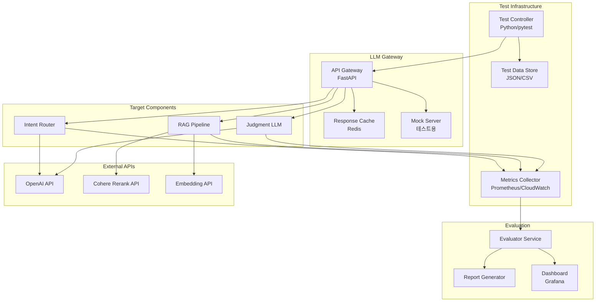

# E-2. LLMOps 테스트 환경 설계서

## 문서 정보
- **문서 ID**: E-2
- **버전**: 2.0 (V7 Intent + Orchestrator)
- **최종 수정일**: 2025-12-16
- **상태**: Active Development
- **관련 문서**:
  - B-3-3 V7 Intent Router 설계
  - B-3-4 Orchestrator 설계
  - B-6 AI/Agent Architecture
  - E-1 Advanced RAG Technology Roadmap
  - E-3 Intent Router Prototype

---

## 1. 개요

### 1.1 목적
최종 AI Factory Decision Engine 개발 전, Intent Router 및 핵심 LLM 컴포넌트의 성능/품질을 검증하기 위한 테스트 환경 설계.

### 1.2 테스트 대상 컴포넌트
```
┌─────────────────────────────────────────────────────────────────┐
│                    LLMOps 테스트 대상                            │
├─────────────────────────────────────────────────────────────────┤
│  Phase 1 (우선)                                                  │
│  ├── Intent Router: 발화 → Intent/Slot 분류                     │
│  ├── RAG Pipeline: Vector Search + Rerank                       │
│  └── Prompt 품질 평가                                            │
├─────────────────────────────────────────────────────────────────┤
│  Phase 2                                                         │
│  ├── Judgment LLM: Rule 보완 판단                               │
│  ├── BI Planner: 자연어 → 분석 계획                             │
│  └── CRAG (Corrective RAG)                                      │
├─────────────────────────────────────────────────────────────────┤
│  Phase 3                                                         │
│  ├── Multi-Agent Orchestration                                  │
│  ├── Workflow Planner                                           │
│  └── Learning Pipeline                                          │
└─────────────────────────────────────────────────────────────────┘
```

### 1.3 제약사항 (기존 논의 기반)
- **Cloud Only**: AWS 기반, GPU 없음
- **API-Based**: OpenAI API, Cohere Rerank API 사용
- **No ML Engineer**: API 기반 솔루션만 사용
- **Fast Iteration**: 빠른 기능 개발 우선

---

## 2. 테스트 환경 아키텍처

### 2.1 전체 구조



### 2.2 환경 구성

```yaml
# docker-compose.test.yml
version: '3.8'

services:
  # 테스트 컨트롤러
  test-controller:
    build: ./test-controller
    environment:
      - OPENAI_API_KEY=${OPENAI_API_KEY}
      - COHERE_API_KEY=${COHERE_API_KEY}
      - TEST_MODE=integration
    volumes:
      - ./test-data:/app/test-data
      - ./reports:/app/reports
    depends_on:
      - llm-gateway
      - redis
      - postgres

  # LLM Gateway (API 프록시 + 캐싱)
  llm-gateway:
    build: ./llm-gateway
    ports:
      - "8000:8000"
    environment:
      - REDIS_URL=redis://redis:6379
      - CACHE_ENABLED=true
      - MOCK_MODE=${MOCK_MODE:-false}
    depends_on:
      - redis

  # 캐시 (동일 요청 재사용으로 비용 절감)
  redis:
    image: redis:7-alpine
    ports:
      - "6379:6379"
    volumes:
      - redis-data:/data

  # 테스트 데이터 DB
  postgres:
    image: pgvector/pgvector:pg16
    environment:
      POSTGRES_DB: llmops_test
      POSTGRES_USER: test
      POSTGRES_PASSWORD: test
    ports:
      - "5432:5432"
    volumes:
      - ./init-db:/docker-entrypoint-initdb.d

  # 메트릭 수집
  prometheus:
    image: prom/prometheus
    ports:
      - "9090:9090"
    volumes:
      - ./prometheus.yml:/etc/prometheus/prometheus.yml

  # 대시보드
  grafana:
    image: grafana/grafana
    ports:
      - "3000:3000"
    volumes:
      - ./grafana-dashboards:/etc/grafana/provisioning/dashboards

volumes:
  redis-data:
  postgres-data:
```

---

## 3. Intent Router 테스트 설계

### 3.1 테스트 프레임워크

```
test-intent-router/
├── config/
│   ├── test_config.yaml        # 테스트 설정
│   ├── prompts/
│   │   └── intent_router_v1.txt  # 프롬프트 버전
│   └── models/
│       └── model_config.yaml    # 모델 설정
├── data/
│   ├── golden_set.json         # 정답 데이터셋 (500+건)
│   ├── edge_cases.json         # 엣지 케이스
│   ├── confusable_pairs.json   # 혼동 쌍
│   └── slot_extraction.json    # Slot 추출 테스트
├── src/
│   ├── intent_router.py        # Intent Router 구현
│   ├── evaluator.py            # 평가 로직
│   ├── metrics.py              # 메트릭 계산
│   └── reporter.py             # 리포트 생성
├── tests/
│   ├── test_accuracy.py        # 정확도 테스트
│   ├── test_latency.py         # 지연 시간 테스트
│   ├── test_cost.py            # 비용 테스트
│   └── test_robustness.py      # 강건성 테스트
└── reports/
    └── {date}_{version}/       # 테스트 리포트
```

### 3.2 Golden Dataset 구조

```json
{
  "version": "1.0",
  "created_at": "2025-01-15",
  "categories": {
    "quality": 150,
    "equipment": 100,
    "production": 100,
    "bi": 80,
    "workflow": 50,
    "system": 20
  },
  "test_cases": [
    {
      "id": "TC-INT-001",
      "category": "quality",
      "user_input": "L01 불량률 왜 올랐어?",
      "expected_intent": "defect_analysis",
      "expected_slots": {
        "line": "L01",
        "metric": "defect_rate"
      },
      "min_confidence": 0.85,
      "tags": ["basic", "quality", "analysis"],
      "difficulty": "easy"
    },
    {
      "id": "TC-INT-002",
      "category": "quality",
      "user_input": "지난주 품질 어땠어?",
      "expected_intent": "quality_check",
      "expected_slots": {
        "time_range": "last_week"
      },
      "min_confidence": 0.80,
      "tags": ["basic", "quality", "time"],
      "difficulty": "easy"
    },
    {
      "id": "TC-INT-050",
      "category": "quality",
      "user_input": "1라인 야간 불량 원인 분석해주고 차트도 보여줘",
      "expected_intent": "defect_analysis",
      "expected_slots": {
        "line": "L01",
        "shift": "N",
        "format": "chart"
      },
      "min_confidence": 0.75,
      "tags": ["complex", "multi-intent", "quality"],
      "difficulty": "hard",
      "notes": "복합 요청 - 분석 + 시각화"
    }
  ],
  "confusable_pairs": [
    {
      "intent_a": "quality_check",
      "intent_b": "defect_analysis",
      "examples": [
        {"input": "품질 상태 확인해줘", "correct": "quality_check"},
        {"input": "품질 왜 안좋아?", "correct": "defect_analysis"}
      ]
    },
    {
      "intent_a": "equipment_status",
      "intent_b": "equipment_anomaly",
      "examples": [
        {"input": "설비 상태 어때?", "correct": "equipment_status"},
        {"input": "설비 이상 없어?", "correct": "equipment_anomaly"}
      ]
    }
  ]
}
```

### 3.3 Intent Router 구현 (테스트용)

```python
# src/intent_router.py
import json
import time
from dataclasses import dataclass
from typing import Optional
import openai
from tenacity import retry, stop_after_attempt, wait_exponential

@dataclass
class IntentResult:
    intent: str
    confidence: float
    slots: dict
    ask_back: Optional[str]
    reason: str
    latency_ms: float
    tokens_used: int
    model: str
    raw_response: str

class IntentRouter:
    def __init__(self, config: dict):
        self.client = openai.OpenAI()
        self.model = config.get("model", "gpt-4.1-mini")
        self.temperature = config.get("temperature", 0.1)
        self.max_tokens = config.get("max_tokens", 1000)
        self.prompt_template = self._load_prompt(config.get("prompt_version", "v1"))

    def _load_prompt(self, version: str) -> str:
        with open(f"config/prompts/intent_router_{version}.txt") as f:
            return f.read()

    @retry(stop=stop_after_attempt(3), wait=wait_exponential(multiplier=1, min=1, max=10))
    def classify(
        self,
        user_message: str,
        context: Optional[dict] = None
    ) -> IntentResult:
        """Intent 분류 실행"""
        start_time = time.time()

        # 프롬프트 구성
        system_prompt = self.prompt_template
        user_prompt = self._build_user_prompt(user_message, context)

        # API 호출
        response = self.client.chat.completions.create(
            model=self.model,
            messages=[
                {"role": "system", "content": system_prompt},
                {"role": "user", "content": user_prompt}
            ],
            temperature=self.temperature,
            max_tokens=self.max_tokens,
            response_format={"type": "json_object"}
        )

        latency_ms = (time.time() - start_time) * 1000

        # 응답 파싱
        raw_content = response.choices[0].message.content
        parsed = self._parse_response(raw_content)

        return IntentResult(
            intent=parsed.get("intent", "unknown"),
            confidence=parsed.get("confidence", 0.0),
            slots=parsed.get("slots", {}),
            ask_back=parsed.get("ask_back"),
            reason=parsed.get("reason", ""),
            latency_ms=latency_ms,
            tokens_used=response.usage.total_tokens,
            model=self.model,
            raw_response=raw_content
        )

    def _build_user_prompt(self, message: str, context: Optional[dict]) -> str:
        ctx_str = ""
        if context:
            ctx_str = f"""
[CONTEXT]
- 현재 세션의 이전 intent: {context.get('previous_intents', [])}
- 사용자 최근 조회 라인: {context.get('recent_lines', [])}
- 사용자 역할: {context.get('user_role', 'operator')}
"""
        return f"[USER]\n{message}\n{ctx_str}"

    def _parse_response(self, content: str) -> dict:
        try:
            return json.loads(content)
        except json.JSONDecodeError:
            return {
                "intent": "unknown",
                "confidence": 0.0,
                "slots": {},
                "reason": "JSON parsing failed"
            }


class IntentRouterEvaluator:
    """Intent Router 평가기"""

    def __init__(self, router: IntentRouter):
        self.router = router
        self.results = []

    def evaluate_dataset(self, dataset_path: str) -> dict:
        """전체 데이터셋 평가"""
        with open(dataset_path) as f:
            dataset = json.load(f)

        metrics = {
            "total": 0,
            "correct_intent": 0,
            "correct_slots": 0,
            "above_min_confidence": 0,
            "latencies": [],
            "tokens": [],
            "by_category": {},
            "by_difficulty": {},
            "errors": []
        }

        for tc in dataset["test_cases"]:
            result = self._evaluate_single(tc)
            self.results.append(result)
            self._update_metrics(metrics, tc, result)

        # 집계 메트릭 계산
        metrics["intent_accuracy"] = metrics["correct_intent"] / metrics["total"]
        metrics["slot_accuracy"] = metrics["correct_slots"] / metrics["total"]
        metrics["confidence_pass_rate"] = metrics["above_min_confidence"] / metrics["total"]
        metrics["avg_latency_ms"] = sum(metrics["latencies"]) / len(metrics["latencies"])
        metrics["p95_latency_ms"] = sorted(metrics["latencies"])[int(len(metrics["latencies"]) * 0.95)]
        metrics["avg_tokens"] = sum(metrics["tokens"]) / len(metrics["tokens"])

        return metrics

    def _evaluate_single(self, test_case: dict) -> dict:
        """단일 테스트 케이스 평가"""
        try:
            result = self.router.classify(test_case["user_input"])

            intent_correct = result.intent == test_case["expected_intent"]
            slots_correct = self._compare_slots(
                result.slots,
                test_case["expected_slots"]
            )
            confidence_ok = result.confidence >= test_case.get("min_confidence", 0.7)

            return {
                "test_case_id": test_case["id"],
                "passed": intent_correct and slots_correct,
                "intent_correct": intent_correct,
                "slots_correct": slots_correct,
                "confidence_ok": confidence_ok,
                "expected_intent": test_case["expected_intent"],
                "actual_intent": result.intent,
                "expected_slots": test_case["expected_slots"],
                "actual_slots": result.slots,
                "confidence": result.confidence,
                "latency_ms": result.latency_ms,
                "tokens_used": result.tokens_used,
                "error": None
            }
        except Exception as e:
            return {
                "test_case_id": test_case["id"],
                "passed": False,
                "error": str(e)
            }

    def _compare_slots(self, actual: dict, expected: dict) -> bool:
        """Slot 비교 (부분 일치 허용)"""
        for key, value in expected.items():
            if key not in actual:
                return False
            if actual[key] != value:
                # 유연한 비교 (예: L01 == 1라인)
                if not self._fuzzy_slot_match(key, actual[key], value):
                    return False
        return True

    def _fuzzy_slot_match(self, slot_name: str, actual: str, expected: str) -> bool:
        """유연한 Slot 매칭"""
        # line 슬롯: L01, L1, 1라인 등 매칭
        if slot_name == "line":
            actual_norm = actual.upper().replace("라인", "").replace("LINE_", "L")
            expected_norm = expected.upper().replace("라인", "").replace("LINE_", "L")
            return actual_norm == expected_norm
        return actual == expected

    def _update_metrics(self, metrics: dict, tc: dict, result: dict):
        """메트릭 업데이트"""
        metrics["total"] += 1

        if result.get("intent_correct"):
            metrics["correct_intent"] += 1
        if result.get("slots_correct"):
            metrics["correct_slots"] += 1
        if result.get("confidence_ok"):
            metrics["above_min_confidence"] += 1

        if result.get("latency_ms"):
            metrics["latencies"].append(result["latency_ms"])
        if result.get("tokens_used"):
            metrics["tokens"].append(result["tokens_used"])

        # 카테고리별 집계
        category = tc.get("category", "unknown")
        if category not in metrics["by_category"]:
            metrics["by_category"][category] = {"total": 0, "correct": 0}
        metrics["by_category"][category]["total"] += 1
        if result.get("passed"):
            metrics["by_category"][category]["correct"] += 1

        # 난이도별 집계
        difficulty = tc.get("difficulty", "medium")
        if difficulty not in metrics["by_difficulty"]:
            metrics["by_difficulty"][difficulty] = {"total": 0, "correct": 0}
        metrics["by_difficulty"][difficulty]["total"] += 1
        if result.get("passed"):
            metrics["by_difficulty"][difficulty]["correct"] += 1

        if result.get("error"):
            metrics["errors"].append(result)
```

### 3.4 테스트 실행 스크립트

```python
# tests/test_accuracy.py
import pytest
import json
from pathlib import Path
from src.intent_router import IntentRouter, IntentRouterEvaluator

class TestIntentRouterAccuracy:
    """Intent Router 정확도 테스트"""

    @pytest.fixture
    def router(self):
        config = {
            "model": "gpt-4.1-mini",
            "temperature": 0.1,
            "prompt_version": "v1"
        }
        return IntentRouter(config)

    @pytest.fixture
    def evaluator(self, router):
        return IntentRouterEvaluator(router)

    def test_overall_accuracy(self, evaluator):
        """전체 정확도 테스트 - 목표: 90% 이상"""
        metrics = evaluator.evaluate_dataset("data/golden_set.json")

        assert metrics["intent_accuracy"] >= 0.90, \
            f"Intent 정확도 미달: {metrics['intent_accuracy']:.2%}"
        assert metrics["slot_accuracy"] >= 0.85, \
            f"Slot 정확도 미달: {metrics['slot_accuracy']:.2%}"

    def test_category_accuracy(self, evaluator):
        """카테고리별 정확도 - 각 카테고리 85% 이상"""
        metrics = evaluator.evaluate_dataset("data/golden_set.json")

        for category, stats in metrics["by_category"].items():
            accuracy = stats["correct"] / stats["total"]
            assert accuracy >= 0.85, \
                f"{category} 카테고리 정확도 미달: {accuracy:.2%}"

    def test_difficulty_accuracy(self, evaluator):
        """난이도별 정확도"""
        metrics = evaluator.evaluate_dataset("data/golden_set.json")

        difficulty_thresholds = {
            "easy": 0.95,
            "medium": 0.85,
            "hard": 0.75
        }

        for difficulty, threshold in difficulty_thresholds.items():
            if difficulty in metrics["by_difficulty"]:
                stats = metrics["by_difficulty"][difficulty]
                accuracy = stats["correct"] / stats["total"]
                assert accuracy >= threshold, \
                    f"{difficulty} 난이도 정확도 미달: {accuracy:.2%} (목표: {threshold:.0%})"

    def test_confusable_pairs(self, router):
        """혼동 쌍 구분 테스트"""
        with open("data/golden_set.json") as f:
            dataset = json.load(f)

        for pair in dataset.get("confusable_pairs", []):
            for example in pair["examples"]:
                result = router.classify(example["input"])
                assert result.intent == example["correct"], \
                    f"혼동 쌍 오분류: '{example['input']}' → " \
                    f"예상: {example['correct']}, 실제: {result.intent}"


class TestIntentRouterLatency:
    """Intent Router 지연 시간 테스트"""

    @pytest.fixture
    def router(self):
        config = {"model": "gpt-4.1-mini", "temperature": 0.1}
        return IntentRouter(config)

    def test_p95_latency(self, router):
        """P95 지연 시간 - 목표: 1.5초 이하"""
        evaluator = IntentRouterEvaluator(router)
        metrics = evaluator.evaluate_dataset("data/golden_set.json")

        assert metrics["p95_latency_ms"] <= 1500, \
            f"P95 지연 시간 초과: {metrics['p95_latency_ms']:.0f}ms"

    def test_avg_latency(self, router):
        """평균 지연 시간 - 목표: 800ms 이하"""
        evaluator = IntentRouterEvaluator(router)
        metrics = evaluator.evaluate_dataset("data/golden_set.json")

        assert metrics["avg_latency_ms"] <= 800, \
            f"평균 지연 시간 초과: {metrics['avg_latency_ms']:.0f}ms"


class TestIntentRouterCost:
    """Intent Router 비용 테스트"""

    def test_tokens_per_request(self):
        """요청당 토큰 사용량 - 목표: 1000 이하"""
        config = {"model": "gpt-4.1-mini", "temperature": 0.1}
        router = IntentRouter(config)
        evaluator = IntentRouterEvaluator(router)
        metrics = evaluator.evaluate_dataset("data/golden_set.json")

        assert metrics["avg_tokens"] <= 1000, \
            f"평균 토큰 사용량 초과: {metrics['avg_tokens']:.0f}"

    def test_daily_cost_estimate(self):
        """일일 비용 추정 - 목표: $50 이하 (10,000 requests 기준)"""
        config = {"model": "gpt-4.1-mini", "temperature": 0.1}
        router = IntentRouter(config)
        evaluator = IntentRouterEvaluator(router)
        metrics = evaluator.evaluate_dataset("data/golden_set.json")

        # GPT-4.1-mini 가격 기준 (input: $0.15/1M, output: $0.60/1M)
        avg_tokens = metrics["avg_tokens"]
        input_tokens = avg_tokens * 0.7  # 추정
        output_tokens = avg_tokens * 0.3

        cost_per_request = (input_tokens * 0.15 + output_tokens * 0.60) / 1_000_000
        daily_cost = cost_per_request * 10_000

        assert daily_cost <= 50, f"일일 비용 초과 추정: ${daily_cost:.2f}"
```

### 3.5 성능 테스트 (Load Test)

```python
# tests/test_load.py
import asyncio
import aiohttp
import time
from dataclasses import dataclass
from typing import List
import statistics

@dataclass
class LoadTestResult:
    total_requests: int
    successful_requests: int
    failed_requests: int
    avg_latency_ms: float
    p50_latency_ms: float
    p95_latency_ms: float
    p99_latency_ms: float
    requests_per_second: float
    duration_seconds: float

class LoadTester:
    """부하 테스트 실행기"""

    def __init__(self, base_url: str):
        self.base_url = base_url

    async def run_load_test(
        self,
        test_cases: List[dict],
        concurrent_users: int = 10,
        duration_seconds: int = 60
    ) -> LoadTestResult:
        """부하 테스트 실행"""

        latencies = []
        errors = []
        start_time = time.time()

        async with aiohttp.ClientSession() as session:
            tasks = []
            while time.time() - start_time < duration_seconds:
                for _ in range(concurrent_users):
                    tc = test_cases[len(tasks) % len(test_cases)]
                    task = asyncio.create_task(
                        self._make_request(session, tc, latencies, errors)
                    )
                    tasks.append(task)
                await asyncio.sleep(0.1)  # 100ms 간격

            await asyncio.gather(*tasks)

        duration = time.time() - start_time

        return LoadTestResult(
            total_requests=len(latencies) + len(errors),
            successful_requests=len(latencies),
            failed_requests=len(errors),
            avg_latency_ms=statistics.mean(latencies) if latencies else 0,
            p50_latency_ms=statistics.median(latencies) if latencies else 0,
            p95_latency_ms=self._percentile(latencies, 95) if latencies else 0,
            p99_latency_ms=self._percentile(latencies, 99) if latencies else 0,
            requests_per_second=len(latencies) / duration,
            duration_seconds=duration
        )

    async def _make_request(
        self,
        session: aiohttp.ClientSession,
        test_case: dict,
        latencies: list,
        errors: list
    ):
        start = time.time()
        try:
            async with session.post(
                f"{self.base_url}/api/v1/intent/classify",
                json={"message": test_case["user_input"]},
                timeout=aiohttp.ClientTimeout(total=10)
            ) as response:
                if response.status == 200:
                    latencies.append((time.time() - start) * 1000)
                else:
                    errors.append({"status": response.status, "case": test_case["id"]})
        except Exception as e:
            errors.append({"error": str(e), "case": test_case["id"]})

    def _percentile(self, data: list, p: int) -> float:
        sorted_data = sorted(data)
        index = int(len(sorted_data) * p / 100)
        return sorted_data[min(index, len(sorted_data) - 1)]


# 부하 테스트 실행
async def main():
    import json

    with open("data/golden_set.json") as f:
        dataset = json.load(f)

    tester = LoadTester("http://localhost:8000")

    # 시나리오 1: 동시 사용자 10명, 1분
    result = await tester.run_load_test(
        test_cases=dataset["test_cases"],
        concurrent_users=10,
        duration_seconds=60
    )

    print(f"""
    === Load Test Results ===
    Total Requests: {result.total_requests}
    Successful: {result.successful_requests}
    Failed: {result.failed_requests}

    Latency:
      Avg: {result.avg_latency_ms:.0f}ms
      P50: {result.p50_latency_ms:.0f}ms
      P95: {result.p95_latency_ms:.0f}ms
      P99: {result.p99_latency_ms:.0f}ms

    Throughput: {result.requests_per_second:.1f} req/s
    Duration: {result.duration_seconds:.1f}s
    """)

if __name__ == "__main__":
    asyncio.run(main())
```

---

## 4. RAG Pipeline 테스트 설계

### 4.1 RAG 테스트 구성요소

```
test-rag-pipeline/
├── data/
│   ├── documents/              # 테스트용 문서
│   │   ├── sop/               # 표준작업절차
│   │   ├── manuals/           # 설비 매뉴얼
│   │   └── cases/             # 사례 데이터
│   ├── queries/
│   │   └── rag_test_queries.json  # 테스트 쿼리셋
│   └── ground_truth/
│       └── relevance_labels.json  # 관련성 정답
├── src/
│   ├── rag_pipeline.py         # RAG 구현
│   ├── hybrid_search.py        # Hybrid Search
│   ├── reranker.py             # Cohere Rerank
│   └── evaluator.py            # RAGAS 평가
└── tests/
    ├── test_retrieval.py       # 검색 정확도
    ├── test_reranker.py        # Rerank 효과
    └── test_end_to_end.py      # E2E RAG 테스트
```

### 4.2 RAG 평가 메트릭

```python
# src/rag_evaluator.py
from dataclasses import dataclass
from typing import List
import numpy as np

@dataclass
class RAGMetrics:
    # Retrieval 메트릭
    recall_at_k: float          # 상위 K개 중 관련 문서 포함율
    precision_at_k: float       # 상위 K개의 정밀도
    mrr: float                  # Mean Reciprocal Rank
    ndcg: float                 # Normalized DCG

    # RAG 품질 메트릭 (RAGAS)
    faithfulness: float         # 생성 답변의 문서 기반 충실도
    answer_relevancy: float     # 질문-답변 관련성
    context_precision: float    # 컨텍스트 정밀도
    context_recall: float       # 컨텍스트 재현율

class RAGEvaluator:
    """RAG 파이프라인 평가기"""

    def __init__(self, llm_client, embedding_model):
        self.llm = llm_client
        self.embedder = embedding_model

    def evaluate_retrieval(
        self,
        queries: List[str],
        retrieved_docs: List[List[dict]],
        ground_truth: List[List[str]],
        k: int = 5
    ) -> dict:
        """검색 품질 평가"""

        recalls = []
        precisions = []
        mrrs = []

        for query, docs, truth in zip(queries, retrieved_docs, ground_truth):
            retrieved_ids = [d["id"] for d in docs[:k]]

            # Recall@K
            hits = len(set(retrieved_ids) & set(truth))
            recalls.append(hits / len(truth) if truth else 0)

            # Precision@K
            precisions.append(hits / k)

            # MRR
            for rank, doc_id in enumerate(retrieved_ids, 1):
                if doc_id in truth:
                    mrrs.append(1 / rank)
                    break
            else:
                mrrs.append(0)

        return {
            "recall_at_k": np.mean(recalls),
            "precision_at_k": np.mean(precisions),
            "mrr": np.mean(mrrs)
        }

    def evaluate_reranker_lift(
        self,
        queries: List[str],
        initial_docs: List[List[dict]],
        reranked_docs: List[List[dict]],
        ground_truth: List[List[str]]
    ) -> dict:
        """Reranker 효과 측정"""

        initial_metrics = self.evaluate_retrieval(
            queries, initial_docs, ground_truth
        )
        reranked_metrics = self.evaluate_retrieval(
            queries, reranked_docs, ground_truth
        )

        return {
            "initial": initial_metrics,
            "reranked": reranked_metrics,
            "lift": {
                "recall_lift": reranked_metrics["recall_at_k"] - initial_metrics["recall_at_k"],
                "precision_lift": reranked_metrics["precision_at_k"] - initial_metrics["precision_at_k"],
                "mrr_lift": reranked_metrics["mrr"] - initial_metrics["mrr"]
            }
        }

    async def evaluate_ragas(
        self,
        questions: List[str],
        answers: List[str],
        contexts: List[List[str]],
        ground_truths: List[str]
    ) -> RAGMetrics:
        """RAGAS 메트릭 평가"""

        # Faithfulness: 답변이 컨텍스트에 기반하는지
        faithfulness_scores = []
        for answer, context in zip(answers, contexts):
            score = await self._evaluate_faithfulness(answer, context)
            faithfulness_scores.append(score)

        # Answer Relevancy: 답변이 질문에 관련있는지
        relevancy_scores = []
        for question, answer in zip(questions, answers):
            score = await self._evaluate_relevancy(question, answer)
            relevancy_scores.append(score)

        # Context Precision: 검색된 컨텍스트의 정밀도
        precision_scores = []
        for question, context, truth in zip(questions, contexts, ground_truths):
            score = await self._evaluate_context_precision(question, context, truth)
            precision_scores.append(score)

        # Context Recall: 필요한 정보가 컨텍스트에 있는지
        recall_scores = []
        for context, truth in zip(contexts, ground_truths):
            score = await self._evaluate_context_recall(context, truth)
            recall_scores.append(score)

        return RAGMetrics(
            recall_at_k=0,  # retrieval에서 계산
            precision_at_k=0,
            mrr=0,
            ndcg=0,
            faithfulness=np.mean(faithfulness_scores),
            answer_relevancy=np.mean(relevancy_scores),
            context_precision=np.mean(precision_scores),
            context_recall=np.mean(recall_scores)
        )

    async def _evaluate_faithfulness(self, answer: str, context: List[str]) -> float:
        """답변 충실도 평가 (LLM-as-Judge)"""
        prompt = f"""
        주어진 컨텍스트와 답변을 비교하여, 답변이 컨텍스트에 기반한 정도를 평가하세요.

        컨텍스트:
        {chr(10).join(context)}

        답변:
        {answer}

        답변의 각 주장이 컨텍스트에서 뒷받침되는지 평가하고,
        0.0 ~ 1.0 사이의 점수를 JSON으로 반환하세요.
        {{"faithfulness_score": 0.0~1.0, "reasoning": "..."}}
        """

        response = await self.llm.chat.completions.create(
            model="gpt-4.1-mini",
            messages=[{"role": "user", "content": prompt}],
            response_format={"type": "json_object"}
        )

        import json
        result = json.loads(response.choices[0].message.content)
        return result.get("faithfulness_score", 0.5)

    async def _evaluate_relevancy(self, question: str, answer: str) -> float:
        """질문-답변 관련성 평가"""
        prompt = f"""
        질문과 답변의 관련성을 평가하세요.

        질문: {question}
        답변: {answer}

        답변이 질문에 직접적으로 대응하는지 평가하고,
        0.0 ~ 1.0 사이의 점수를 JSON으로 반환하세요.
        {{"relevancy_score": 0.0~1.0, "reasoning": "..."}}
        """

        response = await self.llm.chat.completions.create(
            model="gpt-4.1-mini",
            messages=[{"role": "user", "content": prompt}],
            response_format={"type": "json_object"}
        )

        import json
        result = json.loads(response.choices[0].message.content)
        return result.get("relevancy_score", 0.5)
```

### 4.3 Hybrid Search + Rerank 테스트

```python
# tests/test_hybrid_search.py
import pytest
from src.hybrid_search import HybridSearcher
from src.reranker import CohereReranker

class TestHybridSearch:
    """Hybrid Search 테스트"""

    @pytest.fixture
    def searcher(self):
        return HybridSearcher(
            vector_weight=0.7,
            keyword_weight=0.3,
            use_rrf=True
        )

    @pytest.fixture
    def reranker(self):
        return CohereReranker(model="rerank-v3.5")

    def test_vector_vs_hybrid_comparison(self, searcher):
        """Vector Search vs Hybrid Search 비교"""
        queries = [
            "L01 불량률 3% 초과 시 조치",
            "설비 진동 이상 판단 기준",
            "CCP 온도 범위"
        ]

        for query in queries:
            vector_results = searcher.search(query, mode="vector")
            hybrid_results = searcher.search(query, mode="hybrid")

            # Hybrid가 더 다양한 결과를 반환하는지 확인
            vector_sources = set(r["source_type"] for r in vector_results[:5])
            hybrid_sources = set(r["source_type"] for r in hybrid_results[:5])

            print(f"Query: {query}")
            print(f"  Vector sources: {vector_sources}")
            print(f"  Hybrid sources: {hybrid_sources}")

    def test_reranker_improvement(self, searcher, reranker):
        """Reranker 적용 효과 테스트"""
        with open("data/queries/rag_test_queries.json") as f:
            test_data = json.load(f)

        improvements = []

        for tc in test_data["queries"]:
            # 초기 검색
            initial_results = searcher.search(tc["query"], top_k=20)

            # Rerank
            reranked_results = reranker.rerank(
                query=tc["query"],
                documents=initial_results,
                top_k=5
            )

            # 정답 문서가 상위 5개에 포함되는지 확인
            initial_top5 = [r["id"] for r in initial_results[:5]]
            reranked_top5 = [r["id"] for r in reranked_results[:5]]
            ground_truth = tc["relevant_docs"]

            initial_hits = len(set(initial_top5) & set(ground_truth))
            reranked_hits = len(set(reranked_top5) & set(ground_truth))

            improvements.append(reranked_hits - initial_hits)

        avg_improvement = sum(improvements) / len(improvements)
        assert avg_improvement >= 0, "Reranker가 검색 품질을 저하시킴"
        print(f"평균 개선: {avg_improvement:.2f} hits")
```

---

## 5. 테스트 자동화 파이프라인

### 5.1 CI/CD 파이프라인

```yaml
# .github/workflows/llmops-test.yml
name: LLMOps Test Pipeline

on:
  push:
    branches: [main, develop]
    paths:
      - 'src/intent_router/**'
      - 'src/rag/**'
      - 'config/prompts/**'
  pull_request:
    branches: [main]
  schedule:
    - cron: '0 9 * * *'  # 매일 09:00 UTC

env:
  OPENAI_API_KEY: ${{ secrets.OPENAI_API_KEY }}
  COHERE_API_KEY: ${{ secrets.COHERE_API_KEY }}

jobs:
  unit-tests:
    runs-on: ubuntu-latest
    steps:
      - uses: actions/checkout@v4

      - name: Set up Python
        uses: actions/setup-python@v5
        with:
          python-version: '3.11'

      - name: Install dependencies
        run: |
          pip install -r requirements-test.txt

      - name: Run unit tests (mocked)
        run: |
          pytest tests/unit/ -v --tb=short

  integration-tests:
    runs-on: ubuntu-latest
    needs: unit-tests
    services:
      redis:
        image: redis:7-alpine
        ports:
          - 6379:6379
      postgres:
        image: pgvector/pgvector:pg16
        env:
          POSTGRES_DB: llmops_test
          POSTGRES_USER: test
          POSTGRES_PASSWORD: test
        ports:
          - 5432:5432

    steps:
      - uses: actions/checkout@v4

      - name: Set up Python
        uses: actions/setup-python@v5
        with:
          python-version: '3.11'

      - name: Install dependencies
        run: pip install -r requirements-test.txt

      - name: Run Intent Router tests
        run: |
          pytest tests/test_accuracy.py -v \
            --junitxml=reports/intent-router.xml

      - name: Run RAG tests
        run: |
          pytest tests/test_rag.py -v \
            --junitxml=reports/rag.xml

      - name: Upload test reports
        uses: actions/upload-artifact@v4
        with:
          name: test-reports
          path: reports/

  performance-tests:
    runs-on: ubuntu-latest
    needs: integration-tests
    if: github.event_name == 'schedule' || github.event_name == 'workflow_dispatch'

    steps:
      - uses: actions/checkout@v4

      - name: Start test environment
        run: docker-compose -f docker-compose.test.yml up -d

      - name: Wait for services
        run: sleep 30

      - name: Run load tests
        run: |
          python tests/test_load.py \
            --duration 300 \
            --concurrent-users 20 \
            --report reports/load-test.json

      - name: Upload performance report
        uses: actions/upload-artifact@v4
        with:
          name: performance-reports
          path: reports/load-test.json

  report:
    runs-on: ubuntu-latest
    needs: [integration-tests, performance-tests]
    if: always()

    steps:
      - name: Download all reports
        uses: actions/download-artifact@v4

      - name: Generate summary report
        run: |
          python scripts/generate_report.py \
            --input reports/ \
            --output summary.md

      - name: Post to Slack
        if: failure()
        uses: slackapi/slack-github-action@v1
        with:
          payload: |
            {
              "text": "LLMOps 테스트 실패",
              "blocks": [
                {
                  "type": "section",
                  "text": {
                    "type": "mrkdwn",
                    "text": "*LLMOps Test Failed*\nBranch: ${{ github.ref }}\nCommit: ${{ github.sha }}"
                  }
                }
              ]
            }
```

### 5.2 테스트 리포트 생성

```python
# scripts/generate_report.py
import json
from datetime import datetime
from pathlib import Path

def generate_report(results_dir: str, output_path: str):
    """테스트 결과 요약 리포트 생성"""

    report = {
        "generated_at": datetime.now().isoformat(),
        "summary": {},
        "details": {}
    }

    # Intent Router 결과
    intent_results = load_json(f"{results_dir}/intent-router.json")
    report["summary"]["intent_router"] = {
        "accuracy": intent_results.get("intent_accuracy", 0),
        "slot_accuracy": intent_results.get("slot_accuracy", 0),
        "p95_latency_ms": intent_results.get("p95_latency_ms", 0),
        "status": "PASS" if intent_results.get("intent_accuracy", 0) >= 0.9 else "FAIL"
    }

    # RAG 결과
    rag_results = load_json(f"{results_dir}/rag.json")
    report["summary"]["rag_pipeline"] = {
        "recall_at_5": rag_results.get("recall_at_k", 0),
        "faithfulness": rag_results.get("faithfulness", 0),
        "reranker_lift": rag_results.get("reranker_lift", {}).get("mrr_lift", 0),
        "status": "PASS" if rag_results.get("recall_at_k", 0) >= 0.8 else "FAIL"
    }

    # 성능 결과
    perf_results = load_json(f"{results_dir}/load-test.json")
    if perf_results:
        report["summary"]["performance"] = {
            "requests_per_second": perf_results.get("requests_per_second", 0),
            "p95_latency_ms": perf_results.get("p95_latency_ms", 0),
            "error_rate": perf_results.get("failed_requests", 0) /
                         max(perf_results.get("total_requests", 1), 1),
            "status": "PASS" if perf_results.get("p95_latency_ms", 9999) <= 2000 else "FAIL"
        }

    # Markdown 리포트 생성
    md_report = generate_markdown(report)

    with open(output_path, "w") as f:
        f.write(md_report)

    return report

def generate_markdown(report: dict) -> str:
    """Markdown 형식 리포트 생성"""

    summary = report["summary"]

    md = f"""# LLMOps Test Report
Generated: {report["generated_at"]}

## Summary

| Component | Status | Key Metrics |
|-----------|--------|-------------|
| Intent Router | {summary.get("intent_router", {}).get("status", "N/A")} | Accuracy: {summary.get("intent_router", {}).get("accuracy", 0):.1%}, P95: {summary.get("intent_router", {}).get("p95_latency_ms", 0):.0f}ms |
| RAG Pipeline | {summary.get("rag_pipeline", {}).get("status", "N/A")} | Recall@5: {summary.get("rag_pipeline", {}).get("recall_at_5", 0):.1%}, Faithfulness: {summary.get("rag_pipeline", {}).get("faithfulness", 0):.1%} |
| Performance | {summary.get("performance", {}).get("status", "N/A")} | {summary.get("performance", {}).get("requests_per_second", 0):.1f} req/s, P95: {summary.get("performance", {}).get("p95_latency_ms", 0):.0f}ms |

## Quality Gates

### Intent Router
- ✅ Intent 정확도 ≥ 90%: {summary.get("intent_router", {}).get("accuracy", 0):.1%}
- ✅ Slot 정확도 ≥ 85%: {summary.get("intent_router", {}).get("slot_accuracy", 0):.1%}
- ✅ P95 지연 ≤ 1.5s: {summary.get("intent_router", {}).get("p95_latency_ms", 0):.0f}ms

### RAG Pipeline
- ✅ Recall@5 ≥ 80%: {summary.get("rag_pipeline", {}).get("recall_at_5", 0):.1%}
- ✅ Faithfulness ≥ 85%: {summary.get("rag_pipeline", {}).get("faithfulness", 0):.1%}
- ✅ Reranker Lift > 0: {summary.get("rag_pipeline", {}).get("reranker_lift", 0):.2f}

### Performance
- ✅ Throughput ≥ 10 req/s: {summary.get("performance", {}).get("requests_per_second", 0):.1f} req/s
- ✅ P95 Latency ≤ 2s: {summary.get("performance", {}).get("p95_latency_ms", 0):.0f}ms
- ✅ Error Rate < 1%: {summary.get("performance", {}).get("error_rate", 0):.2%}
"""

    return md
```

---

## 6. 테스트 환경 구축 체크리스트

### 6.1 Phase 1: 기본 환경 (1주차)

```markdown
## Week 1 체크리스트

### 인프라 설정
- [ ] Docker Compose 환경 구성
- [ ] Redis 캐시 설정
- [ ] PostgreSQL + pgvector 설치
- [ ] Prometheus + Grafana 설정

### API 연동
- [ ] OpenAI API 키 설정 및 테스트
- [ ] Cohere API 키 설정 및 테스트
- [ ] API Gateway 프록시 구현
- [ ] 응답 캐싱 구현

### 테스트 데이터
- [ ] Golden Dataset 초기 버전 작성 (100건)
- [ ] Intent 카테고리별 샘플 분배
- [ ] Confusable pairs 정의
- [ ] RAG 테스트용 문서 준비
```

### 6.2 Phase 2: 테스트 구현 (2주차)

```markdown
## Week 2 체크리스트

### Intent Router 테스트
- [ ] IntentRouter 클래스 구현
- [ ] IntentRouterEvaluator 구현
- [ ] 정확도 테스트 작성
- [ ] 지연 시간 테스트 작성
- [ ] 비용 테스트 작성

### RAG Pipeline 테스트
- [ ] HybridSearcher 구현
- [ ] CohereReranker 통합
- [ ] RAGEvaluator 구현
- [ ] RAGAS 메트릭 구현

### CI/CD 파이프라인
- [ ] GitHub Actions 워크플로우 설정
- [ ] 테스트 자동화 구성
- [ ] 리포트 생성 스크립트
- [ ] Slack 알림 연동
```

### 6.3 Phase 3: 최적화 (3주차)

```markdown
## Week 3 체크리스트

### 성능 최적화
- [ ] 프롬프트 최적화 (토큰 절감)
- [ ] 캐시 히트율 개선
- [ ] 배치 처리 구현
- [ ] 비동기 처리 최적화

### 데이터셋 확장
- [ ] Golden Dataset 500건으로 확장
- [ ] Edge case 추가
- [ ] 다국어 테스트 케이스 (선택)

### 모니터링
- [ ] 대시보드 구성
- [ ] 알람 설정
- [ ] 비용 모니터링
- [ ] 일일 리포트 자동화
```

---

## 7. 성능 목표 및 SLO

### 7.1 Intent Router SLO

| 메트릭 | 목표 | 경고 임계 | 위험 임계 |
|--------|------|----------|----------|
| Intent 정확도 | ≥ 90% | < 88% | < 85% |
| Slot 정확도 | ≥ 85% | < 82% | < 78% |
| P95 지연 시간 | ≤ 1.5s | > 2.0s | > 3.0s |
| 평균 지연 시간 | ≤ 800ms | > 1.0s | > 1.5s |
| 파싱 실패율 | < 0.5% | > 1% | > 2% |
| 일일 비용 | < $50 | > $60 | > $80 |

### 7.2 RAG Pipeline SLO

| 메트릭 | 목표 | 경고 임계 | 위험 임계 |
|--------|------|----------|----------|
| Recall@5 | ≥ 80% | < 75% | < 70% |
| Precision@5 | ≥ 70% | < 65% | < 60% |
| MRR | ≥ 0.6 | < 0.55 | < 0.5 |
| Faithfulness | ≥ 85% | < 80% | < 75% |
| 검색 지연 | ≤ 500ms | > 700ms | > 1s |
| Rerank 지연 | ≤ 300ms | > 400ms | > 500ms |

### 7.3 전체 시스템 SLO

| 메트릭 | 목표 | 측정 방법 |
|--------|------|----------|
| 가용성 | 99.5% | 성공 응답 / 전체 요청 |
| 처리량 | ≥ 10 req/s | 부하 테스트 |
| E2E 지연 | ≤ 3s | Intent → RAG → 응답 |
| 일일 예산 | < $100 | API 비용 합계 |

---

## 8. 다음 단계

### 8.1 테스트 환경 구축 후 진행 사항

1. **프롬프트 A/B 테스트**: 다양한 프롬프트 버전 비교
2. **모델 비교**: GPT-4.1 vs GPT-4.1-mini vs Claude Haiku
3. **Reranker 비교**: Cohere vs BGE-Reranker vs Cross-Encoder
4. **CRAG 프로토타입**: 자기검증 파이프라인 테스트

### 8.2 다음 문서

- `E-3_Intent_Router_Prototype.md`: Intent Router 상세 구현
- `E-4_Performance_Test_Plan.md`: 성능 테스트 상세 계획
- `E-5_Prompt_Engineering_Guide.md`: 프롬프트 최적화 가이드

---

## 문서 이력

| 버전 | 일자 | 작성자 | 변경 내용 |
|------|------|--------|-----------|
| 1.0 | 2025-12-14 | AI Factory Team | 초기 LLMOps 테스트 환경 설계 |
| 2.0 | 2025-12-16 | AI Factory Team | V7 Intent + Orchestrator 테스트 환경 확장: V7 Intent 14개 체계 테스트 케이스 추가, Claude 모델 계열 (Haiku 500토큰, Sonnet 1500토큰, Opus 3000토큰) 테스트 전략, Orchestrator Plan 생성/실행 테스트 시나리오, 15노드 타입별 단위/통합 테스트 설계 |
