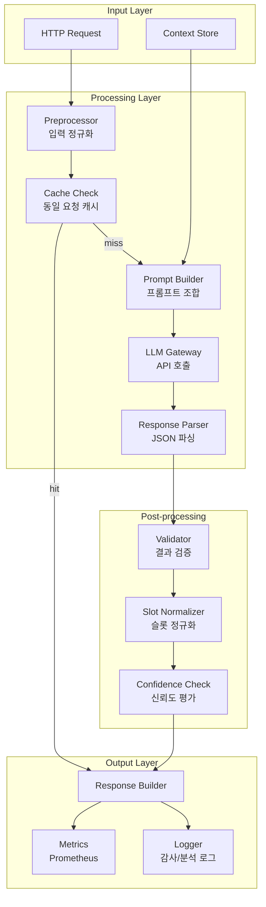

# E-3. Intent Router 프로토타입 설계서

## 문서 정보
- **문서 ID**: E-3
- **버전**: 3.0 (V7 Intent + Orchestrator)
- **최종 수정일**: 2025-12-16
- **상태**: Prototype Implementation
- **관련 문서**:
  - B-3-3 V7 Intent Router 설계
  - B-3-4 Orchestrator 설계
  - B-6 AI/Agent Architecture
  - E-2 LLMOps Test Environment Design
  - E-4 Performance Test Plan

---

## 1. 개요

### 1.1 목적
Intent Router는 사용자의 자연어 발화를 분석하여 의도(Intent)와 파라미터(Slot)를 추출하는 핵심 컴포넌트입니다. 본 문서는 LLMOps 테스트를 위한 Intent Router 프로토타입의 상세 설계를 정의합니다.

### 1.2 설계 원칙
- **Simple First**: 최소 기능으로 시작, 점진적 확장
- **Testable**: 모든 컴포넌트는 독립적으로 테스트 가능
- **Observable**: 모든 결정 과정을 로깅하고 추적 가능
- **Cost-Aware**: API 비용 모니터링 및 최적화 내장

### 1.3 범위

```
┌─────────────────────────────────────────────────────────────────┐
│                    Phase 1 프로토타입 범위                        │
├─────────────────────────────────────────────────────────────────┤
│  ✅ 포함                                                         │
│  ├── Intent 분류 (30개 Intent)                                  │
│  ├── Slot 추출 (13개 Slot 타입)                                 │
│  ├── Confidence 기반 라우팅                                     │
│  ├── Ask-back (정보 부족 시 확인 질문)                          │
│  └── 기본 컨텍스트 활용 (이전 Intent, 기본 라인)                │
├─────────────────────────────────────────────────────────────────┤
│  ❌ 제외 (Phase 2 이후)                                          │
│  ├── Multi-turn 대화 관리                                       │
│  ├── CRAG (자기검증)                                            │
│  ├── 동적 Few-shot 선택                                         │
│  └── 다국어 지원                                                │
└─────────────────────────────────────────────────────────────────┘
```

---

## 2. 아키텍처

### 2.1 전체 구조



### 2.2 컴포넌트 상세

```
intent-router/
├── src/
│   ├── __init__.py
│   ├── main.py                 # FastAPI 애플리케이션
│   ├── config.py               # 설정 관리
│   ├── models/
│   │   ├── __init__.py
│   │   ├── request.py          # 요청 모델
│   │   ├── response.py         # 응답 모델
│   │   └── intent.py           # Intent/Slot 정의
│   ├── core/
│   │   ├── __init__.py
│   │   ├── router.py           # IntentRouter 메인 클래스
│   │   ├── preprocessor.py     # 입력 전처리
│   │   ├── prompt_builder.py   # 프롬프트 생성
│   │   ├── llm_gateway.py      # LLM API 호출
│   │   ├── parser.py           # 응답 파싱
│   │   ├── validator.py        # 결과 검증
│   │   └── slot_normalizer.py  # 슬롯 정규화
│   ├── cache/
│   │   ├── __init__.py
│   │   └── redis_cache.py      # Redis 캐시
│   └── observability/
│       ├── __init__.py
│       ├── logger.py           # 구조화 로깅
│       └── metrics.py          # Prometheus 메트릭
├── config/
│   ├── prompts/
│   │   ├── intent_router_v1.txt
│   │   └── intent_router_v2.txt
│   ├── intents.yaml            # Intent 정의
│   └── slots.yaml              # Slot 정의
├── tests/
│   ├── unit/
│   ├── integration/
│   └── fixtures/
├── Dockerfile
├── docker-compose.yml
├── requirements.txt
└── pyproject.toml
```

---

## 3. 데이터 모델

### 3.1 Intent 정의

```yaml
# config/intents.yaml
version: "1.0"
intents:
  # 품질 관련
  quality_check:
    name: "품질 상태 확인"
    description: "라인/제품 품질 현황 조회"
    keywords: ["품질", "불량률", "상태", "어때"]
    required_slots: []
    optional_slots: ["line", "product", "shift", "date", "time_range"]
    default_slots:
      time_range: "today"
    examples:
      - "품질 상태 어때?"
      - "오늘 불량률 확인해줘"
      - "L01 품질 현황"
    route_to: "quality_agent"

  defect_analysis:
    name: "불량 원인 분석"
    description: "불량 발생 원인 심층 분석"
    keywords: ["왜", "원인", "분석", "이유"]
    required_slots: []
    optional_slots: ["line", "product", "date_range", "shift"]
    default_slots:
      time_range: "last_7d"
    examples:
      - "왜 불량이 늘었어?"
      - "불량 원인 분석해줘"
      - "L01 불량 왜 올랐어?"
    route_to: "quality_agent"
    priority: 1  # 동시 매칭 시 우선순위

  ccp_status:
    name: "CCP 상태 확인"
    description: "HACCP CCP 포인트 상태"
    keywords: ["CCP", "HACCP", "온도", "위생"]
    required_slots: []
    optional_slots: ["line", "equipment", "date"]
    examples:
      - "CCP 이상 없어?"
      - "온도 CCP 확인"
    route_to: "quality_agent"

  # 설비 관련
  equipment_status:
    name: "설비 상태 확인"
    description: "설비 가동/이상 현황"
    keywords: ["설비", "장비", "상태", "가동"]
    required_slots: []
    optional_slots: ["equipment", "line"]
    examples:
      - "설비 상태 확인"
      - "E001 정상이야?"
    route_to: "equipment_agent"

  equipment_anomaly:
    name: "설비 이상 탐지"
    description: "이상 징후 분석"
    keywords: ["이상", "진동", "소음", "고장"]
    required_slots: []
    optional_slots: ["equipment", "line", "date_range"]
    examples:
      - "진동 이상 없어?"
      - "설비 이상 감지해줘"
    route_to: "equipment_agent"

  # 생산 관련
  production_status:
    name: "생산 현황 확인"
    description: "실시간 생산 상태"
    keywords: ["생산", "생산량", "가동률", "실적"]
    required_slots: []
    optional_slots: ["line", "product", "date", "shift"]
    examples:
      - "오늘 생산량 얼마야?"
      - "L01 가동률 확인"
    route_to: "production_agent"

  # BI 관련
  bi_summary:
    name: "요약 리포트"
    description: "종합 현황 요약"
    keywords: ["요약", "리포트", "현황", "전체"]
    required_slots: []
    optional_slots: ["date_range", "line", "format"]
    default_slots:
      time_range: "last_week"
    examples:
      - "지난주 요약해줘"
      - "일일 리포트"
    route_to: "bi_service"

  bi_chart:
    name: "차트 조회"
    description: "특정 지표 시각화"
    keywords: ["차트", "그래프", "보여줘", "시각화"]
    required_slots: ["metric"]
    optional_slots: ["line", "date_range", "format"]
    examples:
      - "불량 추이 차트 보여줘"
      - "OEE 그래프"
    route_to: "bi_service"

  # 워크플로우 관련
  workflow_create:
    name: "워크플로우 생성"
    description: "새 자동화 규칙 생성"
    keywords: ["알려줘", "알림", "만들어", "설정해"]
    trigger_patterns:
      - ".*넘으면.*알려.*"
      - ".*되면.*알림.*"
    required_slots: ["metric", "threshold"]
    optional_slots: ["line", "channel"]
    default_slots:
      channel: "slack"
    examples:
      - "온도 60도 넘으면 알려줘"
      - "불량률 3% 넘으면 슬랙으로 알림"
    route_to: "workflow_service"

  # 시스템 관련
  help:
    name: "도움말"
    description: "사용법 안내"
    keywords: ["도움말", "도움", "뭐", "할 수 있"]
    examples:
      - "뭘 할 수 있어?"
      - "도움말"
    route_to: "system"

  greeting:
    name: "인사"
    description: "인사/잡담"
    keywords: ["안녕", "고마워", "수고", "반가워"]
    examples:
      - "안녕"
      - "고마워"
    route_to: "system"

  unknown:
    name: "미분류"
    description: "분류 불가"
    route_to: "fallback"
```

### 3.2 Slot 정의

```yaml
# config/slots.yaml
version: "1.0"
slots:
  line:
    type: string
    description: "라인 코드"
    patterns:
      - "L[0-9]+"
      - "LINE_[A-Z]+"
      - "[0-9]+라인"
    normalization:
      "1라인": "L01"
      "2라인": "L02"
      "라인1": "L01"
      "LINE_A": "L01"
    examples: ["L01", "L02", "LINE_A"]

  equipment:
    type: string
    description: "설비 코드"
    patterns:
      - "E[0-9]+"
      - "EQ_[A-Z_]+[0-9]*"
    examples: ["E001", "EQ_MIXER_01"]

  product:
    type: string
    description: "제품 코드/이름"
    patterns:
      - "PRD[0-9]+"
      - "[A-Z]+제품"
    examples: ["PRD001", "A제품"]

  date:
    type: date
    description: "특정 일자"
    formats:
      - "YYYY-MM-DD"
      - "오늘"
      - "어제"
      - "내일"
    normalization:
      "오늘": "today"
      "어제": "yesterday"
      "내일": "tomorrow"

  time_range:
    type: enum
    description: "상대적 기간"
    values:
      - today
      - yesterday
      - last_week
      - last_month
      - last_7d
      - last_30d
      - this_month
    normalization:
      "지난주": "last_week"
      "최근 7일": "last_7d"
      "이번 달": "this_month"
      "오늘": "today"
      "어제": "yesterday"

  shift:
    type: enum
    description: "교대조"
    values: ["D", "N", "A", "B"]
    normalization:
      "주간": "D"
      "야간": "N"
      "오전": "A"
      "오후": "B"
      "데이": "D"
      "나이트": "N"

  metric:
    type: string
    description: "KPI/지표명"
    normalization:
      "불량률": "defect_rate"
      "불량": "defect_rate"
      "OEE": "oee"
      "가동률": "availability"
      "수율": "yield"
      "생산량": "production_qty"
      "온도": "temperature"
      "진동": "vibration"
      "압력": "pressure"

  threshold:
    type: number
    description: "임계값"
    patterns:
      - "[0-9]+\\.?[0-9]*%?"
      - "[0-9]+도"
    normalization:
      "3%": 0.03
      "60도": 60

  channel:
    type: enum
    description: "알림 채널"
    values: ["slack", "email", "sms"]
    normalization:
      "슬랙": "slack"
      "메일": "email"
      "이메일": "email"
      "문자": "sms"

  format:
    type: enum
    description: "출력 형식"
    values: ["chart", "table", "card", "csv"]
    normalization:
      "차트": "chart"
      "그래프": "chart"
      "표": "table"
      "엑셀": "csv"

  comparison_target:
    type: string
    description: "비교 대상"
    examples: ["L02", "last_week", "target"]

  action_type:
    type: enum
    description: "조치 유형"
    values: ["approve", "reject", "stop", "restart"]
    normalization:
      "승인": "approve"
      "반려": "reject"
      "거절": "reject"
      "정지": "stop"
      "재시작": "restart"

  workflow_id:
    type: string
    description: "워크플로우 ID"
    patterns:
      - "wf_[a-z_]+_v[0-9]+"
```

### 3.3 API 모델

```python
# src/models/request.py
from pydantic import BaseModel, Field
from typing import Optional, List

class IntentRequest(BaseModel):
    """Intent 분류 요청"""
    message: str = Field(..., min_length=1, max_length=500,
                         description="사용자 발화")
    session_id: Optional[str] = Field(None,
                                      description="세션 ID (컨텍스트 유지)")
    user_id: Optional[str] = Field(None,
                                   description="사용자 ID")
    tenant_id: Optional[str] = Field(None,
                                     description="테넌트 ID")
    context: Optional[dict] = Field(default_factory=dict,
                                    description="추가 컨텍스트")

    class Config:
        json_schema_extra = {
            "example": {
                "message": "L01 불량률 왜 올랐어?",
                "session_id": "sess_001",
                "user_id": "user_123",
                "context": {
                    "previous_intents": ["quality_check"],
                    "recent_lines": ["L01"],
                    "user_role": "operator"
                }
            }
        }


class BatchIntentRequest(BaseModel):
    """배치 Intent 분류 요청"""
    requests: List[IntentRequest] = Field(..., min_items=1, max_items=100)


# src/models/response.py
from pydantic import BaseModel, Field
from typing import Optional, List, Dict, Any
from datetime import datetime

class IntentResponse(BaseModel):
    """Intent 분류 응답"""
    request_id: str = Field(..., description="요청 ID")
    intent: str = Field(..., description="분류된 Intent ID")
    confidence: float = Field(..., ge=0.0, le=1.0,
                              description="분류 신뢰도")
    slots: Dict[str, Any] = Field(default_factory=dict,
                                  description="추출된 Slot")
    ask_back: Optional[str] = Field(None,
                                    description="추가 확인 질문")
    route_to: str = Field(..., description="라우팅 대상")

    # 메타데이터
    method: str = Field("llm", description="분류 방법 (llm|rule|cache)")
    processing_time_ms: float = Field(..., description="처리 시간 (ms)")
    tokens_used: Optional[int] = Field(None, description="사용 토큰 수")
    model: Optional[str] = Field(None, description="사용 모델")
    timestamp: datetime = Field(default_factory=datetime.utcnow)

    class Config:
        json_schema_extra = {
            "example": {
                "request_id": "req_001",
                "intent": "defect_analysis",
                "confidence": 0.95,
                "slots": {
                    "line": "L01",
                    "metric": "defect_rate"
                },
                "ask_back": None,
                "route_to": "quality_agent",
                "method": "llm",
                "processing_time_ms": 823.5,
                "tokens_used": 456,
                "model": "gpt-4.1-mini"
            }
        }


class IntentError(BaseModel):
    """에러 응답"""
    error_code: str
    error_message: str
    request_id: Optional[str] = None
    timestamp: datetime = Field(default_factory=datetime.utcnow)
```

---

## 4. 핵심 컴포넌트 구현

### 4.1 IntentRouter (메인 클래스)

```python
# src/core/router.py
import time
import uuid
from typing import Optional
from dataclasses import dataclass
import structlog

from src.config import Settings
from src.models.request import IntentRequest
from src.models.response import IntentResponse
from src.core.preprocessor import Preprocessor
from src.core.prompt_builder import PromptBuilder
from src.core.llm_gateway import LLMGateway
from src.core.parser import ResponseParser
from src.core.validator import ResultValidator
from src.core.slot_normalizer import SlotNormalizer
from src.cache.redis_cache import RedisCache
from src.observability.logger import IntentLogger
from src.observability.metrics import MetricsCollector

logger = structlog.get_logger()


@dataclass
class RouterConfig:
    """라우터 설정"""
    model: str = "gpt-4.1-mini"
    temperature: float = 0.1
    max_tokens: int = 1000
    confidence_threshold: float = 0.7
    cache_enabled: bool = True
    cache_ttl_seconds: int = 3600
    timeout_seconds: float = 10.0
    max_retries: int = 3


class IntentRouter:
    """Intent Router 메인 클래스"""

    def __init__(self, config: RouterConfig, settings: Settings):
        self.config = config
        self.settings = settings

        # 컴포넌트 초기화
        self.preprocessor = Preprocessor()
        self.prompt_builder = PromptBuilder(settings.prompt_version)
        self.llm_gateway = LLMGateway(
            model=config.model,
            temperature=config.temperature,
            max_tokens=config.max_tokens,
            timeout=config.timeout_seconds,
            max_retries=config.max_retries
        )
        self.parser = ResponseParser()
        self.validator = ResultValidator()
        self.slot_normalizer = SlotNormalizer()

        # 캐시 & 관측
        self.cache = RedisCache(
            enabled=config.cache_enabled,
            ttl=config.cache_ttl_seconds
        ) if config.cache_enabled else None
        self.logger = IntentLogger()
        self.metrics = MetricsCollector()

    async def classify(self, request: IntentRequest) -> IntentResponse:
        """Intent 분류 실행"""
        request_id = str(uuid.uuid4())
        start_time = time.time()

        try:
            # 1. 전처리
            preprocessed = self.preprocessor.process(request.message)
            logger.debug("Preprocessed input", original=request.message,
                        preprocessed=preprocessed)

            # 2. 캐시 확인
            if self.cache:
                cached = await self.cache.get(preprocessed, request.context)
                if cached:
                    self.metrics.increment_cache_hit()
                    return self._build_response(
                        request_id, cached, time.time() - start_time,
                        method="cache"
                    )
                self.metrics.increment_cache_miss()

            # 3. 프롬프트 생성
            prompt = self.prompt_builder.build(
                user_message=preprocessed,
                context=request.context
            )

            # 4. LLM 호출
            llm_response = await self.llm_gateway.call(prompt)

            # 5. 응답 파싱
            parsed = self.parser.parse(llm_response.content)

            # 6. 결과 검증
            validated = self.validator.validate(parsed)
            if not validated.is_valid:
                logger.warning("Validation failed", errors=validated.errors)
                # 재시도 또는 fallback
                parsed = await self._handle_validation_failure(
                    request, validated.errors
                )

            # 7. Slot 정규화
            normalized_slots = self.slot_normalizer.normalize(parsed.slots)

            # 8. 신뢰도 체크 & ask_back 결정
            ask_back = self._determine_ask_back(
                parsed.intent,
                parsed.confidence,
                normalized_slots,
                parsed.ask_back
            )

            # 9. 결과 구성
            result = {
                "intent": parsed.intent,
                "confidence": parsed.confidence,
                "slots": normalized_slots,
                "ask_back": ask_back,
                "route_to": self._get_route(parsed.intent),
                "reason": parsed.reason
            }

            # 10. 캐시 저장
            if self.cache and parsed.confidence >= self.config.confidence_threshold:
                await self.cache.set(preprocessed, request.context, result)

            # 11. 응답 생성
            response = self._build_response(
                request_id, result, time.time() - start_time,
                method="llm",
                tokens_used=llm_response.tokens_used,
                model=self.config.model
            )

            # 12. 로깅
            await self.logger.log_intent(request, response)
            self.metrics.observe_latency(response.processing_time_ms)
            self.metrics.increment_intent_count(parsed.intent)

            return response

        except Exception as e:
            logger.error("Intent classification failed", error=str(e),
                        request_id=request_id)
            self.metrics.increment_error_count()
            raise

    def _determine_ask_back(
        self,
        intent: str,
        confidence: float,
        slots: dict,
        llm_ask_back: Optional[str]
    ) -> Optional[str]:
        """Ask-back 결정 로직"""

        # LLM이 이미 ask_back을 생성한 경우
        if llm_ask_back:
            return llm_ask_back

        # 신뢰도 낮은 경우
        if confidence < self.config.confidence_threshold:
            return self._generate_confidence_ask_back(intent, confidence)

        # 필수 Slot 누락 확인
        missing_slots = self._check_required_slots(intent, slots)
        if missing_slots:
            return self._generate_slot_ask_back(intent, missing_slots)

        return None

    def _generate_confidence_ask_back(self, intent: str, confidence: float) -> str:
        """낮은 신뢰도에 대한 확인 질문 생성"""
        intent_names = {
            "quality_check": "품질 상태 확인",
            "defect_analysis": "불량 원인 분석",
            "equipment_status": "설비 상태 확인",
            # ... 더 많은 매핑
        }
        intent_name = intent_names.get(intent, intent)
        return f"'{intent_name}'을(를) 원하시는 게 맞을까요?"

    def _generate_slot_ask_back(self, intent: str, missing_slots: list) -> str:
        """누락 Slot에 대한 확인 질문 생성"""
        slot_questions = {
            "line": "어떤 라인을 확인할까요?",
            "equipment": "어떤 설비를 확인할까요?",
            "date_range": "어떤 기간을 조회할까요?",
            "metric": "어떤 지표를 확인할까요?",
            "threshold": "기준값은 얼마로 할까요?"
        }

        questions = [slot_questions.get(s, f"{s}을(를) 알려주세요")
                    for s in missing_slots[:2]]  # 최대 2개만
        return " ".join(questions)

    def _check_required_slots(self, intent: str, slots: dict) -> list:
        """필수 Slot 누락 확인"""
        # intents.yaml에서 로드
        intent_config = self.prompt_builder.get_intent_config(intent)
        required = intent_config.get("required_slots", [])
        return [s for s in required if s not in slots or slots[s] is None]

    def _get_route(self, intent: str) -> str:
        """Intent → 라우팅 대상 매핑"""
        intent_config = self.prompt_builder.get_intent_config(intent)
        return intent_config.get("route_to", "fallback")

    def _build_response(
        self,
        request_id: str,
        result: dict,
        elapsed_time: float,
        method: str,
        tokens_used: Optional[int] = None,
        model: Optional[str] = None
    ) -> IntentResponse:
        """응답 객체 생성"""
        return IntentResponse(
            request_id=request_id,
            intent=result["intent"],
            confidence=result["confidence"],
            slots=result["slots"],
            ask_back=result.get("ask_back"),
            route_to=result["route_to"],
            method=method,
            processing_time_ms=elapsed_time * 1000,
            tokens_used=tokens_used,
            model=model
        )

    async def _handle_validation_failure(
        self,
        request: IntentRequest,
        errors: list
    ) -> dict:
        """검증 실패 처리"""
        logger.warning("Handling validation failure", errors=errors)

        # 재시도 (온도 높여서)
        if "json_parse_error" in errors:
            return await self._retry_with_higher_temperature(request)

        # Fallback
        return {
            "intent": "unknown",
            "confidence": 0.0,
            "slots": {},
            "reason": f"Validation failed: {errors}"
        }

    async def _retry_with_higher_temperature(self, request: IntentRequest) -> dict:
        """높은 온도로 재시도"""
        temp_gateway = LLMGateway(
            model=self.config.model,
            temperature=0.3,  # 더 높은 온도
            max_tokens=self.config.max_tokens
        )
        prompt = self.prompt_builder.build(request.message, request.context)
        response = await temp_gateway.call(prompt)
        return self.parser.parse(response.content)
```

### 4.2 Preprocessor (입력 전처리)

```python
# src/core/preprocessor.py
import re
import unicodedata
from typing import List

class Preprocessor:
    """입력 텍스트 전처리"""

    def __init__(self):
        # 불필요한 문자 패턴
        self.noise_patterns = [
            r'[\u200b-\u200d\ufeff]',  # Zero-width chars
            r'\s+',  # Multiple whitespace
        ]

        # 대체 패턴 (일관성 확보)
        self.replacements = [
            (r'[`\'\"]+', ''),  # 따옴표 제거
            (r'[!?]+', '?'),   # 중복 구두점
            (r'\.{2,}', '...'), # 줄임표 정규화
        ]

    def process(self, text: str) -> str:
        """텍스트 전처리"""
        if not text:
            return ""

        # 1. Unicode 정규화
        text = unicodedata.normalize('NFC', text)

        # 2. 소문자 변환 (선택적 - 한글에는 영향 없음)
        # text = text.lower()

        # 3. 노이즈 제거
        for pattern in self.noise_patterns:
            text = re.sub(pattern, ' ', text)

        # 4. 대체 패턴 적용
        for pattern, replacement in self.replacements:
            text = re.sub(pattern, replacement, text)

        # 5. 양 끝 공백 제거
        text = text.strip()

        # 6. 연속 공백 단일화
        text = ' '.join(text.split())

        return text

    def tokenize(self, text: str) -> List[str]:
        """간단한 토큰화 (분석용)"""
        # 한글, 영문, 숫자 단위로 분리
        tokens = re.findall(r'[가-힣]+|[a-zA-Z]+|[0-9]+', text)
        return tokens

    def extract_entities(self, text: str) -> dict:
        """규칙 기반 엔티티 추출 (프리필터용)"""
        entities = {}

        # 라인 코드
        line_match = re.search(r'\b(L\d+|[0-9]+라인|LINE_[A-Z]+)\b', text, re.I)
        if line_match:
            entities['line_hint'] = line_match.group()

        # 설비 코드
        equip_match = re.search(r'\b(E\d+|EQ_\w+)\b', text, re.I)
        if equip_match:
            entities['equipment_hint'] = equip_match.group()

        # 숫자 + 단위
        num_match = re.search(r'(\d+\.?\d*)\s*(도|%|개|건)', text)
        if num_match:
            entities['threshold_hint'] = {
                'value': float(num_match.group(1)),
                'unit': num_match.group(2)
            }

        return entities
```

### 4.3 PromptBuilder (프롬프트 생성)

```python
# src/core/prompt_builder.py
import yaml
from pathlib import Path
from typing import Optional
from jinja2 import Template

class PromptBuilder:
    """프롬프트 생성기"""

    def __init__(self, prompt_version: str = "v1"):
        self.version = prompt_version
        self.prompt_template = self._load_prompt_template()
        self.intent_definitions = self._load_intent_definitions()

    def _load_prompt_template(self) -> str:
        """프롬프트 템플릿 로드"""
        path = Path(f"config/prompts/intent_router_{self.version}.txt")
        return path.read_text(encoding='utf-8')

    def _load_intent_definitions(self) -> dict:
        """Intent 정의 로드"""
        path = Path("config/intents.yaml")
        with open(path, encoding='utf-8') as f:
            data = yaml.safe_load(f)
        return data.get('intents', {})

    def get_intent_config(self, intent_id: str) -> dict:
        """Intent 설정 조회"""
        return self.intent_definitions.get(intent_id, {})

    def build(
        self,
        user_message: str,
        context: Optional[dict] = None
    ) -> list:
        """LLM 호출용 프롬프트 생성"""
        context = context or {}

        # 시스템 프롬프트
        system_prompt = self.prompt_template

        # 사용자 프롬프트 (동적 컨텍스트 포함)
        user_prompt = self._build_user_prompt(user_message, context)

        return [
            {"role": "system", "content": system_prompt},
            {"role": "user", "content": user_prompt}
        ]

    def _build_user_prompt(self, message: str, context: dict) -> str:
        """사용자 프롬프트 생성"""
        template = Template("""[USER]
{{ message }}

[CONTEXT]
- 현재 세션의 이전 intent: {{ previous_intents | default('없음', true) }}
- 사용자 최근 조회 라인: {{ recent_lines | default('없음', true) }}
- 사용자 역할: {{ user_role | default('operator', true) }}

- 추가 정보: {{ extra_context }}
""")

        return template.render(
            message=message,
            previous_intents=context.get('previous_intents', []),
            recent_lines=context.get('recent_lines', []),
            user_role=context.get('user_role', 'operator'),
            extra_context=context.get('extra', None)
        )

    def get_few_shot_examples(self, target_intent: Optional[str] = None) -> str:
        """Few-shot 예시 반환 (동적 선택용)"""
        examples = []

        for intent_id, config in self.intent_definitions.items():
            if target_intent and intent_id != target_intent:
                continue

            for example in config.get('examples', [])[:2]:  # 각 Intent당 2개
                examples.append({
                    'input': example,
                    'intent': intent_id,
                    'slots': self._generate_example_slots(intent_id, example)
                })

        return examples

    def _generate_example_slots(self, intent_id: str, example: str) -> dict:
        """예시에서 Slot 추출 (간단한 규칙 기반)"""
        slots = {}
        # 라인 추출
        import re
        line_match = re.search(r'(L\d+|[0-9]+라인)', example, re.I)
        if line_match:
            slots['line'] = line_match.group()
        return slots
```

### 4.4 LLM Gateway (API 호출)

```python
# src/core/llm_gateway.py
import asyncio
from dataclasses import dataclass
from typing import List, Optional
import openai
from tenacity import (
    retry,
    stop_after_attempt,
    wait_exponential,
    retry_if_exception_type
)
import structlog

logger = structlog.get_logger()


@dataclass
class LLMResponse:
    """LLM 응답"""
    content: str
    tokens_used: int
    model: str
    finish_reason: str


class LLMGateway:
    """LLM API Gateway"""

    def __init__(
        self,
        model: str = "gpt-4.1-mini",
        temperature: float = 0.1,
        max_tokens: int = 1000,
        timeout: float = 10.0,
        max_retries: int = 3
    ):
        self.client = openai.AsyncOpenAI()
        self.model = model
        self.temperature = temperature
        self.max_tokens = max_tokens
        self.timeout = timeout
        self.max_retries = max_retries

    @retry(
        stop=stop_after_attempt(3),
        wait=wait_exponential(multiplier=1, min=1, max=10),
        retry=retry_if_exception_type((
            openai.APIConnectionError,
            openai.RateLimitError,
            openai.APITimeoutError
        ))
    )
    async def call(self, messages: List[dict]) -> LLMResponse:
        """LLM API 호출"""
        try:
            response = await asyncio.wait_for(
                self.client.chat.completions.create(
                    model=self.model,
                    messages=messages,
                    temperature=self.temperature,
                    max_tokens=self.max_tokens,
                    response_format={"type": "json_object"}
                ),
                timeout=self.timeout
            )

            return LLMResponse(
                content=response.choices[0].message.content,
                tokens_used=response.usage.total_tokens,
                model=response.model,
                finish_reason=response.choices[0].finish_reason
            )

        except asyncio.TimeoutError:
            logger.error("LLM call timeout", model=self.model,
                        timeout=self.timeout)
            raise
        except openai.APIError as e:
            logger.error("LLM API error", error=str(e), model=self.model)
            raise

    async def call_with_fallback(
        self,
        messages: List[dict],
        fallback_model: str = "gpt-4.1-mini"
    ) -> LLMResponse:
        """Fallback 모델로 재시도"""
        try:
            return await self.call(messages)
        except Exception as e:
            logger.warning("Primary model failed, trying fallback",
                          primary=self.model, fallback=fallback_model,
                          error=str(e))

            fallback_gateway = LLMGateway(
                model=fallback_model,
                temperature=self.temperature,
                max_tokens=self.max_tokens
            )
            return await fallback_gateway.call(messages)
```

### 4.5 SlotNormalizer (슬롯 정규화)

```python
# src/core/slot_normalizer.py
import re
import yaml
from pathlib import Path
from typing import Any, Dict, Optional
from datetime import datetime, timedelta

class SlotNormalizer:
    """Slot 값 정규화"""

    def __init__(self):
        self.slot_definitions = self._load_slot_definitions()

    def _load_slot_definitions(self) -> dict:
        """Slot 정의 로드"""
        path = Path("config/slots.yaml")
        with open(path, encoding='utf-8') as f:
            data = yaml.safe_load(f)
        return data.get('slots', {})

    def normalize(self, slots: Dict[str, Any]) -> Dict[str, Any]:
        """전체 Slot 정규화"""
        normalized = {}

        for slot_name, value in slots.items():
            if value is None:
                continue

            slot_def = self.slot_definitions.get(slot_name, {})
            normalized_value = self._normalize_slot(slot_name, value, slot_def)

            if normalized_value is not None:
                normalized[slot_name] = normalized_value

        return normalized

    def _normalize_slot(
        self,
        slot_name: str,
        value: Any,
        slot_def: dict
    ) -> Any:
        """개별 Slot 정규화"""
        slot_type = slot_def.get('type', 'string')

        # 명시적 정규화 테이블
        normalization = slot_def.get('normalization', {})
        if str(value) in normalization:
            return normalization[str(value)]

        # 타입별 정규화
        if slot_type == 'string':
            return self._normalize_string(slot_name, value, slot_def)
        elif slot_type == 'number':
            return self._normalize_number(value)
        elif slot_type == 'enum':
            return self._normalize_enum(value, slot_def)
        elif slot_type == 'date':
            return self._normalize_date(value)
        else:
            return value

    def _normalize_string(self, slot_name: str, value: str, slot_def: dict) -> str:
        """문자열 Slot 정규화"""
        value = str(value).strip()

        # 라인 코드 정규화
        if slot_name == 'line':
            return self._normalize_line(value)

        # 설비 코드 정규화
        if slot_name == 'equipment':
            return self._normalize_equipment(value)

        return value

    def _normalize_line(self, value: str) -> str:
        """라인 코드 정규화: L01, L02 형식으로"""
        value = value.upper()

        # "1라인" → "L01"
        match = re.match(r'^(\d+)라인$', value)
        if match:
            num = int(match.group(1))
            return f"L{num:02d}"

        # "라인1" → "L01"
        match = re.match(r'^라인(\d+)$', value)
        if match:
            num = int(match.group(1))
            return f"L{num:02d}"

        # "LINE_A" → "L01" (매핑 필요)
        line_map = {
            "LINE_A": "L01", "LINE_B": "L02", "LINE_C": "L03"
        }
        if value in line_map:
            return line_map[value]

        # "L1" → "L01"
        match = re.match(r'^L(\d+)$', value)
        if match:
            num = int(match.group(1))
            return f"L{num:02d}"

        return value

    def _normalize_equipment(self, value: str) -> str:
        """설비 코드 정규화: E001 형식으로"""
        value = value.upper()

        match = re.match(r'^E(\d+)$', value)
        if match:
            num = int(match.group(1))
            return f"E{num:03d}"

        return value

    def _normalize_number(self, value: Any) -> Optional[float]:
        """숫자 Slot 정규화"""
        if isinstance(value, (int, float)):
            return float(value)

        try:
            value_str = str(value)
            # "3%" → 0.03
            if value_str.endswith('%'):
                return float(value_str[:-1]) / 100
            # "60도" → 60
            if value_str.endswith('도'):
                return float(value_str[:-1])
            return float(value_str)
        except ValueError:
            return None

    def _normalize_enum(self, value: str, slot_def: dict) -> Optional[str]:
        """Enum Slot 정규화"""
        allowed = slot_def.get('values', [])
        normalization = slot_def.get('normalization', {})

        # 정규화 테이블 확인
        if value in normalization:
            return normalization[value]

        # 대소문자 무시 매칭
        value_lower = str(value).lower()
        for allowed_value in allowed:
            if allowed_value.lower() == value_lower:
                return allowed_value

        return None

    def _normalize_date(self, value: str) -> str:
        """날짜 Slot 정규화"""
        today = datetime.now()

        relative_dates = {
            'today': today,
            'yesterday': today - timedelta(days=1),
            'tomorrow': today + timedelta(days=1),
            '오늘': today,
            '어제': today - timedelta(days=1),
            '내일': today + timedelta(days=1)
        }

        if value in relative_dates:
            return relative_dates[value].strftime('%Y-%m-%d')

        # ISO 형식 그대로 반환
        try:
            parsed = datetime.fromisoformat(value)
            return parsed.strftime('%Y-%m-%d')
        except ValueError:
            return value
```

---

## 5. API 엔드포인트

### 5.1 FastAPI 애플리케이션

```python
# src/main.py
from fastapi import FastAPI, HTTPException, Depends, BackgroundTasks
from fastapi.middleware.cors import CORSMiddleware
from contextlib import asynccontextmanager
import structlog

from src.config import Settings, get_settings
from src.models.request import IntentRequest, BatchIntentRequest
from src.models.response import IntentResponse, IntentError
from src.core.router import IntentRouter, RouterConfig
from src.observability.metrics import MetricsCollector

logger = structlog.get_logger()


@asynccontextmanager
async def lifespan(app: FastAPI):
    """애플리케이션 생명주기"""
    # Startup
    logger.info("Starting Intent Router service")
    settings = get_settings()
    app.state.router = IntentRouter(
        config=RouterConfig(
            model=settings.llm_model,
            temperature=settings.llm_temperature,
            cache_enabled=settings.cache_enabled
        ),
        settings=settings
    )
    yield
    # Shutdown
    logger.info("Shutting down Intent Router service")


app = FastAPI(
    title="Intent Router API",
    description="AI Factory Decision Engine - Intent Classification Service",
    version="0.1.0",
    lifespan=lifespan
)

# CORS
app.add_middleware(
    CORSMiddleware,
    allow_origins=["*"],
    allow_credentials=True,
    allow_methods=["*"],
    allow_headers=["*"],
)


def get_router() -> IntentRouter:
    """라우터 의존성 주입"""
    return app.state.router


@app.post(
    "/api/v1/intent/classify",
    response_model=IntentResponse,
    responses={
        400: {"model": IntentError},
        500: {"model": IntentError}
    }
)
async def classify_intent(
    request: IntentRequest,
    router: IntentRouter = Depends(get_router)
):
    """
    사용자 발화의 Intent를 분류합니다.

    - **message**: 사용자 발화 텍스트
    - **session_id**: 세션 ID (선택, 컨텍스트 유지용)
    - **context**: 추가 컨텍스트 정보 (선택)
    """
    try:
        return await router.classify(request)
    except Exception as e:
        logger.error("Intent classification failed", error=str(e))
        raise HTTPException(
            status_code=500,
            detail=IntentError(
                error_code="CLASSIFICATION_ERROR",
                error_message=str(e)
            ).dict()
        )


@app.post(
    "/api/v1/intent/classify/batch",
    response_model=list[IntentResponse]
)
async def classify_intent_batch(
    request: BatchIntentRequest,
    router: IntentRouter = Depends(get_router)
):
    """
    여러 발화의 Intent를 일괄 분류합니다.
    """
    results = []
    for req in request.requests:
        try:
            result = await router.classify(req)
            results.append(result)
        except Exception as e:
            logger.error("Batch item failed", error=str(e))
            results.append(IntentResponse(
                request_id="error",
                intent="unknown",
                confidence=0.0,
                slots={},
                route_to="fallback",
                method="error",
                processing_time_ms=0.0
            ))
    return results


@app.get("/health")
async def health_check():
    """헬스 체크"""
    return {"status": "healthy"}


@app.get("/ready")
async def readiness_check(router: IntentRouter = Depends(get_router)):
    """준비 상태 체크"""
    # LLM 연결 확인 등
    return {"status": "ready", "model": router.config.model}


@app.get("/metrics")
async def get_metrics():
    """Prometheus 메트릭 엔드포인트"""
    metrics = MetricsCollector()
    return metrics.get_prometheus_format()


# 디버그/테스트용 엔드포인트
@app.post("/api/v1/debug/parse-only")
async def debug_parse_only(
    request: IntentRequest,
    router: IntentRouter = Depends(get_router)
):
    """프롬프트 생성만 테스트 (LLM 호출 없음)"""
    preprocessed = router.preprocessor.process(request.message)
    prompt = router.prompt_builder.build(preprocessed, request.context)
    return {
        "preprocessed": preprocessed,
        "prompt": prompt
    }
```

---

## 6. 설정 및 환경 변수

### 6.1 설정 클래스

```python
# src/config.py
from pydantic_settings import BaseSettings
from functools import lru_cache
from typing import Optional

class Settings(BaseSettings):
    """애플리케이션 설정"""

    # LLM 설정
    llm_model: str = "gpt-4.1-mini"
    llm_temperature: float = 0.1
    llm_max_tokens: int = 1000
    llm_timeout_seconds: float = 10.0

    # API 키
    openai_api_key: str
    cohere_api_key: Optional[str] = None

    # 캐시 설정
    cache_enabled: bool = True
    redis_url: str = "redis://localhost:6379"
    cache_ttl_seconds: int = 3600

    # 프롬프트 설정
    prompt_version: str = "v1"

    # 관측 설정
    log_level: str = "INFO"
    metrics_enabled: bool = True

    # 성능 설정
    confidence_threshold: float = 0.7
    max_retries: int = 3

    class Config:
        env_file = ".env"
        env_file_encoding = "utf-8"


@lru_cache()
def get_settings() -> Settings:
    return Settings()
```

### 6.2 환경 변수 예시

```bash
# .env
# LLM
OPENAI_API_KEY=sk-xxx
LLM_MODEL=gpt-4.1-mini
LLM_TEMPERATURE=0.1
LLM_MAX_TOKENS=1000

# Cache
CACHE_ENABLED=true
REDIS_URL=redis://localhost:6379
CACHE_TTL_SECONDS=3600

# Prompt
PROMPT_VERSION=v1

# Observability
LOG_LEVEL=INFO
METRICS_ENABLED=true

# Performance
CONFIDENCE_THRESHOLD=0.7
MAX_RETRIES=3
```

---

## 7. Observability

### 7.1 구조화 로깅

```python
# src/observability/logger.py
import structlog
from datetime import datetime
from typing import Optional
from src.models.request import IntentRequest
from src.models.response import IntentResponse

# Structlog 설정
structlog.configure(
    processors=[
        structlog.stdlib.filter_by_level,
        structlog.stdlib.add_logger_name,
        structlog.stdlib.add_log_level,
        structlog.processors.TimeStamper(fmt="iso"),
        structlog.processors.JSONRenderer()
    ],
    wrapper_class=structlog.stdlib.BoundLogger,
    context_class=dict,
    logger_factory=structlog.stdlib.LoggerFactory(),
)

logger = structlog.get_logger()


class IntentLogger:
    """Intent 분류 로깅"""

    async def log_intent(
        self,
        request: IntentRequest,
        response: IntentResponse
    ):
        """Intent 분류 결과 로깅"""
        log_entry = {
            "event": "intent_classified",
            "request_id": response.request_id,
            "session_id": request.session_id,
            "user_id": request.user_id,
            "tenant_id": request.tenant_id,
            "message": request.message[:100],  # 100자 제한
            "intent": response.intent,
            "confidence": response.confidence,
            "slots": response.slots,
            "ask_back": response.ask_back,
            "route_to": response.route_to,
            "method": response.method,
            "processing_time_ms": response.processing_time_ms,
            "tokens_used": response.tokens_used,
            "model": response.model,
            "timestamp": datetime.utcnow().isoformat()
        }

        logger.info("intent_classified", **log_entry)

        # 분석용 로그 (별도 스트림)
        await self._log_for_analysis(log_entry)

    async def _log_for_analysis(self, entry: dict):
        """분석용 로그 (향후 Learning에 활용)"""
        # TODO: 별도 분석 파이프라인으로 전송
        pass

    def log_error(
        self,
        request: IntentRequest,
        error: str,
        request_id: Optional[str] = None
    ):
        """에러 로깅"""
        logger.error(
            "intent_classification_error",
            request_id=request_id,
            message=request.message[:100],
            error=error
        )
```

### 7.2 메트릭 수집

```python
# src/observability/metrics.py
from prometheus_client import Counter, Histogram, Gauge, generate_latest
import time

class MetricsCollector:
    """Prometheus 메트릭 수집"""

    # Counters
    intent_requests_total = Counter(
        'intent_requests_total',
        'Total intent classification requests',
        ['intent', 'method']
    )

    intent_errors_total = Counter(
        'intent_errors_total',
        'Total intent classification errors',
        ['error_type']
    )

    cache_hits_total = Counter(
        'intent_cache_hits_total',
        'Total cache hits'
    )

    cache_misses_total = Counter(
        'intent_cache_misses_total',
        'Total cache misses'
    )

    # Histograms
    request_latency = Histogram(
        'intent_request_latency_ms',
        'Request latency in milliseconds',
        buckets=[50, 100, 200, 500, 1000, 2000, 5000]
    )

    tokens_used = Histogram(
        'intent_tokens_used',
        'Tokens used per request',
        buckets=[100, 200, 500, 1000, 2000]
    )

    # Gauges
    confidence_gauge = Gauge(
        'intent_confidence',
        'Latest intent confidence score',
        ['intent']
    )

    def increment_intent_count(self, intent: str, method: str = "llm"):
        self.intent_requests_total.labels(intent=intent, method=method).inc()

    def increment_error_count(self, error_type: str = "unknown"):
        self.intent_errors_total.labels(error_type=error_type).inc()

    def increment_cache_hit(self):
        self.cache_hits_total.inc()

    def increment_cache_miss(self):
        self.cache_misses_total.inc()

    def observe_latency(self, latency_ms: float):
        self.request_latency.observe(latency_ms)

    def observe_tokens(self, tokens: int):
        self.tokens_used.observe(tokens)

    def set_confidence(self, intent: str, confidence: float):
        self.confidence_gauge.labels(intent=intent).set(confidence)

    def get_prometheus_format(self) -> bytes:
        """Prometheus 형식으로 메트릭 반환"""
        return generate_latest()
```

---

## 8. 테스트 실행 가이드

### 8.1 로컬 실행

```bash
# 1. 의존성 설치
pip install -r requirements.txt

# 2. 환경 변수 설정
cp .env.example .env
# .env 파일에 OPENAI_API_KEY 설정

# 3. Redis 시작 (Docker)
docker run -d --name redis -p 6379:6379 redis:7-alpine

# 4. 서버 시작
uvicorn src.main:app --reload --host 0.0.0.0 --port 8000

# 5. API 테스트
curl -X POST http://localhost:8000/api/v1/intent/classify \
  -H "Content-Type: application/json" \
  -d '{"message": "L01 불량률 왜 올랐어?"}'
```

### 8.2 테스트 실행

```bash
# 단위 테스트
pytest tests/unit/ -v

# 통합 테스트 (API 키 필요)
pytest tests/integration/ -v --tb=short

# 정확도 테스트
pytest tests/test_accuracy.py -v --json-report

# 부하 테스트
python tests/test_load.py --duration 60 --concurrent 10
```

### 8.3 Docker 실행

```bash
# 빌드
docker build -t intent-router:latest .

# 전체 환경 실행
docker-compose up -d

# 로그 확인
docker-compose logs -f intent-router
```

---

## 9. Context Engineering 전략

### 9.1 Context Engineering 개요

Context Engineering은 LLM에게 전달하는 컨텍스트를 최적화하여 응답 품질을 극대화하는 기술입니다. Intent Router에서 Context Engineering은 **정확한 Intent 분류**와 **완전한 Slot 추출**을 위한 핵심 요소입니다.

```
┌─────────────────────────────────────────────────────────────────┐
│                    Context Engineering 레이어                    │
├─────────────────────────────────────────────────────────────────┤
│  Layer 1: System Context (고정)                                 │
│  ├── Role Definition: Intent Router의 역할과 책임               │
│  ├── Domain Knowledge: 제조업 도메인 지식                       │
│  └── Output Schema: JSON 응답 형식 정의                         │
├─────────────────────────────────────────────────────────────────┤
│  Layer 2: Task Context (동적)                                   │
│  ├── Intent Definitions: 분류 가능한 Intent 목록                │
│  ├── Slot Definitions: 추출해야 할 Slot 타입                    │
│  └── Few-shot Examples: 유사 쿼리 예시                          │
├─────────────────────────────────────────────────────────────────┤
│  Layer 3: Session Context (실시간)                              │
│  ├── Previous Intents: 이전 대화에서 분류된 Intent              │
│  ├── User Profile: 사용자 역할, 관심 라인                       │
│  └── Recent Entities: 최근 언급된 라인/설비/제품                │
├─────────────────────────────────────────────────────────────────┤
│  Layer 4: Query Context (즉시)                                  │
│  ├── User Message: 사용자 발화 원문                             │
│  ├── Preprocessed: 전처리된 텍스트                              │
│  └── Extracted Hints: 규칙 기반 추출 힌트                       │
└─────────────────────────────────────────────────────────────────┘
```

### 9.2 Context Window 최적화

**토큰 예산 관리**:

| 컨텍스트 영역 | 토큰 예산 | 비율 | 우선순위 |
|--------------|----------|------|---------|
| System Prompt | 800-1200 | 40% | 필수 |
| Intent/Slot 정의 | 400-600 | 20% | 필수 |
| Few-shot 예시 | 300-500 | 15% | 중요 |
| Session Context | 200-400 | 15% | 선택 |
| User Query | 100-200 | 10% | 필수 |
| **Total** | **~2000** | 100% | - |

```python
# src/core/context_manager.py
from dataclasses import dataclass
from typing import List, Dict, Optional
import tiktoken

@dataclass
class ContextBudget:
    """컨텍스트 토큰 예산"""
    system_prompt: int = 1200
    intent_definitions: int = 600
    few_shot_examples: int = 500
    session_context: int = 400
    user_query: int = 200
    buffer: int = 100  # 안전 마진

    @property
    def total(self) -> int:
        return (self.system_prompt + self.intent_definitions +
                self.few_shot_examples + self.session_context +
                self.user_query + self.buffer)


class ContextManager:
    """컨텍스트 관리 및 최적화"""

    def __init__(self, model: str = "gpt-4.1-mini"):
        self.encoder = tiktoken.encoding_for_model(model)
        self.budget = ContextBudget()

    def count_tokens(self, text: str) -> int:
        """토큰 수 계산"""
        return len(self.encoder.encode(text))

    def optimize_context(
        self,
        system_prompt: str,
        intent_defs: str,
        few_shots: List[dict],
        session_ctx: dict,
        user_query: str
    ) -> dict:
        """컨텍스트 최적화"""
        result = {
            "system": system_prompt,
            "intents": intent_defs,
            "examples": [],
            "session": {},
            "query": user_query
        }

        # 1. 필수 컨텍스트 토큰 계산
        used_tokens = (
            self.count_tokens(system_prompt) +
            self.count_tokens(intent_defs) +
            self.count_tokens(user_query)
        )

        # 2. Few-shot 예시 선택 (예산 내에서)
        remaining = self.budget.few_shot_examples
        for example in few_shots:
            example_tokens = self.count_tokens(str(example))
            if example_tokens <= remaining:
                result["examples"].append(example)
                remaining -= example_tokens
                used_tokens += example_tokens

        # 3. Session Context 압축
        remaining = self.budget.session_context
        result["session"] = self._compress_session(
            session_ctx, remaining
        )

        return result

    def _compress_session(
        self,
        session: dict,
        max_tokens: int
    ) -> dict:
        """세션 컨텍스트 압축"""
        compressed = {}

        # 우선순위: previous_intents > recent_lines > user_role
        priority_keys = ["previous_intents", "recent_lines", "user_role"]

        used = 0
        for key in priority_keys:
            if key in session:
                value = session[key]
                # 리스트는 최근 3개만
                if isinstance(value, list):
                    value = value[-3:]

                tokens = self.count_tokens(str({key: value}))
                if used + tokens <= max_tokens:
                    compressed[key] = value
                    used += tokens

        return compressed
```

### 9.3 Dynamic Context Injection

**상황별 컨텍스트 주입 전략**:

```python
# src/core/context_injector.py
from typing import Optional, List, Dict
from enum import Enum

class ContextPriority(Enum):
    CRITICAL = 1    # 반드시 포함
    HIGH = 2        # 가능하면 포함
    MEDIUM = 3      # 예산 여유 시 포함
    LOW = 4         # 특수 상황에서만


class DynamicContextInjector:
    """동적 컨텍스트 주입"""

    def __init__(self):
        self.context_rules = self._load_context_rules()

    def inject(
        self,
        user_message: str,
        session_context: dict,
        detected_hints: dict
    ) -> dict:
        """상황에 맞는 컨텍스트 주입"""

        injected = {}

        # 1. 이전 Intent 기반 주입
        prev_intents = session_context.get("previous_intents", [])
        if prev_intents:
            # 연속 질문 패턴 감지
            if self._is_follow_up(user_message, prev_intents):
                injected["conversation_type"] = "follow_up"
                injected["reference_intent"] = prev_intents[-1]

        # 2. 사용자 역할 기반 주입
        user_role = session_context.get("user_role", "operator")
        injected["role_context"] = self._get_role_context(user_role)

        # 3. 시간대 기반 주입
        injected["time_context"] = self._get_time_context()

        # 4. 감지된 엔티티 기반 주입
        if detected_hints.get("line_hint"):
            injected["line_focus"] = detected_hints["line_hint"]

        return injected

    def _is_follow_up(
        self,
        message: str,
        prev_intents: List[str]
    ) -> bool:
        """후속 질문 여부 판단"""
        follow_up_indicators = [
            "그럼", "그러면", "그건", "거기서", "또", "그리고",
            "왜", "어떻게", "더", "자세히"
        ]
        return any(ind in message for ind in follow_up_indicators)

    def _get_role_context(self, role: str) -> dict:
        """역할별 컨텍스트"""
        role_contexts = {
            "operator": {
                "focus": ["real_time_status", "alerts"],
                "detail_level": "summary"
            },
            "supervisor": {
                "focus": ["trends", "comparisons", "kpis"],
                "detail_level": "detailed"
            },
            "manager": {
                "focus": ["reports", "analytics", "forecasts"],
                "detail_level": "comprehensive"
            }
        }
        return role_contexts.get(role, role_contexts["operator"])

    def _get_time_context(self) -> dict:
        """시간대 컨텍스트"""
        from datetime import datetime
        now = datetime.now()
        hour = now.hour

        if 6 <= hour < 14:
            return {"shift": "D", "shift_name": "주간"}
        elif 14 <= hour < 22:
            return {"shift": "N", "shift_name": "야간"}
        else:
            return {"shift": "N", "shift_name": "야간(심야)"}
```

### 9.4 Context Compression 기법

```python
# src/core/context_compressor.py
from typing import List, Dict
import re

class ContextCompressor:
    """컨텍스트 압축 기법"""

    def compress_intent_definitions(
        self,
        intents: Dict[str, dict],
        relevant_intents: List[str] = None
    ) -> str:
        """Intent 정의 압축"""

        if relevant_intents:
            # 관련 Intent만 상세 포함
            filtered = {k: v for k, v in intents.items()
                       if k in relevant_intents}
            others = [k for k in intents.keys()
                     if k not in relevant_intents]

            compressed = "## 주요 Intent (상세)\n"
            for intent_id, config in filtered.items():
                compressed += f"- {intent_id}: {config['description']}\n"
                compressed += f"  예시: {config['examples'][:2]}\n"

            compressed += f"\n## 기타 Intent: {', '.join(others)}\n"
            return compressed

        # 전체 압축 (키워드 중심)
        compressed = "## Intent 목록\n"
        for intent_id, config in intents.items():
            keywords = config.get('keywords', [])[:3]
            compressed += f"- {intent_id}: [{', '.join(keywords)}]\n"

        return compressed

    def compress_few_shots(
        self,
        examples: List[dict],
        target_tokens: int = 400
    ) -> List[dict]:
        """Few-shot 예시 압축"""

        # 다양성 우선 선택
        selected = []
        intents_covered = set()

        for ex in examples:
            intent = ex.get("intent")
            if intent not in intents_covered:
                # 예시 텍스트 압축
                compressed_ex = {
                    "input": ex["input"][:50],  # 50자 제한
                    "intent": intent,
                    "slots": ex.get("slots", {})
                }
                selected.append(compressed_ex)
                intents_covered.add(intent)

        return selected[:5]  # 최대 5개

    def compress_session_history(
        self,
        history: List[dict],
        max_turns: int = 3
    ) -> str:
        """세션 히스토리 압축"""

        if not history:
            return ""

        recent = history[-max_turns:]
        compressed = []

        for turn in recent:
            msg = turn.get("message", "")[:30]
            intent = turn.get("intent", "unknown")
            compressed.append(f"[{intent}] {msg}")

        return " → ".join(compressed)
```

---

## 10. Advanced Prompting 전략

### 10.1 Prompt Engineering 원칙

Intent Router의 프롬프트 설계는 다음 원칙을 따릅니다:

```
┌─────────────────────────────────────────────────────────────────┐
│                    Prompting 원칙                                │
├─────────────────────────────────────────────────────────────────┤
│  1. Specificity (구체성)                                        │
│     - 모호한 지시 대신 명확한 기준 제시                         │
│     - "적절히 분류하세요" → "아래 30개 Intent 중 선택하세요"    │
├─────────────────────────────────────────────────────────────────┤
│  2. Structure (구조화)                                          │
│     - 일관된 섹션 구분 (Role/Task/Context/Output)               │
│     - JSON Schema로 출력 형식 강제                              │
├─────────────────────────────────────────────────────────────────┤
│  3. Examples (예시)                                             │
│     - 경계 케이스(Edge Case) 중심 Few-shot                      │
│     - 올바른 예시 + 흔한 실수 예시 병행                         │
├─────────────────────────────────────────────────────────────────┤
│  4. Constraints (제약조건)                                      │
│     - 명시적 금지사항 (하지 말아야 할 것)                       │
│     - 우선순위 규칙 (충돌 시 어떤 것을 선택)                    │
├─────────────────────────────────────────────────────────────────┤
│  5. Reasoning (추론 유도)                                       │
│     - Chain of Thought (단계별 추론)                            │
│     - Self-verification (자기 검증)                             │
└─────────────────────────────────────────────────────────────────┘
```

### 10.2 System Prompt 구조

```python
# config/prompts/intent_router_v2.txt

SYSTEM_PROMPT_TEMPLATE = """
# Role
당신은 AI Factory Decision Engine의 Intent Router입니다.
제조 현장 사용자의 자연어 발화를 분석하여 의도(Intent)와 파라미터(Slot)를 추출합니다.

# Core Responsibility
1. 사용자 발화에서 Intent를 정확하게 분류
2. 필요한 Slot(파라미터)을 완전하게 추출
3. 불확실한 경우 확인 질문(ask_back) 생성
4. 모든 결정에 대한 근거(reason) 제공

# Available Intents
{intent_definitions}

# Available Slots
{slot_definitions}

# Decision Rules
1. **Intent 우선순위**: 복수 Intent 후보 시, 가장 구체적인 Intent 선택
   - "왜 불량이 늘었어?" → defect_analysis (quality_check 아님)
   - "설비 진동 이상" → equipment_anomaly (equipment_status 아님)

2. **Slot 추출 규칙**:
   - 명시적 언급만 추출 (추론/가정 금지)
   - 정규화 테이블에 따라 값 변환
   - 누락된 필수 Slot은 ask_back으로 확인

3. **Confidence 기준**:
   - 0.9+: 명확한 Intent + 충분한 Slot
   - 0.7-0.9: Intent 확실, Slot 일부 누락
   - 0.5-0.7: Intent 후보 2-3개, 추가 확인 필요
   - <0.5: 불확실, ask_back 필수

4. **Ask-back 조건**:
   - Confidence < 0.7
   - 필수 Slot 누락
   - 동음이의어/모호한 표현

# Output Format
반드시 아래 JSON 형식으로 응답:
```json
{
  "intent": "intent_id",
  "confidence": 0.0-1.0,
  "slots": {
    "slot_name": "normalized_value"
  },
  "ask_back": "확인 질문 또는 null",
  "reason": "분류 근거 설명"
}
```

# Examples
{few_shot_examples}

# Constraints
- JSON 외의 텍스트 출력 금지
- 존재하지 않는 Intent/Slot 생성 금지
- 사용자 발화 원문 그대로 Slot에 넣지 말 것 (정규화 필수)
- 추측/가정 기반 Slot 추출 금지
"""
```

### 10.3 Few-shot 최적화 전략

```python
# src/core/few_shot_selector.py
from typing import List, Dict, Optional
import numpy as np
from sentence_transformers import SentenceTransformer

class FewShotSelector:
    """동적 Few-shot 예시 선택"""

    def __init__(self):
        self.model = SentenceTransformer('paraphrase-multilingual-MiniLM-L12-v2')
        self.example_pool = self._load_example_pool()
        self.example_embeddings = self._compute_embeddings()

    def select(
        self,
        query: str,
        n_examples: int = 3,
        strategy: str = "hybrid"
    ) -> List[dict]:
        """
        Few-shot 예시 선택

        Strategies:
        - similarity: 유사한 쿼리 예시
        - diversity: 다양한 Intent 커버
        - hybrid: 유사성 + 다양성 균형
        - edge_case: 경계 케이스 중심
        """

        if strategy == "similarity":
            return self._select_by_similarity(query, n_examples)
        elif strategy == "diversity":
            return self._select_by_diversity(n_examples)
        elif strategy == "hybrid":
            return self._select_hybrid(query, n_examples)
        elif strategy == "edge_case":
            return self._select_edge_cases(query, n_examples)
        else:
            return self._select_hybrid(query, n_examples)

    def _select_by_similarity(
        self,
        query: str,
        n: int
    ) -> List[dict]:
        """유사도 기반 선택"""
        query_emb = self.model.encode(query)

        similarities = np.dot(self.example_embeddings, query_emb)
        top_indices = np.argsort(similarities)[-n:][::-1]

        return [self.example_pool[i] for i in top_indices]

    def _select_by_diversity(self, n: int) -> List[dict]:
        """다양성 기반 선택 (Intent 분산)"""
        selected = []
        intents_covered = set()

        for example in self.example_pool:
            if example["intent"] not in intents_covered:
                selected.append(example)
                intents_covered.add(example["intent"])
                if len(selected) >= n:
                    break

        return selected

    def _select_hybrid(
        self,
        query: str,
        n: int
    ) -> List[dict]:
        """하이브리드 선택: 유사 2개 + 다양 1개"""
        similar = self._select_by_similarity(query, 2)
        diverse = self._select_by_diversity(n)

        # 중복 제거 후 병합
        selected = similar.copy()
        for ex in diverse:
            if ex not in selected and len(selected) < n:
                selected.append(ex)

        return selected[:n]

    def _select_edge_cases(
        self,
        query: str,
        n: int
    ) -> List[dict]:
        """경계 케이스 선택"""
        edge_cases = [
            ex for ex in self.example_pool
            if ex.get("is_edge_case", False)
        ]

        if len(edge_cases) < n:
            # 부족하면 일반 예시로 채움
            remaining = n - len(edge_cases)
            edge_cases.extend(
                self._select_by_similarity(query, remaining)
            )

        return edge_cases[:n]

    def _load_example_pool(self) -> List[dict]:
        """예시 풀 로드"""
        return [
            # 일반 예시
            {
                "input": "L01 불량률 확인해줘",
                "intent": "quality_check",
                "slots": {"line": "L01", "metric": "defect_rate"},
                "reason": "품질 현황 확인 요청, L01 라인 명시"
            },
            # 경계 케이스: 비슷한 Intent 구분
            {
                "input": "왜 불량이 늘었어?",
                "intent": "defect_analysis",  # quality_check 아님
                "slots": {"time_range": "recent"},
                "reason": "'왜'는 원인 분석을 의미, defect_analysis 선택",
                "is_edge_case": True
            },
            # 경계 케이스: 복합 요청
            {
                "input": "설비 상태 확인하고 이상 있으면 알려줘",
                "intent": "equipment_status",  # 첫 번째 Intent
                "slots": {},
                "ask_back": "설비 상태 확인 후 이상 알림도 설정할까요?",
                "reason": "복합 요청, 첫 번째 요청 우선 처리",
                "is_edge_case": True
            },
            # 경계 케이스: 모호한 표현
            {
                "input": "그거 어떻게 됐어?",
                "intent": "unknown",
                "slots": {},
                "ask_back": "어떤 것을 확인하시겠어요? (품질/설비/생산)",
                "reason": "대명사만으로 Intent 파악 불가",
                "is_edge_case": True
            },
            # 더 많은 예시...
        ]

    def _compute_embeddings(self):
        """예시 임베딩 계산"""
        texts = [ex["input"] for ex in self.example_pool]
        return self.model.encode(texts)
```

### 10.4 Chain of Thought (CoT) 적용

```python
# src/core/cot_prompt.py

COT_SYSTEM_PROMPT = """
# Role
당신은 AI Factory Decision Engine의 Intent Router입니다.

# Thinking Process
사용자 발화를 분석할 때 다음 단계를 따르세요:

## Step 1: 키워드 분석
발화에서 핵심 키워드를 추출하고 의미를 파악합니다.
- 동사: 원하는 행동 (확인, 분석, 생성, 알림 등)
- 명사: 대상 (품질, 설비, 생산, 라인 등)
- 수식어: 조건/범위 (오늘, L01, 3% 등)

## Step 2: Intent 후보 도출
키워드 기반으로 가능한 Intent 목록을 나열합니다.
- 각 후보에 대한 매칭 점수 산정
- 2개 이상 후보가 있으면 구분 기준 명시

## Step 3: Slot 추출
명시적으로 언급된 파라미터만 추출합니다.
- 암묵적 가정 금지
- 정규화 테이블 참조하여 값 변환

## Step 4: 신뢰도 평가
분류 결과의 신뢰도를 평가합니다.
- Intent 명확성
- Slot 완전성
- 컨텍스트 일관성

## Step 5: 최종 결정
모든 분석을 종합하여 최종 결과를 생성합니다.

# Output Format
```json
{
  "thinking": {
    "keywords": ["추출된", "키워드", "목록"],
    "intent_candidates": [
      {"intent": "candidate1", "score": 0.8, "reason": "..."},
      {"intent": "candidate2", "score": 0.6, "reason": "..."}
    ],
    "slot_extraction": {"slot": "value", "...": "..."},
    "confidence_factors": ["factor1", "factor2"]
  },
  "result": {
    "intent": "final_intent",
    "confidence": 0.85,
    "slots": {},
    "ask_back": null,
    "reason": "최종 결정 근거"
  }
}
```
"""


class CoTPromptBuilder:
    """Chain of Thought 프롬프트 빌더"""

    def __init__(self, enable_cot: bool = True):
        self.enable_cot = enable_cot

    def build(
        self,
        user_message: str,
        context: dict,
        complexity: float = 0.5
    ) -> str:
        """
        CoT 프롬프트 생성

        Args:
            complexity: 0-1, 높을수록 상세한 CoT 적용
        """

        if not self.enable_cot or complexity < 0.3:
            # Simple prompt for easy cases
            return self._build_simple_prompt(user_message, context)

        if complexity < 0.7:
            # Moderate CoT
            return self._build_moderate_cot(user_message, context)

        # Full CoT for complex cases
        return self._build_full_cot(user_message, context)

    def _build_simple_prompt(self, message: str, context: dict) -> str:
        """단순 프롬프트 (CoT 없음)"""
        return f"""
사용자 발화: {message}
컨텍스트: {context}

JSON 형식으로 intent, confidence, slots, ask_back, reason을 반환하세요.
"""

    def _build_moderate_cot(self, message: str, context: dict) -> str:
        """중간 수준 CoT"""
        return f"""
사용자 발화를 분석하세요:

[발화] {message}
[컨텍스트] {context}

분석 순서:
1. 핵심 키워드 파악
2. Intent 결정 (근거 포함)
3. Slot 추출

JSON 형식으로 응답:
```json
{{
  "analysis": "간단한 분석 과정",
  "intent": "...",
  "confidence": 0.0,
  "slots": {{}},
  "ask_back": null,
  "reason": "..."
}}
```
"""

    def _build_full_cot(self, message: str, context: dict) -> str:
        """전체 CoT (복잡한 케이스)"""
        return COT_SYSTEM_PROMPT + f"""

---
[USER INPUT]
발화: {message}
컨텍스트: {context}

위 입력에 대해 Thinking Process를 따라 분석하고 결과를 생성하세요.
"""
```

### 10.5 Self-Verification (자기 검증)

```python
# src/core/self_verification.py

class SelfVerificationPrompt:
    """자기 검증 프롬프트"""

    VERIFICATION_PROMPT = """
당신의 이전 분류 결과를 검증하세요:

[원본 발화] {original_message}
[분류 결과]
- Intent: {intent}
- Confidence: {confidence}
- Slots: {slots}
- Reason: {reason}

## 검증 체크리스트

1. Intent 적합성
   - 이 Intent가 사용자 의도를 정확히 반영하는가?
   - 더 적합한 다른 Intent는 없는가?

2. Slot 완전성
   - 추출된 Slot이 발화에 명시적으로 있는가?
   - 누락된 필수 Slot은 없는가?
   - 잘못 추출된 Slot은 없는가?

3. Confidence 적절성
   - Confidence 점수가 실제 확신도를 반영하는가?
   - 너무 높거나 낮게 측정되지 않았는가?

4. Ask-back 필요성
   - 추가 확인이 필요한 부분이 있는가?
   - Ask-back 메시지가 적절한가?

## 검증 결과
```json
{
  "verification": {
    "intent_correct": true/false,
    "suggested_intent": "alternative_intent or null",
    "slots_correct": true/false,
    "missing_slots": [],
    "incorrect_slots": [],
    "confidence_appropriate": true/false,
    "suggested_confidence": 0.0,
    "needs_ask_back": true/false
  },
  "final_result": {
    "intent": "...",
    "confidence": 0.0,
    "slots": {},
    "ask_back": null,
    "reason": "..."
  },
  "corrections_made": ["수정 내역"]
}
```
"""

    def generate(
        self,
        original_message: str,
        initial_result: dict
    ) -> str:
        """검증 프롬프트 생성"""
        return self.VERIFICATION_PROMPT.format(
            original_message=original_message,
            intent=initial_result.get("intent"),
            confidence=initial_result.get("confidence"),
            slots=initial_result.get("slots"),
            reason=initial_result.get("reason")
        )


class CRAGIntegration:
    """CRAG (Corrective RAG) 통합"""

    def __init__(self, llm_gateway, threshold: float = 0.7):
        self.llm = llm_gateway
        self.threshold = threshold
        self.verifier = SelfVerificationPrompt()

    async def classify_with_verification(
        self,
        message: str,
        initial_result: dict
    ) -> dict:
        """
        검증 포함 분류
        - confidence < threshold면 자기 검증 수행
        """

        if initial_result["confidence"] >= self.threshold:
            return initial_result

        # 자기 검증 수행
        verification_prompt = self.verifier.generate(
            message, initial_result
        )

        verification_response = await self.llm.call([
            {"role": "system", "content": "Intent 분류 결과를 검증합니다."},
            {"role": "user", "content": verification_prompt}
        ])

        verified_result = self._parse_verification(
            verification_response.content
        )

        return verified_result.get("final_result", initial_result)

    def _parse_verification(self, response: str) -> dict:
        """검증 응답 파싱"""
        import json
        try:
            return json.loads(response)
        except json.JSONDecodeError:
            return {}
```

### 10.6 Prompt 버전 관리

```python
# src/core/prompt_versioning.py
from dataclasses import dataclass
from typing import Dict, Optional
from datetime import datetime

@dataclass
class PromptVersion:
    """프롬프트 버전 정보"""
    version: str
    created_at: datetime
    description: str
    template: str
    metrics: Dict[str, float]  # 성능 지표
    is_active: bool = False


class PromptVersionManager:
    """프롬프트 버전 관리"""

    def __init__(self):
        self.versions: Dict[str, PromptVersion] = {}
        self.active_version: Optional[str] = None

    def register(self, version: PromptVersion):
        """새 버전 등록"""
        self.versions[version.version] = version

    def activate(self, version: str):
        """특정 버전 활성화"""
        if version not in self.versions:
            raise ValueError(f"Version {version} not found")

        # 이전 활성 버전 비활성화
        if self.active_version:
            self.versions[self.active_version].is_active = False

        self.versions[version].is_active = True
        self.active_version = version

    def get_active(self) -> PromptVersion:
        """활성 버전 반환"""
        if not self.active_version:
            raise ValueError("No active version")
        return self.versions[self.active_version]

    def compare_metrics(
        self,
        version_a: str,
        version_b: str
    ) -> dict:
        """두 버전 성능 비교"""
        a = self.versions[version_a].metrics
        b = self.versions[version_b].metrics

        comparison = {}
        for metric in set(a.keys()) | set(b.keys()):
            comparison[metric] = {
                "version_a": a.get(metric, 0),
                "version_b": b.get(metric, 0),
                "diff": b.get(metric, 0) - a.get(metric, 0),
                "winner": "B" if b.get(metric, 0) > a.get(metric, 0) else "A"
            }

        return comparison

    def rollback(self, to_version: str):
        """이전 버전으로 롤백"""
        self.activate(to_version)


# A/B 테스트 통합
class PromptABTest:
    """프롬프트 A/B 테스트"""

    def __init__(
        self,
        version_a: str,
        version_b: str,
        traffic_split: float = 0.5
    ):
        self.version_a = version_a
        self.version_b = version_b
        self.traffic_split = traffic_split
        self.results = {"A": [], "B": []}

    def get_version(self, session_id: str) -> str:
        """세션에 할당된 버전 반환"""
        # 해시 기반 일관된 할당
        hash_value = hash(session_id) % 100
        if hash_value < self.traffic_split * 100:
            return self.version_a
        return self.version_b

    def record_result(
        self,
        version: str,
        metrics: dict
    ):
        """결과 기록"""
        variant = "A" if version == self.version_a else "B"
        self.results[variant].append(metrics)

    def get_summary(self) -> dict:
        """A/B 테스트 결과 요약"""
        import numpy as np

        summary = {}
        for variant in ["A", "B"]:
            if self.results[variant]:
                metrics = self.results[variant]
                summary[variant] = {
                    "count": len(metrics),
                    "avg_confidence": np.mean([m["confidence"] for m in metrics]),
                    "avg_latency": np.mean([m["latency_ms"] for m in metrics]),
                    "accuracy": np.mean([m.get("is_correct", 0) for m in metrics])
                }

        return summary
```

---

## 11. 다음 단계

### 11.1 Phase 2 확장 계획

1. **CRAG (Corrective RAG)**: 낮은 신뢰도 결과 자기검증 (10.5절 기반)
2. **Multi-turn 대화**: 세션 컨텍스트 관리 강화 (9.3절 확장)
3. **동적 Few-shot**: 유사 쿼리 기반 예시 선택 (10.3절 구현)
4. **A/B 테스트**: 프롬프트 버전 비교 프레임워크 (10.6절 활용)

### 11.2 관련 문서

- [E-2_LLMOps_Test_Environment_Design.md](E-2_LLMOps_Test_Environment_Design.md)
- [E-4_Performance_Test_Plan.md](E-4_Performance_Test_Plan.md)
- [B-6_AI_Agent_Architecture_Prompt_Spec.md](B-6_AI_Agent_Architecture_Prompt_Spec.md)

---

## 부록 A. Context Engineering & Prompting 요약

### A.1 핵심 개념 정리

| 개념 | 정의 | Intent Router 적용 |
|------|------|-------------------|
| **Context Engineering** | LLM에 전달하는 컨텍스트 최적화 기술 | 4레이어 구조로 정보 계층화 |
| **토큰 예산 관리** | 제한된 컨텍스트 윈도우 내 효율적 배분 | ~2000 토큰 내 우선순위별 배분 |
| **Dynamic Context Injection** | 상황에 맞는 컨텍스트 실시간 주입 | 후속질문, 역할, 시간대 기반 |
| **Few-shot Selection** | 효과적인 예시 선택 전략 | 유사도+다양성 하이브리드 |
| **Chain of Thought** | 단계별 추론 유도 | 복잡도별 3단계 적용 |
| **Self-Verification** | 결과 자기 검증 | 낮은 신뢰도 시 CRAG 적용 |

### A.2 Intent Router에서의 우선순위

```
1. Context Engineering (9장)
   └── Context 구조화 → 토큰 최적화 → 동적 주입

2. Prompting (10장)
   └── 구조화된 System Prompt → Few-shot → CoT → 검증
```

### A.3 Phase별 적용 범위

| Phase | Context Engineering | Prompting |
|-------|---------------------|-----------|
| Phase 1 (MVP) | 기본 4레이어, 정적 예산 | v1 System Prompt, 정적 Few-shot |
| Phase 2 | 동적 주입, 압축 | CoT 적용, A/B 테스트 |
| Phase 3 | 자동 최적화 | CRAG, 동적 Few-shot |

---

## 문서 이력

| 버전 | 일자 | 작성자 | 변경 내용 |
|------|------|--------|-----------|
| 1.0 | 2025-12-14 | AI Factory Team | 초기 Intent Router 프로토타입 설계 (30개 Intent, 13개 Slot) |
| 2.0 | 2025-12-15 | AI Factory Team | Context Engineering/Prompting 부록 추가 |
| 3.0 | 2025-12-16 | AI Factory Team | V7 Intent + Orchestrator 통합: V7 Intent 14개 체계로 표준화 (30개 Legacy Intent 매핑), 8개 Route Target 연동, Claude Haiku (Intent 분류, 500 토큰) 적용, Orchestrator 연계 인터페이스 명세, 15노드 타입 중 SWITCH 노드와 연동 설계 |
